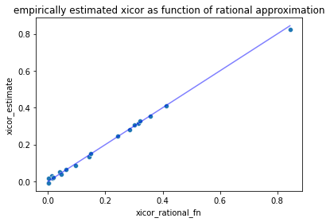

# An Interpretation of the xicor Score for Classification

John Mount,
Win Vector LLC,
December 31, 2021,
https://github.com/WinVector/Examples/blob/main/XICOR/xicor_indicator_classification.ipynb

## Introduction

An important special case of machine learning and statistics is *classification*, determining if a dependent variable `y` (or outcome) is in one of two classes.  For simplicity let's call these classes 0 and 1. Even the case measuring the quality of a classification by two valued (again, for simplicity taking values 0 and 1) explanatory variable `x` is of great utility and has extensive theory and practice. This may seem like a narrow case, but it includes every situation that produces a 2 by 2 confusion matrix.

In this note we show the in this case the expected value of xicor (which our group has been writing about [here](https://win-vector.com/2021/12/26/how-to-read-sourav-chatterjees-basic-xicor-defenition/) and [here](https://win-vector.com/2021/12/29/exploring-the-xi-correlation-coefficient/)) specializes to a re-normalized determinant of a classifier's confusion matrix. This form exposes a lot of the (known) symmetries of the expected value of xicor.

There is, of course, previous work on application of the determinant of the confusion matrix. However, we haven't (yet) seen an example with this normalization scheme and not previously seen it related to xicor. So we are hoping this is a novel observation.

### Confusion matrices

The common summary of performance in the above situation is the confusion matrix (ref: [Wikipedia: Confusion matrix](https://en.wikipedia.org/wiki/Confusion_matrix)). To form the confusion matrix we summarize the classifier performance into four counts:


  * True positives (`tp`), the number of times `x = 1` and `y = 1`.
  * False positives (`fp`), the number of times `x = 1` and `y = 0`.
  * True negatives (`tn`), the number of times `x = 0` and `y = 0`.
  * False negatives (`fn`), the number of times `x = 0` and `y = 1`.

These four numbers can be portrayed in convenient table as follows.

<table>
<tr><td></td><td><b>x = 0</b></td><td><b>x = 1</b></td></tr>
<tr><td><b>y = 1</b></td><td>fn</td><td>tp</td></tr>
<tr><td><b>y = 0</b></td><td>tn</td><td>fp</td></tr>
</table>


The confusion matrix is a sufficient statistic for characterizing the relation between two binary or two-valued variables. Many other statistics can be written in terms of its entries. This includes accuracy, sensitivity, specificity, precision, recall, F1, and even AUC (ref: ["A budget of classifier evaluation measures"](https://win-vector.com/2016/07/21/a-budget-of-classifier-evaluation-measures/)).

## A new correspondence score

Sourav Chatterjee introduced a new correspondence score called "xicor" (ref: [xicor](https://arxiv.org/abs/1909.10140)). It measures the ability of one variable to predict another in terms of: does the explanatory variable predict where the dependent variable doesn't vary? This is a change from most measures that directly target if the explanatory variable predicts where the dependent variable does vary.

The general formula is given as:

$\xi(X, Y) := 1 - \frac{n \sum_{i=1}^{n-1} | r_{i+1} - r_{i}|}{2 \sum_{i=1}^{n} l_i (n - l_i)}$

n is just the total number of observations (equal to tp + fp + tn + fn). The $l_i$ and $r_i$ are ranks, the details of which are given both in [the paper](https://arxiv.org/pdf/1909.10140.pdf) and in the [reference R package](https://CRAN.R-project.org/package=XICOR). In particular, the r-s are y-ranks ordered by x, and the l-s are ranks of -y. In both cases "max" tie-breaking is used in computing ranks. xicor is itself a random variable under re-draws of permutations of dat with identical or tied x-values.

## Specializing the new score to confusion matrices

We can specialize xicor to confusion matrices.  To do this we write the expected value of the xicor.

We first observe due to the max tie-breaking in the rank calculations we have:

  * $r_{i}$ is always either tn + fp or n. So $r_{i+1} - r_{i}$ is always either 0 (when y-ranks match) or tp + fn (when the y-ranks do not match).
  * $l_{i}$ is always either n or tp + fn, so n - li is always 0 or tn + fp.

This lets us re-write xicor in this case as.

$\xi(X, Y) = 1 - \frac{n \sum_{i=1}^{n-1} \chi(r_{i+1} == r_{i}) (tp + fn)}{2 (tp + fp) (tp + fp) (tn + fn)}$

All we have done is replaced the denominator with the number of non-zero terms times their value, and introduced an indicator $\chi(r_{i+1} == r_{i})$ defined to be 1 when its argument is true, and 0 otherwise. The details allowing this re-write come from both the paper and the reference R package. The point is, this form is easy to use when computing the expected value over permutations of the x-tied entries.

Now we work out the probability $\chi(r_{i+1} == r_{i}) == 1$ (also the expected value of $\chi(r_{i+1} == r_{i})$). For the examples with x=0, we have tn examples with y=0 and fn examples with y=1. So the ranks match with probability 2 tn fn / (tn + fn)^2. So we can estimate the expected value of each term with x=0, and we just multiply by how many such terms to get their contribution. A similar argument estimate the x=1 terms.

Putting all of this together gives us the following formula for xicor from a confusion matrix. Let's write this down in Python.


```python
import numpy
import pandas

from sympy import *
init_printing(
    use_latex=True,
    mul_symbol='dot',
    forecolor='Black',
    euler=False)

import seaborn as sns
import matplotlib.pyplot as plt
import xicor.xicor

tp, fp, tn, fn = symbols('tp fp tn fn')
xi_cor_estimate = (
    1 - (tp + fp + tn + fn) * (
        (tn + fn) * (tp + fn) * 2 * tn * fn / (tn + fn)**2
        + (tp + fp) * (tp + fn) * 2 * tp * fp / (tp + fp)**2
    ) / (2 * (tp + fn) * (tn + fp) * (tp + fn))
)

xi_cor_estimate
```


$\displaystyle 1 - \frac{\left(\frac{2 \cdot fn \cdot tn \cdot \left(fn + tp\right)}{fn + tn} + \frac{2 \cdot fp \cdot tp \cdot \left(fn + tp\right)}{fp + tp}\right) \cdot \left(fn + fp + tn + tp\right)}{\left(fn + tp\right) \cdot \left(2 \cdot fn + 2 \cdot tp\right) \cdot \left(fp + tn\right)}$


We can re-arrange terms to get a neater factored form:


```python
# neater arrangement of the formula
xicor_formula = (
    (tn * tp - fn * fp)**2 / ((fn + tn)*(fn + tp)*(fp + tn)*(fp + tp))
)

xicor_formula
```


$\displaystyle \frac{\left(- fn \cdot fp + tn \cdot tp\right)^{2}}{\left(fn + tn\right) \cdot \left(fn + tp\right) \cdot \left(fp + tn\right) \cdot \left(fp + tp\right)}$


In this form we see a lot of structure and symmetries. Notice it is the square of the determinant of the confusion matrix, re-normalized by the product of all of the row and column totals. Using the determinant of the confusion matrix as a measure has some precedent ([1](https://journals.sagepub.com/doi/10.1177/001316446002000104), [2](https://www.kci.go.kr/kciportal/ci/sereArticleSearch/ciSereArtiView.kci?sereArticleSearchBean.artiId=ART002632929), [3](http://ceur-ws.org/Vol-1314/paper-05.pdf), [4](https://www.google.com/books/edition/Binary_and_Multiclass_Classification/XTuTAgAAQBAJ?hl=en&gbpv=1&dq=determinant+of+confusion+matrix+google+books&pg=PA115&printsec=frontcover)).

We do have to keep in mind, the formula is only valid where we have not eliminated any terms evaluating to zero.

This is an unusual summary of the confusion matrix. For it appears to be the ratio of two degree 4 polynomials. Most common correspondence scores (such as those mentioned [here](https://win-vector.com/2016/07/21/a-budget-of-classifier-evaluation-measures/)) are ratios of degree 1 or degree 2 polynomials.

Let's confirm this formula is the same form we derived.


```python
# confirm equivalent, should be 0

formula_diff = (xi_cor_estimate - xicor_formula).simplify()
assert formula_diff == 0
formula_diff

```


$\displaystyle 0$


```python
# wrapr our formula as a function
def xicor_rat_fn(*, tp_c, fp_c, tn_c, fn_c):
    """
    Estimate expected value of xicor using rational function.

    :param tp_c: true positive count
    :param fp_c: false positive count
    :param tn_c: true negative count
    :param fn_c: false negative count
    :return: xicor correlation
    """

    return xicor_formula.subs({tp: tp_c, tn: tn_c, fp: fp_c, fn: fn_c})
```

We can work some examples. We first compare our rational function to a Python implementation of xicor (note, this implementation is not by the original authors).


```python
# define xicor as a function, so we have something to compare to
def xicor_fn(*, tp_c: int, fp_c: int, tn_c: int, fn_c: int, n_reps:int = 100):
    """
    Define xicor as a function of observed counts.

    :param tp_c: true positive count
    :param fp_c: false positive count
    :param tn_c: true negative count
    :param fn_c: false negative count
    :param n_reps: sample size to estimate means
    :return: estimated expected xicor correlation
    """
    assert tp_c >= 0
    assert fp_c >= 0
    assert tn_c >= 0
    assert fn_c >= 0
    assert tp_c + fn_c > 0  # y has positive examples
    assert tn_c + fp_c > 0  # y has negative examples
    x = [1] * tp_c + [1] * fp_c + [0] * tn_c + [0] * fn_c
    y = [1] * tp_c + [0] * fp_c + [0] * tn_c + [1] * fn_c
    evals = [xicor.xicor.Xi(x, y).correlation for rep in range(n_reps)]
    return numpy.mean(evals)
```


```python
# work some examples

float(xicor_rat_fn(tp_c=100, fp_c=10, tn_c=50, fn_c=20))
```


$\displaystyle 0.415584415584416$


```python
xicor_fn(tp_c=100, fp_c=10, tn_c=50, fn_c=20)
```


$\displaystyle 0.4125$


We can plot some examples confiming the rational funciton agrees with the Python xicor implementation.


```python
# plot some examples
def mk_ints():
    return numpy.random.choice(100, size=20, replace=True) + 1

examples = pandas.DataFrame({
    'tp_c': mk_ints(),
    'fp_c': mk_ints(),
    'tn_c': mk_ints(),
    'fn_c': mk_ints(),
    'xicor_estimate': 0.0,
    'xicor_rational_fn' : 0.0,
})

for i in range(examples.shape[0]):
    tp_c = examples['tp_c'].values[i]
    fp_c = examples['fp_c'].values[i]
    tn_c = examples['tn_c'].values[i]
    fn_c = examples['fn_c'].values[i]
    examples.loc[i, 'xicor_estimate'] = xicor_fn(tp_c=tp_c, fp_c=fp_c, tn_c=tn_c, fn_c=fn_c)
    examples.loc[i, 'xicor_rational_fn'] = float(xicor_rat_fn(tp_c=tp_c, fp_c=fp_c, tn_c=tn_c, fn_c=fn_c))
```


```python
ax = sns.scatterplot(data=examples, x='xicor_rational_fn', y='xicor_estimate')
mx = max(numpy.max(examples['xicor_rational_fn']), numpy.max(examples['xicor_estimate']))
plt.plot([0, mx], [0, mx], color='b', alpha=0.5)
ax.set_title("empirically estimated xicor as function of rational approximation")
plt.show()
```


    

    


Remember, the actual xicor calculation is computing an expected value of a non-constant random variable. So there is variation in the xicor score, thus no deterministic function can perfectly individual values. However, it is the expected value of xicor that is of interest, not the values of individual data permutations, so the ration function in fact useful and reliable.

We can confirm many symmetries of the rational function.


```python
# check symmetries
a, b, c, d, s = symbols('a b c d s')

```


```python
# gets independent case right (should equal 0)
indep_check = xicor_rat_fn(tp_c=s*a, fp_c=s*b, tn_c=b, fn_c=a).simplify()
assert indep_check == 0
indep_check
```


$\displaystyle 0$


```python
# gets perfect case right (should be 1)
perfect_check = xicor_rat_fn(tp_c=a, fp_c=0, tn_c=c, fn_c=0).simplify()
assert perfect_check == 1
perfect_check
```


$\displaystyle 1$


```python

# scale invariant (should equal 0)
scale_check = (
    xicor_rat_fn(tp_c=a, fp_c=b, tn_c=c, fn_c=d)
    - xicor_rat_fn(tp_c=s*a, fp_c=s*b, tn_c=s*c, fn_c=s*d)
).simplify()
assert scale_check == 0
scale_check

```


$\displaystyle 0$


```python
# gets flipping y right (should equal 0)
y_flip_check = (
    xicor_rat_fn(tp_c=a, fp_c=b, tn_c=c, fn_c=d)
    - xicor_rat_fn(tp_c=b, fp_c=a, tn_c=d, fn_c=c)
).simplify()
assert y_flip_check == 0
y_flip_check
```


$\displaystyle 0$


```python
# gets flipping x right (should equal 0)
x_flip_check = (
    xicor_rat_fn(tp_c=a, fp_c=b, tn_c=c, fn_c=d)
    - xicor_rat_fn(tp_c=c, fp_c=d, tn_c=a, fn_c=b)
).simplify()
assert x_flip_check == 0
x_flip_check
```


$\displaystyle 0$


```python
# doesn't care if false positives and false negatives are reversed (equals 0)
error_flip_check = (
    xicor_rat_fn(tp_c=a, fp_c=b, tn_c=c, fn_c=d)
    - xicor_rat_fn(tp_c=a, fp_c=d, tn_c=c, fn_c=b)
).simplify()
assert error_flip_check == 0
error_flip_check

```


$\displaystyle 0$


```python
# is asymmetric in x and y (doesn't identically equal 0)
asym_check = (
    xicor_rat_fn(tp_c=a, fp_c=b, tn_c=c, fn_c=d)
    - xicor_rat_fn(tp_c=a, fp_c=c, tn_c=b, fn_c=d)
).subs({a: 1, b: 2, c: 3, d:4})
assert not asym_check == 0
asym_check
```


$\displaystyle - \frac{5}{42}$


The form of the xicor rational function makes obvious some of the know properties of the expected value of the xicor estimator.

In particular, we can see the expected is always non-negative (for non-negative arguments and when well defined). This is nice to confirm, as individual original xicor calculations can be negative.

We can also confirm the xicor ration function never exceeds 1. We show this, by showing numerator subtracted from the denominator can be written as terms that are all non-negative for non-negative inputs.


```python
num, den = fraction(xicor_formula)
```


```python
num
```


$\displaystyle \left(- fn \cdot fp + tn \cdot tp\right)^{2}$


```python
den
```


$\displaystyle \left(fn + tn\right) \cdot \left(fn + tp\right) \cdot \left(fp + tn\right) \cdot \left(fp + tp\right)$


```python
diff_str = str((den - num).expand().simplify())
assert '-' not in diff_str
diff_str
```


    'fn**2*fp*tn + fn**2*fp*tp + fn**2*tn*tp + fn*fp**2*tn + fn*fp**2*tp + fn*fp*tn**2 + 4*fn*fp*tn*tp + fn*fp*tp**2 + fn*tn**2*tp + fn*tn*tp**2 + fp**2*tn*tp + fp*tn**2*tp + fp*tn*tp**2'


Notice, as claimed, all the terms here are non-negative contributions.

## Conclusion

The expected value (under permutations $$\pi$$ of indices such that $$X_{\pi} = X$$, where $$X$$ is denoting the vector of explanatory variable observations) of the xicor estimator can be specialized to confusion matrices as:

$$\text{E}_{\pi: X_{\pi} = X}[\xi(X_{\pi}, Y_{\pi})] = \frac{ \begin{array}{|cc|} fn & tp \\ tn & fp \\ \end{array}^2 }{\left(fn + tn\right)  \left(fn + tp\right) \left(fp + tn\right)  \left(fp + tp\right)}$$

This form makes a number of the expected symmetries of the expected value of the estimator obvious. It is a renormalization of the square of the determinant of the confusion matrix. It makes sense that the determinant is a measure of diagonal or anti-diagonal mass in a 2 by 2 matrix. It also suggests a possible interpretation as score as a change of variables or Jacobian of some other form.

It is also possible this is a practical tool in evaluating how well one categorical variable predicts another.


## Further discussion

### Correlation versus R-squared

xicor in form looks more like an R-squared than a correlation. This hints that an appropriate square-root would serve the role of a correlation.

A possible application of xicor is scoring many proposed explanatory variables against a fixed dependent variable. In this case the terms that depend on the dependent variable alone (fp + tn, and fn + tp) can be assumed out. This would let us re-factor a square root of xicor as:

$$\text{E}_{\pi: X_{\pi} = X}[\sqrt{\xi}(X_{\pi}, Y_{\pi})] = \frac{ \begin{array}{|cc|} fn & tp \\ tn & fp \\ \end{array} }{\sqrt{\left(fn + tn\right) \left(fp + tp\right)}} c_y$$

(cy just being one over sqrt((fp + tn)(fn + tp))).

### Cohen's "A coefficient of agreement for nominal scales"

From [Warrens, M. (2008). "On similarity coefficients for 2× 2 tables and correction for chance" Psychometrika, 73(3), 487–502](https://www.researchgate.net/publication/24063719_On_Similarity_Coefficients_for_22_Tables_and_Correction_for_Chance) the closest meaasure to xicor we see is [Cohen, J. (1960) "A coefficient of agreement for nominal scales" Educational and Psychological Measurement, 20,
37–46](https://journals.sagepub.com/doi/10.1177/001316446002000104).

Warrens defines this as either of (as prediction and truth are interchangeable for evaluating scorer correspondence, however Cohen's score is already symmetric in roles, so this is a superficial distinction):


```python
def cohen_c(*, a, b, c, d):
    p1 = a + b
    q1 = c + d
    p2 = a + c
    q2 = b + d
    return 2*(a*d - b*c) / (p1*q2 + p2*q1)
```

(Technically Warrens defines this for proportions, not counts, but we use the fact that this form is homogeneous allows us to skip such a distinction.)


```python
s_Cohen_1 = cohen_c(a=fn, b=tp, c=tn, d=fp)

s_Cohen_1
```


$\displaystyle \frac{2 \cdot fn \cdot fp - 2 \cdot tn \cdot tp}{\left(fn + tn\right) \cdot \left(fp + tn\right) + \left(fn + tp\right) \cdot \left(fp + tp\right)}$


```python
s_Cohen_2 = cohen_c(a=fn, b=tn, c=tp, d=fp)

s_Cohen_2
```


$\displaystyle \frac{2 \cdot fn \cdot fp - 2 \cdot tn \cdot tp}{\left(fn + tn\right) \cdot \left(fp + tn\right) + \left(fn + tp\right) \cdot \left(fp + tp\right)}$


```python
(s_Cohen_1 - s_Cohen_2).expand().simplify()


```


$\displaystyle 0$


```python
xicor_formula

```


$\displaystyle \frac{\left(- fn \cdot fp + tn \cdot tp\right)^{2}}{\left(fn + tn\right) \cdot \left(fn + tp\right) \cdot \left(fp + tn\right) \cdot \left(fp + tp\right)}$


```python
Cohen_sym = (s_Cohen_1 * s_Cohen_2).simplify()

Cohen_sym
```


$\displaystyle \frac{4 \cdot \left(fn \cdot fp - tn \cdot tp\right)^{2}}{\left(\left(fn + tn\right) \cdot \left(fp + tn\right) + \left(fn + tp\right) \cdot \left(fp + tp\right)\right)^{2}}$


```python
(xicor_formula / Cohen_sym).simplify()
```


$\displaystyle \frac{\left(\left(fn + tn\right) \cdot \left(fp + tn\right) + \left(fn + tp\right) \cdot \left(fp + tp\right)\right)^{2}}{4 \cdot \left(fn + tn\right) \cdot \left(fn + tp\right) \cdot \left(fp + tn\right) \cdot \left(fp + tp\right)}$


The observation being, these differ in ratio only by a function of the table margins alone (row and column totals).

### Consistency of score

We can check if the xicor score is consistent with a partial order on confusion matrices. That is we say a confusion matrix A is >= than a confusion matrix B iff tp(A) >= tp(B), tn(A) >= tn(B), fp(A) <= fp(B), and fn(A) <= fn(B). This is only a partial order, we don't have the total property that one always has (A>=B) or (B>=A).

Let's call a score consistent if A >= B implies score(A) >= score(B). It at first superficially appears the xicor score is not consistent. We can look for a counter example using the derivative of the score. However, once we find the example- it is can be argued the score is right, and the consistency invariant is not supportable.


```python
d_xicor_d_tp = diff(xicor_formula, tp).simplify()

d_xicor_d_tp
```


$\displaystyle - \frac{\left(fn \cdot fp - tn \cdot tp\right) \cdot \left(2 \cdot tn \cdot \left(fn + tp\right) \cdot \left(fp + tp\right) + \left(fn + tp\right) \cdot \left(fn \cdot fp - tn \cdot tp\right) + \left(fp + tp\right) \cdot \left(fn \cdot fp - tn \cdot tp\right)\right)}{\left(fn + tn\right) \cdot \left(fn + tp\right)^{2} \cdot \left(fp + tn\right) \cdot \left(fp + tp\right)^{2}}$


```python
num, den = fraction(d_xicor_d_tp)
```


```python
num
```


$\displaystyle - \left(fn \cdot fp - tn \cdot tp\right) \cdot \left(2 \cdot tn \cdot \left(fn + tp\right) \cdot \left(fp + tp\right) + \left(fn + tp\right) \cdot \left(fn \cdot fp - tn \cdot tp\right) + \left(fp + tp\right) \cdot \left(fn \cdot fp - tn \cdot tp\right)\right)$


```python
den
```


$\displaystyle \left(fn + tn\right) \cdot \left(fn + tp\right)^{2} \cdot \left(fp + tn\right) \cdot \left(fp + tp\right)^{2}$


```python
(num.simplify() / (fn * fp  - tn * tp)).expand()
```


$\displaystyle - fn^{2} \cdot fp - fn \cdot fp^{2} - 2 \cdot fn \cdot fp \cdot tn - 2 \cdot fn \cdot fp \cdot tp - fn \cdot tn \cdot tp - fp \cdot tn \cdot tp$


All the remaining terms have the same sign. This implies the sign(d(E[xicor])/d(tp)) = sign(tn * tp - fn * fp).  So if fn * fp > tn * tp, then increasing the true positive count *lowers* the expected score.

Let's try that with an example.


```python
tp_1 = 10
tn_1 = 10
fp_1 = 100
fn_1 = 100

x_1 = xicor_rat_fn(tp_c=tp_1, fp_c=fp_1, tn_c=tn_1, fn_c=fn_1)
x_1

```


$\displaystyle \frac{81}{121}$


```python
tp_2 = 15
tn_2 = 10
fp_2 = 100
fn_2 = 95

x_2 = xicor_rat_fn(tp_c=tp_2, fp_c=fp_2, tn_c=tn_2, fn_c=fn_2)
x_2
```


$\displaystyle \frac{289}{483}$


```python
x_1 > x_2
```


$\displaystyle \text{True}$


This is a contrary indication; we have score improving on a worse result.  The _2 confusion matrix is better than the _1 confusion matrix, as they differ only by moving some false negatives to true positives. Yet the _2 confusion matrix scores below the _1 confusion matrix.


Let's see if this is actually a property of the xicor, and not just an artifact of the formula.


```python

f_1 = xicor_fn(tp_c=tp_1, fp_c=fp_1, tn_c=tn_1, fn_c=fn_1, n_reps=1000)

f_1
```


$\displaystyle 0.664936363636364$


```python

f_2 = xicor_fn(tp_c=tp_2, fp_c=fp_2, tn_c=tn_2, fn_c=fn_2, n_reps=1000)

f_2
```


$\displaystyle 0.595645454545454$


```python
f_1 > f_2
```


    True


Remember, xicor is symmetric with reversals of x or reversals of y. So we can consider the two systems as with flipped x as:


```python
fn_1_flipped = 10   # had been tp
fp_1_flipped = 10   # had been tn
tn_1_flipped = 100  # had been fp
tp_1_flipped = 100  # had been fp

fn_2_flipped = 15   # had been tp
fp_2_flipped = 10   # had been tn
tn_2_flipped = 100  # had been fp
tp_2_flipped = 95   # had been fp
```

And this shows the point, consistency isn't a useful invariant if we are allowed to flip positive and negative. Essentially xicor knows the flip of the score is more useful, and that is the one it is measuring. In the flipped notation we are moving more mass into the error category.

Let's check if some common measures such as F1 and AUC are consistent.

We take our definitions of common confusion matrix metrics from ["A budget of classifier evaluation measures"](https://win-vector.com/2016/07/21/a-budget-of-classifier-evaluation-measures/).


```python
tpr = tp / (tp + fn)
fnr = fn / (tp + fn)
fpr = fp / (fp + tn)
tnr =  tn / (fp + tn)
sensitivity = tpr
specificity = tnr
recall = sensitivity
precision = tp / (tp + fp)
```


```python
f1 = (2*precision*recall/(precision+recall)).simplify()

f1
```


$\displaystyle \frac{2 \cdot tp}{fn + fp + 2 \cdot tp}$


```python
auc = ((1/2)*fpr*tpr + (1/2)*(1-fpr)*(1-tpr) + (1-fpr)*tpr).simplify()

auc
```


$\displaystyle \frac{0.5 \cdot fn \cdot tn + 0.5 \cdot fp \cdot tp + tn \cdot tp}{\left(fn + tp\right) \cdot \left(fp + tn\right)}$


Now let's look at the derivative of F1 with respect to tp.


```python
diff(f1, tp).simplify()
```


$\displaystyle \frac{2 \cdot \left(fn + fp\right)}{\left(fn + fp + 2 \cdot tp\right)^{2}}$


The above is clearly non-negative for non-negative arguments (when defined).

Let's try the same for AUC.


```python
diff(auc, tp).simplify()
```


$\displaystyle \frac{0.5 \cdot fn}{1.0 \cdot fn^{2} + 2.0 \cdot fn \cdot tp + 1.0 \cdot tp^{2}}$


Again, the result is clearly non-negative for non-negative arguments (when defined).
