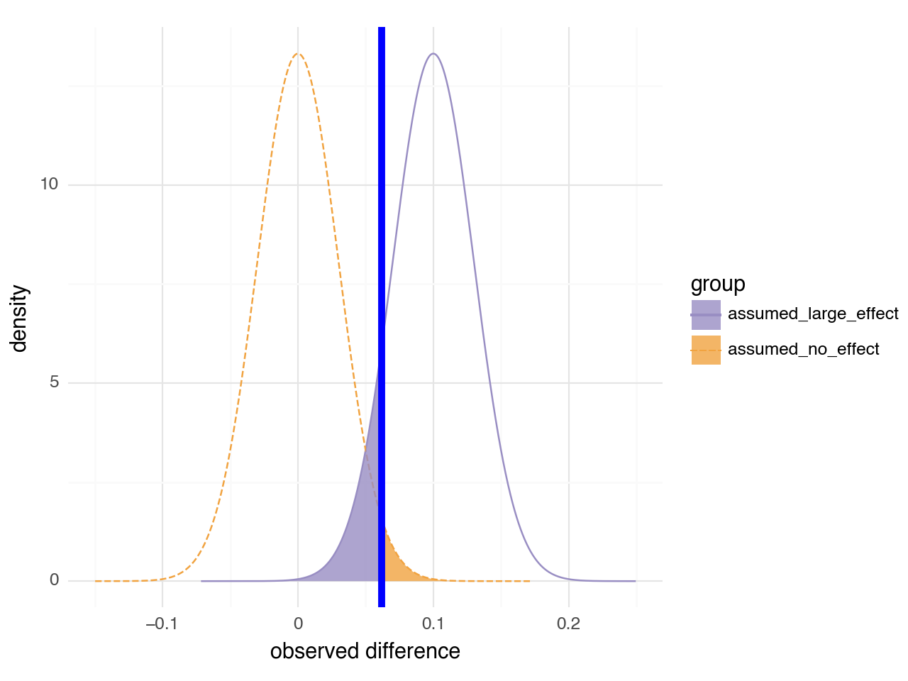
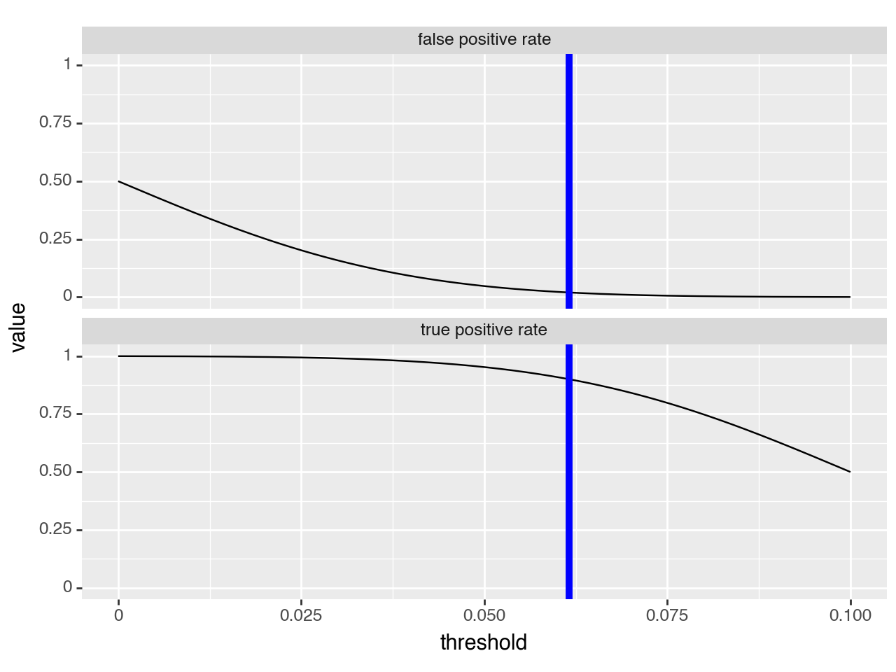
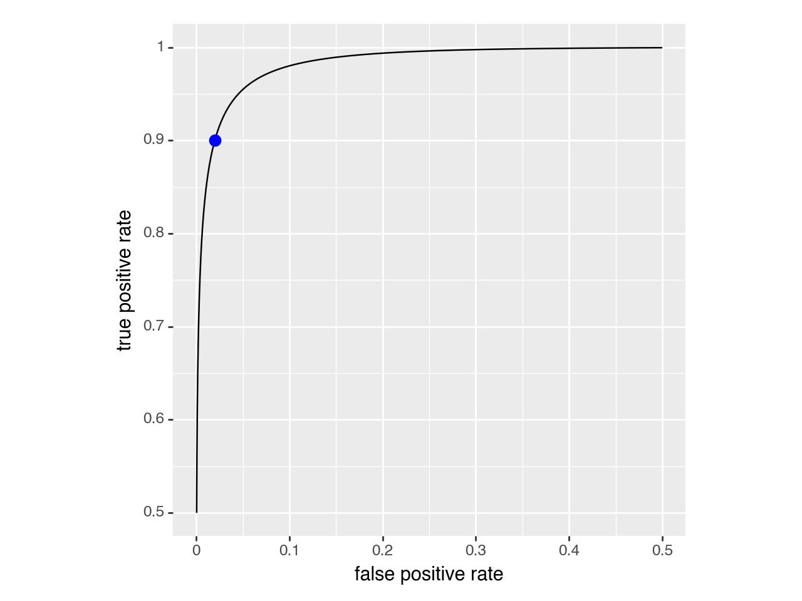
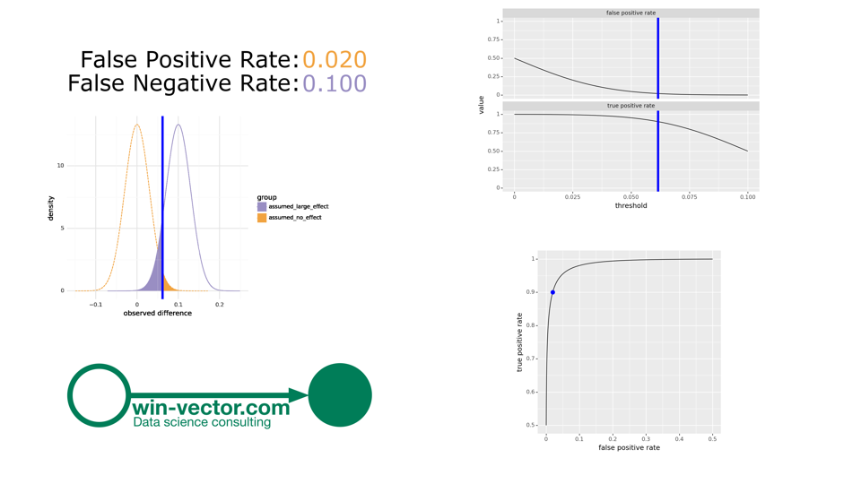
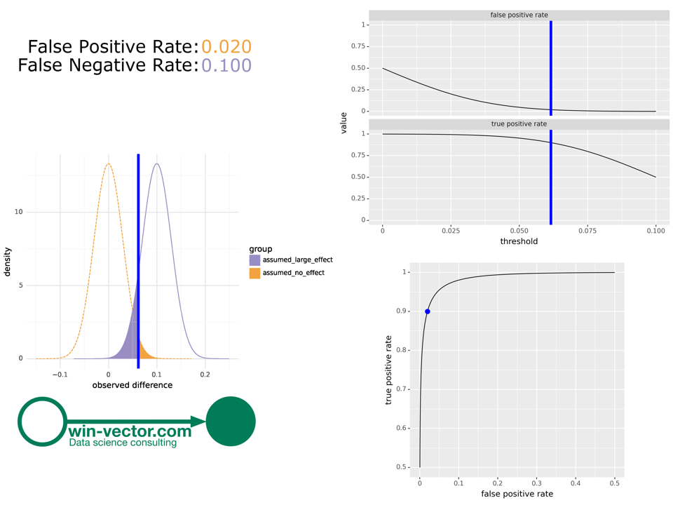
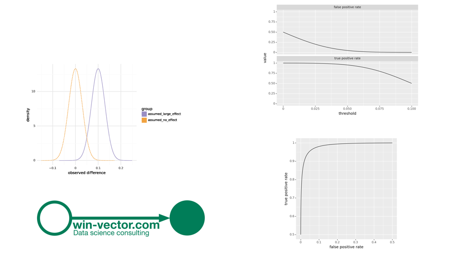

Interactive version of the graph from [A/B Tests for Engineers](https://win-vector.com/2023/10/15/a-b-tests-for-engineers/).

To see the interaction: download [directory](https://github.com/WinVector/Examples/tree/main/ab_test) and run this Jupyter notebook in JupyterLab or VSCode.

[Jupyter Widgets documentation](https://ipywidgets.readthedocs.io/en/latest/index.html)


```python
# import our modules
import numpy as np
import pandas as pd
from IPython.display import display, clear_output
import matplotlib.pyplot as plt
from sig_pow_visual import composite_graphs_using_PIL, graph_factory
from data_algebra import RecordSpecification
import PIL
from PIL import Image, ImageDraw, ImageFont

import ipywidgets as widgets
```


```python
# our specification of interest
# derived from the above
n = 557  # the experiment size
r = 0.1  # the assumed large effect size (difference in conversion rates)
t = 0.061576 # the correct threshold for specified power and significance

```


```python
mk_graphs = graph_factory(
    n=n,  # the experiment size
    r=r,  # the assumed large effect size (difference in conversion rates)
)
```


```python
graphs = mk_graphs(t)
graphs
```


    

    


    

    


    

    


    {'g_areas': <Figure Size: (640 x 480)>,
     'g_thresholds': <Figure Size: (640 x 480)>,
     'g_roc': <Figure Size: (640 x 480)>,
     'i_title': <PIL.Image.Image image mode=RGB size=1920x720>,
     'sig_area': 0.019929850662135592,
     'mpow_area': 0.09983997004823636}


```python
# composite the images using PIL
img_c = composite_graphs_using_PIL(graphs, hd_aspect=True)
img_c = img_c.resize((int(0.25 * img_c.size[0]), int(0.25 * img_c.size[1])))
display(img_c)
```


    

    


```python
# composite the images using PIL
img_c = composite_graphs_using_PIL(graphs, hd_aspect=False)
img_c = img_c.resize((int(0.25 * img_c.size[0]), int(0.25 * img_c.size[1])))
display(img_c)
```


    

    


```python
graphs = mk_graphs(None)
# composite the images using PIL
img_c = composite_graphs_using_PIL(graphs)
img_c = img_c.resize((int(0.25 * img_c.size[0]), int(0.25 * img_c.size[1])))
display(img_c)
```


    

    

