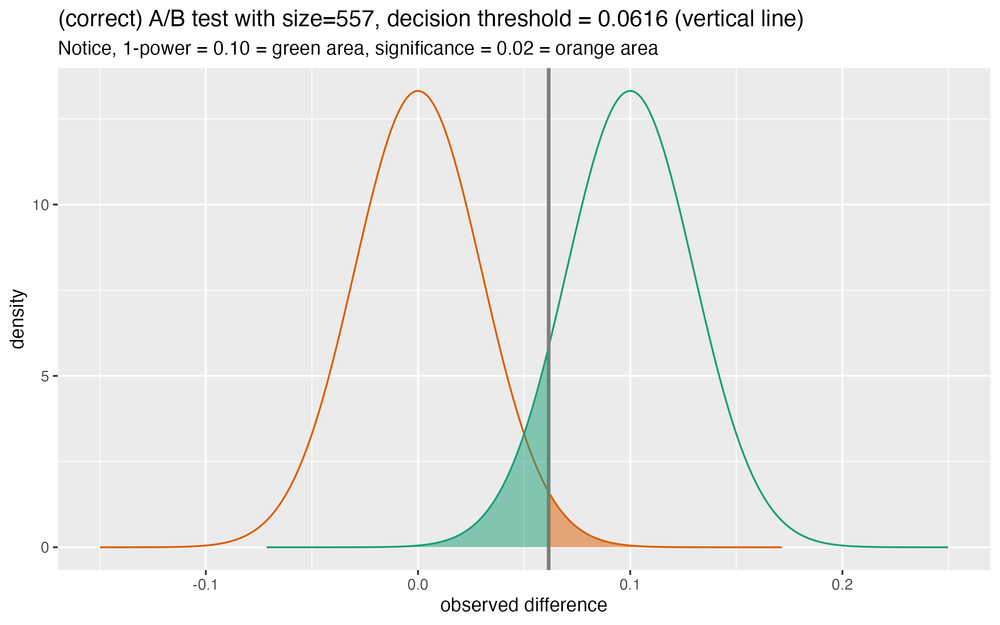

For an article on A/B testing that I am preparing, I asked my partner Dr. Nina Zumel if she could do me a favor and write some code to produce the diagrams. She prepared [an excellent parameterized diagram generator](https://github.com/WinVector/Examples/blob/main/calling_R_from_Python/significance_power_visuals.R). However being the author of the book [Practical Data Science with R](https://www.manning.com/books/practical-data-science-with-r-second-edition), she built it in [`R`](https://www.r-project.org) using [ggplot2](https://CRAN.R-project.org/package=ggplot2). This would be great, except the A/B testing article is being developed in Python, as it targets programmers familiar with Python.

As the production of the diagrams is not part of the proposed article, I decided to use the [`rpy2` package](https://rpy2.github.io) to integrate the `R` diagrams directly into the new worksheet. Alternatively, I could translate her code into Python using one of: [Seaborn objects](https://seaborn.pydata.org/tutorial/objects_interface.html), [plotnine](https://plotnine.readthedocs.io/en/v0.12.3/), [ggpy](https://github.com/yhat/ggpy), or others. The large number of options is evidence of how influential Leland Wilkinson's grammar of graphics (gg) is. 

Let's try the `rpy2` approach.

For our example we import our modules, including a small adaptor I wrote called [`r_tools`](https://github.com/WinVector/Examples/blob/main/calling_R_from_Python/r_tools.py).


```python
# import our modules
import numpy as np
from IPython.display import Code, display, Image
from rpy2 import robjects
from r_tools import get_ggplot_fn_by_name
import pandas as pd
```

Now all we have to do use her code is:

  1) Source her `.R` file to load the function.
  2) Get a reference to the diagram producing function.

This is done as follows.


```python
# read the .R file into the R interpreter environment
robjects.r("source('significance_power_visuals.R')")
# get a Python reference to the sig_pow_visuals R function
sig_pow_visuals = get_ggplot_fn_by_name("sig_pow_visuals")
```

Now we can use the diagram code. What the A/B testing diagram is and how to pick the arguments will be the content of our later article. The thing to notice now is: we generate the diagram from the `R` code, working in `Python`.


```python
# make the example diagram
n = 557
r = 0.1
t = 0.061576
power = 0.9
significance = 0.02

display(sig_pow_visuals(
  stdev=np.sqrt(0.5 / n), 
  effect_size=r, 
  threshold=t,
  title=f"(correct) A/B test with size={n}, decision threshold = {t:.4f} (vertical line)",
  subtitle=f"Notice, 1-power = {1-power:.2f} = green area, significance = {significance:.2f} = orange area"
))
```


    

    


For the above to work, one must have an installed `R` environment (with the appropriate packages) and a properly installed and configured `rpy2`. 

The above example is a bit unusual, in that it is a plot that doesn't take an incoming data frame as an argument. More often we are likely wanting to pass a `Pandas` data frame into `R`. This is also quite easy.

To see this, consider [another `.R` file](https://github.com/WinVector/Examples/blob/main/calling_R_from_Python/plot_frame.R) that defines the following R function.


```python
# show the contents of a .R file
display(Code("plot_frame.R", language="R"))
```


<style>pre { line-height: 125%; }
td.linenos .normal { color: inherit; background-color: transparent; padding-left: 5px; padding-right: 5px; }
span.linenos { color: inherit; background-color: transparent; padding-left: 5px; padding-right: 5px; }
td.linenos .special { color: #000000; background-color: #ffffc0; padding-left: 5px; padding-right: 5px; }
span.linenos.special { color: #000000; background-color: #ffffc0; padding-left: 5px; padding-right: 5px; }
.output_html .hll { background-color: #ffffcc }
.output_html { background: #f8f8f8; }
.output_html .c { color: #3D7B7B; font-style: italic } /* Comment */
.output_html .err { border: 1px solid #FF0000 } /* Error */
.output_html .k { color: #008000; font-weight: bold } /* Keyword */
.output_html .o { color: #666666 } /* Operator */
.output_html .ch { color: #3D7B7B; font-style: italic } /* Comment.Hashbang */
.output_html .cm { color: #3D7B7B; font-style: italic } /* Comment.Multiline */
.output_html .cp { color: #9C6500 } /* Comment.Preproc */
.output_html .cpf { color: #3D7B7B; font-style: italic } /* Comment.PreprocFile */
.output_html .c1 { color: #3D7B7B; font-style: italic } /* Comment.Single */
.output_html .cs { color: #3D7B7B; font-style: italic } /* Comment.Special */
.output_html .gd { color: #A00000 } /* Generic.Deleted */
.output_html .ge { font-style: italic } /* Generic.Emph */
.output_html .gr { color: #E40000 } /* Generic.Error */
.output_html .gh { color: #000080; font-weight: bold } /* Generic.Heading */
.output_html .gi { color: #008400 } /* Generic.Inserted */
.output_html .go { color: #717171 } /* Generic.Output */
.output_html .gp { color: #000080; font-weight: bold } /* Generic.Prompt */
.output_html .gs { font-weight: bold } /* Generic.Strong */
.output_html .gu { color: #800080; font-weight: bold } /* Generic.Subheading */
.output_html .gt { color: #0044DD } /* Generic.Traceback */
.output_html .kc { color: #008000; font-weight: bold } /* Keyword.Constant */
.output_html .kd { color: #008000; font-weight: bold } /* Keyword.Declaration */
.output_html .kn { color: #008000; font-weight: bold } /* Keyword.Namespace */
.output_html .kp { color: #008000 } /* Keyword.Pseudo */
.output_html .kr { color: #008000; font-weight: bold } /* Keyword.Reserved */
.output_html .kt { color: #B00040 } /* Keyword.Type */
.output_html .m { color: #666666 } /* Literal.Number */
.output_html .s { color: #BA2121 } /* Literal.String */
.output_html .na { color: #687822 } /* Name.Attribute */
.output_html .nb { color: #008000 } /* Name.Builtin */
.output_html .nc { color: #0000FF; font-weight: bold } /* Name.Class */
.output_html .no { color: #880000 } /* Name.Constant */
.output_html .nd { color: #AA22FF } /* Name.Decorator */
.output_html .ni { color: #717171; font-weight: bold } /* Name.Entity */
.output_html .ne { color: #CB3F38; font-weight: bold } /* Name.Exception */
.output_html .nf { color: #0000FF } /* Name.Function */
.output_html .nl { color: #767600 } /* Name.Label */
.output_html .nn { color: #0000FF; font-weight: bold } /* Name.Namespace */
.output_html .nt { color: #008000; font-weight: bold } /* Name.Tag */
.output_html .nv { color: #19177C } /* Name.Variable */
.output_html .ow { color: #AA22FF; font-weight: bold } /* Operator.Word */
.output_html .w { color: #bbbbbb } /* Text.Whitespace */
.output_html .mb { color: #666666 } /* Literal.Number.Bin */
.output_html .mf { color: #666666 } /* Literal.Number.Float */
.output_html .mh { color: #666666 } /* Literal.Number.Hex */
.output_html .mi { color: #666666 } /* Literal.Number.Integer */
.output_html .mo { color: #666666 } /* Literal.Number.Oct */
.output_html .sa { color: #BA2121 } /* Literal.String.Affix */
.output_html .sb { color: #BA2121 } /* Literal.String.Backtick */
.output_html .sc { color: #BA2121 } /* Literal.String.Char */
.output_html .dl { color: #BA2121 } /* Literal.String.Delimiter */
.output_html .sd { color: #BA2121; font-style: italic } /* Literal.String.Doc */
.output_html .s2 { color: #BA2121 } /* Literal.String.Double */
.output_html .se { color: #AA5D1F; font-weight: bold } /* Literal.String.Escape */
.output_html .sh { color: #BA2121 } /* Literal.String.Heredoc */
.output_html .si { color: #A45A77; font-weight: bold } /* Literal.String.Interpol */
.output_html .sx { color: #008000 } /* Literal.String.Other */
.output_html .sr { color: #A45A77 } /* Literal.String.Regex */
.output_html .s1 { color: #BA2121 } /* Literal.String.Single */
.output_html .ss { color: #19177C } /* Literal.String.Symbol */
.output_html .bp { color: #008000 } /* Name.Builtin.Pseudo */
.output_html .fm { color: #0000FF } /* Name.Function.Magic */
.output_html .vc { color: #19177C } /* Name.Variable.Class */
.output_html .vg { color: #19177C } /* Name.Variable.Global */
.output_html .vi { color: #19177C } /* Name.Variable.Instance */
.output_html .vm { color: #19177C } /* Name.Variable.Magic */
.output_html .il { color: #666666 } /* Literal.Number.Integer.Long */</style><div class="highlight"><pre><span></span><span class="nf">library</span><span class="p">(</span><span class="n">ggplot2</span><span class="p">)</span>


<span class="n">plt_frame</span><span class="w"> </span><span class="o">&lt;-</span><span class="w"> </span><span class="nf">function</span><span class="p">(</span><span class="n">d</span><span class="p">)</span><span class="w"> </span><span class="p">{</span>
<span class="w">  </span><span class="nf">ggplot</span><span class="p">(</span><span class="n">data</span><span class="w"> </span><span class="o">=</span><span class="w"> </span><span class="n">d</span><span class="p">,</span><span class="w"> </span><span class="n">mapping</span><span class="w"> </span><span class="o">=</span><span class="w"> </span><span class="nf">aes</span><span class="p">(</span><span class="n">x</span><span class="w"> </span><span class="o">=</span><span class="w"> </span><span class="n">x</span><span class="p">,</span><span class="w"> </span><span class="n">y</span><span class="w"> </span><span class="o">=</span><span class="w"> </span><span class="n">y</span><span class="p">))</span><span class="w"> </span><span class="o">+</span>
<span class="w">    </span><span class="nf">geom_point</span><span class="p">()</span>
<span class="p">}</span>
</pre></div>


We can source this `.R` file and get a reference to the desired function as before.


```python
robjects.r("source('plot_frame.R')")
plt_frame = get_ggplot_fn_by_name(
    "plt_frame",
    # ggplot2::ggsave() arguments
    width=3,
    height=2,
    units="in",
)
```

With the function reference in hand, we can now plot.


```python
display(plt_frame(
    pd.DataFrame({
        "x": [1.0, 2.0, 3.0],
        "y": [1.0, -1.0, 2.0],
})))
```


    

    


The adapter also adds some minimal function help (source file name and names of arguments).


```python
help(plt_frame)
```

    Help on function plt_frame in module r_tools:
    
    plt_frame(*args, **kwargs) -> IPython.core.display.Image
        imported R function plt_frame() (assumed to return a ggplot)
         wrapped fn returns IPython.display.Image
        R source file: plot_frame.R
        R definition environment: <environment: R_GlobalEnv>
        R arguments:
        $d
    


And that is one method to use `R` graphing in Python or mixed-language data science projects. 

All of the code in this example can be found [here](https://github.com/WinVector/Examples/tree/main/calling_R_from_Python).
