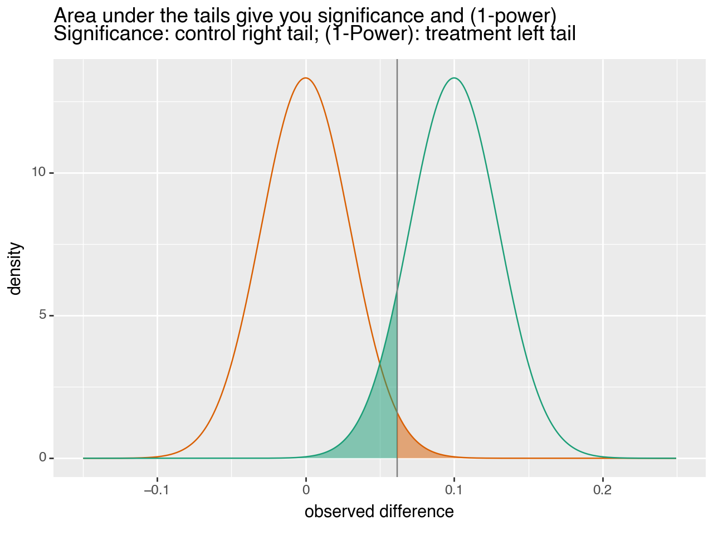

Reproduce the ["R from Python" plot](https://github.com/WinVector/Examples/blob/main/calling_R_from_Python/plot_from_R_example.ipynb) in Python using plotnine. This is a line for line tranlation of [significance_power_visuals.R](https://github.com/WinVector/Examples/blob/main/calling_R_from_Python/significance_power_visuals.R).


```python
# import our modules
import numpy as np
import pandas as pd
from IPython.display import display, HTML
from scipy.stats import norm
from data_algebra.cdata import RecordSpecification
from plotnine import (
    aes, 
    ggplot, 
    geom_line, geom_point, geom_ribbon, geom_vline,
    scale_color_manual, scale_fill_manual,
    xlab, ylab,
    ggtitle,
    theme
)
```


```python
# our parameters of interest
n = 557
r = 0.1
t = 0.061576
power = 0.9
significance = 0.02
```


```python
# convert to what were the function arguments
stdev = np.sqrt(0.5 / n)
effect_size = r
threshold = t
title='Area under the tails give you significance and (1-power)'
subtitle = 'Significance: control right tail; (1-Power): treatment left tail'
eps=1e-6
control_color='#d95f02'
treatment_color='#1b9e77'
```


```python
# define the wide plotting data
x = set(np.arange(-5 * stdev, 5 * stdev + effect_size, step=stdev / 100))
x.update([threshold, threshold-eps, threshold+eps])
x = sorted(x)

pframe = pd.DataFrame({
    'x': x,
    'control': norm.pdf(x, loc=0, scale=stdev),
    'treatment': norm.pdf(x, loc=effect_size, scale=stdev),
})
# control's right tail
pframe['control_tail'] = np.where(pframe['x'] > threshold, pframe['control'], 0)
# treatment's left tail
pframe['treatment_tail'] = np.where(pframe['x'] <= threshold, pframe['treatment'], 0)

pframe
```


<div>
<style scoped>
    .dataframe tbody tr th:only-of-type {
        vertical-align: middle;
    }

    .dataframe tbody tr th {
        vertical-align: top;
    }

    .dataframe thead th {
        text-align: right;
    }
</style>
<table border="1" class="dataframe">
  <thead>
    <tr style="text-align: right;">
      <th></th>
      <th>x</th>
      <th>control</th>
      <th>treatment</th>
      <th>control_tail</th>
      <th>treatment_tail</th>
    </tr>
  </thead>
  <tbody>
    <tr>
      <th>0</th>
      <td>-0.149805</td>
      <td>4.962170e-05</td>
      <td>1.069071e-14</td>
      <td>0.000000e+00</td>
      <td>1.069071e-14</td>
    </tr>
    <tr>
      <th>1</th>
      <td>-0.149506</td>
      <td>5.216325e-05</td>
      <td>1.161969e-14</td>
      <td>0.000000e+00</td>
      <td>1.161969e-14</td>
    </tr>
    <tr>
      <th>2</th>
      <td>-0.149206</td>
      <td>5.482949e-05</td>
      <td>1.262815e-14</td>
      <td>0.000000e+00</td>
      <td>1.262815e-14</td>
    </tr>
    <tr>
      <th>3</th>
      <td>-0.148907</td>
      <td>5.762625e-05</td>
      <td>1.372275e-14</td>
      <td>0.000000e+00</td>
      <td>1.372275e-14</td>
    </tr>
    <tr>
      <th>4</th>
      <td>-0.148607</td>
      <td>6.055961e-05</td>
      <td>1.491073e-14</td>
      <td>0.000000e+00</td>
      <td>1.491073e-14</td>
    </tr>
    <tr>
      <th>...</th>
      <td>...</td>
      <td>...</td>
      <td>...</td>
      <td>...</td>
      <td>...</td>
    </tr>
    <tr>
      <th>1332</th>
      <td>0.248377</td>
      <td>1.588927e-14</td>
      <td>6.290411e-05</td>
      <td>1.588927e-14</td>
      <td>0.000000e+00</td>
    </tr>
    <tr>
      <th>1333</th>
      <td>0.248677</td>
      <td>1.462444e-14</td>
      <td>5.986178e-05</td>
      <td>1.462444e-14</td>
      <td>0.000000e+00</td>
    </tr>
    <tr>
      <th>1334</th>
      <td>0.248977</td>
      <td>1.345895e-14</td>
      <td>5.696089e-05</td>
      <td>1.345895e-14</td>
      <td>0.000000e+00</td>
    </tr>
    <tr>
      <th>1335</th>
      <td>0.249276</td>
      <td>1.238510e-14</td>
      <td>5.419515e-05</td>
      <td>1.238510e-14</td>
      <td>0.000000e+00</td>
    </tr>
    <tr>
      <th>1336</th>
      <td>0.249576</td>
      <td>1.139579e-14</td>
      <td>5.155855e-05</td>
      <td>1.139579e-14</td>
      <td>0.000000e+00</td>
    </tr>
  </tbody>
</table>
<p>1337 rows × 5 columns</p>
</div>


```python
# convert from to long for for plotting using the data algebra

# specify the cdata record transform
record_transform = RecordSpecification(
    pd.DataFrame({
        'group': ['treatment', 'control'],
        'y': ['treatment', 'control'],
        'tail': ['treatment_tail', 'control_tail'],
    }),
    record_keys=['x'],
    control_table_keys=['group'],
).map_from_rows()


record_transform
```


RecordMap: transforming records of the form:<br>
<style type="text/css">
#T_2e174_row0_col0 {
  background-color: #FFE4C4;
}
</style>
<table id="T_2e174">
  <thead>
    <tr>
      <th class="blank level0" >&nbsp;</th>
      <th id="T_2e174_level0_col0" class="col_heading level0 col0" >record id</th>
      <th id="T_2e174_level0_col1" class="col_heading level0 col1" colspan="4">value</th>
    </tr>
    <tr>
      <th class="blank level1" >&nbsp;</th>
      <th id="T_2e174_level1_col0" class="col_heading level1 col0" >x</th>
      <th id="T_2e174_level1_col1" class="col_heading level1 col1" >treatment</th>
      <th id="T_2e174_level1_col2" class="col_heading level1 col2" >control</th>
      <th id="T_2e174_level1_col3" class="col_heading level1 col3" >treatment_tail</th>
      <th id="T_2e174_level1_col4" class="col_heading level1 col4" >control_tail</th>
    </tr>
  </thead>
  <tbody>
    <tr>
      <th id="T_2e174_level0_row0" class="row_heading level0 row0" >0</th>
      <td id="T_2e174_row0_col0" class="data row0 col0" >x record key</td>
      <td id="T_2e174_row0_col1" class="data row0 col1" >treatment value</td>
      <td id="T_2e174_row0_col2" class="data row0 col2" >control value</td>
      <td id="T_2e174_row0_col3" class="data row0 col3" >treatment_tail value</td>
      <td id="T_2e174_row0_col4" class="data row0 col4" >control_tail value</td>
    </tr>
  </tbody>
</table>
<br>
to records of the form:<br>
<style type="text/css">
#T_9fd51_row0_col0, #T_9fd51_row1_col0 {
  background-color: #FFE4C4;
}
#T_9fd51_row0_col1, #T_9fd51_row1_col1 {
  background-color: #7FFFD4;
}
</style>
<table id="T_9fd51">
  <thead>
    <tr>
      <th class="blank level0" >&nbsp;</th>
      <th id="T_9fd51_level0_col0" class="col_heading level0 col0" >record id</th>
      <th id="T_9fd51_level0_col1" class="col_heading level0 col1" >record structure</th>
      <th id="T_9fd51_level0_col2" class="col_heading level0 col2" colspan="2">value</th>
    </tr>
    <tr>
      <th class="blank level1" >&nbsp;</th>
      <th id="T_9fd51_level1_col0" class="col_heading level1 col0" >x</th>
      <th id="T_9fd51_level1_col1" class="col_heading level1 col1" >group</th>
      <th id="T_9fd51_level1_col2" class="col_heading level1 col2" >y</th>
      <th id="T_9fd51_level1_col3" class="col_heading level1 col3" >tail</th>
    </tr>
  </thead>
  <tbody>
    <tr>
      <th id="T_9fd51_level0_row0" class="row_heading level0 row0" >0</th>
      <td id="T_9fd51_row0_col0" class="data row0 col0" >x record key</td>
      <td id="T_9fd51_row0_col1" class="data row0 col1" >control</td>
      <td id="T_9fd51_row0_col2" class="data row0 col2" >control value</td>
      <td id="T_9fd51_row0_col3" class="data row0 col3" >control_tail value</td>
    </tr>
    <tr>
      <th id="T_9fd51_level0_row1" class="row_heading level0 row1" >1</th>
      <td id="T_9fd51_row1_col0" class="data row1 col0" >x record key</td>
      <td id="T_9fd51_row1_col1" class="data row1 col1" >treatment</td>
      <td id="T_9fd51_row1_col2" class="data row1 col2" >treatment value</td>
      <td id="T_9fd51_row1_col3" class="data row1 col3" >treatment_tail value</td>
    </tr>
  </tbody>
</table>


For details on the record transform please see [here](https://github.com/WinVector/data_algebra/blob/main/Examples/cdata/record_shapes.ipynb).


```python
# apply the record transform
pframelong = record_transform(pframe)

pframelong
```


<div>
<style scoped>
    .dataframe tbody tr th:only-of-type {
        vertical-align: middle;
    }

    .dataframe tbody tr th {
        vertical-align: top;
    }

    .dataframe thead th {
        text-align: right;
    }
</style>
<table border="1" class="dataframe">
  <thead>
    <tr style="text-align: right;">
      <th></th>
      <th>x</th>
      <th>group</th>
      <th>y</th>
      <th>tail</th>
    </tr>
  </thead>
  <tbody>
    <tr>
      <th>0</th>
      <td>-0.149805</td>
      <td>control</td>
      <td>4.962170e-05</td>
      <td>0.000000e+00</td>
    </tr>
    <tr>
      <th>1</th>
      <td>-0.149805</td>
      <td>treatment</td>
      <td>1.069071e-14</td>
      <td>1.069071e-14</td>
    </tr>
    <tr>
      <th>2</th>
      <td>-0.149506</td>
      <td>control</td>
      <td>5.216325e-05</td>
      <td>0.000000e+00</td>
    </tr>
    <tr>
      <th>3</th>
      <td>-0.149506</td>
      <td>treatment</td>
      <td>1.161969e-14</td>
      <td>1.161969e-14</td>
    </tr>
    <tr>
      <th>4</th>
      <td>-0.149206</td>
      <td>control</td>
      <td>5.482949e-05</td>
      <td>0.000000e+00</td>
    </tr>
    <tr>
      <th>...</th>
      <td>...</td>
      <td>...</td>
      <td>...</td>
      <td>...</td>
    </tr>
    <tr>
      <th>2669</th>
      <td>0.248977</td>
      <td>treatment</td>
      <td>5.696089e-05</td>
      <td>0.000000e+00</td>
    </tr>
    <tr>
      <th>2670</th>
      <td>0.249276</td>
      <td>control</td>
      <td>1.238510e-14</td>
      <td>1.238510e-14</td>
    </tr>
    <tr>
      <th>2671</th>
      <td>0.249276</td>
      <td>treatment</td>
      <td>5.419515e-05</td>
      <td>0.000000e+00</td>
    </tr>
    <tr>
      <th>2672</th>
      <td>0.249576</td>
      <td>control</td>
      <td>1.139579e-14</td>
      <td>1.139579e-14</td>
    </tr>
    <tr>
      <th>2673</th>
      <td>0.249576</td>
      <td>treatment</td>
      <td>5.155855e-05</td>
      <td>0.000000e+00</td>
    </tr>
  </tbody>
</table>
<p>2674 rows × 4 columns</p>
</div>


```python
# make the plot using the plotnine implementation 
# of Leland Wilkinson's Grammar of Graphics
# (nearly call equiv to Hadley Wickham ggplot2 realization)
palette = {'control': control_color, 'treatment': treatment_color}
p = (
    ggplot(pframelong, aes(x='x', y='y'))
        + geom_line(aes(color='group'))
        + geom_vline(xintercept=threshold, 
                     color='#7f7f7f', 
                     # linewidth=1,
                     )
        + geom_ribbon(aes(ymin=0, ymax='tail', fill='group'), alpha = 0.5)
        + scale_color_manual(values=palette)
        + scale_fill_manual(values=palette)
        + theme(legend_position='none')
        + ylab('density')
        + xlab('observed difference')
        + ggtitle(
            title 
            + "\n" + subtitle,
            )
    )

p
```


    

    


    <Figure Size: (640 x 480)>


