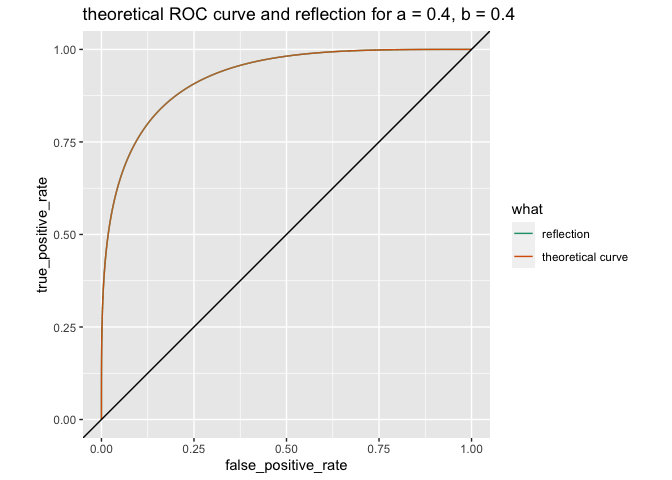
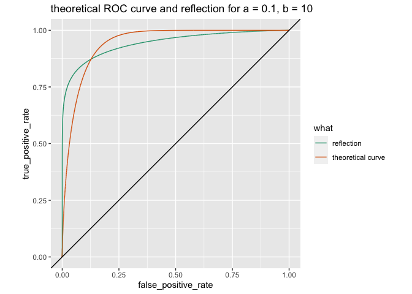

Asymmetry in the ROC Families
================

``` r
library(ggplot2)
```

``` r
mk_frame <- function(a, b, eval_points = seq(0, 1, 1e-5)) {
  tf <- data.frame(
    what = 'theoretical curve',
    a = a,
    b = b,
    false_positive_rate = 1 - pbeta(eval_points, shape1 = a, shape2 = b + 1),
    true_positive_rate = 1 - pbeta(eval_points, shape1 = a + 1, shape2 = b),
    stringsAsFactors = FALSE)
  
  reflect <- data.frame(
    what = 'reflection',
    a = a,
    b = b,
    false_positive_rate = 1 - tf$true_positive_rate,
    true_positive_rate = 1 - tf$false_positive_rate,
    stringsAsFactors = FALSE)
  
  rbind(tf, reflect)
}

mk_plot <- function(data) {
  a <- data$a[[1]]
  b <- data$b[[1]]
  ggplot(
    data = data,
    mapping = aes(
      x = false_positive_rate, 
      y = true_positive_rate, 
      color = what)) +
    geom_line() + 
    geom_abline(intercept = 0, slope = 1) +
    coord_fixed() +
    scale_color_brewer(palette = "Dark2") +
    ggtitle(paste0(
      "theoretical ROC curve and reflection for a = ", 
      format(a, digits = 2),
      ", b = ",
      format(b, digits = 2)))
}
```

``` r
a <- 0.4
b <- a

uniform_example <- mk_frame(a, b)
mk_plot(uniform_example)
```

<!-- -->

``` r
a <- 0.1
b <- 10

skew_example <- mk_frame(a, b)
mk_plot(skew_example)
```

<!-- -->
