Prediction Plot
================

See if we can infer distributional facts from the empirical ROC plot.

It looks like the prevalence is not obvious from the empirical plot,
though it is where the parameterization achieves slope 1, which is also
where the distance off the diagonal is maximized.

``` r
library(wrapr)
library(ggplot2)
library(WVPlots)
```

``` r
unpack[
  train_p,
  test_p
] <- readRDS('predictions.RDS') 
# from https://github.com/WinVector/vtreat/tree/main/Examples/KDD2009
```

``` r
calc_area <- function(x, y) {
  n <- length(x)
  dx <- abs(x[-length(x)] - x[-1])
  my <- (y[-length(x)] + y[-1])/2
  sum(dx*my)
}

mk_frame_idea_ab <- function(a, b, eval_points = seq(0, 1, 1e-5)) {
  data.frame(
    what = paste0("a=", format(a, digits = 3), ', b=', format(b, digits = 3)),
    model_score = eval_points,
    false_positive_rate = 1 - pbeta(eval_points, shape1 = a, shape2 = b + 1),
    true_positive_rate = 1 - pbeta(eval_points, shape1 = a + 1, shape2 = b),
    stringsAsFactors = FALSE)
}


mk_frame_idea_a1b1a2b2 <- function(a1, b1, a2, b2, eval_points = seq(0, 1, 1e-5)) {
  data.frame(
    what = paste0("a1=", format(a1, digits = 3), 
                  ', b1=', format(b1, digits = 3),
                  ", a2=", format(a2, digits = 3), 
                  ', b2=', format(b2, digits = 3)),
    model_score = eval_points,
    true_positive_rate = 1 - pbeta(eval_points, shape1 = a1, shape2 = b1),
    false_positive_rate = 1 - pbeta(eval_points, shape1 = a2, shape2 = b2),
    stringsAsFactors = FALSE)
}


mk_plot <- function(data, mn) {
  ggplot(
    data = data,
    mapping = aes(
      x = false_positive_rate, 
      y = true_positive_rate, 
      color = what)) +
    geom_line() + 
    geom_abline(intercept = 0, slope = 1) +
    coord_fixed() +
    scale_color_brewer(palette = "Dark2") +
    ggtitle(paste0(
      "theoretical ROC curve(s) on ", mn))
}


plot_a1b1a2b2_example <- function(mf, mn, a1, b1, a2, b2) {
  print("******************************")
  print(mn)
  prevalence <- mean(mf$churn)
  print(paste0('prevalence: ', prevalence))
  print(paste0("a1= ", a1, ", b1= ", b1,
               ", a2= ", a2, ", b1=2= ", b2))
  
  d_pos <- density(mf$xgboost[mf$churn])
  d_neg <- density(mf$xgboost[!mf$churn])
  
  evals <- seq(0, 1, by = 0.01)
  tf <- rbind(
    data.frame( 
      model_score = evals,
      density = dbeta(evals, shape1 = a1, shape2 = b1),
      what = 'positive theoretical',
      stringsAsFactors = FALSE),
    data.frame( 
      model_score = evals,
      density = dbeta(evals, shape1 = a2, shape2 = b2),
      what = 'negative theoretical',
      stringsAsFactors = FALSE),
    data.frame( 
      model_score = d_pos$x,
      density = d_pos$y,
      what = 'positive empirical',
      stringsAsFactors = FALSE),
    data.frame( 
      model_score = d_neg$x,
      density = d_neg$y,
      what = 'negative empirical',
      stringsAsFactors = FALSE))
  
  print(ggplot() +
          geom_ribbon(
            data = tf[tf$what %in% c('positive empirical', 'negative empirical'), ],
            mapping = aes(x = model_score, ymin = 0, ymax = density, fill = what), alpha = 0.5) +
          geom_line(
            data = tf[!(tf$what %in% c('positive empirical', 'negative empirical')), ],
            mapping = aes(x = model_score, y = density, color = what)) +
          ggtitle(paste0("Empirical and theoretical densities on ", mn)))
  
  pf <- mk_frame_idea_a1b1a2b2(a1, b1, a2, b2)
  
  print(paste0("ideal area: ",
               calc_area(
                 x = pf$false_positive_rate,
                 y = pf$true_positive_rate)))
  
  print(mk_plot(pf, mn))
  
  idx <- which.min(abs(prevalence - pf$model_score))
  print(pf[idx, ])
  
  print(mk_plot(pf, mn) + 
          geom_point(
            data = pf[idx, ],
            mapping = aes(
              x = false_positive_rate, 
              y = true_positive_rate)) +
          geom_abline(
            intercept = pf$true_positive_rate[[idx]] - pf$false_positive_rate[[idx]],
            slope = 1))
  
  
  print(ROCPlot(
    mf,
    xvar = 'xgboost',
    truthVar = 'churn',
    truthTarget = TRUE,
    title = paste0('model on ', mn, ', with mean-fit ROC curve')) + 
      geom_line(
        data = pf,
        mapping = aes(
          x = false_positive_rate, 
          y = true_positive_rate),
        linetype = 3,
        color = "DarkGreen"))
  print("******************************")
  invisible(NULL)
}
```

``` r
work_example <- function(mf, mn) {
  print(mn)
  print(paste0('prevalence: ', mean(mf$churn)))
  
  print(ggplot(
    data = mf,
    mapping = aes(x = xgboost, y = as.numeric(churn))) +
      coord_fixed() +
      xlim(c(0, 1)) + ylim(c(0, 1)) +
      geom_smooth() + 
      ggtitle(paste0("expected outcome as a function of model prediction on ", mn)))
  
  print(DoubleDensityPlot(
    mf,
    xvar = 'xgboost',
    truthVar = 'churn',
    title = paste0("double density on ", mn)))
  
  conditional_means <- aggregate(xgboost ~ churn, data = mf, FUN = mean)
  print(paste0("conditional means: ", conditional_means))
  
  
  print(ROCPlot(
    mf,
    xvar = 'xgboost',
    truthVar = 'churn',
    truthTarget = TRUE,
    title = paste0('model on ', mn),
    add_convex_hull = TRUE))
  
  # Now get the ideal AUC seen.
  roc_curve <- sigr::build_ROC_curve(
    modelPredictions = mf$xgboost, 
    yValues = mf$churn)
  
  idxs <- sort(unique(chull(
    x = c(1 - roc_curve$Specificity, 1),
    y = c(roc_curve$Sensitivity, 0))))
  idxs <- idxs[-length(idxs)]
  convex_hull <- roc_curve[idxs, ]
  target_area <- calc_area(
    x = 1 - convex_hull$Specificity, 
    y = convex_hull$Sensitivity)
  
  print(paste0('convex hull area: ', target_area))
  
  # Use the method of "A Single Parameter Family Characterizing Probability Model Performance" to identify the ROC curve from the restricted family.
  # 
  # First get `a, b` shape family. We are considering curves of the form `(a = c * a1, b = c * b1)` for positive `c`.
  
  prevalence <- mean(mf$churn)
  print(paste0("prevalence: ", prevalence))
  
  a1 <- 1
  b1 <- a1 * (1 - prevalence) / prevalence
  
  plot_a1b1a2b2_example(mf, paste(mn, 'joint prevalence matched'), a1 = a1 + 1, b1 = b1, a2 = a1, b2 = b1 + 1)
  

  # now try another match
  
  f <- function(x) {
    a <- x[[1]]
    b <- a * (1 - prevalence) / prevalence
    of <- mk_frame_idea_ab(a = a, b = b)
    fn <- suppressWarnings(approxfun(
      x = of$false_positive_rate, 
      y = of$true_positive_rate))
    evals <- fn(1 - roc_curve$Specificity)
    sum((roc_curve$Sensitivity - evals)^2)
  }
  soln <- optimize(f, c(0, 100))
  print(soln)
  
  a <- soln$minimum
  b <- a * (1 - prevalence) / prevalence
  
  plot_a1b1a2b2_example(mf, paste(mn, 'prevalance and ROC curve matched'), a1 = a + 1, b1 = b, a2 = a, b2 = b + 1)
 
  
  # Fit both parameters, by shape.
  
  f2 <- function(x) {
    a <- x[[1]]
    b <- x[[2]]
    of <- mk_frame_idea_ab(a = a, b = b)
    fn <- suppressWarnings(approxfun(
      x = of$false_positive_rate, 
      y = of$true_positive_rate))
    evals <- fn(1 - roc_curve$Specificity)
    sum((roc_curve$Sensitivity - evals)^2)
  }
  
  print(f2(c(a, b)))
  
  soln2 <- optim(
    par = c(a, b),
    fn = f2,
    method = 'L-BFGS-B',
    lower = c(0, 0))
  print(soln2)
  
  a2 <- soln2$par[[1]]
  b2 <- soln2$par[[2]]
  
  plot_a1b1a2b2_example(mf, paste(mn, 'ROC curve matched'), a1 = a2 + 1, b1 = b2, a2 = a2, b2 = b2 + 1)
  
  # Moment match positive and negatie separately (enforce no relation)
  # https://en.wikipedia.org/wiki/Beta_distribution#Method_of_moments
  calc_ab <- function(empirical_mean, emprical_var) {
    list(
      a = empirical_mean * ( empirical_mean * (1 - empirical_mean) / emprical_var - 1),
      b = (1 - empirical_mean) * ( empirical_mean * (1 - empirical_mean) / emprical_var - 1))
  }
  
  unpack[
    a_pos = a,
    b_pos = b
    ] <- calc_ab(mean(mf$xgboost[mf$churn]), var(mf$xgboost[mf$churn]))
  unpack[
    a_neg = a,
    b_neg = b
    ] <- calc_ab(mean(mf$xgboost[!mf$churn]), var(mf$xgboost[!mf$churn]))
  
  print(paste0(
    'a_pos: ', a_pos,
    ', b_pos: ', b_pos,
    ', a_neg: ', a_neg,
    ', b_neg: ', b_neg
  ))
  plot_a1b1a2b2_example(mf, paste(mn, 'Density curves matched'), a1 = a_pos, b1 = b_pos, a2 = a_neg, b2 = b_neg)
  
  invisible(NULL)
}
```

Train
-----

``` r
work_example(train_p, 'train')
```

    ## [1] "train"
    ## [1] "prevalence: 0.0735555555555556"

    ## `geom_smooth()` using method = 'gam' and formula 'y ~ s(x, bs = "cs")'

    ## Warning: Removed 19 rows containing missing values (geom_smooth).

<!-- --><!-- -->

    ## [1] "conditional means: c(FALSE, TRUE)"                          
    ## [2] "conditional means: c(0.0658697948849392, 0.178439974513895)"

<!-- -->

    ## [1] "convex hull area: 0.813642950884061"
    ## [1] "prevalence: 0.0735555555555556"
    ## [1] "******************************"
    ## [1] "train joint prevalence matched"
    ## [1] "prevalence: 0.0735555555555556"
    ## [1] "a1= 2, b1= 12.595166163142, a2= 1, b1=2= 13.595166163142"

<!-- -->

    ## [1] "ideal area: 0.759545506176936"

<!-- -->

    ##                              what model_score true_positive_rate
    ## 7357 a1=2, b1=12.6, a2=1, b2=13.6     0.07356          0.7359147
    ##      false_positive_rate
    ## 7357            0.353896

<!-- --><!-- -->

    ## [1] "******************************"
    ## $minimum
    ## [1] 0.5625448
    ## 
    ## $objective
    ## [1] 37.91684
    ## 
    ## [1] "******************************"
    ## [1] "train prevalance and ROC curve matched"
    ## [1] "prevalence: 0.0735555555555556"
    ## [1] "a1= 1.56254481450927, b1= 7.08534541295821, a2= 0.562544814509275, b1=2= 8.08534541295821"

<!-- -->

    ## [1] "ideal area: 0.818262015186894"

<!-- -->

    ##                                     what model_score true_positive_rate
    ## 7357 a1=1.56, b1=7.09, a2=0.563, b2=8.09     0.07356          0.7902399
    ##      false_positive_rate
    ## 7357           0.3093546

<!-- --><!-- -->

    ## [1] "******************************"
    ## [1] 37.91684
    ## $par
    ## [1] 1.342247 1.120087
    ## 
    ## $value
    ## [1] 0.9419788
    ## 
    ## $counts
    ## function gradient 
    ##       31       31 
    ## 
    ## $convergence
    ## [1] 0
    ## 
    ## $message
    ## [1] "CONVERGENCE: REL_REDUCTION_OF_F <= FACTR*EPSMCH"
    ## 
    ## [1] "******************************"
    ## [1] "train ROC curve matched"
    ## [1] "prevalence: 0.0735555555555556"
    ## [1] "a1= 2.34224660685369, b1= 1.12008690658619, a2= 1.34224660685369, b1=2= 2.12008690658619"

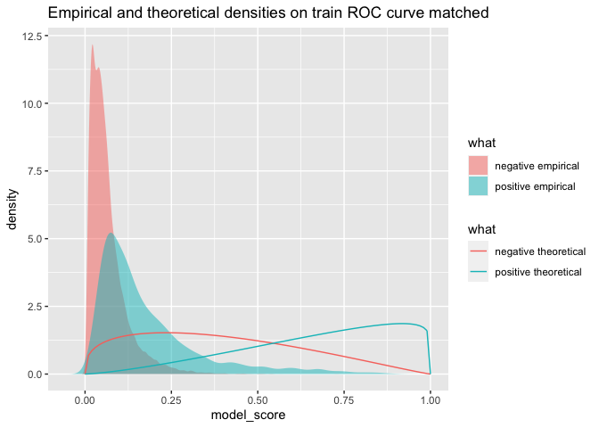<!-- -->

    ## [1] "ideal area: 0.810946448943487"

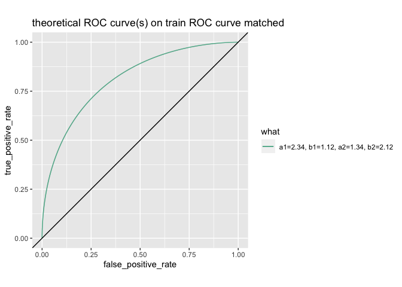<!-- -->

    ##                                    what model_score true_positive_rate
    ## 7357 a1=2.34, b1=1.12, a2=1.34, b2=2.12     0.07356          0.9973474
    ##      false_positive_rate
    ## 7357            0.927682

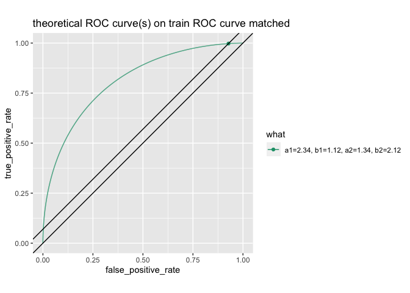<!-- -->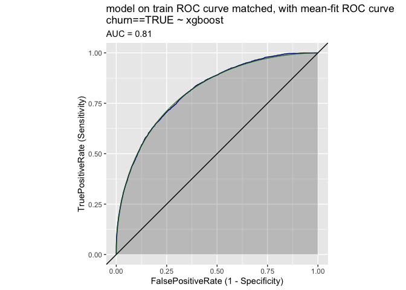<!-- -->

    ## [1] "******************************"
    ## [1] "a_pos: 0.962076558261329, b_pos: 4.42952115341852, a_neg: 1.23355876484108, b_neg: 17.4936707186551"
    ## [1] "******************************"
    ## [1] "train Density curves matched"
    ## [1] "prevalence: 0.0735555555555556"
    ## [1] "a1= 0.962076558261329, b1= 4.42952115341852, a2= 1.23355876484108, b1=2= 17.4936707186551"

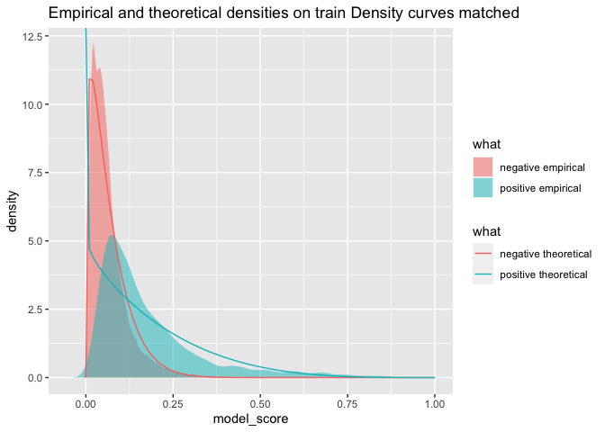<!-- -->

    ## [1] "ideal area: 0.745073735073568"

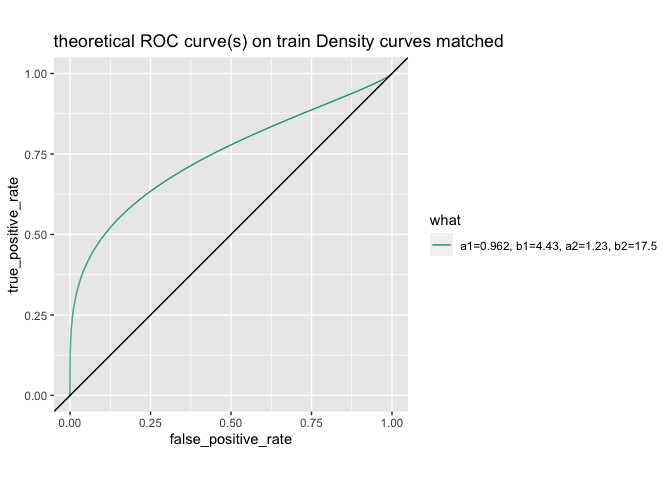<!-- -->

    ##                                     what model_score true_positive_rate
    ## 7357 a1=0.962, b1=4.43, a2=1.23, b2=17.5     0.07356          0.6961396
    ##      false_positive_rate
    ## 7357           0.3447712

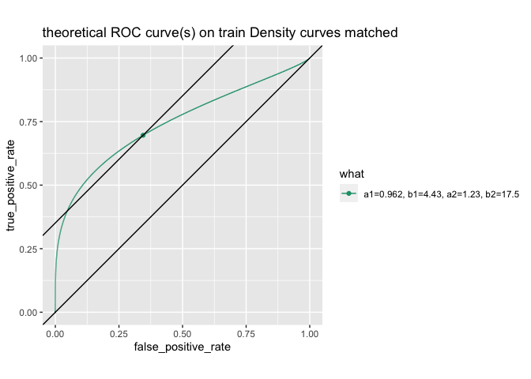<!-- -->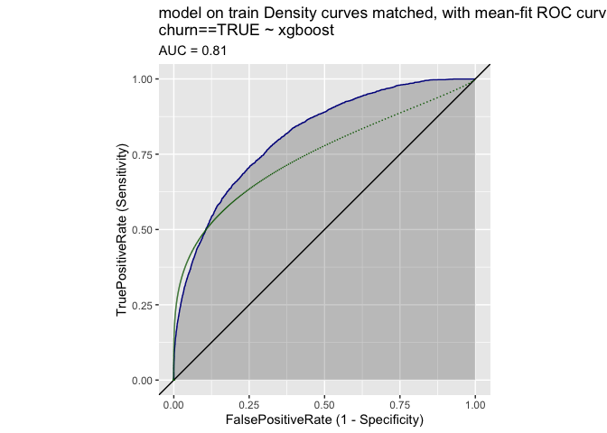<!-- -->

    ## [1] "******************************"

Test
----

``` r
work_example(test_p, 'test')
```

    ## [1] "test"
    ## [1] "prevalence: 0.0724"

    ## `geom_smooth()` using method = 'gam' and formula 'y ~ s(x, bs = "cs")'

    ## Warning: Removed 1 rows containing missing values (geom_smooth).

<!-- --><!-- -->

    ## [1] "conditional means: c(FALSE, TRUE)"                          
    ## [2] "conditional means: c(0.0673460909607208, 0.148062062141028)"

<!-- -->

    ## [1] "convex hull area: 0.750178682466962"
    ## [1] "prevalence: 0.0724"
    ## [1] "******************************"
    ## [1] "test joint prevalence matched"
    ## [1] "prevalence: 0.0724"
    ## [1] "a1= 2, b1= 12.8121546961326, a2= 1, b1=2= 13.8121546961326"

<!-- -->

    ## [1] "ideal area: 0.759389914092928"

<!-- -->

    ##                              what model_score true_positive_rate
    ## 7241 a1=2, b1=12.8, a2=1, b2=13.8      0.0724           0.735932
    ##      false_positive_rate
    ## 7241           0.3541453

<!-- --><!-- -->

    ## [1] "******************************"
    ## $minimum
    ## [1] 1.159244
    ## 
    ## $objective
    ## [1] 4.403791
    ## 
    ## [1] "******************************"
    ## [1] "test prevalance and ROC curve matched"
    ## [1] "prevalence: 0.0724"
    ## [1] "a1= 2.15924365035961, b1= 14.8524089789167, a2= 1.15924365035961, b1=2= 15.8524089789167"

<!-- -->

    ## [1] "ideal area: 0.744771790545527"

<!-- -->

    ##                                    what model_score true_positive_rate
    ## 7241 a1=2.16, b1=14.9, a2=1.16, b2=15.9      0.0724          0.7225412
    ##      false_positive_rate
    ## 7241           0.3641095

<!-- -->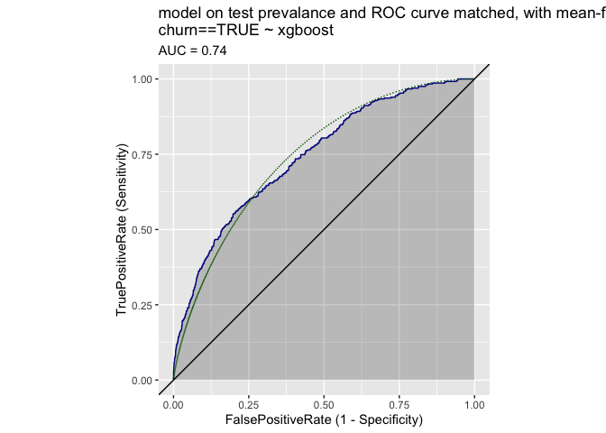<!-- -->

    ## [1] "******************************"
    ## [1] 4.403791
    ## $par
    ## [1] 4.224174 1.591359
    ## 
    ## $value
    ## [1] 0.9509045
    ## 
    ## $counts
    ## function gradient 
    ##       45       45 
    ## 
    ## $convergence
    ## [1] 0
    ## 
    ## $message
    ## [1] "CONVERGENCE: REL_REDUCTION_OF_F <= FACTR*EPSMCH"
    ## 
    ## [1] "******************************"
    ## [1] "test ROC curve matched"
    ## [1] "prevalence: 0.0724"
    ## [1] "a1= 5.22417422194232, b1= 1.59135880319764, a2= 4.22417422194232, b1=2= 2.59135880319764"

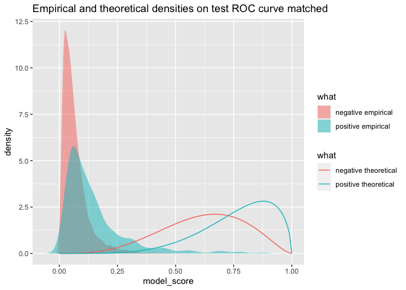<!-- -->

    ## [1] "ideal area: 0.740896875593515"

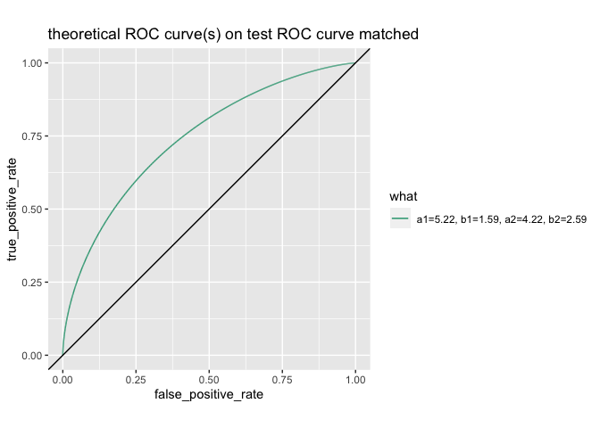<!-- -->

    ##                                    what model_score true_positive_rate
    ## 7241 a1=5.22, b1=1.59, a2=4.22, b2=2.59      0.0724          0.9999966
    ##      false_positive_rate
    ## 7241           0.9998526

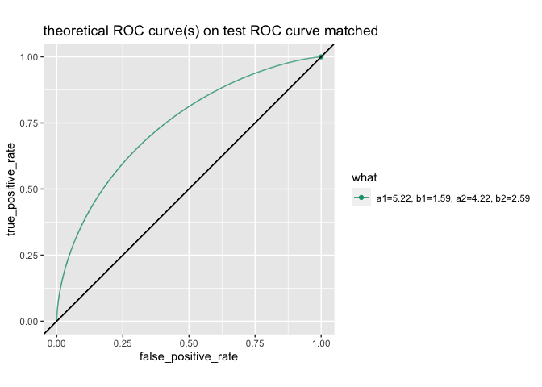<!-- -->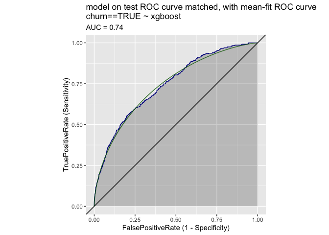<!-- -->

    ## [1] "******************************"
    ## [1] "a_pos: 0.831909381137213, b_pos: 4.78674383162723, a_neg: 1.11088656128712, b_neg: 15.3843033664407"
    ## [1] "******************************"
    ## [1] "test Density curves matched"
    ## [1] "prevalence: 0.0724"
    ## [1] "a1= 0.831909381137213, b1= 4.78674383162723, a2= 1.11088656128712, b1=2= 15.3843033664407"

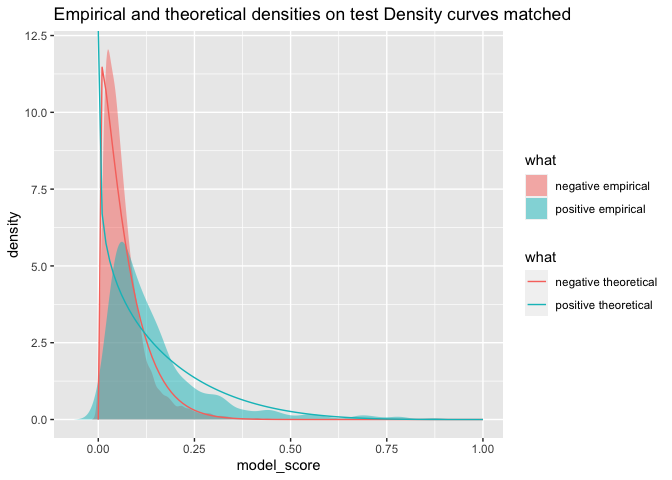<!-- -->

    ## [1] "ideal area: 0.676805773302162"

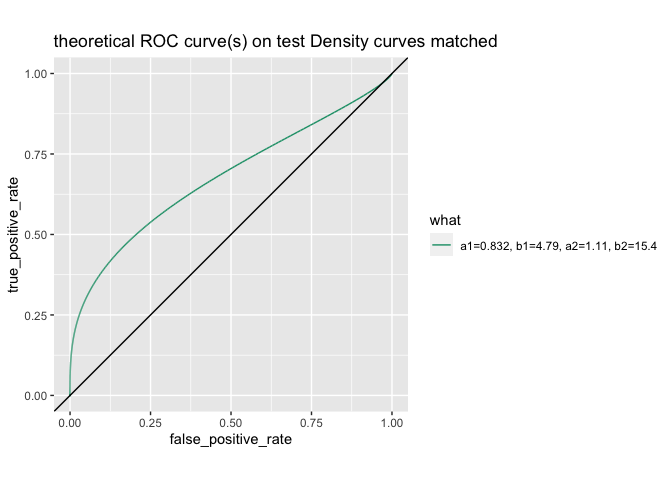<!-- -->

    ##                                     what model_score true_positive_rate
    ## 7241 a1=0.832, b1=4.79, a2=1.11, b2=15.4      0.0724          0.6164276
    ##      false_positive_rate
    ## 7241            0.357449

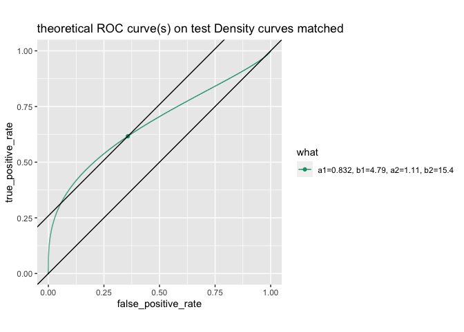<!-- -->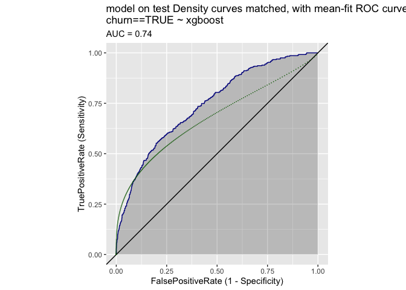<!-- -->

    ## [1] "******************************"
