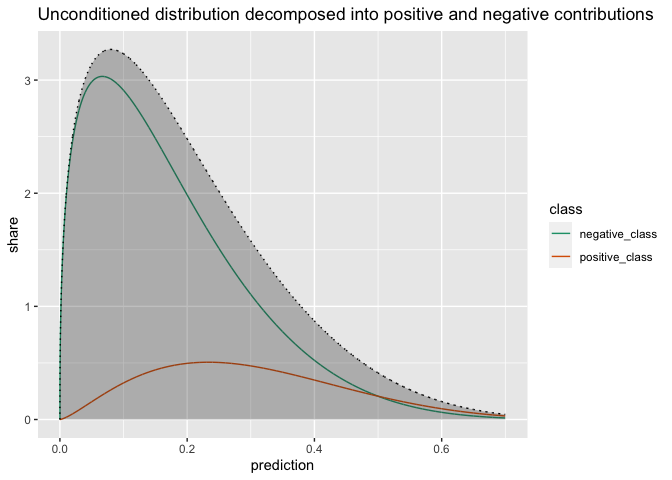
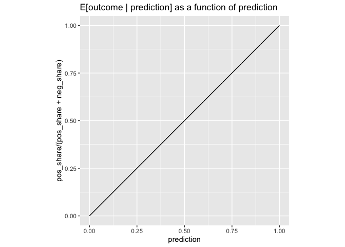
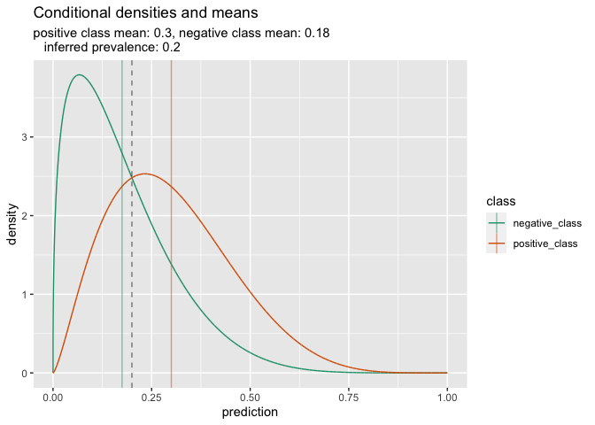
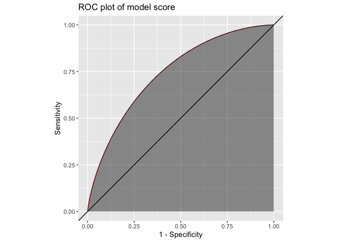
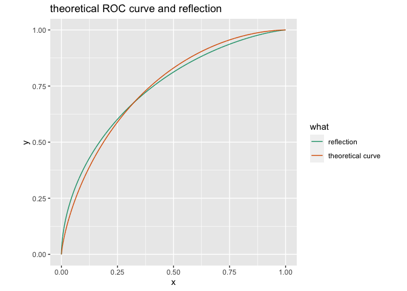

A Single Parameter Family Characterizing Probability Model Performance
================

This is the source for the article shared
[here](https://win-vector.com/2020/10/29/a-single-parameter-family-characterizing-probability-model-performance/).

Introduction
------------

We’ve been writing on the distribution density shapes expected for
probability models in [ROC (receiver operator characteristic)
plots](https://win-vector.com/tag/roc-curves/), [double density
plots](https://win-vector.com/2020/10/27/the-double-density-plot-contains-a-lot-of-useful-information/),
and [normal/logit-normal
densities](https://win-vector.com/2020/10/26/your-lopsided-model-is-out-to-get-you/)
frameworks. I thought I would re-approach the issue with a specific
family of examples.

### Definitions

Let’s define a “probability model” as a model that returns predicted
probabilities. Essentially this means the model returns numbers between
zero and one, and the model is a good probability model if these
predictions obey additional conditions (such as being large on positive
examples, small on negative examples, obeying the [probability
axioms](https://win-vector.com/2020/09/19/kolmogorovs-axioms-of-probability-even-smarter-than-you-have-been-told/),
and even [balance
conditions](https://win-vector.com/2011/09/14/the-simpler-derivation-of-logistic-regression/)).

We will call a probability model [fully
calibrated](https://win-vector.com/2020/10/28/an-example-of-a-calibrated-model-that-is-not-fully-calibrated/)
if we have <code>E\[outcome \| prediction\] = prediction</code> for all
observed values of <code>prediction</code>. We
[note](https://win-vector.com/2020/10/28/an-example-of-a-calibrated-model-that-is-not-fully-calibrated/),
not all calibrated models are fully calibrated.

Our Example
-----------

Any fully calibrated probability model’s performance can be
characterized as follows.

We assume an unconditioned distribution of the model predictions:
<code>density(p)</code>. Then the distribution of predictions on
positive truth-value examples must be a shape of the form <code>c p
density(p)</code> for some constant <code>c</code>, and the
distributions of the predictions conditioned to come from the negative
truth-value examples must be of the form <code>d (1 - p)
density(p)</code> for some constant <code>d</code>. Our point is: being
fully calibrated is a very strong condition. In this situation knowing
the unconditioned distribution of predictions and the positive outcome
prevalence determines the two conditional prediction distributions.

Let’s work a very interesting specific example of the above. Let’s take
our unconditional distribution of model predictions to be [Beta
distributed](https://en.wikipedia.org/wiki/Beta_distribution) with shape
parameters <code>a</code> and <code>b</code>. Then some algebra allows
us to derive the fully balanced condition implies that the distribution
of the predictions on known positive outcomes must be Beta distributed
with parameters <code>(a + 1, b)</code>, and the distribution of the
predictions on the known negative outcomes must be Beta distributed with
parameters <code>(a, b + 1)</code>.

By the methods of [an earlier
note](https://win-vector.com/2020/10/27/the-double-density-plot-contains-a-lot-of-useful-information/)
we know the the <code>prevalence</code> must obey the equation:

<pre>
   prevalence E[prediction | positive] +
      (1 - prevalence) E[prediction | negative] = prevalence
</pre>

Substituting in the known expected values for the conditional Beta
distributions we have:

<pre>
   prevalence (a + 1) / (a + b + 1) +
      (1 - prevalence) a / (a + b + 1) = prevalence
</pre>

Which implies <code>prevalence = a / (a + b)</code>. This prevalence is
also the mean of the unconditional distribution *and* the unique point
where the two conditional densities cross (this is confirmed by some
algebra on the Beta densities).

### Examining an Instance

Let’s see an instance of this example in
[`R`](https://www.r-project.org).

``` r
library(ggplot2)
library(WVPlots)
```

We pick an example prevalence.

``` r
prevalence <- .2
# a / (a + b) = prevalence
# so b = a * (1-prevalence) / prevalence 
# and a = b * prevalence / (1 - prevalence)
```

This leaves us one degree of freedom remaining, let’s use this to set
`a` to `1.4`.

``` r
a <- 1.4
b <- a * (1 - prevalence) / prevalence
print(b)
```

    ## [1] 5.6

Confirm `a / (a + b)` matches the specified prevalence.

``` r
a / (a + b)
```

    ## [1] 0.2

Demonstrating the Relations
---------------------------

### Basic Summaries and Densities

Let’s look at all three of the distributions of interest: the
unconditional distribution of predictions, the distribution of
predictions on known positive examples, and the distribution of examples
on known negative examples.

``` r
step <- 0.0001
prediction <- seq(0, 1, step)

d_mutual <- dbeta(prediction, shape1 = a, shape2 = b)
d_pos <- dbeta(prediction, shape1 = a + 1, shape2 = b)
d_neg <- dbeta(prediction, shape1 = a, shape2 = b + 1)
```

The conditional densities weighted by what fraction of the system they
are should add up to the unconditional density. That is easy to confirm
quantitatively.

``` r
d_pos_share <- d_pos * prevalence 
d_neg_share <- d_neg * (1 - prevalence)

error <- max(abs((d_pos_share + d_neg_share) - d_mutual))
error
```

    ## [1] 2.220446e-15

With a bit more work we can depict this graphically.

``` r
pf <- data.frame(
    prediction = prediction,
    share = d_pos_share,
    density = d_pos,
    class = 'positive_class',
    stringsAsFactors = FALSE)
nf <- data.frame(
    prediction = prediction,
    share = d_neg_share,
    density = d_neg,
    class = 'negative_class',
    stringsAsFactors = FALSE)
uf <- data.frame(
  prediction = prediction,
  share = d_mutual,
  density = d_mutual,
  class = 'unconditioned',
  stringsAsFactors = FALSE
)
cf <- data.frame(
  prediction = prediction,
  share = d_pos_share + d_neg_share,
  density = d_pos_share + d_neg_share,
  class = 'combined',
  stringsAsFactors = FALSE
)

rf <- data.frame(
  prediction = prediction,
  pos_share = d_pos_share,
  pos_density = d_pos,
  neg_share = d_neg_share,
  neg_density = d_neg,
  combined_share = d_pos_share + d_neg_share,
  mutual_density = d_mutual,
  stringsAsFactors = FALSE)
```

``` r
lf <- rbind(pf, nf)
plot_lim <- 0.7
lf <- lf[lf$prediction <= plot_lim, ]
ggplot() + 
  geom_line(
    data = lf,
    mapping = aes(x = prediction, y = share, color = class)) + 
  geom_ribbon(
    data = cf[cf$prediction <= plot_lim, ],
    mapping = aes(x = prediction, ymin = 0, ymax = share),
    alpha = 0.3
  ) +
  geom_line(
    data = uf[uf$prediction <= plot_lim, ],
    mapping = aes(x = prediction, y = share),
    linetype = 3
  ) +
  scale_color_brewer(palette = "Dark2") +
  ggtitle("Unconditioned distribution decomposed into positive and negative contributions")
```

<!-- -->

Note the conditioned curves are the densities re-scaled by to integrate
to their fraction of contribution, this moves the crossing point away
from the prevalence.

### Full Calibration

We can also confirm the the depicted model score is fully calibrated. We
are looking for the following line to match the line `y = x`.

``` r
ggplot(
  data = rf,
  mapping = aes(x = prediction, y = pos_share/(pos_share + neg_share))) +
  geom_line() +
  coord_fixed() +
  ggtitle("E[outcome | prediction] as a function of prediction")
```

    ## Warning: Removed 2 row(s) containing missing values (geom_path).

<!-- -->

### Conditional Summaries

The per-class means and prevalences can be confirmed as follows.

``` r
means <- data.frame(
  mean = c(sum(pf$density * pf$prediction) / sum(pf$density),
           sum(nf$density * nf$prediction) / sum(nf$density)),
  class_prevalence = c(prevalence, 1 - prevalence),
  class = c('positive_class', 'negative_class'),
  stringsAsFactors = FALSE)

knitr::kable(means)
```

|      mean | class\_prevalence | class           |
|----------:|------------------:|:----------------|
| 0.3000000 |               0.2 | positive\_class |
| 0.1750018 |               0.8 | negative\_class |

``` r
recovered_prev <- sum(means$class_prevalence * means$mean)
recovered_prev
```

    ## [1] 0.2000014

The conditional curves cross where <code>beta(a, b+1)(x) = beta(a+1,
b)(x)</code>. This is at `x = 1/(1 + beta(a, b+1)/beta(a+1, b))`, which
is also `a / (a + b)`.

``` r
crossing_prediction <- 1/(1 + beta(a, b+1)/beta(a+1, b))

print(crossing_prediction - a / (a + b))
```

    ## [1] 2.775558e-17

``` r
print(
  dbeta(crossing_prediction, a, b + 1) - 
    dbeta(crossing_prediction, a + 1, b))
```

    ## [1] -5.329071e-15

### A Graphical Summary

All of the above relations can be summarized in the following annotated
graph.

``` r
ggplot() + 
  geom_line(
    data = rbind(pf, nf),
    mapping = aes(x = prediction, y = density, color = class)) + 
  geom_vline(
    data = means,
    mapping = aes(xintercept = mean, color = class), alpha = 0.5) + 
  geom_vline(xintercept = recovered_prev, alpha = 0.5, linetype = 2) +
  scale_color_brewer(palette = "Dark2") + 
  ggtitle("Conditional densities and means",
          subtitle = paste0(
            "positive class mean: ", 
            format(means$mean[means$class == 'positive_class'], digits = 2),
            ", negative class mean: ", 
            format(means$mean[means$class == 'negative_class'], digits = 2),
            "\n   inferred prevalence: ", format(recovered_prev, digits = 2)
          ))
```

<!-- -->

As an ROC Plot
--------------

And we can, of course, represent the model performance as an ROC plot.

``` r
rf <- data.frame(
  prediction = pf$prediction,
  Sensitivity = 1 - cumsum(pf$density)/sum(pf$density),
  Specificity = cumsum(nf$density)/sum(nf$density))

tf <- data.frame(
  what = 'theoretical curve',
  prediction = pf$prediction,
  y = 1 - pbeta(pf$prediction, shape1 = a + 1, shape2 = b),
  x = 1 - pbeta(pf$prediction, shape1 = a, shape2 = b + 1),
  stringsAsFactors = FALSE)

ggplot(
  data = rf,
  aes(x = 1 - Specificity, y = Sensitivity)) +
  geom_line() + 
  geom_ribbon(aes(ymin = 0, ymax = Sensitivity), alpha = 0.5) +
  geom_line(
    data = tf,
    mapping = aes(x = x, y = y),
    color = 'red',
    linetype = 2,
    alpha = 0.5) + 
  geom_abline(slope = 1, intercept = 0) +
  coord_fixed() +
  ggtitle("ROC plot of model score")
```

<!-- -->

We can check if the ROC curve is symmetric with respect to `(x, y)` goes
to `(1 - y, 1 - x)`. It turns out, does not quite have this symmetry.

``` r
reflect <- data.frame(
  what = 'reflection',
  x = 1 - tf$y,
  y = 1 - tf$x,
  stringsAsFactors = FALSE)

ggplot(
  data = rbind(tf[, qc(what, x, y)], reflect),
  mapping = aes(x = x, y = y, color = what)) +
  geom_line() + 
  coord_fixed() +
  scale_color_brewer(palette = "Dark2") +
  ggtitle("theoretical ROC curve and reflection")
```

<!-- -->

The above lack of symmetry means we probably have a different single
parameter family of ROC curves for each prevalence, as the 0.5
prevelance case does have a symmetric ROC curve family.

Some Limiting Cases
-------------------

For a given prevalence situation the prediction densities of all fully
calibrated models that have an unconditional beta distribution are given
by shape parameters:

-   `(c a, c b)` for the unconditional distribution of predictions.
-   `(c a + 1, c b)` for the distribution of the prediction on positive
    examples.
-   `(c a, c b + 1)` for the distribution of the prediction on negative
    examples.

Where `(a, b)` are positive numbers such that `prevalence = a / (a + b)`
and `c` is an arbitrary positive constant.

For this family of model perfmonces the limit as we take `c` to positive
infinity is the constant model that always predicts the prevalence. This
is an oblivious or uninformative model, but it is fully calibrated on
its single limiting prediction.

If we take the limit of `c` to zero from above, then the limiting model
is an impulse at zero of perfect negative predictions and an impulse at
one of perfect positive predictions.

For intermediate values of `c` we get models that are fully calibrated,
match the observed prevalence, and have varying degrees of quality for
their predictions.

If `a = b`, then the [previously discussed uniform distribution
example](https://win-vector.com/2020/09/06/0-83-is-a-special-auc/) is
part of the model family.

Conclusion
----------

For a given problem prevalence, the set of fully calibrated model
performance densities that have an unconditional Beta distribution form
a single parameter family. When model performance is characterized by a
single parameter of this nature, then using a single derived parameter
such as AUC (area under the curve) becomes a proper model comparison
procedure in that dominant model quality is ordered the same way as the
score. (Please see
[ref](https://win-vector.com/2020/09/13/why-working-with-auc-is-more-powerful-than-one-might-think/),
though this is not the model characterization family we anticipated
there; also a different characterization than [normal or logit normal
scoring](https://win-vector.com/2020/10/26/your-lopsided-model-is-out-to-get-you/);
some notes on the asymmetries in this formulation can be found
[here](https://github.com/WinVector/Examples/blob/main/density_shapes/Asymmetry.md).)
