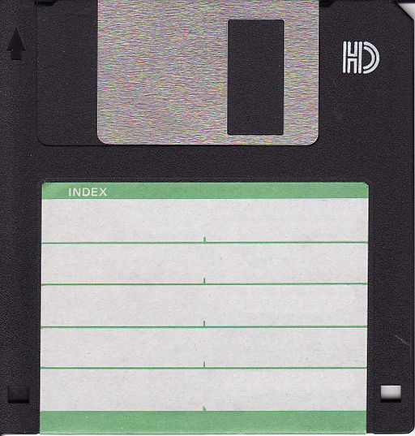

Trick question: is a `10,000` cell numeric `data.frame`
large or small? 

In the era of "big data" `10,000` cells is minuscule.  Such data could be fit on
fewer than `1,000` punched cards (or less than half a box).

<center>

</center>


The joking answer is: it is small when they are selling you the software,
but can be considered unfairly large later.

# Example

Let's look at a few examples in [`R`](https://cran.r-project.org). First let's
set up our examples.  A `10,000` row by one column `data.frame` (probably
fairly close the common mental model of a `100,000` cell `data.frame`),
and a `100,000` column by one row `data.frame` (frankly bit of an abuse,
but large data warehouses with millions of rows and `500` to `1,000` columns
are not uncommon).

```{r setup}
dTall <- as.data.frame(matrix(data = 0.0, 
                              nrow = 10000, 
                              ncol = 1))

dWide <- as.data.frame(matrix(data = 0.0, 
                              nrow = 1,
                              ncol = 10000))
```

For our example problem we will
try to select (zero) rows based on a condition written against the
first column.

# Base R

For standard `R` working with either 
`data.frame` is not a problem.  

```{r baseR}
system.time(nrow(dTall[dTall$V1>0, , drop = FALSE]))

system.time(nrow(dWide[dWide$V1>0, , drop = FALSE]))
```

# dplyr

For `dplyr` the tall frame is no problem, but the wide frame
can take almost 5 minutes to filter.

```{r dplyr, cache=TRUE}
library("dplyr")

system.time(dTall %>% filter(V1>0) %>% tally())

system.time(dWide %>% filter(V1>0) %>% tally())
```

We will dig deeper into the  `dplyr` timing on the wide table later.

# Databases

Most databases don't really like to work with a ridiculous number of columns.

## RSQLite

`RSQLite` refuses to worm with the wide frame.

```{r sqlite_connect}
db <- DBI::dbConnect(RSQLite::SQLite(), 
                     ":memory:")
```

```{r sqlite, cache=TRUE, error = TRUE}
DBI::dbWriteTable(db, "dTall", dTall,
                  overwrite = TRUE,
                  temporary = TRUE)

DBI::dbWriteTable(db, "dWide", dWide,
                  overwrite = TRUE,
                  temporary = TRUE)
```

```{r clean_sqlite}
DBI::dbDisconnect(db)
```

## PostgreSQL

PostgreSQL refuses the wide frame, stating a hard limit of
`1600` columns.

```{r postgres_connect}
db <- DBI::dbConnect(RPostgres::Postgres(),
                     host = 'localhost',
                     port = 5432,
                     user = 'postgres',
                     password = 'pg')
```

```{r postgres, cache = TRUE, error = TRUE}
DBI::dbWriteTable(db, "dTall", dTall,
                  overwrite = TRUE,
                  temporary = TRUE)

DBI::dbWriteTable(db, "dWide", dWide,
                  overwrite = TRUE,
                  temporary = TRUE)
```

```{r clean_postgres}
DBI::dbDisconnect(db)
```


## Spark

Spark fails, losing the cluster connection when attempting to write
the wide frame.

```{r spark_connect}
spark <- sparklyr::spark_connect(version='2.2.0', 
                                 master = "local")
```

```{r spark, cache = TRUE, error = TRUE}
DBI::dbWriteTable(spark, "dTall", dTall,
                  temporary = TRUE)

DBI::dbWriteTable(db, "dWide", dWide,
                  temporary = TRUE)
```

```{r clean_spark}
sparklyr::spark_disconnect(spark)
```

# Why I care

Some clients have run into intermittent issues on `Spark` at around 700 columns.
One step of working around the issue was trying a range of sizes
to try and figure out where the issue was and get a repeatable failure (
always an imporant step in debugging).

# Extra: dplyr again at larger scale.

Let's look a bit more closely at that dplyr run-time.  
We will try to get the nature of the column dependency by
pushing the column count ever further up: to `100,000`.

This is still less than a megabyte of data.  It can fit on a 1986 era `1.44 MB` floppy disk.

<center>

</center>


```{r dplyr2, cache=TRUE}
dWide <- as.data.frame(matrix(data = 0.0, 
                              nrow = 1,
                              ncol = 100000))

dwt <- system.time(dWide %>% filter(V1>0) %>% tally())
print(dwt)
```

## Python

For comparison we can measure how long it would take to write the results out to disk,
start up a [Python](https://www.python.org) interpreter,
use [Pandas](https://pandas.pydata.org) do do the work, 
and then read the result back in to `R`.

```{r bp}
start_pandas <- Sys.time()
feather::write_feather(dWide, "df.feather")
```


```{python, p1, engine.path="/anaconda/bin/python"}
import pandas
import feather

df = feather.read_dataframe('df.feather')
print(type(df))
print(df.shape)
df_filtered = df.query('V1>1')
feather.write_dataframe(df_filtered, 'dr.feather')
```

```{r ep}
res <- feather::read_feather('dr.feather')
nrow(res)
end_pandas <- Sys.time()
python_duration <- difftime(end_pandas, start_pandas, 
                            unit = "secs")
print(python_duration)

ratio <- as.numeric(dwt['elapsed'])/as.numeric(python_duration)
print(ratio)
```

This is slow, but still `r sprintf("%8.3g", ratio)` times faster than using `dplyr`.


