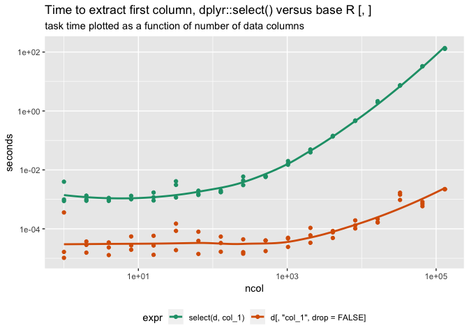
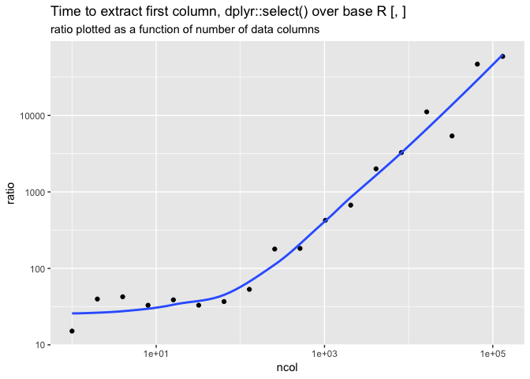

select\_timing.Rmd
================

``` r
library("dplyr")
```

    ## 
    ## Attaching package: 'dplyr'

    ## The following objects are masked from 'package:stats':
    ## 
    ##     filter, lag

    ## The following objects are masked from 'package:base':
    ## 
    ##     intersect, setdiff, setequal, union

``` r
library("ggplot2")
```

    ## Registered S3 methods overwritten by 'ggplot2':
    ##   method         from 
    ##   [.quosures     rlang
    ##   c.quosures     rlang
    ##   print.quosures rlang

``` r
library("rqdatatable")
```

    ## Loading required package: rquery

``` r
library("cdata")
packageVersion("dplyr")
```

    ## [1] '0.8.1'

``` r
R.version
```

    ##                _                           
    ## platform       x86_64-apple-darwin15.6.0   
    ## arch           x86_64                      
    ## os             darwin15.6.0                
    ## system         x86_64, darwin15.6.0        
    ## status                                     
    ## major          3                           
    ## minor          6.0                         
    ## year           2019                        
    ## month          04                          
    ## day            26                          
    ## svn rev        76424                       
    ## language       R                           
    ## version.string R version 3.6.0 (2019-04-26)
    ## nickname       Planting of a Tree

``` r
f <- function(k) {
  d <- rep(list(1:5), k)
  names(d) <- paste0("col_", seq_len(k))
  d <- data.frame(d)
  rownames(d) <- NULL
  d <- tbl_df(d)
  gc()
  tm <- microbenchmark::microbenchmark(
    select(d, col_1),
    d[, "col_1", drop = FALSE],
    times = 3L
  )
  td <- data.frame(tm)
  td$ncol <- ncol(d)
  td
}


times <- lapply(2^(0:17), f)
times <- data.frame(data.table::rbindlist(times))
times$seconds <- times$time/1e9


ggplot(data = times, 
       mapping = aes(x = ncol, y = seconds, color = expr)) + 
  geom_point() + 
  geom_smooth(se = FALSE) + 
  scale_x_log10() + 
  scale_y_log10() + 
  theme(legend.position = "bottom") +
  scale_color_brewer(palette = "Dark2") +
  ggtitle("Time to extract first column, dplyr::select() versus base R [, ]",
          subtitle = "task time plotted as a function of number of data columns")
```

    ## `geom_smooth()` using method = 'loess' and formula 'y ~ x'

<!-- -->

``` r
# compute time ratios
layout <- blocks_to_rowrecs_spec(
  wrapr::qchar_frame(
    "expr"         , "seconds"     |
      "select(d, col_1)", select_time |
      'd[, "col_1", drop = FALSE]'     , base_R_time      ),
  recordKeys = "ncol")

print(layout)
```

    ## {
    ##  block_record <- wrapr::qchar_frame(
    ##    "ncol"  , "expr"                        , "seconds"   |
    ##      .     , "select(d, col_1)"            , select_time |
    ##      .     , "d[, \"col_1\", drop = FALSE]", base_R_time )
    ##  block_keys <- c('ncol', 'expr')
    ## 
    ##  # becomes
    ## 
    ##  row_record <- wrapr::qchar_frame(
    ##    "ncol"  , "select_time", "base_R_time" |
    ##      .     , select_time  , base_R_time   )
    ##  row_keys <- c('ncol')
    ## 
    ##  # args: c(checkNames = TRUE, checkKeys = TRUE, strict = FALSE, allow_rqdatatable = FALSE)
    ## }

``` r
calc_ratios <- local_td(times) %.>%
  project(., 
          groupby = c("expr", "ncol"),
          seconds = mean(seconds)) %.>%
  layout %.>%
  extend(.,
         ratio = select_time/base_R_time)

cat(format(calc_ratios))
```

    ## table(times; 
    ##   expr,
    ##   time,
    ##   ncol,
    ##   seconds) %.>%
    ##  project(., seconds := mean(seconds),
    ##   g= expr, ncol) %.>%
    ##  non_sql_node(., blocks_to_rowrecs(.)) %.>%
    ##  extend(.,
    ##   ratio := select_time / base_R_time)

``` r
ratios <- times %.>% calc_ratios

ggplot(data = ratios, 
       mapping = aes(x = ncol, y = ratio)) +
  geom_point() + 
  geom_smooth(se = FALSE) + 
  scale_x_log10() + 
  scale_y_log10() + 
  theme(legend.position = "bottom") +
  scale_color_brewer(palette = "Dark2") +
  ggtitle("Time to extract first column, dplyr::select() over base R [, ]",
          subtitle = "ratio plotted as a function of number of data columns")
```

    ## `geom_smooth()` using method = 'loess' and formula 'y ~ x'

<!-- -->
