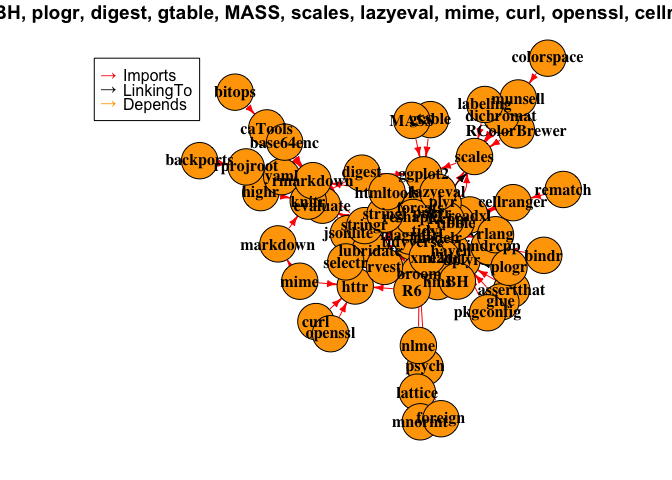
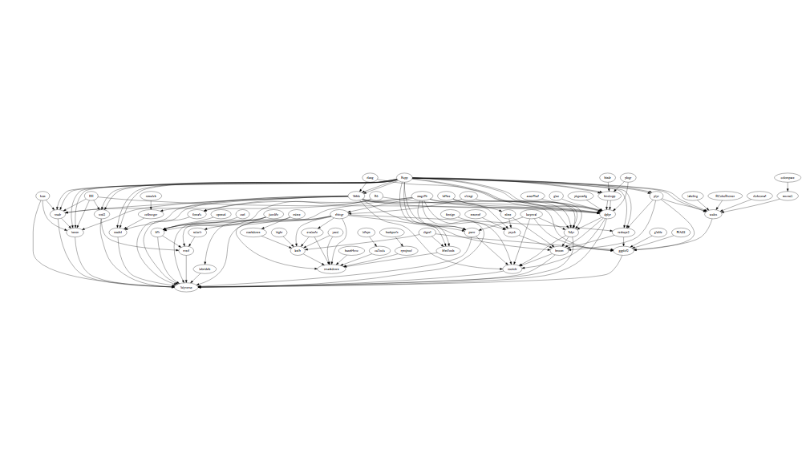

tidyverse plot
==============

``` r
# https://cran.r-project.org/web/packages/miniCRAN/vignettes/miniCRAN-dependency-graph.html
library("miniCRAN")
library("igraph")
```

    ## 
    ## Attaching package: 'igraph'

    ## The following objects are masked from 'package:stats':
    ## 
    ##     decompose, spectrum

    ## The following object is masked from 'package:base':
    ## 
    ##     union

``` r
library("DiagrammeR")
```

    ## 
    ## Attaching package: 'DiagrammeR'

    ## The following object is masked from 'package:igraph':
    ## 
    ##     %>%

``` r
tags <- pkgDep("tidyverse")
dg <- makeDepGraph(tags, enhances=FALSE, suggests=FALSE)
plot(dg, legendPosition = c(-1, 1), vertex.size=20, width=10000, height=10000)
```



``` r
igraph::write_graph(dg, 'tidyverse.dot', format='dot')
txt <- readLines('tidyverse.dot')
txt <- gsub('name=','label=', txt, fixed = TRUE)
writeLines(txt, 'tidyverse.dot')
DiagrammeR::grViz('tidyverse.dot', width=10000, height=10000)
```


