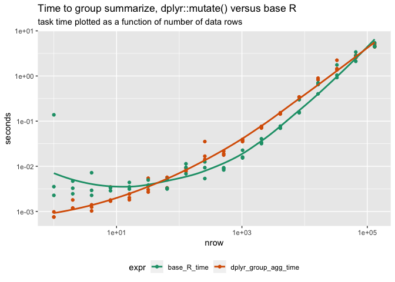
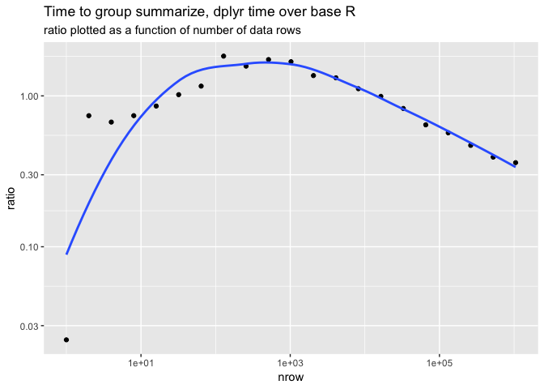

time\_grouped\_max
================

``` r
library("dplyr")
```

    ## 
    ## Attaching package: 'dplyr'

    ## The following objects are masked from 'package:stats':
    ## 
    ##     filter, lag

    ## The following objects are masked from 'package:base':
    ## 
    ##     intersect, setdiff, setequal, union

``` r
library("ggplot2")
```

    ## Registered S3 methods overwritten by 'ggplot2':
    ##   method         from 
    ##   [.quosures     rlang
    ##   c.quosures     rlang
    ##   print.quosures rlang

``` r
library("rqdatatable")
```

    ## Loading required package: rquery

``` r
library("cdata")
packageVersion("dplyr")
```

    ## [1] '0.8.0.1'

``` r
R.version
```

    ##                _                           
    ## platform       x86_64-apple-darwin15.6.0   
    ## arch           x86_64                      
    ## os             darwin15.6.0                
    ## system         x86_64, darwin15.6.0        
    ## status                                     
    ## major          3                           
    ## minor          6.0                         
    ## year           2019                        
    ## month          04                          
    ## day            26                          
    ## svn rev        76424                       
    ## language       R                           
    ## version.string R version 3.6.0 (2019-04-26)
    ## nickname       Planting of a Tree

``` r
mk_data <- function(ngroup_rows, symbols, nrow, ncol) {
  d <- rep(list(runif(nrow)), ncol)
  names(d) <- paste0("col_", seq_len(ncol))
  d <- data.frame(d)
  rownames(d) <- NULL
  for(i in seq_len(ngroup_rows)) {
    g <- paste0("group_", i)
    d[[g]] <- sample(symbols, nrow, replace = TRUE)
  }
  d <- tbl_df(d)
  gc()
  d
}

d <- mk_data(2, c("a", "b"), 5, 1)

group_cols <- c("group_1", "group_2")
target_cols <- "col_1"
new_names <- "col_1_max"

#' Add aggregations of target columns by groups to data.frame.
#' 
#' @param d data.frame to work with
#' @param group_cols names of columns to group by (non-empty).
#' @param target_cols names of columns to summarize (non-empty).
#' @param new_names new column names for results.
#' @param FUN aggregation function
#' @return d with new per-group aggregation columns added
#'
window_summary_base <- function(d, group_cols, target_cols, new_names, FUN = max) {
  d_agg <- aggregate(d[, target_cols, drop = FALSE], 
                     d[, group_cols, drop = FALSE], 
                     FUN = FUN)
  nm_map <- c(group_cols, new_names)
  names(nm_map) <- c(group_cols, target_cols)
  colnames(d_agg) <- nm_map[colnames(d_agg)]
  merge(d, d_agg, by = group_cols)
}

d %.>%
  knitr::kable(.)
```

|    col\_1 | group\_1 | group\_2 |
| --------: | :------- | :------- |
| 0.8875918 | b        | b        |
| 0.9799595 | b        | a        |
| 0.3740186 | b        | a        |
| 0.0469195 | a        | a        |
| 0.6826373 | a        | a        |

``` r
window_summary_base(d, group_cols, target_cols, new_names, max) %.>%
  knitr::kable(.)
```

| group\_1 | group\_2 |    col\_1 | col\_1\_max |
| :------- | :------- | --------: | ----------: |
| a        | a        | 0.0469195 |   0.6826373 |
| a        | a        | 0.6826373 |   0.6826373 |
| b        | a        | 0.9799595 |   0.9799595 |
| b        | a        | 0.3740186 |   0.9799595 |
| b        | b        | 0.8875918 |   0.8875918 |

``` r
#' Add aggregations of target columns by groups to data.frame.
#' 
#' @param d data.frame to work with
#' @param group_cols names of columns to group by (non-empty).
#' @param target_cols names of columns to summarize (non-empty).
#' @param new_names new column names for results.
#' @param FUN aggregation function
#' @return d with new per-group aggregation columns added
#'
window_summary_dplyr <- function(d, group_cols, target_cols, new_names, FUN = max) {
  dg <- group_by(d, !!!rlang::syms(group_cols)) 
  for(i in seq_len(length(target_cols))) {
    dg <- mutate(dg, !!rlang::sym(new_names[[i]]) := FUN(!!rlang::sym(target_cols[[i]])))
  }
  ungroup(dg)
}

window_summary_dplyr(d, group_cols, target_cols, new_names, max) %.>%
  knitr::kable(.)
```

|    col\_1 | group\_1 | group\_2 | col\_1\_max |
| --------: | :------- | :------- | ----------: |
| 0.8875918 | b        | b        |   0.8875918 |
| 0.9799595 | b        | a        |   0.9799595 |
| 0.3740186 | b        | a        |   0.9799595 |
| 0.0469195 | a        | a        |   0.6826373 |
| 0.6826373 | a        | a        |   0.6826373 |

``` r
f <- function(k) {
  d <- mk_data(10, letters, k, 1)
  group_cols <- colnames(d)[grepl("^group_", colnames(d))]
  target_cols <- "col_1"
  new_names <- "col_1_max"
  gc()
  tm <- microbenchmark::microbenchmark(
    base_R_time = window_summary_base(d, group_cols, target_cols, new_names, max),
    dplyr_group_agg_time = window_summary_dplyr(d, group_cols, target_cols, new_names, max),
    times = 3L
  )
  td <- data.frame(tm)
  td$ncol <- ncol(d)
  td$nrow <- nrow(d)
  td
}


times <- lapply(2^(0:17), f)
times <- data.frame(data.table::rbindlist(times))
times$seconds <- times$time/1e9


ggplot(data = times, 
       mapping = aes(x = nrow, y = seconds, color = expr)) + 
  geom_point() + 
  geom_smooth(se = FALSE) + 
  scale_x_log10() + 
  scale_y_log10() + 
  theme(legend.position = "bottom") +
  scale_color_brewer(palette = "Dark2") +
  ggtitle("Time to group summarize, dplyr::mutate() versus base R",
          subtitle = "task time plotted as a function of number of data rows")
```

    ## `geom_smooth()` using method = 'loess' and formula 'y ~ x'

<!-- -->

``` r
# compute time ratios
layout <- blocks_to_rowrecs_spec(
  wrapr::qchar_frame(
    "expr"         , "seconds"     |
      "dplyr_group_agg_time", dplyr_group_agg_time |
      'base_R_time'     , base_R_time      ),
  recordKeys = "nrow")

print(layout)
```

    ## {
    ##  block_record <- wrapr::qchar_frame(
    ##    "nrow"  , "expr"                , "seconds"            |
    ##      .     , "dplyr_group_agg_time", dplyr_group_agg_time |
    ##      .     , "base_R_time"         , base_R_time          )
    ##  block_keys <- c('nrow', 'expr')
    ## 
    ##  # becomes
    ## 
    ##  row_record <- wrapr::qchar_frame(
    ##    "nrow"  , "dplyr_group_agg_time", "base_R_time" |
    ##      .     , dplyr_group_agg_time  , base_R_time   )
    ##  row_keys <- c('nrow')
    ## 
    ##  # args: c(checkNames = TRUE, checkKeys = TRUE, strict = FALSE, allow_rqdatatable = FALSE)
    ## }

``` r
calc_ratios <- local_td(times) %.>%
  project(., 
          groupby = c("expr", "nrow"),
          seconds = mean(seconds)) %.>%
  layout %.>%
  extend(.,
         ratio = dplyr_group_agg_time/base_R_time)

cat(format(calc_ratios))
```

    ## table(times; 
    ##   expr,
    ##   time,
    ##   ncol,
    ##   nrow,
    ##   seconds) %.>%
    ##  project(., seconds := mean(seconds),
    ##   g= expr, nrow) %.>%
    ##  non_sql_node(., blocks_to_rowrecs(.)) %.>%
    ##  extend(.,
    ##   ratio := dplyr_group_agg_time / base_R_time)

``` r
ratios <- times %.>% calc_ratios

ggplot(data = ratios, 
       mapping = aes(x = nrow, y = ratio)) +
  geom_point() + 
  geom_smooth(se = FALSE) + 
  scale_x_log10() + 
  scale_y_log10() + 
  theme(legend.position = "bottom") +
  scale_color_brewer(palette = "Dark2") +
  ggtitle("Time to group summarize, dplyr time over base R",
          subtitle = "ratio plotted as a function of number of data rows")
```

    ## `geom_smooth()` using method = 'loess' and formula 'y ~ x'

<!-- -->
