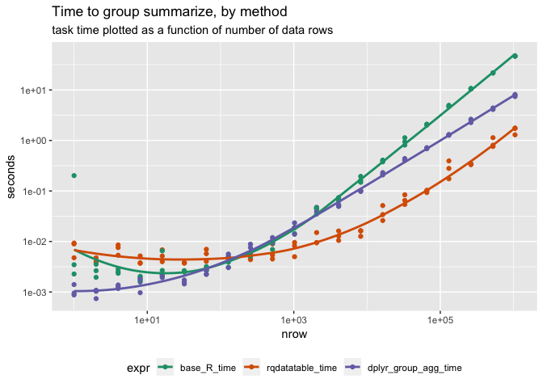

time\_grouped\_summary
================

``` r
library("dplyr")
```

    ## 
    ## Attaching package: 'dplyr'

    ## The following objects are masked from 'package:stats':
    ## 
    ##     filter, lag

    ## The following objects are masked from 'package:base':
    ## 
    ##     intersect, setdiff, setequal, union

``` r
library("ggplot2")
```

    ## Registered S3 methods overwritten by 'ggplot2':
    ##   method         from 
    ##   [.quosures     rlang
    ##   c.quosures     rlang
    ##   print.quosures rlang

``` r
library("rqdatatable")
```

    ## Loading required package: rquery

``` r
library("cdata")
library("wrapr")
```

    ## 
    ## Attaching package: 'wrapr'

    ## The following object is masked from 'package:dplyr':
    ## 
    ##     coalesce

``` r
packageVersion("dplyr")
```

    ## [1] '0.8.0.1'

``` r
R.version
```

    ##                _                           
    ## platform       x86_64-apple-darwin15.6.0   
    ## arch           x86_64                      
    ## os             darwin15.6.0                
    ## system         x86_64, darwin15.6.0        
    ## status                                     
    ## major          3                           
    ## minor          6.0                         
    ## year           2019                        
    ## month          04                          
    ## day            26                          
    ## svn rev        76424                       
    ## language       R                           
    ## version.string R version 3.6.0 (2019-04-26)
    ## nickname       Planting of a Tree

``` r
mk_data <- function(ngroup_rows, symbols, nrow, ncol) {
  d <- replicate(ncol, list(runif(nrow)))
  names(d) <- paste0("col_", seq_len(ncol))
  d <- data.frame(d)
  rownames(d) <- NULL
  for(i in seq_len(ngroup_rows)) {
    g <- paste0("group_", i)
    d[[g]] <- sample(symbols, nrow, replace = TRUE)
  }
  d <- tbl_df(d)
  gc()
  d
}


#' Add aggregations of target columns by groups to data.frame.
#' 
#' @param d data.frame to work with
#' @param group_cols names of columns to group by (non-empty).
#' @param target_cols names of columns to summarize (non-empty).
#' @param new_names new column names for results.
#' @param FUN aggregation function
#' @return d with new per-group aggregation columns added
#'
window_summary_base <- function(d, group_cols, target_cols, 
                                new_names = paste0(target_cols, "_sum"), 
                                FUN = sum) {
  # build a table of per-group aggregations of columns of interest
  d_agg <- aggregate(d[, target_cols, drop = FALSE], 
                     d[, group_cols, drop = FALSE], 
                     FUN = FUN)
  # re-map these derived columns to new column names
  nm_map <- c(group_cols, new_names)
  names(nm_map) <- c(group_cols, target_cols)
  colnames(d_agg) <- nm_map[colnames(d_agg)]
  # merge the aggregation results back into original data.frame
  merge(d, d_agg, by = group_cols)
}

d <- mk_data(2, c("a", "b"), 5, 2)

d %.>%
  knitr::kable(.)
```

|    col\_1 |    col\_2 | group\_1 | group\_2 |
| --------: | --------: | :------- | :------- |
| 0.8097685 | 0.3365113 | a        | a        |
| 0.4884981 | 0.7870978 | b        | a        |
| 0.1375909 | 0.8189787 | b        | b        |
| 0.4216615 | 0.9880847 | b        | b        |
| 0.9531570 | 0.4267701 | b        | a        |

``` r
group_cols <- c("group_1", "group_2")
target_cols <- c("col_1", "col_2")
new_names <- c("col_1_sum", "col_2_sum")

window_summary_base(d, group_cols, target_cols, new_names, sum) %.>%
  knitr::kable(.)
```

| group\_1 | group\_2 |    col\_1 |    col\_2 | col\_1\_sum | col\_2\_sum |
| :------- | :------- | --------: | --------: | ----------: | ----------: |
| a        | a        | 0.8097685 | 0.3365113 |   0.8097685 |   0.3365113 |
| b        | a        | 0.4884981 | 0.7870978 |   1.4416551 |   1.2138679 |
| b        | a        | 0.9531570 | 0.4267701 |   1.4416551 |   1.2138679 |
| b        | b        | 0.1375909 | 0.8189787 |   0.5592524 |   1.8070634 |
| b        | b        | 0.4216615 | 0.9880847 |   0.5592524 |   1.8070634 |

``` r
#' Add aggregations of target columns by groups to data.frame.
#' 
#' @param d data.frame to work with
#' @param group_cols names of columns to group by (non-empty).
#' @param target_cols names of columns to summarize (non-empty).
#' @param new_names new column names for results.
#' @param FUN aggregation function
#' @param env evaluatin environment
#' @return d with new per-group aggregation columns added
#'
window_summary_rqdatatable <- function(d, group_cols, target_cols, 
                                       new_names = paste0(target_cols, "_sum"), 
                                       FUN = sum,
                                       env = parent.frame()) {
  extend_se(d, 
            new_names := paste("FUN(", target_cols, ")"),
            partitionby = group_cols)
}

window_summary_rqdatatable(d, group_cols, target_cols, new_names, sum) %.>%
  knitr::kable(.)
```

|    col\_1 |    col\_2 | group\_1 | group\_2 | col\_1\_sum | col\_2\_sum |
| --------: | --------: | :------- | :------- | ----------: | ----------: |
| 0.8097685 | 0.3365113 | a        | a        |   0.8097685 |   0.3365113 |
| 0.4884981 | 0.7870978 | b        | a        |   1.4416551 |   1.2138679 |
| 0.9531570 | 0.4267701 | b        | a        |   1.4416551 |   1.2138679 |
| 0.1375909 | 0.8189787 | b        | b        |   0.5592524 |   1.8070634 |
| 0.4216615 | 0.9880847 | b        | b        |   0.5592524 |   1.8070634 |

``` r
#' Add aggregations of target columns by groups to data.frame.
#' 
#' @param d data.frame to work with
#' @param group_cols names of columns to group by (non-empty).
#' @param target_cols names of columns to summarize (non-empty).
#' @param new_names new column names for results.
#' @param FUN aggregation function
#' @param env evaluatin environment
#' @return d with new per-group aggregation columns added
#'
window_summary_dplyr <- function(d, group_cols, target_cols, 
                                 new_names = paste0(target_cols, "_sum"), 
                                 FUN = sum,
                                 env = parent.frame()) {
  # in all cases want to use a grouped mutate
  dg <- group_by(d, !!!rlang::syms(group_cols)) 
  # first alternative: splice eval method
  force(env)
  eval_env <- new.env(parent = env)
  assign("FUN", FUN, envir = eval_env)
  terms <- lapply(
    seq_len(length(target_cols)),
    function(i) {
      rlang::parse_quo(paste("FUN(", target_cols[[i]], ")"),
                       env = eval_env)
    })
  names(terms) <- new_names
  dg <- mutate(dg, !!!terms)
  # # second alternate: non-slice way to mutate parametricly
  # for(i in seq_len(length(target_cols))) {
  #   dg <- mutate(dg, !!rlang::sym(new_names[[i]]) := FUN(!!rlang::sym(target_cols[[i]])))
  # }
  # # third alternative: mutate_at() with an appropriat renaming strategy
  ungroup(dg)
}

window_summary_dplyr(d, group_cols, target_cols, new_names, sum) %.>%
  knitr::kable(.)
```

|    col\_1 |    col\_2 | group\_1 | group\_2 | col\_1\_sum | col\_2\_sum |
| --------: | --------: | :------- | :------- | ----------: | ----------: |
| 0.8097685 | 0.3365113 | a        | a        |   0.8097685 |   0.3365113 |
| 0.4884981 | 0.7870978 | b        | a        |   1.4416551 |   1.2138679 |
| 0.1375909 | 0.8189787 | b        | b        |   0.5592524 |   1.8070634 |
| 0.4216615 | 0.9880847 | b        | b        |   0.5592524 |   1.8070634 |
| 0.9531570 | 0.4267701 | b        | a        |   1.4416551 |   1.2138679 |

``` r
f <- function(k) {
  d <- mk_data(5, letters, k, 1)
  group_cols <- colnames(d)[grepl("^group_", colnames(d))]
  target_cols <- colnames(d)[grepl("^col_", colnames(d))]
  new_names <- paste0(target_cols, "_sum")
  gc()
  tm <- microbenchmark::microbenchmark(
    base_R_time = window_summary_base(d, group_cols, target_cols, new_names, sum),
    rqdatatable_time = window_summary_rqdatatable(d, group_cols, target_cols, new_names, sum),
    dplyr_group_agg_time = window_summary_dplyr(d, group_cols, target_cols, new_names, sum),
    times = 3L
  )
  td <- data.frame(tm)
  td$ncol <- ncol(d)
  td$nrow <- nrow(d)
  td
}


times <- lapply(2^(0:20), f)
times <- data.frame(data.table::rbindlist(times))
times$seconds <- times$time/1e9


ggplot(data = times, 
       mapping = aes(x = nrow, y = seconds, color = expr)) + 
  geom_point() + 
  geom_smooth(se = FALSE) + 
  scale_x_log10() + 
  scale_y_log10() + 
  theme(legend.position = "bottom") +
  scale_color_brewer(palette = "Dark2") +
  ggtitle("Time to group summarize, by method",
          subtitle = "task time plotted as a function of number of data rows")
```

    ## `geom_smooth()` using method = 'loess' and formula 'y ~ x'

<!-- -->
