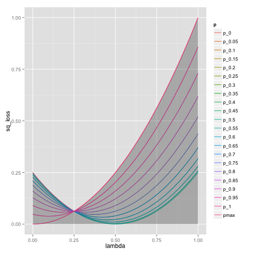
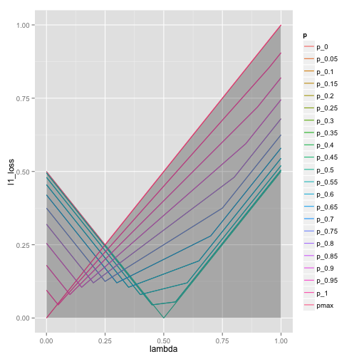
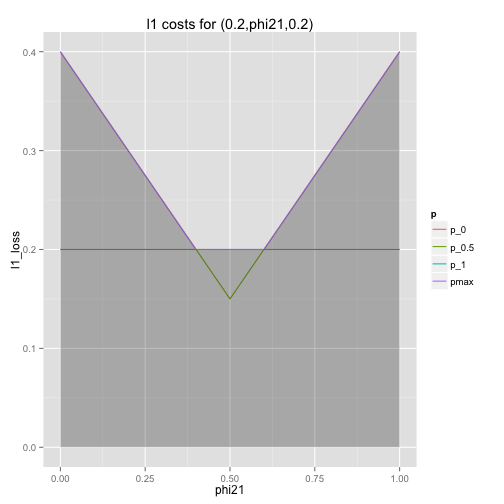
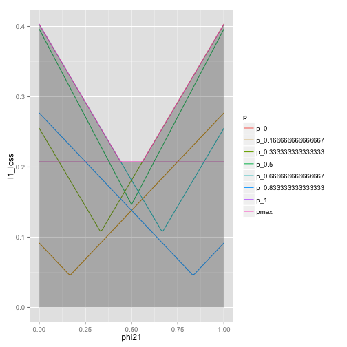
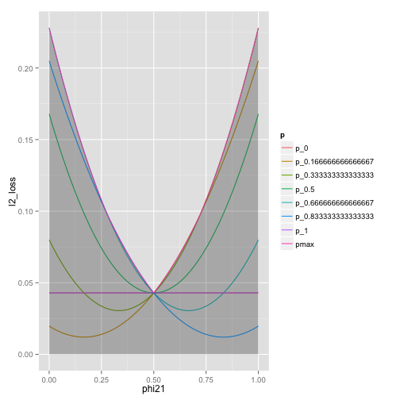

```r
# to make HTML from this (from the shell:
#  echo "library(knitr); knit('freq.Rmd')" | R --vanilla ; pandoc freq.md -o freq.html


library(MASS)
library(ggplot2)
library(reshape2)


# In all cases we are model the observed number of wins (winsSeen)
# found in flipping a coin kFlips times where the probability of
# winning on each flip is given by the probability pWin 
# (pWin in the set {1/nSides, ... (nSides-1)/nSides}).

# Write down the linear conditions that confirm a vector
# of estimates of length kFlips+1 where the entry winsSeen+1
# represents the estimated expected value of pWin give
# we observed winsSeen successes in kFlips trials.
# We are writing one check condition for each possible value
# of the unknown win probably pWin in the set {1/nSides, ... (nSides-1)/nSides}.
freqSystem <- function(nSides,kFlips,stepMult=1) {
  pSeq <- (1:(nSides-1))/nSides
  if(stepMult>1) {
     pSeq <- seq(1/nSides,(nSides-1)/nSides,by=1/(nSides*stepMult))
  }
  a <- matrix(data=0.0,nrow=length(pSeq),ncol=kFlips+1)
  rownames(a) <- paste('check for p=',pSeq,sep='')
  colnames(a) <- paste('prob.',0:kFlips,'heads')
  b <- matrix(data=0,nrow=length(pSeq),ncol=1)
  rownames(b) <- paste('check for p=',pSeq,sep='')
  colnames(b) <- c('p')
  i <- 1
  for(pWin in pSeq) {
    for(winsSeen in 0:kFlips) {
      a[i,winsSeen+1] <- choose(kFlips,winsSeen) * pWin^winsSeen * (1-pWin)^(kFlips-winsSeen)
    }
    b[i,1] <- pWin
    i <- i + 1
  }
  list(a=a,b=b)
}

nameBiasChecks <- function(x) {
  names(x) <- paste('bias for p=',1:length(x)/(length(x)+1),sep='')
  x
}

nameEstimates <- function(x) {
  names(x) <- paste('pest for',0:(length(x)-1),'heads')
  x
}

# Build the traditional frequentist empirical estimates of
# the expected value of the unknown quantity pWin
# for each possible observed outcome of number of wins
# seen in kFlips trials
empiricalMeansEstimates <- function(nSides,kFlips) {
  nameEstimates(c((0:kFlips)/kFlips))
}

# Build the Bayes estimate of expected values from uniform priors
# on the unknown probability pWin (in the set {1/nSides, ... (nSides-1)/nSides})
# seen in kFlips trials
bayesMeansEstimates <- function(nSides,kFlips) {
  e <- rep(0.0,kFlips+1)
  for(winsSeen in 0:kFlips) {
    posteriorProbs <- rep(0,nSides-1)
    for(i in 1:(nSides-1)) {
      pWin <- i/nSides
      posteriorProbs[i] <- choose(kFlips,winsSeen) * pWin^winsSeen * (1-pWin)^(kFlips-winsSeen)
    }
    posteriorProbs <- posteriorProbs/sum(posteriorProbs)
    e[winsSeen+1] <- sum(posteriorProbs*(1:(nSides-1))/nSides)
  }
  nameEstimates(e)
}

# Compute for a given assumed win probability pWin
# the expected loss (under outcomes distributed 
# as length(ests)-1 flips with probability Win)
# of the estimates ests.
lossFn <- function(pWin,ests) {
  kFlips <- length(ests)-1
  loss <- 0.0
  for(winsSeen in 0:kFlips) {
    probObservation <- choose(kFlips,winsSeen) * pWin^winsSeen * (1-pWin)^(kFlips-winsSeen)
    loss <- loss + probObservation*(ests[winsSeen+1]-pWin)^2
  }
  names(loss) <- paste('exp. sq. error for p=',pWin,sep='')
  loss
}

# Compute for all win probabilities
# pWin in the set {1/nSides, ... (nSides-1)/nSides}
# the expected loss (under outcomes distributed 
# as length(ests)-1 flips with probability Win)
# of the estimates ests.
losses <- function(nSides,ests) {
  sapply((1:(nSides-1))/nSides,function(pWin) lossFn(pWin,ests))
}

# return null vectors as columns of a matrix
nullVecs <- function(a) {
  Null(t(a))  # from MASS
}


nSides <- 6
for(kFlips in (1:3)) {
  print('')
  print(paste('***** nSides =',nSides,'kFlips =',kFlips))
  # first check insisting on unbiasedness
  # completely determines the estimate for 
  # one flip from a nSides-slides system
  sNK = freqSystem(nSides,kFlips)
  # print(sNK)
  print('full rank')
  print(qr(sNK$a)$rank==kFlips+1)
  print('bias free determined solution')
  print(nameEstimates(as.numeric(qr.solve(sNK$a,sNK$b))))
  print('standard empirical solution')
  print(empiricalMeansEstimates(nSides,kFlips))
  print('losses for standard empirical solution')
  print(losses(nSides,empiricalMeansEstimates(nSides,kFlips)))
  
  # now show the Bayes solution has smaller loss
  bayesSoln <- bayesMeansEstimates(nSides,kFlips)
  print('Bayes solution')
  print(bayesSoln)
  print('losses for Bayes solution')
  print(losses(nSides,bayesSoln))
  print('Bayes max loss improvement')
  print(max(losses(nSides,empiricalMeansEstimates(nSides,kFlips))) - max(losses(nSides,bayesSoln)))
  print('Bayes solution bias check (failed)')
  print(nameBiasChecks(as.numeric(sNK$a %*% bayesSoln - sNK$b)))
  print('')
}
```

```
## [1] ""
## [1] "***** nSides = 6 kFlips = 1"
## [1] "full rank"
## [1] TRUE
## [1] "bias free determined solution"
## pest for 0 heads pest for 1 heads 
##       -4.491e-16        1.000e+00 
## [1] "standard empirical solution"
## pest for 0 heads pest for 1 heads 
##                0                1 
## [1] "losses for standard empirical solution"
## exp. sq. error for p=0.166666666666667 
##                                 0.1389 
## exp. sq. error for p=0.333333333333333 
##                                 0.2222 
##               exp. sq. error for p=0.5 
##                                 0.2500 
## exp. sq. error for p=0.666666666666667 
##                                 0.2222 
## exp. sq. error for p=0.833333333333333 
##                                 0.1389 
## [1] "Bayes solution"
## pest for 0 heads pest for 1 heads 
##           0.3889           0.6111 
## [1] "losses for Bayes solution"
## exp. sq. error for p=0.166666666666667 
##                                0.07407 
## exp. sq. error for p=0.333333333333333 
##                                0.02778 
##               exp. sq. error for p=0.5 
##                                0.01235 
## exp. sq. error for p=0.666666666666667 
##                                0.02778 
## exp. sq. error for p=0.833333333333333 
##                                0.07407 
## [1] "Bayes max loss improvement"
## [1] 0.1759
## [1] "Bayes solution bias check (failed)"
## bias for p=0.166666666666667 bias for p=0.333333333333333 
##                       0.2593                       0.1296 
##               bias for p=0.5 bias for p=0.666666666666667 
##                       0.0000                      -0.1296 
## bias for p=0.833333333333333 
##                      -0.2593 
## [1] ""
## [1] ""
## [1] "***** nSides = 6 kFlips = 2"
## [1] "full rank"
## [1] TRUE
## [1] "bias free determined solution"
## pest for 0 heads pest for 1 heads pest for 2 heads 
##              0.0              0.5              1.0 
## [1] "standard empirical solution"
## pest for 0 heads pest for 1 heads pest for 2 heads 
##              0.0              0.5              1.0 
## [1] "losses for standard empirical solution"
## exp. sq. error for p=0.166666666666667 
##                                0.06944 
## exp. sq. error for p=0.333333333333333 
##                                0.11111 
##               exp. sq. error for p=0.5 
##                                0.12500 
## exp. sq. error for p=0.666666666666667 
##                                0.11111 
## exp. sq. error for p=0.833333333333333 
##                                0.06944 
## [1] "Bayes solution"
## pest for 0 heads pest for 1 heads pest for 2 heads 
##           0.3182           0.5000           0.6818 
## [1] "losses for Bayes solution"
## exp. sq. error for p=0.166666666666667 
##                                0.05418 
## exp. sq. error for p=0.333333333333333 
##                                0.02594 
##               exp. sq. error for p=0.5 
##                                0.01653 
## exp. sq. error for p=0.666666666666667 
##                                0.02594 
## exp. sq. error for p=0.833333333333333 
##                                0.05418 
## [1] "Bayes max loss improvement"
## [1] 0.07082
## [1] "Bayes solution bias check (failed)"
## bias for p=0.166666666666667 bias for p=0.333333333333333 
##                       0.2121                       0.1061 
##               bias for p=0.5 bias for p=0.666666666666667 
##                       0.0000                      -0.1061 
## bias for p=0.833333333333333 
##                      -0.2121 
## [1] ""
## [1] ""
## [1] "***** nSides = 6 kFlips = 3"
## [1] "full rank"
## [1] TRUE
## [1] "bias free determined solution"
## pest for 0 heads pest for 1 heads pest for 2 heads pest for 3 heads 
##       -2.930e-16        3.333e-01        6.667e-01        1.000e+00 
## [1] "standard empirical solution"
## pest for 0 heads pest for 1 heads pest for 2 heads pest for 3 heads 
##           0.0000           0.3333           0.6667           1.0000 
## [1] "losses for standard empirical solution"
## exp. sq. error for p=0.166666666666667 
##                                0.04630 
## exp. sq. error for p=0.333333333333333 
##                                0.07407 
##               exp. sq. error for p=0.5 
##                                0.08333 
## exp. sq. error for p=0.666666666666667 
##                                0.07407 
## exp. sq. error for p=0.833333333333333 
##                                0.04630 
## [1] "Bayes solution"
## pest for 0 heads pest for 1 heads pest for 2 heads pest for 3 heads 
##           0.2748           0.4111           0.5889           0.7252 
## [1] "losses for Bayes solution"
## exp. sq. error for p=0.166666666666667 
##                                0.04134 
## exp. sq. error for p=0.333333333333333 
##                                0.02390 
##               exp. sq. error for p=0.5 
##                                0.01860 
## exp. sq. error for p=0.666666666666667 
##                                0.02390 
## exp. sq. error for p=0.833333333333333 
##                                0.04134 
## [1] "Bayes max loss improvement"
## [1] 0.04199
## [1] "Bayes solution bias check (failed)"
## bias for p=0.166666666666667 bias for p=0.333333333333333 
##                      0.17937                      0.08853 
##               bias for p=0.5 bias for p=0.666666666666667 
##                      0.00000                     -0.08853 
## bias for p=0.833333333333333 
##                     -0.17937 
## [1] ""
```

```r
print('')
```

```
## [1] ""
```

```r
print('*****')
```

```
## [1] "*****"
```

```r
# now show a under-determined system allows more solutions
kFlips = 7
# confirm more probs would completely determine this situation (should by analogy to the moment curve)
print('')
```

```
## [1] ""
```

```r
print(paste('***** nSides =',nSides,'kFlips =',kFlips))
```

```
## [1] "***** nSides = 6 kFlips = 7"
```

```r
print(kFlips)
```

```
## [1] 7
```

```r
sU <- freqSystem(nSides,kFlips)
print('is full rank')
```

```
## [1] "is full rank"
```

```r
print(qr(sU$a)$rank==kFlips+1)
```

```
## [1] FALSE
```

```r
print('can extend to full rank')
```

```
## [1] "can extend to full rank"
```

```r
sCheck = freqSystem(nSides,kFlips,stepMult=2)
print(qr(sCheck$a)$rank==kFlips+1)
```

```
## [1] TRUE
```

```r
wiggleRoom = nullVecs(sU$a)
print('confirm null vecs')
```

```
## [1] "confirm null vecs"
```

```r
wiggleDim <- dim(wiggleRoom)[[2]]
print((dim(wiggleRoom)[[1]]==kFlips+1) && (wiggleDim + nSides-1==kFlips+1) &&
   (max(abs(sU$a %*% wiggleRoom))<1.0e-12))
```

```
## [1] TRUE
```

```r
baseSoln <- empiricalMeansEstimates(nSides,kFlips)
print('empirical solution')
```

```
## [1] "empirical solution"
```

```r
print(baseSoln)
```

```
## pest for 0 heads pest for 1 heads pest for 2 heads pest for 3 heads 
##           0.0000           0.1429           0.2857           0.4286 
## pest for 4 heads pest for 5 heads pest for 6 heads pest for 7 heads 
##           0.5714           0.7143           0.8571           1.0000
```

```r
baseLosses <- losses(nSides,baseSoln)
print('empirical solution losses')
```

```
## [1] "empirical solution losses"
```

```r
print(baseLosses)
```

```
## exp. sq. error for p=0.166666666666667 
##                                0.01984 
## exp. sq. error for p=0.333333333333333 
##                                0.03175 
##               exp. sq. error for p=0.5 
##                                0.03571 
## exp. sq. error for p=0.666666666666667 
##                                0.03175 
## exp. sq. error for p=0.833333333333333 
##                                0.01984
```

```r
print(sum(baseLosses))
```

```
## [1] 0.1389
```

```r
print(max(baseLosses))
```

```
## [1] 0.03571
```

```r
wsoln <- function(x) {nameEstimates(baseSoln  + as.numeric(wiggleRoom %*% x))}
maxloss <- function(x) {max(losses(nSides,wsoln(x)))-max(baseLosses)}
opt <- optim(rep(0.0,wiggleDim),f=maxloss,method='BFGS')
newSoln <- wsoln(opt$par)
print('minmax soln')
```

```
## [1] "minmax soln"
```

```r
print(newSoln)
```

```
## pest for 0 heads pest for 1 heads pest for 2 heads pest for 3 heads 
##          0.03191          0.11184          0.29667          0.43917 
## pest for 4 heads pest for 5 heads pest for 6 heads pest for 7 heads 
##          0.56083          0.70333          0.88816          0.96809
```

```r
print('minmax soln losses')
```

```
## [1] "minmax soln losses"
```

```r
print(losses(nSides,newSoln))
```

```
## exp. sq. error for p=0.166666666666667 
##                                0.01904 
## exp. sq. error for p=0.333333333333333 
##                                0.03269 
##               exp. sq. error for p=0.5 
##                                0.03549 
## exp. sq. error for p=0.666666666666667 
##                                0.03269 
## exp. sq. error for p=0.833333333333333 
##                                0.01904
```

```r
print(sum(losses(nSides,newSoln)))
```

```
## [1] 0.139
```

```r
print(max(losses(nSides,newSoln)))
```

```
## [1] 0.03549
```

```r
print('minmax soln bias checks')
```

```
## [1] "minmax soln bias checks"
```

```r
print(nameBiasChecks(as.numeric(sU$a %*% newSoln - sU$b)))
```

```
## bias for p=0.166666666666667 bias for p=0.333333333333333 
##                    2.776e-17                    1.110e-16 
##               bias for p=0.5 bias for p=0.666666666666667 
##                    0.000e+00                    0.000e+00 
## bias for p=0.833333333333333 
##                    0.000e+00
```

```r
print('minmax soln max loss improvement')
```

```
## [1] "minmax soln max loss improvement"
```

```r
print(max(baseLosses)-max(losses(nSides,newSoln)))
```

```
## [1] 0.000222
```

```r
print('minmax soln individual loss changes')
```

```
## [1] "minmax soln individual loss changes"
```

```r
print(baseLosses-losses(nSides,newSoln))
```

```
## exp. sq. error for p=0.166666666666667 
##                              0.0007983 
## exp. sq. error for p=0.333333333333333 
##                             -0.0009417 
##               exp. sq. error for p=0.5 
##                              0.0002220 
## exp. sq. error for p=0.666666666666667 
##                             -0.0009417 
## exp. sq. error for p=0.833333333333333 
##                              0.0007983
```

```r
bayesSoln <- bayesMeansEstimates(nSides,kFlips)
bayesLosses <- losses(nSides,bayesSoln)
print('bayes solution')
```

```
## [1] "bayes solution"
```

```r
print(bayesSoln)
```

```
## pest for 0 heads pest for 1 heads pest for 2 heads pest for 3 heads 
##           0.2031           0.2514           0.3360           0.4439 
## pest for 4 heads pest for 5 heads pest for 6 heads pest for 7 heads 
##           0.5561           0.6640           0.7486           0.7969
```

```r
print('bayes losses')
```

```
## [1] "bayes losses"
```

```r
print(bayesLosses)
```

```
## exp. sq. error for p=0.166666666666667 
##                                0.01878 
## exp. sq. error for p=0.333333333333333 
##                                0.01726 
##               exp. sq. error for p=0.5 
##                                0.01868 
## exp. sq. error for p=0.666666666666667 
##                                0.01726 
## exp. sq. error for p=0.833333333333333 
##                                0.01878
```

```r
print('sum bayes losses')
```

```
## [1] "sum bayes losses"
```

```r
print(sum(bayesLosses))
```

```
## [1] 0.09076
```

```r
print('max bayes losses')
```

```
## [1] "max bayes losses"
```

```r
print(max(bayesLosses))
```

```
## [1] 0.01878
```

```r
sumloss <- function(x) {sum(losses(nSides,wsoln(x)))}
optS <- optim(rep(0.0,wiggleDim),f=sumloss,method='BFGS')
newSolnS <- wsoln(optS$par)
print('sumloss soln')
```

```
## [1] "sumloss soln"
```

```r
print(newSolnS)
```

```
## pest for 0 heads pest for 1 heads pest for 2 heads pest for 3 heads 
##          0.01569          0.12843          0.28871          0.43753 
## pest for 4 heads pest for 5 heads pest for 6 heads pest for 7 heads 
##          0.56247          0.71129          0.87157          0.98431
```

```r
print('sumloss soln losses')
```

```
## [1] "sumloss soln losses"
```

```r
print(losses(nSides,newSolnS))
```

```
## exp. sq. error for p=0.166666666666667 
##                                0.01923 
## exp. sq. error for p=0.333333333333333 
##                                0.03215 
##               exp. sq. error for p=0.5 
##                                0.03555 
## exp. sq. error for p=0.666666666666667 
##                                0.03215 
## exp. sq. error for p=0.833333333333333 
##                                0.01923
```

```r
print(sum(losses(nSides,newSolnS)))
```

```
## [1] 0.1383
```

```r
print(max(losses(nSides,newSolnS)))
```

```
## [1] 0.03555
```

```r
print('sumloss soln bias checks')
```

```
## [1] "sumloss soln bias checks"
```

```r
print(nameBiasChecks(as.numeric(sU$a %*% newSolnS - sU$b)))
```

```
## bias for p=0.166666666666667 bias for p=0.333333333333333 
##                    2.776e-17                    1.110e-16 
##               bias for p=0.5 bias for p=0.666666666666667 
##                    0.000e+00                   -1.110e-16 
## bias for p=0.833333333333333 
##                    0.000e+00
```

```r
print('')
```

```
## [1] ""
```

```r
# see if we can improve on Bayes by max criterion
wsolnF <- function(x) {nameEstimates(bayesSoln + x)}
maxlossF <- function(x) {max(losses(nSides,wsolnF(x)))-max(bayesLosses)}
optM <- optim(rep(0.0,length(bayesSoln)),f=maxlossF,method='BFGS')
maxPolished <- wsolnF(optM$par)
print('polished max soln')
```

```
## [1] "polished max soln"
```

```r
print(maxPolished)
```

```
## pest for 0 heads pest for 1 heads pest for 2 heads pest for 3 heads 
##           0.1900           0.2275           0.3455           0.4577 
## pest for 4 heads pest for 5 heads pest for 6 heads pest for 7 heads 
##           0.5423           0.6545           0.7725           0.8100
```

```r
print('polished max losses')
```

```
## [1] "polished max losses"
```

```r
print(losses(nSides,maxPolished))
```

```
## exp. sq. error for p=0.166666666666667 
##                                0.01841 
## exp. sq. error for p=0.333333333333333 
##                                0.01839 
##               exp. sq. error for p=0.5 
##                                0.01843 
## exp. sq. error for p=0.666666666666667 
##                                0.01839 
## exp. sq. error for p=0.833333333333333 
##                                0.01841
```

```r
print('polished max losses max')
```

```
## [1] "polished max losses max"
```

```r
print(max(losses(nSides,maxPolished)))
```

```
## [1] 0.01843
```

```r
print('polished max improvement')
```

```
## [1] "polished max improvement"
```

```r
print(max(bayesLosses)-max(losses(nSides,maxPolished)))
```

```
## [1] 0.0003476
```

```r
print('')
```

```
## [1] ""
```

```r
# see if we can improve on Bayes by max criterion
sumlossF <- function(x) {sum(losses(nSides,wsolnF(x)))-sum(bayesLosses)}
optS <- optim(rep(0.0,length(bayesSoln)),f=sumlossF,method='BFGS')
polishedSum <- wsolnF(optS$par)
print('polished sum soln')
```

```
## [1] "polished sum soln"
```

```r
print(polishedSum)
```

```
## pest for 0 heads pest for 1 heads pest for 2 heads pest for 3 heads 
##           0.2031           0.2514           0.3360           0.4439 
## pest for 4 heads pest for 5 heads pest for 6 heads pest for 7 heads 
##           0.5561           0.6640           0.7486           0.7969
```

```r
print('polished sum losses')
```

```
## [1] "polished sum losses"
```

```r
print(losses(nSides,polishedSum))
```

```
## exp. sq. error for p=0.166666666666667 
##                                0.01878 
## exp. sq. error for p=0.333333333333333 
##                                0.01726 
##               exp. sq. error for p=0.5 
##                                0.01868 
## exp. sq. error for p=0.666666666666667 
##                                0.01726 
## exp. sq. error for p=0.833333333333333 
##                                0.01878
```

```r
print('polished sum losses sum')
```

```
## [1] "polished sum losses sum"
```

```r
print(sum(losses(nSides,polishedSum)))
```

```
## [1] 0.09076
```

```r
print('polished sum improvement')
```

```
## [1] "polished sum improvement"
```

```r
print(sum(bayesLosses)-sum(losses(nSides,polishedSum)))
```

```
## [1] 0
```

```r
# # look into polished soln
# library(contfrac)
# conv <- convergents(as_cf(polished[[1]]))
# conv$A/conv$B
# # likely not near a simple fraction


# look into game theory solution


d <- data.frame(lambda=seq(.2,.3,0.001))
pseq <- seq(1/6,5/6,1/6)
sqErrP <- function(lambda,p) { p*(1-lambda-p)^2 + (1-p)*(lambda-p)^2 }
sqErrM <- function(lambda) { max(sapply(pseq,function(p) sqErrP(lambda,p))) }
lossM <- sapply(pseq,function(p) { sqErrP(d$lambda,p)})
colnames(lossM) <- paste('p',pseq,sep='_')
d <- cbind(d,lossM)
d$pmax <- sapply(d$lambda,sqErrM)
dplot <- melt(d,id.vars=c('lambda'),variable.name='p',value.name='sq_loss')
ggplot() +
   geom_line(data=dplot,aes(x=lambda,y=sq_loss,color=p)) +
   geom_ribbon(data=subset(dplot,p=='pmax'),aes(x=lambda,ymin=0,ymax=sq_loss),alpha=0.3) +
   coord_cartesian(ylim = c(0.05,0.07))
```

 

```r
# lambda = 2*p*(1-p) = 10/36 is optimal solution
# at lambda1/4 all curves cross: p*(3/4-p)^2+(1-p)*(1/4-p)^2 = 1/16

print('Null estimate')
```

```
## [1] "Null estimate"
```

```r
nullEst <- c(0.5,0.5)
print(nullEst)
```

```
## [1] 0.5 0.5
```

```r
print(losses(6,nullEst))
```

```
## exp. sq. error for p=0.166666666666667 
##                                0.11111 
## exp. sq. error for p=0.333333333333333 
##                                0.02778 
##               exp. sq. error for p=0.5 
##                                0.00000 
## exp. sq. error for p=0.666666666666667 
##                                0.02778 
## exp. sq. error for p=0.833333333333333 
##                                0.11111
```

```r
print('Empirical frequency estimate')
```

```
## [1] "Empirical frequency estimate"
```

```r
empEst <- empiricalMeansEstimates(6,1)
print(empEst)
```

```
## pest for 0 heads pest for 1 heads 
##                0                1
```

```r
print(losses(6,empEst))
```

```
## exp. sq. error for p=0.166666666666667 
##                                 0.1389 
## exp. sq. error for p=0.333333333333333 
##                                 0.2222 
##               exp. sq. error for p=0.5 
##                                 0.2500 
## exp. sq. error for p=0.666666666666667 
##                                 0.2222 
## exp. sq. error for p=0.833333333333333 
##                                 0.1389
```

```r
print('Bayes estimate')
```

```
## [1] "Bayes estimate"
```

```r
print(bayesMeansEstimates(6,1))
```

```
## pest for 0 heads pest for 1 heads 
##           0.3889           0.6111
```

```r
print(losses(6,bayesMeansEstimates(6,1)))
```

```
## exp. sq. error for p=0.166666666666667 
##                                0.07407 
## exp. sq. error for p=0.333333333333333 
##                                0.02778 
##               exp. sq. error for p=0.5 
##                                0.01235 
## exp. sq. error for p=0.666666666666667 
##                                0.02778 
## exp. sq. error for p=0.833333333333333 
##                                0.07407
```

```r
print('collared estimate')
```

```
## [1] "collared estimate"
```

```r
collaredEst <- c(1/6,5/6)
print(collaredEst)
```

```
## [1] 0.1667 0.8333
```

```r
print(losses(6,collaredEst))
```

```
## exp. sq. error for p=0.166666666666667 
##                                0.07407 
## exp. sq. error for p=0.333333333333333 
##                                0.10185 
##               exp. sq. error for p=0.5 
##                                0.11111 
## exp. sq. error for p=0.666666666666667 
##                                0.10185 
## exp. sq. error for p=0.833333333333333 
##                                0.07407
```

```r
# l2 all crossing
d <- data.frame(lambda=seq(0,1,0.01))
pseq <- seq(0,1,0.05)
sqErrP <- function(lambda,p) { p*(1-lambda-p)^2 + (1-p)*(lambda-p)^2 }
sqErrM <- function(lambda) { max(sapply(pseq,function(p) sqErrP(lambda,p))) }
lossM <- sapply(pseq,function(p) { sqErrP(d$lambda,p)})
colnames(lossM) <- paste('p',pseq,sep='_')
d <- cbind(d,lossM)
d$pmax <- sapply(d$lambda,sqErrM)
dplot <- melt(d,id.vars=c('lambda'),variable.name='p',value.name='sq_loss')
ggplot() +
   geom_line(data=dplot,aes(x=lambda,y=sq_loss,color=p)) +
   geom_ribbon(data=subset(dplot,p=='pmax'),aes(x=lambda,ymin=0,ymax=sq_loss),alpha=0.3) 
```

 

```r
# at lambda1/4 all curves cross: p*(3/4-p)^2+(1-p)*(1/4-p)^2 = 1/16


# l1 error (notice no all-crossing)
d <- data.frame(lambda=seq(0,1,0.01))
pseq <- seq(0,1,0.05)
l1ErrP <- function(lambda,p) { p*abs(1-lambda-p) + (1-p)*abs(lambda-p) }
l1ErrM <- function(lambda) { max(sapply(pseq,function(p) l1ErrP(lambda,p))) }
lossM <- sapply(pseq,function(p) { l1ErrP(d$lambda,p)})
colnames(lossM) <- paste('p',pseq,sep='_')
d <- cbind(d,lossM)
d$pmax <- sapply(d$lambda,l1ErrM)
dplot <- melt(d,id.vars=c('lambda'),variable.name='p',value.name='l1_loss')
ggplot() +
   geom_line(data=dplot,aes(x=lambda,y=l1_loss,color=p)) +
   geom_ribbon(data=subset(dplot,p=='pmax'),aes(x=lambda,ymin=0,ymax=l1_loss),alpha=0.3) 
```

 

```r
# l1 notice flat region
# l1 problem - adding error same no matter who gets it
d <- data.frame(phi21=seq(0,1,0.1))
pseq <- c(0,0.5,1)
proposedSoln <- c(0.2, 0.5, 0.8)
l1ErrP <- function(phi21,p) { (1-p)^2*abs(p-proposedSoln[1]) + 2*p*(1-p)*abs(phi21-p)  + p^2*abs(p-proposedSoln[3]) }
l1ErrM <- function(phi21) { max(sapply(pseq,function(p) l1ErrP(phi21,p))) }
lossM <- sapply(pseq,function(p) { l1ErrP(d$phi21,p)})
colnames(lossM) <- paste('p',pseq,sep='_')
d <- cbind(d,lossM)
d$pmax <- sapply(d$phi21,l1ErrM)
dplot <- melt(d,id.vars=c('phi21'),variable.name='p',value.name='l1_loss')
ggplot() +
   geom_line(data=dplot,aes(x=phi21,y=l1_loss,color=p)) +
   geom_ribbon(data=subset(dplot,p=='pmax'),aes(x=phi21,ymin=0,ymax=l1_loss),alpha=0.3) +
  ggtitle(paste('l1 costs for (',proposedSoln[1],',phi21,',proposedSoln[1],')',sep=''))
```

 

```r
# l1 notice flat region
# l1 problem - adding error same no matter who gets it
d <- data.frame(phi21=seq(0,1,0.01))
pseq <- seq(0,1,1/6)
l1ErrP <- function(phi21,p) { (1-p)^2*abs(p-0.207106781187) + 2*p*(1-p)*abs(phi21-p)  + p^2*abs(p-0.792893218813) }
l1ErrM <- function(phi21) { max(sapply(pseq,function(p) l1ErrP(phi21,p))) }
lossM <- sapply(pseq,function(p) { l1ErrP(d$phi21,p)})
colnames(lossM) <- paste('p',pseq,sep='_')
d <- cbind(d,lossM)
d$pmax <- sapply(d$phi21,l1ErrM)
dplot <- melt(d,id.vars=c('phi21'),variable.name='p',value.name='l1_loss')
ggplot() +
   geom_line(data=dplot,aes(x=phi21,y=l1_loss,color=p)) +
   geom_ribbon(data=subset(dplot,p=='pmax'),aes(x=phi21,ymin=0,ymax=l1_loss),alpha=0.3) 
```

 

```r
# l2 no flat
d <- data.frame(phi21=seq(0,1,0.01))
pseq <- seq(0,1,1/6)
l2ErrP <- function(phi21,p) { (1-p)^2*(p-0.207106781187)^2 + 2*p*(1-p)*(phi21-p)^2  + p^2*(p-0.792893218813)^2 }
l2ErrM <- function(phi21) { max(sapply(pseq,function(p) l2ErrP(phi21,p))) }
lossM <- sapply(pseq,function(p) { l2ErrP(d$phi21,p)})
colnames(lossM) <- paste('p',pseq,sep='_')
d <- cbind(d,lossM)
d$pmax <- sapply(d$phi21,l2ErrM)
dplot <- melt(d,id.vars=c('phi21'),variable.name='p',value.name='l2_loss')
ggplot() +
   geom_line(data=dplot,aes(x=phi21,y=l2_loss,color=p)) +
   geom_ribbon(data=subset(dplot,p=='pmax'),aes(x=phi21,ymin=0,ymax=l2_loss),alpha=0.3) 
```

 

```r
for( k in 1:10) {
  print(paste('solving dice game for k-rolls',k))
  print(bayesMeansEstimates(6,k))
}
```

```
## [1] "solving dice game for k-rolls 1"
## pest for 0 heads pest for 1 heads 
##           0.3889           0.6111 
## [1] "solving dice game for k-rolls 2"
## pest for 0 heads pest for 1 heads pest for 2 heads 
##           0.3182           0.5000           0.6818 
## [1] "solving dice game for k-rolls 3"
## pest for 0 heads pest for 1 heads pest for 2 heads pest for 3 heads 
##           0.2748           0.4111           0.5889           0.7252 
## [1] "solving dice game for k-rolls 4"
## pest for 0 heads pest for 1 heads pest for 2 heads pest for 3 heads 
##           0.2467           0.3491           0.5000           0.6509 
## pest for 4 heads 
##           0.7533 
## [1] "solving dice game for k-rolls 5"
## pest for 0 heads pest for 1 heads pest for 2 heads pest for 3 heads 
##           0.2273           0.3058           0.4296           0.5704 
## pest for 4 heads pest for 5 heads 
##           0.6942           0.7727 
## [1] "solving dice game for k-rolls 6"
## pest for 0 heads pest for 1 heads pest for 2 heads pest for 3 heads 
##           0.2134           0.2746           0.3766           0.5000 
## pest for 4 heads pest for 5 heads pest for 6 heads 
##           0.6234           0.7254           0.7866 
## [1] "solving dice game for k-rolls 7"
## pest for 0 heads pest for 1 heads pest for 2 heads pest for 3 heads 
##           0.2031           0.2514           0.3360           0.4439 
## pest for 4 heads pest for 5 heads pest for 6 heads pest for 7 heads 
##           0.5561           0.6640           0.7486           0.7969 
## [1] "solving dice game for k-rolls 8"
## pest for 0 heads pest for 1 heads pest for 2 heads pest for 3 heads 
##           0.1953           0.2337           0.3041           0.3991 
## pest for 4 heads pest for 5 heads pest for 6 heads pest for 7 heads 
##           0.5000           0.6009           0.6959           0.7663 
## pest for 8 heads 
##           0.8047 
## [1] "solving dice game for k-rolls 9"
## pest for 0 heads pest for 1 heads pest for 2 heads pest for 3 heads 
##           0.1893           0.2200           0.2787           0.3624 
## pest for 4 heads pest for 5 heads pest for 6 heads pest for 7 heads 
##           0.4542           0.5458           0.6376           0.7213 
## pest for 8 heads pest for 9 heads 
##           0.7800           0.8107 
## [1] "solving dice game for k-rolls 10"
##  pest for 0 heads  pest for 1 heads  pest for 2 heads  pest for 3 heads 
##            0.1846            0.2092            0.2581            0.3319 
##  pest for 4 heads  pest for 5 heads  pest for 6 heads  pest for 7 heads 
##            0.4161            0.5000            0.5839            0.6681 
##  pest for 8 heads  pest for 9 heads pest for 10 heads 
##            0.7419            0.7908            0.8154
```
