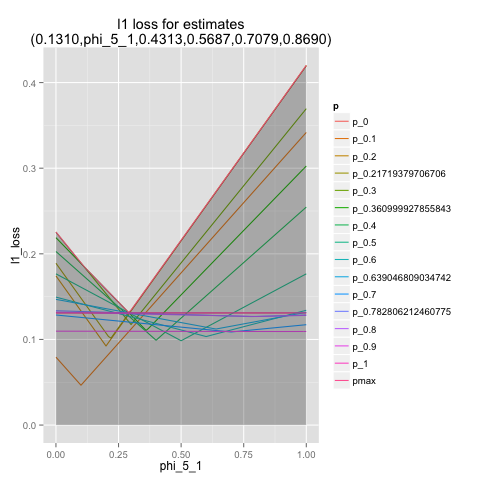
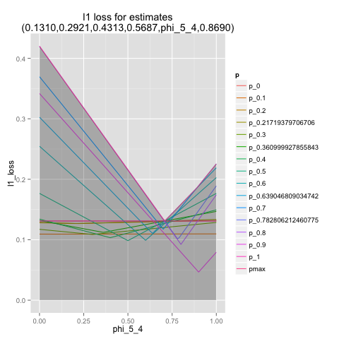

.. code:: python

    %load_ext rpy2.ipython
    
    import sympy
    import numpy
    import pandas
    import scipy
    import scipy.special
    import scipy.optimize
    import cvxopt
.. code:: python

    %%R
    library(ggplot2)
    library(reshape2)
.. code:: python

    def ncr(n, r):
        s = scipy.special.binom(n,r)
        return int(round(s)) # scipy special function return is not always an integer
    
    
    
    def numericSoln(si):
        return { k:complex(si[k]).real for k in si.keys() }
    
    def isRealSoln(si):
        if not all([abs(complex(sij).imag)<1.0e-6 for sij in si.values()]):
            return False
        ns = numericSoln(si)
        return all([ nij>=0 and nij<=1.0 for nij in ns.values()])
    
    def printsolnN(phis,soln):
       ns = numericSoln(soln)
       for phi in phis:
          if phi in soln:
             print '\t',phi,'\t',soln[phi],'\t',ns[phi]
    
    
    # build equations to make polynomial p-free
    def prepareClearingEqns(p,phis,poly):
       polyTerms = sympy.collect(sympy.expand(poly),p,evaluate=False)
       eqns = [ polyTerms[k] for k in polyTerms.keys() if (not k==1) ]
       return eqns
    
    # crude numeric check of signs of poly
    def checkForSignsIn01(p,poly):
        sawPlus = False
        sawMinus = False
        scale = 20
        for i in range(scale+1):
           y = float(sympy.expand(poly.subs({p:i/float(scale)})))
           if y>0:
              sawPlus = True
           if y<0:
              sawMinus = True
           if sawPlus and sawMinus:
              break
        return ('+' if sawPlus else '') + ('-' if sawMinus else '')
    
    explicitGradientClearingEqns = False
    
    # for k flips of unknown coin solve for minimal max variance estimate schedule
    def solveForK(k):
       print '*******************'
       print 'k',k
       p = sympy.symbols('p')
       phis = [ sympy.symbols(str('phi_'+str(h) + '_' + str(k))) for h in range(k+1) ]
       poly = sum([ p**h * (1-p)**(k-h) * ncr(k,h) * (phis[h]-p)**2 for h in range(k+1) ])
       eqns = []
       if explicitGradientClearingEqns:
           for phi in phis:
               eqns.extend(prepareClearingEqns(p,phis,sympy.diff(poly,phi)))
       else:
            eqns = prepareClearingEqns(p,phis,poly)
       soln1 = sympy.solve(eqns,phis)
       soln1 = [ { phis[j]:si[j] for j in range(len(phis))} for si in soln1 ]
       numSoln = [ numericSoln(si) for si in soln1 ]
       viol = [ max([ abs(sympy.expand(eij.subs(si))) for eij in eqns ]) for si in numSoln ]
       isReal = [ isRealSoln(si) for si in soln1 ]
       costs = { i:abs(sympy.expand(poly.subs(numSoln[i]).subs({p:0}))) for i in range(len(numSoln)) if isReal[i] and viol[i]<1.0e-8 }
       print 'costs',costs
       minCost = min(costs.values())
       index = [ i for i in costs.keys() if costs[i] <= minCost ][0]
       soln = soln1[index]
       losspoly = sympy.simplify(sympy.expand(poly.subs(soln)))
       print 'loss poly',losspoly
       printsolnN(phis,soln)
       print 'loss',abs(complex(losspoly.subs({p:0})))  # the p->0 subs is to get rid of rounding error if we were working over floating point
       # check if gradient is p-free (or even zero) at our fixed point
       checks = []
       for phi in phis:
            checki = sympy.expand(sympy.diff(poly,phi).subs(soln))
            print 'd',phi,checki,checkForSignsIn01(p,checki)
            checks.append(checki)
       print '*******************'
       ns = numericSoln(soln)
       return [ ns[phi] for phi in phis ]
    
    # solve numerically using Newton's zero finding method
    def solveForKN(k):
       p = sympy.symbols('p')
       phis = [ sympy.symbols(str('phi_'+str(h) + '_' + str(k))) for h in range(k+1) ]
       poly = sum([ p**h * (1-p)**(k-h) * ncr(k,h) * (phis[h]-p)**2 for h in range(k+1) ])
       eqns = prepareClearingEqns(p,phis,poly)
       jacobian = [ [ sympy.diff(eqi,phij) for phij in phis ] for eqi in eqns ]
       nSoln = { phis[i]:((i+0.5)/(k+1.0)) for i in range(len(phis)) }
       while True:
          checks = numpy.array([ float(sympy.expand(ei.subs(nSoln))) for ei in eqns ])
          if max([abs(ci) for ci in checks])<1.0e-12:
             break
          js = numpy.matrix([ [ float(sympy.expand(jij.subs(nSoln))) for jij in ji ] for ji in jacobian ])
          step = numpy.linalg.solve(js,checks)
          nSoln = { phis[i]:(nSoln[phis[i]]-step[i]) for i in range(len(phis)) }
          if max([abs(si) for si in step])<1.0e-12:
             break
       return [ nSoln[phi] for phi in phis ]
    
    
    # approximate l1 loss for using phis as our estimate when prob is one of pseq
    def l1Loss(phis,pseq=[ pi/float(1000) for pi in range(1001) ]):
        k = len(phis)-1
        kchoose = [ float(ncr(k,h)) for h in range(k+1) ]
        def f(p):
            if p<0 or p>1:
                return float('inf')
            return sum([ p**h * (1.0-p)**(k-h) * kchoose[h] * abs(phis[h]-p) for h in range(k+1) ])
        reg = max([ f(p) for p in pseq ])
        return reg
    
    # approximate l2 loss for using phis as our estimate when prob is one of pseq
    def l2Loss(phis,pseq):
        k = len(phis)-1
        kchoose = [ float(ncr(k,h)) for h in range(k+1) ]
        def f(p):
            if p<0 or p>1:
                return float('inf')
            return sum([ p**h * (1.0-p)**(k-h) * kchoose[h] * (phis[h]-p)**2 for h in range(k+1) ])
        reg = max([ f(p) for p in pseq ])
        return reg
    
    def solveL2Problem(k,pseq):
        baseSoln = solveForKN(k)
        l0 = l2Loss(baseSoln,pseq)
        maxP = max(pseq)
        minP = min(pseq)
        start = [ min(maxP,max(minP,phi)) for phi in baseSoln ]
        def f(x):
            if not all([ phi>=0 and phi<=1 for phi in x]):
                return l0+1.0
            return l2Loss(x,pseq)
        opt = scipy.optimize.minimize(f,start,method='Powell')
        return opt['x']
    
    
    
    # Solve argmin_phi max_i sum_{j=0}^{k} (k choose j) p(i)^j (1-p(i))^{k-j} | p(i) - phi(j) |
    # Pick set of estimates (indexed by evidence) minimizing worse L1 loss expected for any p
    # k: number of flips
    # p: array of probabilities to check against
    def solveL1Problem(k,p):
       nphis = k+1
       nps = len(p)
       # encode argmin_phi max_i sum_{j=0}^{k} (k choose j) p(i)^j (1-p(i))^{k-j} | p(i) - phi(j) |
       # solve a x <= b 
       # varibles: 
       #  phi (indices: 0 ... nphis-1)
       #  u (indices: nphis ... (1+nps)*nphis-1) 
       #   u(i,j) = var((i+1)*nphis+j) = abs(phi(j)-p(i)) i=0...nps-1, j=0...nphis-1
       #  s (index: (1+nps)*nphis )
       # eqns: 
       #  u(i,j) >= phi(j) - p(i)
       #  u(i,j) >= -(phi(j) - p(i))
       #  s >= sum_{j=0}^{k} (k choose j) p(i)^j (1-p(i))^{k-j} u(i,j)
       nvars = (1+nps)*nphis+1
       sindex = (1+nps)*nphis
       a = []
       b = []
       c = numpy.zeros(nvars)
       c[sindex] = 1.0
       for i in range(nps):
          arow = numpy.zeros(nvars)
          brow = 0.0
          # TODO: put poly coefs in terms of u's here
          arow[sindex] = -1.0
          for j in range(nphis):
             uindex = (i+1)*nphis+j
             arow[uindex] = ncr(k,j) * p[i]**j * (1-p[i])**(k-j)
          a.append(arow)
          b.append(brow)
          for j in range(nphis):
             uindex = (i+1)*nphis+j
             phiindex = j
             # u(i,j) >= phi(j) - p(i) : phi(j) - u(i,j) <= p(i)
             arow = numpy.zeros(nvars)
             arow[phiindex] = 1.0
             arow[uindex] = -1.0 
             brow = p[i]
             a.append(arow)
             b.append(brow)
             # u(i,j) >= -(phi(j) - p(i)) : -phi(j) - u(i,j) <= -p(i)
             arow = numpy.zeros(nvars)
             arow[phiindex] = -1.0
             arow[uindex] = -1.0 
             brow = -p[i]
             a.append(arow)
             b.append(brow)
       cmat = cvxopt.matrix(c)
       gmat = cvxopt.matrix(numpy.matrix(a))
       hmat = cvxopt.matrix(b)
       cvxopt.solvers.options['show_progress'] = False
       sol = cvxopt.solvers.lp(cmat,gmat,hmat) # solve gmax * x <= hmat minimizing cmat
       return [ sol['x'][i] for i in range(nphis) ]
    
    # l1 cost on known ps
    def l1Cost(phis,ps):
        k = len(phis)-1
        choose = [ ncr(k,j) for j in range(len(phis)) ]
        def f(p):
            return sum([ choose[j] *  p**j * (1.0-p)**(k-j) * abs(phis[j]-p) for j in range(len(phis)) ])
        return max([ f(p) for p in ps ])
            
    # solve argmax_p sum_{j=0}^{k} (k choose j) p^j (1-p)^{k-j} | p - phi(j) | for 0<=p<=1
    def worstL1p(phis):
        k = len(phis)-1
        choose = [ ncr(k,j) for j in range(len(phis)) ]
        def f(p):
            return -sum([ choose[j] * p**j * (1-p)**(k-j) * abs(phis[j]-p) for j in range(len(phis)) ])
        cuts = set([0.0,1.0])
        for phi in phis:
            if phi>0.0 and phi<1.0:
                cuts.add(phi)
        cuts = sorted(cuts)
        optX = None
        optF = None
        for i in range(len(cuts)-1):
           opti = scipy.optimize.minimize_scalar(f,bounds=(cuts[i],cuts[i+1]),method='Bounded')
           xi = opti['x']
           fi = -f(xi)
           if (optX is None) or (fi>optF):
                optX = xi
                optF = fi
        return optX
    
    # return which ps are approximately diverse active constrains on the current phis
    def activeL1Constraints(phis,ps):
        k = len(phis)-1
        choose = [ ncr(k,j) for j in range(len(phis)) ]
        def f(p):
            return sum([ choose[j] *  p**j * (1.0-p)**(k-j) * abs(phis[j]-p) for j in range(len(phis)) ])
        losses = [ f(p) for p in ps ]
        maxloss = max(losses)
        indices = sorted(range(len(losses)),key=lambda i: -losses[i])
        active = set()
        for idx in indices:
            pi = ps[idx]
            lossi = losses[idx]
            if lossi<maxloss-1.0e-6:
                break
            if len(active)<=0 or min([ abs(pi-aj) for aj in active])>1.0e-3:
                active.add(pi)
        return sorted(active)
    
    
    # solve L1 problem over 0<=p<=1 using crude column generation method
    def solveL1ProblemByCuts(k):
       ps = [ i/20.0 for i in range(21) ]
       done = False
       while not done:
          phis = solveL1Problem(k,ps)
          # print phis
          cost1 = l1Cost(phis,ps)
          newP = worstL1p(phis)
          ps.append(newP)
          cost2 = l1Cost(phis,ps)
          # print 'cost1,cost2',cost1,cost2
          if not cost1+1.0e-8<cost2:
             done = True
       return phis,activeL1Constraints(phis,ps)
    
                
    # Build the Bayes estimate of expected values from uniform priors
    # on the unknown probability pWin in the set phis
    # seen in kFlips trials
    def bayesMeansEstimates(phis,priors,kFlips):
      nphis = len(phis)
      if priors is None:
         priors = numpy.ones(nphis)
      else:
         priors = numpy.array(priors)
      priors = priors/sum(priors)
      e = numpy.zeros(kFlips+1)
      for winsSeen in range(kFlips+1):
        posteriorProbs = numpy.zeros(nphis)
        for i in range(nphis):
          pWin = phis[i]
          posteriorProbs[i] = priors[i]*ncr(kFlips,winsSeen) * \
             pWin**winsSeen * (1-pWin)**(kFlips-winsSeen)
        posteriorProbs = posteriorProbs/sum(posteriorProbs)
        e[winsSeen] = sum(posteriorProbs*phis)
      return numpy.array(e)

.. code:: python

    def reportSoln(x,pTrue):
        return '[' + ' '.join([str(xi) for xi in x]) + '] l2Loss ' + str(l2Loss(x,pTrue)) + ', l1Loss ' + str(l1Cost(x,pTrue))
    
    df = pandas.DataFrame(columns=['n','h','estName','phi'])
    df[['n','h']] = df[['n','h']].astype(float)
    df[['estName']] = df[['estName']].astype(str)
    df[['phi']] = df[['phi']].astype(float)
    
    def addToFrame(n,estName,phis):
        for h in range(len(phis)):
            df.loc[df.shape[0]+1] = [n,h,estName,phis[h]]
    
    for k in range(1,11):
        print
        print 'solutions for k-rolls:',k
        obliviousSoln = [0.5 for h in range(k+1)]
        efSoln = [ h/float(k) for h in range(k+1)]
        addToFrame(k,'Frequentist',efSoln)
        print '\tempirical frequentist solution:',efSoln
        bjSoln = [ (h+0.5)/(k+1.0) for h in range(k+1)]
        addToFrame(k,'Bayes (Jeffreys)',bjSoln)
        print '\tJeffries prior Bayes solution:',bjSoln
        l1soln,activePs = solveL1ProblemByCuts(k)
        addToFrame(k,'l1 minimax',l1soln)
        print '\tl1 solution for general coin game:',l1soln
        print '\tl1 solution active ps:',activePs
        l2soln = solveForKN(k)
        addToFrame(k,'l2 minimax',l2soln)
        print '\tnumeric l2 for general coin game:',l2soln
        for pTrue in [(0.0,0.5,1.0),(1/6.0,2/6.0,3/6.0,4/6.0,5/6.0)]:
            print '\tsolutions for for k-roll games restricted to probs',pTrue
            print '\t\tempirical frequentist solution:',reportSoln(efSoln,pTrue)
            print '\t\tobvlivious solution',reportSoln(obliviousSoln,pTrue)
            print '\t\tuniform prior restricted Bayes soln:',reportSoln(bayesMeansEstimates(pTrue,None,k),pTrue)
            print '\t\tl1 solution for restrited dice game:',reportSoln(solveL1Problem(k,pTrue),pTrue)
            l2solnP = solveL2Problem(k,pTrue)
            print '\t\tl2 solution for restrited dice game:',reportSoln(l2solnP,pTrue)
            print '\t\t\tl2 restricted loss of last soln:',l2Loss(l2solnP,pTrue),'(and for general l2 solution)',l2Loss(l2soln,pTrue)
        print

.. parsed-literal::

    
    solutions for k-rolls: 1
    	empirical frequentist solution: [0.0, 1.0]
    	Jeffries prior Bayes solution: [0.25, 0.75]
    	l1 solution for general coin game: [0.25000000053084404, 0.7499999994691557]
    	l1 solution active ps: [0.0, 0.5, 1.0]
    	numeric l2 for general coin game: [0.25, 0.75]
    	solutions for for k-roll games restricted to probs (0.0, 0.5, 1.0)
    		empirical frequentist solution: [0.0 1.0] l2Loss 0.25, l1Loss 0.5
    		obvlivious solution [0.5 0.5] l2Loss 0.25, l1Loss 0.5
    		uniform prior restricted Bayes soln: [0.166666666667 0.833333333333] l2Loss 0.111111111111, l1Loss 0.333333333333
    		l1 solution for restrited dice game: [0.249999999455 0.750000000545] l2Loss 0.0625000002725, l1Loss 0.250000000545
    		l2 solution for restrited dice game: [0.25 0.75] l2Loss 0.0625, l1Loss 0.25
    			l2 restricted loss of last soln: 0.0625 (and for general l2 solution) 0.0625
    	solutions for for k-roll games restricted to probs (0.16666666666666666, 0.3333333333333333, 0.5, 0.6666666666666666, 0.8333333333333334)
    		empirical frequentist solution: [0.0 1.0] l2Loss 0.25, l1Loss 0.5
    		obvlivious solution [0.5 0.5] l2Loss 0.111111111111, l1Loss 0.333333333333
    		uniform prior restricted Bayes soln: [0.388888888889 0.611111111111] l2Loss 0.0740740740741, l1Loss 0.259259259259
    		l1 solution for restrited dice game: [0.300000000256 0.699999999744] l2Loss 0.0622222222336, l1Loss 0.20000000017
    		l2 solution for restrited dice game: [0.25 0.75] l2Loss 0.0625, l1Loss 0.25
    			l2 restricted loss of last soln: 0.0625 (and for general l2 solution) 0.0625
    
    
    solutions for k-rolls: 2
    	empirical frequentist solution: [0.0, 0.5, 1.0]
    	Jeffries prior Bayes solution: [0.16666666666666666, 0.5, 0.8333333333333334]
    	l1 solution for general coin game: [0.1916025849097775, 0.5000000003927415, 0.8083974150901696]
    	l1 solution active ps: [0.0, 0.36110277018834125, 0.63891962123298907, 1.0]
    	numeric l2 for general coin game: [0.20710678118654738, 0.49999999999999983, 0.79289321881345221]
    	solutions for for k-roll games restricted to probs (0.0, 0.5, 1.0)
    		empirical frequentist solution: [0.0 0.5 1.0] l2Loss 0.125, l1Loss 0.25
    		obvlivious solution [0.5 0.5 0.5] l2Loss 0.25, l1Loss 0.5
    		uniform prior restricted Bayes soln: [0.1 0.5 0.9] l2Loss 0.08, l1Loss 0.2
    		l1 solution for restrited dice game: [0.166666656849 0.5 0.833333343151] l2Loss 0.0555555588283, l1Loss 0.166666671576
    		l2 solution for restrited dice game: [0.207106781187 0.500000000041 0.792893218813] l2Loss 0.0428932188135, l1Loss 0.207106781187
    			l2 restricted loss of last soln: 0.0428932188135 (and for general l2 solution) 0.0428932188135
    	solutions for for k-roll games restricted to probs (0.16666666666666666, 0.3333333333333333, 0.5, 0.6666666666666666, 0.8333333333333334)
    		empirical frequentist solution: [0.0 0.5 1.0] l2Loss 0.125, l1Loss 0.296296296296
    		obvlivious solution [0.5 0.5 0.5] l2Loss 0.111111111111, l1Loss 0.333333333333
    		uniform prior restricted Bayes soln: [0.318181818182 0.5 0.681818181818] l2Loss 0.0541781450872, l1Loss 0.212121212121
    		l1 solution for restrited dice game: [0.242424243029 0.5 0.757575756971] l2Loss 0.0445490256534, l1Loss 0.161616162019
    		l2 solution for restrited dice game: [0.207106781187 0.5 0.792893218813] l2Loss 0.0428932188135, l1Loss 0.181236973415
    			l2 restricted loss of last soln: 0.0428932188135 (and for general l2 solution) 0.0428932188135
    
    
    solutions for k-rolls: 3
    	empirical frequentist solution: [0.0, 0.3333333333333333, 0.6666666666666666, 1.0]
    	Jeffries prior Bayes solution: [0.125, 0.375, 0.625, 0.875]
    	l1 solution for general coin game: [0.16204790029316266, 0.39658685219868767, 0.6034131464669085, 0.8379520999487733]
    	l1 solution active ps: [0.0, 0.28964153346034199, 0.5, 0.71035846884017806, 1.0]
    	numeric l2 for general coin game: [0.18301270189221974, 0.39433756729740699, 0.60566243270259423, 0.8169872981077817]
    	solutions for for k-roll games restricted to probs (0.0, 0.5, 1.0)
    		empirical frequentist solution: [0.0 0.333333333333 0.666666666667 1.0] l2Loss 0.0833333333333, l1Loss 0.25
    		obvlivious solution [0.5 0.5 0.5 0.5] l2Loss 0.25, l1Loss 0.5
    		uniform prior restricted Bayes soln: [0.0555555555556 0.5 0.5 0.944444444444] l2Loss 0.0493827160494, l1Loss 0.111111111111
    		l1 solution for restrited dice game: [0.0999999996952 0.5 0.5 0.900000000305] l2Loss 0.040000000061, l1Loss 0.100000000076
    		l2 solution for restrited dice game: [0.183012701892 0.394337567308 0.501819605275 0.816987298125] l2Loss 0.0334936490539, l1Loss 0.183012701892
    			l2 restricted loss of last soln: 0.0334936490539 (and for general l2 solution) 0.0334936490539
    	solutions for for k-roll games restricted to probs (0.16666666666666666, 0.3333333333333333, 0.5, 0.6666666666666666, 0.8333333333333334)
    		empirical frequentist solution: [0.0 0.333333333333 0.666666666667 1.0] l2Loss 0.0833333333333, l1Loss 0.25
    		obvlivious solution [0.5 0.5 0.5 0.5] l2Loss 0.111111111111, l1Loss 0.333333333333
    		uniform prior restricted Bayes soln: [0.274814814815 0.411111111111 0.588888888889 0.725185185185] l2Loss 0.0413402834934, l1Loss 0.179368998628
    		l1 solution for restrited dice game: [0.213263724569 0.405581333739 0.594418666261 0.786736275431] l2Loss 0.0355624537193, l1Loss 0.142498068554
    		l2 solution for restrited dice game: [0.183012701892 0.394337567297 0.605662432703 0.816987298108] l2Loss 0.0334936490539, l1Loss 0.158493649054
    			l2 restricted loss of last soln: 0.0334936490539 (and for general l2 solution) 0.0334936490539
    
    
    solutions for k-rolls: 4
    	empirical frequentist solution: [0.0, 0.25, 0.5, 0.75, 1.0]
    	Jeffries prior Bayes solution: [0.1, 0.3, 0.5, 0.7, 0.9]
    	l1 solution for general coin game: [0.14374804852360978, 0.33414659684052456, 0.5000000111050183, 0.6658533929161125, 0.8562519514766311]
    	l1 solution active ps: [0.0, 0.24648851416142309, 0.41668579647889104, 0.58333969037069322, 0.75352095187829315, 1.0]
    	numeric l2 for general coin game: [0.16666666666666657, 0.33333333333333298, 0.49999999999999928, 0.66666666666666574, 0.83333333333333226]
    	solutions for for k-roll games restricted to probs (0.0, 0.5, 1.0)
    		empirical frequentist solution: [0.0 0.25 0.5 0.75 1.0] l2Loss 0.0625, l1Loss 0.1875
    		obvlivious solution [0.5 0.5 0.5 0.5 0.5] l2Loss 0.25, l1Loss 0.5
    		uniform prior restricted Bayes soln: [0.0294117647059 0.5 0.5 0.5 0.970588235294] l2Loss 0.0276816608997, l1Loss 0.0588235294118
    		l1 solution for restrited dice game: [0.0555555293498 0.5 0.5 0.5 0.94444447065] l2Loss 0.0246913609364, l1Loss 0.0555555588313
    		l2 solution for restrited dice game: [0.166666666667 0.333333333346 0.500000000035 0.375976819753 0.848938836876] l2Loss 0.0277777777778, l1Loss 0.166666666667
    			l2 restricted loss of last soln: 0.0277777777778 (and for general l2 solution) 0.0277777777778
    	solutions for for k-roll games restricted to probs (0.16666666666666666, 0.3333333333333333, 0.5, 0.6666666666666666, 0.8333333333333334)
    		empirical frequentist solution: [0.0 0.25 0.5 0.75 1.0] l2Loss 0.0625, l1Loss 0.197530864198
    		obvlivious solution [0.5 0.5 0.5 0.5 0.5] l2Loss 0.111111111111, l1Loss 0.333333333333
    		uniform prior restricted Bayes soln: [0.246680286006 0.349056603774 0.5 0.650943396226 0.753319713994] l2Loss 0.032666446072, l1Loss 0.155459620586
    		l1 solution for restrited dice game: [0.18090056258 0.339372469422 0.5 0.660627530578 0.81909943742] l2Loss 0.0285590713054, l1Loss 0.120201194966
    		l2 solution for restrited dice game: [0.166666666687 0.333333333333 0.5 0.666666666667 0.833333331503] l2Loss 0.0277777777778, l1Loss 0.124999999884
    			l2 restricted loss of last soln: 0.0277777777778 (and for general l2 solution) 0.0277777777778
    
    
    solutions for k-rolls: 5
    	empirical frequentist solution: [0.0, 0.2, 0.4, 0.6, 0.8, 1.0]
    	Jeffries prior Bayes solution: [0.08333333333333333, 0.25, 0.4166666666666667, 0.5833333333333334, 0.75, 0.9166666666666666]
    	l1 solution for general coin game: [0.13098490014999317, 0.2920833550225756, 0.4312839988599481, 0.5687160116582426, 0.7079166228922025, 0.8690150999541757]
    	l1 solution active ps: [0.0, 0.21719379706706049, 0.36099992785584262, 0.5, 0.63904680903474187, 0.78280621246077464, 1.0]
    	numeric l2 for general coin game: [0.15450849718749732, 0.29270509831249841, 0.43090169943749956, 0.56909830056250077, 0.70729490168750231, 0.84549150281250485]
    	solutions for for k-roll games restricted to probs (0.0, 0.5, 1.0)
    		empirical frequentist solution: [0.0 0.2 0.4 0.6 0.8 1.0] l2Loss 0.05, l1Loss 0.1875
    		obvlivious solution [0.5 0.5 0.5 0.5 0.5 0.5] l2Loss 0.25, l1Loss 0.5
    		uniform prior restricted Bayes soln: [0.0151515151515 0.5 0.5 0.5 0.5 0.984848484848] l2Loss 0.0146923783287, l1Loss 0.030303030303
    		l1 solution for restrited dice game: [0.0294116806678 0.5 0.5 0.5 0.5 0.970588319332] l2Loss 0.0138408353932, l1Loss 0.0294117699583
    		l2 solution for restrited dice game: [0.154508497187 0.29270509833 0.430901699449 0.501189936964 0.409051751075 0.845491502831] l2Loss 0.0238728757031, l1Loss 0.154508497187
    			l2 restricted loss of last soln: 0.0238728757031 (and for general l2 solution) 0.0238728757031
    	solutions for for k-roll games restricted to probs (0.16666666666666666, 0.3333333333333333, 0.5, 0.6666666666666666, 0.8333333333333334)
    		empirical frequentist solution: [0.0 0.2 0.4 0.6 0.8 1.0] l2Loss 0.05, l1Loss 0.1875
    		obvlivious solution [0.5 0.5 0.5 0.5 0.5 0.5] l2Loss 0.111111111111, l1Loss 0.333333333333
    		uniform prior restricted Bayes soln: [0.227306967985 0.305843110191 0.429643929644 0.570356070356 0.694156889809 0.772693032015] l2Loss 0.0265604298945, l1Loss 0.137328258645
    		l1 solution for restrited dice game: [0.166666667912 0.313638256875 0.438893140753 0.561106859247 0.686361743125 0.833333332088] l2Loss 0.0265211391016, l1Loss 0.117263169705
    		l2 solution for restrited dice game: [0.166666666699 0.292705098312 0.430901699437 0.569098300563 0.707294901688 0.833333331939] l2Loss 0.0238113659803, l1Loss 0.128799427918
    			l2 restricted loss of last soln: 0.0238113659803 (and for general l2 solution) 0.0238728757031
    
    
    solutions for k-rolls: 6
    	empirical frequentist solution: [0.0, 0.16666666666666666, 0.3333333333333333, 0.5, 0.6666666666666666, 0.8333333333333334, 1.0]
    	Jeffries prior Bayes solution: [0.07142857142857142, 0.21428571428571427, 0.35714285714285715, 0.5, 0.6428571428571429, 0.7857142857142857, 0.9285714285714286]
    	l1 solution for general coin game: [0.12142009384240575, 0.26147915987431153, 0.38196891625959106, 0.5000000008783331, 0.6180310826982969, 0.7385208414882181, 0.8785799061574862]
    	l1 solution active ps: [0.0, 0.19572689615946981, 0.32082600384142879, 0.4406873722280974, 0.55931640725187781, 0.67917412508742425, 0.80426215306549531, 1.0]
    	numeric l2 for general coin game: [0.14494897427875081, 0.26329931618583163, 0.38164965809291207, 0.49999999999999173, 0.61835034190706983, 0.736700683814145, 0.85505102572121505]
    	solutions for for k-roll games restricted to probs (0.0, 0.5, 1.0)
    		empirical frequentist solution: [0.0 0.166666666667 0.333333333333 0.5 0.666666666667 0.833333333333 1.0] l2Loss 0.0416666666667, l1Loss 0.15625
    		obvlivious solution [0.5 0.5 0.5 0.5 0.5 0.5 0.5] l2Loss 0.25, l1Loss 0.5
    		uniform prior restricted Bayes soln: [0.00769230769231 0.5 0.5 0.5 0.5 0.5 0.992307692308] l2Loss 0.00757396449704, l1Loss 0.0153846153846
    		l1 solution for restrited dice game: [0.0151514648353 0.5 0.5 0.5 0.5 0.5 0.984848535165] l2Loss 0.00734619068911, l1Loss 0.0151515167239
    		l2 solution for restrited dice game: [0.144948974265 0.638687506793 0.381649658105 0.500000000011 0.477152966367 0.433542290064 0.88321053905] l2Loss 0.0210102051406, l1Loss 0.144948974265
    			l2 restricted loss of last soln: 0.0210102051406 (and for general l2 solution) 0.0210102051445
    	solutions for for k-roll games restricted to probs (0.16666666666666666, 0.3333333333333333, 0.5, 0.6666666666666666, 0.8333333333333334)
    		empirical frequentist solution: [0.0 0.166666666667 0.333333333333 0.5 0.666666666667 0.833333333333 1.0] l2Loss 0.0416666666667, l1Loss 0.15625
    		obvlivious solution [0.5 0.5 0.5 0.5 0.5 0.5 0.5] l2Loss 0.111111111111, l1Loss 0.333333333333
    		uniform prior restricted Bayes soln: [0.213380453327 0.274647887324 0.376645355397 0.5 0.623354644603 0.725352112676 0.786619546673] l2Loss 0.0221153021832, l1Loss 0.123136849538
    		l1 solution for restrited dice game: [0.166666667309 0.281076524223 0.375458049807 0.5 0.624541950193 0.718923475777 0.833333332691] l2Loss 0.0218645634403, l1Loss 0.109843857508
    		l2 solution for restrited dice game: [0.166666667927 0.263299316172 0.381649658103 0.5 0.618350341907 0.736700683833 0.833333283647] l2Loss 0.0208516170218, l1Loss 0.116347340416
    			l2 restricted loss of last soln: 0.0208516170218 (and for general l2 solution) 0.0210102051444
    
    
    solutions for k-rolls: 7
    	empirical frequentist solution: [0.0, 0.14285714285714285, 0.2857142857142857, 0.42857142857142855, 0.5714285714285714, 0.7142857142857143, 0.8571428571428571, 1.0]
    	Jeffries prior Bayes solution: [0.0625, 0.1875, 0.3125, 0.4375, 0.5625, 0.6875, 0.8125, 0.9375]
    	l1 solution for general coin game: [0.11389668038692093, 0.23800677021159725, 0.3445595652004531, 0.4484262201771256, 0.5515737833622973, 0.6554404375929243, 0.7619932366731346, 0.8861033196781587]
    	l1 solution active ps: [0.0, 0.1792273951645626, 0.29022140501876265, 0.3959745050203069, 0.5, 0.60401725386111538, 0.70977860104156332, 0.82079342150007151, 1.0]
    	numeric l2 for general coin game: [0.13714594258870808, 0.24081853042050227, 0.344491118252296, 0.44816370608408912, 0.55183629391588152, 0.65550888174767297, 0.75918146957946298, 0.86285405741124843]
    	solutions for for k-roll games restricted to probs (0.0, 0.5, 1.0)
    		empirical frequentist solution: [0.0 0.142857142857 0.285714285714 0.428571428571 0.571428571429 0.714285714286 0.857142857143 1.0] l2Loss 0.0357142857143, l1Loss 0.15625
    		obvlivious solution [0.5 0.5 0.5 0.5 0.5 0.5 0.5 0.5] l2Loss 0.25, l1Loss 0.5
    		uniform prior restricted Bayes soln: [0.00387596899225 0.5 0.5 0.5 0.5 0.5 0.5 0.996124031008] l2Loss 0.00384592272099, l1Loss 0.0077519379845
    		l1 solution for restrited dice game: [0.00769228312404 0.5 0.5 0.5 0.5 0.5 0.5 0.992307716876] l2Loss 0.00378698262649, l1Loss 0.00769230807619
    		l2 solution for restrited dice game: [0.137145942589 0.616206721028 0.344491118265 0.4481637061 0.549190214366 0.360208088664 0.151790613978 0.897585955074] l2Loss 0.0188090095685, l1Loss 0.137145942589
    			l2 restricted loss of last soln: 0.0188090095685 (and for general l2 solution) 0.0188090095686
    	solutions for for k-roll games restricted to probs (0.16666666666666666, 0.3333333333333333, 0.5, 0.6666666666666666, 0.8333333333333334)
    		empirical frequentist solution: [0.0 0.142857142857 0.285714285714 0.428571428571 0.571428571429 0.714285714286 0.857142857143 1.0] l2Loss 0.0357142857143, l1Loss 0.15625
    		obvlivious solution [0.5 0.5 0.5 0.5 0.5 0.5 0.5 0.5] l2Loss 0.111111111111, l1Loss 0.333333333333
    		uniform prior restricted Bayes soln: [0.203065668302 0.251405546037 0.33603150662 0.443861984801 0.556138015199 0.66396849338 0.748594453963 0.796934331698] l2Loss 0.0187823171961, l1Loss 0.116332256288
    		l1 solution for restrited dice game: [0.16666667288 0.25129079795 0.333333333325 0.471599601341 0.528400398659 0.666666666675 0.74870920205 0.83333332712] l2Loss 0.0191337687145, l1Loss 0.102629876053
    		l2 solution for restrited dice game: [0.166666668796 0.240818530411 0.344491118252 0.448163706094 0.551836293916 0.655508881748 0.759181469599 0.833333105106] l2Loss 0.0185656536849, l1Loss 0.112930629826
    			l2 restricted loss of last soln: 0.0185656536849 (and for general l2 solution) 0.0188090095686
    
    
    solutions for k-rolls: 8
    	empirical frequentist solution: [0.0, 0.125, 0.25, 0.375, 0.5, 0.625, 0.75, 0.875, 1.0]
    	Jeffries prior Bayes solution: [0.05555555555555555, 0.16666666666666666, 0.2777777777777778, 0.3888888888888889, 0.5, 0.6111111111111112, 0.7222222222222222, 0.8333333333333334, 0.9444444444444444]
    	l1 solution for general coin game: [0.10776815608075044, 0.21931787739327863, 0.3150231129755032, 0.40802485346404505, 0.5000000013251399, 0.5919751463672478, 0.6849768800373918, 0.7806821494767411, 0.8922318434004618]
    	l1 solution active ps: [0.0, 0.16599851137446592, 0.26598799144202911, 0.36082665593891317, 0.45380106497798162, 0.54619454816237634, 0.63913646551673864, 0.73401189056232763, 0.83400143995418163, 1.0]
    	numeric l2 for general coin game: [0.13060193748186366, 0.22295145311139491, 0.31530096874092589, 0.40765048437045631, 0.49999999999998584, 0.59234951562951332, 0.68469903125903675, 0.77704854688855263, 0.8693980625180614]
    	solutions for for k-roll games restricted to probs (0.0, 0.5, 1.0)
    		empirical frequentist solution: [0.0 0.125 0.25 0.375 0.5 0.625 0.75 0.875 1.0] l2Loss 0.03125, l1Loss 0.13671875
    		obvlivious solution [0.5 0.5 0.5 0.5 0.5 0.5 0.5 0.5 0.5] l2Loss 0.25, l1Loss 0.5
    		uniform prior restricted Bayes soln: [0.00194552529183 0.5 0.5 0.5 0.5 0.5 0.5 0.5 0.998054474708] l2Loss 0.00193795515451, l1Loss 0.00389105058366
    		l1 solution for restrited dice game: [0.00387585717804 0.5 0.5 0.5 0.5 0.5 0.5 0.5 0.996124142822] l2Loss 0.00192296222727, l1Loss 0.0038759698658
    		l2 solution for restrited dice game: [0.130601937482 0.598339643719 0.690689159348 0.407650484382 0.500000000012 0.545606675665 0.385083332668 0.169657691287 0.93582357461] l2Loss 0.017056866074, l1Loss 0.130601937482
    			l2 restricted loss of last soln: 0.017056866074 (and for general l2 solution) 0.017056866074
    	solutions for for k-roll games restricted to probs (0.16666666666666666, 0.3333333333333333, 0.5, 0.6666666666666666, 0.8333333333333334)
    		empirical frequentist solution: [0.0 0.125 0.25 0.375 0.5 0.625 0.75 0.875 1.0] l2Loss 0.03125, l1Loss 0.13671875
    		obvlivious solution [0.5 0.5 0.5 0.5 0.5 0.5 0.5 0.5 0.5] l2Loss 0.111111111111, l1Loss 0.333333333333
    		uniform prior restricted Bayes soln: [0.195260476177 0.233697264582 0.304134379969 0.399057403621 0.5 0.600942596379 0.695865620031 0.766302735418 0.804739523823] l2Loss 0.018007685456, l1Loss 0.106032688791
    		l1 solution for restrited dice game: [0.166666668834 0.2167982497 0.333333333723 0.406367020149 0.5 0.593632979851 0.666666666278 0.7832017503 0.833333331166] l2Loss 0.0179244659521, l1Loss 0.0977270379767
    		l2 solution for restrited dice game: [0.183016542704 0.222965203022 0.315301022824 0.407650485111 0.50000000003 0.591187370225 0.684697182283 0.777048502329 0.833328303315] l2Loss 0.0168129749519, l1Loss 0.102561759416
    			l2 restricted loss of last soln: 0.0168129749519 (and for general l2 solution) 0.017056866074
    
    
    solutions for k-rolls: 9
    	empirical frequentist solution: [0.0, 0.1111111111111111, 0.2222222222222222, 0.3333333333333333, 0.4444444444444444, 0.5555555555555556, 0.6666666666666666, 0.7777777777777778, 0.8888888888888888, 1.0]
    	Jeffries prior Bayes solution: [0.05, 0.15, 0.25, 0.35, 0.45, 0.55, 0.65, 0.75, 0.85, 0.95]
    	l1 solution for general coin game: [0.10264212529939748, 0.2040136741160041, 0.2910022084311352, 0.37535485210598, 0.4585632093716296, 0.5414368038761673, 0.6246451401774117, 0.7089977938670285, 0.7959863262489215, 0.8973578746853068]
    	l1 solution active ps: [0.0, 0.15515985040672431, 0.24621623700708614, 0.33240558574383688, 0.41659630380607671, 0.5, 0.58340370518012885, 0.66759443436233634, 0.75377819753100983, 0.84485136947884865, 1.0]
    	numeric l2 for general coin game: [0.12499999999993124, 0.20833333333325538, 0.29166666666657692, 0.37499999999989464, 0.45833333333320636, 0.54166666666650842, 0.62499999999979383, 0.70833333333304671, 0.79166666666622476, 0.87499999999922329]
    	solutions for for k-roll games restricted to probs (0.0, 0.5, 1.0)
    		empirical frequentist solution: [0.0 0.111111111111 0.222222222222 0.333333333333 0.444444444444 0.555555555556 0.666666666667 0.777777777778 0.888888888889 1.0] l2Loss 0.0277777777778, l1Loss 0.13671875
    		obvlivious solution [0.5 0.5 0.5 0.5 0.5 0.5 0.5 0.5 0.5 0.5] l2Loss 0.25, l1Loss 0.5
    		uniform prior restricted Bayes soln: [0.000974658869396 0.5 0.5 0.5 0.5 0.5 0.5 0.5 0.5 0.999025341131] l2Loss 0.000972758949572, l1Loss 0.00194931773879
    		l1 solution for restrited dice game: [0.00194482948192 0.5 0.5 0.5 0.5 0.5 0.5 0.5 0.5 0.998055170518] l2Loss 0.000968980284687, l1Loss 0.00194552800984
    		l2 solution for restrited dice game: [0.124999999934 0.208333333351 0.291666666684 0.375000000012 0.458333333344 0.500717538743 0.497589740717 0.70833333332 0.184275811065 0.938576308113] l2Loss 0.0156249999836, l1Loss 0.124999999934
    			l2 restricted loss of last soln: 0.0156249999836 (and for general l2 solution) 0.0156250000002
    	solutions for for k-roll games restricted to probs (0.16666666666666666, 0.3333333333333333, 0.5, 0.6666666666666666, 0.8333333333333334)
    		empirical frequentist solution: [0.0 0.111111111111 0.222222222222 0.333333333333 0.444444444444 0.555555555556 0.666666666667 0.777777777778 0.888888888889 1.0] l2Loss 0.0277777777778, l1Loss 0.13671875
    		obvlivious solution [0.5 0.5 0.5 0.5 0.5 0.5 0.5 0.5 0.5 0.5] l2Loss 0.111111111111, l1Loss 0.333333333333
    		uniform prior restricted Bayes soln: [0.18926077274 0.219987438753 0.278652335209 0.362437814386 0.454203031376 0.545796968624 0.637562185614 0.721347664791 0.780012561247 0.81073922726] l2Loss 0.0172650938973, l1Loss 0.109863319723
    		l1 solution for restrited dice game: [0.166666669019 0.178394850692 0.333333332716 0.33819848159 0.49999999929 0.50000000071 0.66180151841 0.666666667284 0.821605149308 0.833333330981] l2Loss 0.0171215115142, l1Loss 0.0891371380188
    		l2 solution for restrited dice game: [0.196996585469 0.208464792041 0.291666997531 0.374999999481 0.458333333322 0.537269985903 0.624950975144 0.707587563013 0.791646405912 0.833218570067] l2Loss 0.0154449229399, l1Loss 0.101171673921
    			l2 restricted loss of last soln: 0.0154449229399 (and for general l2 solution) 0.015625
    
    
    solutions for k-rolls: 10
    	empirical frequentist solution: [0.0, 0.1, 0.2, 0.3, 0.4, 0.5, 0.6, 0.7, 0.8, 0.9, 1.0]
    	Jeffries prior Bayes solution: [0.045454545454545456, 0.13636363636363635, 0.22727272727272727, 0.3181818181818182, 0.4090909090909091, 0.5, 0.5909090909090909, 0.6818181818181818, 0.7727272727272727, 0.8636363636363636, 0.9545454545454546]
    	l1 solution for general coin game: [0.09826526400582009, 0.19120312092499994, 0.271015741090656, 0.3482922467591192, 0.4243922695084243, 0.4999999963063106, 0.5756077322703826, 0.6517077576515427, 0.7289842560026036, 0.808796881071396, 0.9017347360452662]
    	l1 solution active ps: [0.0, 0.14602970052725917, 0.22977773950594638, 0.30876671085544621, 0.38586688004136338, 0.46202154146925511, 0.53795675202860249, 0.61415884787859898, 0.69120080213558366, 0.77022276873398221, 0.85396381493049334, 1.0]
    	numeric l2 for general coin game: [0.12012653667611538, 0.19610122934092272, 0.27207592200573305, 0.3480506146705476, 0.42402530733536842, 0.50000000000019862, 0.5759746926650432, 0.65194938532990943, 0.72792407799480374, 0.80389877065973081, 0.87987346332470762]
    	solutions for for k-roll games restricted to probs (0.0, 0.5, 1.0)
    		empirical frequentist solution: [0.0 0.1 0.2 0.3 0.4 0.5 0.6 0.7 0.8 0.9 1.0] l2Loss 0.025, l1Loss 0.123046875
    		obvlivious solution [0.5 0.5 0.5 0.5 0.5 0.5 0.5 0.5 0.5 0.5 0.5] l2Loss 0.25, l1Loss 0.5
    		uniform prior restricted Bayes soln: [0.000487804878049 0.5 0.5 0.5 0.5 0.5 0.5 0.5 0.5 0.5 0.999512195122] l2Loss 0.000487328970851, l1Loss 0.000975609756098
    		l1 solution for restrited dice game: [0.000974504389646 0.5 0.5 0.5 0.5 0.5 0.5 0.5 0.5 0.5 0.99902549561] l2Loss 0.000486379775916, l1Loss 0.000974659171114
    		l2 solution for restrited dice game: [0.120126536676 0.571489419948 0.647464112613 0.348050614683 0.424025307347 0.500000000018 0.551651759149 0.354234619838 0.4246453469 0.196507915059 0.997931309432] l2Loss 0.0144303848138, l1Loss 0.120126536676
    			l2 restricted loss of last soln: 0.0144303848138 (and for general l2 solution) 0.0144303848138
    	solutions for for k-roll games restricted to probs (0.16666666666666666, 0.3333333333333333, 0.5, 0.6666666666666666, 0.8333333333333334)
    		empirical frequentist solution: [0.0 0.1 0.2 0.3 0.4 0.5 0.6 0.7 0.8 0.9 1.0] l2Loss 0.025, l1Loss 0.123046875
    		obvlivious solution [0.5 0.5 0.5 0.5 0.5 0.5 0.5 0.5 0.5 0.5 0.5] l2Loss 0.111111111111, l1Loss 0.333333333333
    		uniform prior restricted Bayes soln: [0.184595064958 0.209247335549 0.258068774016 0.331937027007 0.416091566541 0.5 0.583908433459 0.668062972993 0.741931225984 0.790752664451 0.815404935042] l2Loss 0.0164974307555, l1Loss 0.101363602606
    		l1 solution for restrited dice game: [0.166666666528 0.166666667078 0.311378207303 0.333333333202 0.438570869961 0.5 0.561429130039 0.666666666798 0.688621792697 0.833333332922 0.833333333472] l2Loss 0.0162594967291, l1Loss 0.0879975872226
    		l2 solution for restrited dice game: [0.206448115119 0.196302450351 0.272076043217 0.348050614582 0.424025307335 0.499999997496 0.57110782512 0.651597705182 0.726421736255 0.803847976124 0.833128057554] l2Loss 0.0143312922912, l1Loss 0.0952262267234
    			l2 restricted loss of last soln: 0.0143312922912 (and for general l2 solution) 0.0144303848138
    

.. code:: python

    %%R -i df
    df = as.data.frame(df)
    df$group = as.factor(pmin(df$h,df$n-df$h))
    df$up = 2*df$h>=df$n
    df$down = 2*df$h<=df$n
    pieces = list()
    for(e in unique(df$estName)) {
      pieces[[length(pieces)+1]] = 
        geom_text(data=subset(df,estName==e & up),
                  aes(x=n,y=phi,group=group,color=estName,label=paste(h,n,sep='/')))
      pieces[[length(pieces)+1]] = 
        geom_line(data=subset(df,estName==e & up),
                  aes(x=n,y=phi,group=group,color=estName,linetype=estName))
      pieces[[length(pieces)+1]] = 
        geom_text(data=subset(df,estName==e & down),
                  aes(x=n,y=phi,group=group,color=estName,label=paste(h,n,sep='/')))
      pieces[[length(pieces)+1]] = 
        geom_line(data=subset(df,estName==e & down),
                  aes(x=n,y=phi,group=group,color=estName,linetype=estName))
    }
    ns = sort(unique(df$n))
    print(ggplot() + pieces + 
          scale_x_continuous(labels=ns,breaks=ns) +
          scale_y_continuous(labels=seq(0,1,0.1),breaks=seq(0,1,0.1))
         )
    #write.table(df,file='dfFrame.tsv',sep='\t',row.names=FALSE)
    #df <- read.table('dfFrame.tsv',sep='\t',header=TRUE)

.. image:: output_4_0.png

.. code:: python

    pTrue = (0.0,0.5,1.0)
    for k in range(1,11):
        print
        print 'uniform Bayes solution to coingame (all-heads, fair, or all-tails):',k
        bmSoln = bayesMeansEstimates(pTrue,None,k)
        print bmSoln
        print 'l1 solution to coingame (all-heads, fair, or all-tails):',k
        l1Soln = solveL1Problem(k,pTrue)
        print 'l1Soln',l1Soln
        print 'l1 loss',l1Loss(l1Soln,pTrue)
        print 'l2 loss',l2Loss(l1Soln,pTrue)
        def eP(z):
             return bayesMeansEstimates(pTrue,(z, 1-2.0*z, z ),k)[0] - l1Soln[0]
        z = scipy.optimize.brentq(eP,0.0,0.5)
        effectivePriors = (z, 1-2.0*z, z)
        print 'effective priors l1',effectivePriors
        print 'Bayes check l1',bayesMeansEstimates(pTrue,effectivePriors,k)
        l2Soln = solveL2Problem(k,pTrue)
        print 'l2Soln',l2Soln
        print 'l1 loss',l1Loss(l2Soln,pTrue)
        print 'l2 loss',l2Loss(l2Soln,pTrue)
        def gP(z):
             return bayesMeansEstimates(pTrue,(z, 1-2.0*z, z ),k)[0] - l2Soln[0]
        z = scipy.optimize.brentq(gP,0.0,0.5)
        effectivePriors2 = (z, 1-2.0*z, z)
        print 'effective priors l2',effectivePriors2
        print 'Bayes check l2',bayesMeansEstimates(pTrue,effectivePriors2,k)

.. parsed-literal::

    
    uniform Bayes solution to coingame (all-heads, fair, or all-tails): 1
    [ 0.16666667  0.83333333]
    l1 solution to coingame (all-heads, fair, or all-tails): 1
    l1Soln [0.24999999945491402, 0.7500000005450859]
    l1 loss 0.250000000545
    l2 loss 0.0625000002725
    effective priors l1 (0.250000000545086, 0.49999999890982805, 0.250000000545086)
    Bayes check l1 [ 0.25  0.75]
    l2Soln [ 0.25  0.75]
    l1 loss 0.25
    l2 loss 0.0625
    effective priors l2 (0.25, 0.5, 0.25)
    Bayes check l2 [ 0.25  0.75]
    
    uniform Bayes solution to coingame (all-heads, fair, or all-tails): 2
    [ 0.1  0.5  0.9]
    l1 solution to coingame (all-heads, fair, or all-tails): 2
    l1Soln [0.1666666568485795, 0.5000000000000001, 0.8333333431514207]
    l1 loss 0.166666671576
    l2 loss 0.0555555588283
    effective priors l1 (0.25000001104535186, 0.4999999779092963, 0.25000001104535186)
    Bayes check l1 [ 0.16666666  0.5         0.83333334]
    l2Soln [ 0.20710678  0.5         0.79289322]
    l1 loss 0.207106781187
    l2 loss 0.0428932188135
    effective priors l2 (0.2071067811865605, 0.585786437626879, 0.2071067811865605)
    Bayes check l2 [ 0.20710678  0.5         0.79289322]
    
    uniform Bayes solution to coingame (all-heads, fair, or all-tails): 3
    [ 0.05555556  0.5         0.5         0.94444444]
    l1 solution to coingame (all-heads, fair, or all-tails): 3
    l1Soln [0.09999999969515637, 0.5000000000000001, 0.5000000000000001, 0.9000000003048437]
    l1 loss 0.100000000076
    l2 loss 0.040000000061
    effective priors l1 (0.25000000047631815, 0.4999999990473637, 0.25000000047631815)
    Bayes check l1 [ 0.1  0.5  0.5  0.9]
    l2Soln [ 0.1830127   0.39433757  0.50181961  0.8169873 ]
    l1 loss 0.183012701892
    l2 loss 0.0334936490539
    effective priors l2 (0.1510847396257868, 0.6978305207484263, 0.1510847396257868)
    Bayes check l2 [ 0.1830127  0.5        0.5        0.8169873]
    
    uniform Bayes solution to coingame (all-heads, fair, or all-tails): 4
    [ 0.02941176  0.5         0.5         0.5         0.97058824]
    l1 solution to coingame (all-heads, fair, or all-tails): 4
    l1Soln [0.05555552934981534, 0.5000000000000001, 0.5000000000000001, 0.5000000000000001, 0.9444444706501847]
    l1 loss 0.0555555588313
    l2 loss 0.0246913609364
    effective priors l1 (0.2500000663328986, 0.49999986733420276, 0.2500000663328986)
    Bayes check l1 [ 0.05555553  0.5         0.5         0.5         0.94444447]
    l2Soln [ 0.16666667  0.33333333  0.5         0.37597682  0.84893884]
    l1 loss 0.166666666667
    l2 loss 0.0277777777778
    effective priors l2 (0.10000000000011512, 0.7999999999997698, 0.10000000000011512)
    Bayes check l2 [ 0.16666667  0.5         0.5         0.5         0.83333333]
    
    uniform Bayes solution to coingame (all-heads, fair, or all-tails): 5
    [ 0.01515152  0.5         0.5         0.5         0.5         0.98484848]
    l1 solution to coingame (all-heads, fair, or all-tails): 5
    l1Soln [0.02941168066781756, 0.5000000000000001, 0.5000000000000001, 0.5000000000000001, 0.5000000000000001, 0.9705883193321826]
    l1 loss 0.0294117699583
    l2 loss 0.0138408353932
    effective priors l1 (0.2500003794849061, 0.4999992410301878, 0.2500003794849061)
    Bayes check l1 [ 0.02941168  0.5         0.5         0.5         0.5         0.97058832]
    l2Soln [ 0.1545085   0.2927051   0.4309017   0.50118994  0.40905175  0.8454915 ]
    l1 loss 0.154508497187
    l2 loss 0.0238728757031
    effective priors l2 (0.06130893952188311, 0.8773821209562338, 0.06130893952188311)
    Bayes check l2 [ 0.1545085  0.5        0.5        0.5        0.5        0.8454915]
    
    uniform Bayes solution to coingame (all-heads, fair, or all-tails): 6
    [ 0.00769231  0.5         0.5         0.5         0.5         0.5
      0.99230769]
    l1 solution to coingame (all-heads, fair, or all-tails): 6
    l1Soln [0.015151464835256744, 0.5000000000000001, 0.5000000000000001, 0.5000000000000001, 0.5000000000000001, 0.5000000000000001, 0.9848485351647435]
    l1 loss 0.0151515167239
    l2 loss 0.00734619068911
    effective priors l1 (0.25000042808198086, 0.4999991438360383, 0.25000042808198086)
    Bayes check l1 [ 0.01515146  0.5         0.5         0.5         0.5         0.5
      0.98484854]
    l2Soln [ 0.14494897  0.63868751  0.38164966  0.5         0.47715297  0.43354229
      0.88321054]
    l1 loss 0.144948974265
    l2 loss 0.0210102051406
    effective priors l2 (0.03555190165893773, 0.9288961966821245, 0.03555190165893773)
    Bayes check l2 [ 0.14494897  0.5         0.5         0.5         0.5         0.5
      0.85505103]
    
    uniform Bayes solution to coingame (all-heads, fair, or all-tails): 7
    [ 0.00387597  0.5         0.5         0.5         0.5         0.5         0.5
      0.99612403]
    l1 solution to coingame (all-heads, fair, or all-tails): 7
    l1Soln [0.007692283124038655, 0.5000000000000001, 0.5000000000000001, 0.5000000000000001, 0.5000000000000001, 0.5000000000000001, 0.5000000000000001, 0.9923077168759615]
    l1 loss 0.00769230807619
    l2 loss 0.00378698262649
    effective priors l1 (0.2500004054730463, 0.4999991890539074, 0.2500004054730463)
    Bayes check l1 [ 0.00769228  0.5         0.5         0.5         0.5         0.5         0.5
      0.99230772]
    l2Soln [ 0.13714594  0.61620672  0.34449112  0.44816371  0.54919021  0.36020809
      0.15179061  0.89758596]
    l1 loss 0.137145942589
    l2 loss 0.0188090095685
    effective priors l2 (0.019849362180012965, 0.960301275639974, 0.019849362180012965)
    Bayes check l2 [ 0.13714594  0.5         0.5         0.5         0.5         0.5         0.5
      0.86285406]
    
    uniform Bayes solution to coingame (all-heads, fair, or all-tails): 8
    [ 0.00194553  0.5         0.5         0.5         0.5         0.5         0.5
      0.5         0.99805447]
    l1 solution to coingame (all-heads, fair, or all-tails): 8
    l1Soln [0.003875857178041267, 0.5000000000000001, 0.5000000000000001, 0.5000000000000001, 0.5000000000000001, 0.5000000000000001, 0.5000000000000001, 0.5000000000000001, 0.996124142821959]
    l1 loss 0.0038759698658
    l2 loss 0.00192296222727
    effective priors l1 (0.25000363423216493, 0.49999273153567014, 0.25000363423216493)
    Bayes check l1 [ 0.00387586  0.5         0.5         0.5         0.5         0.5         0.5
      0.5         0.99612414]
    l2Soln [ 0.13060194  0.59833964  0.69068916  0.40765048  0.5         0.54560668
      0.38508333  0.16965769  0.93582357]
    l1 loss 0.130601937482
    l2 loss 0.017056866074
    effective priors l2 (0.010809680995590636, 0.9783806380088187, 0.010809680995590636)
    Bayes check l2 [ 0.13060194  0.5         0.5         0.5         0.5         0.5         0.5
      0.5         0.86939806]
    
    uniform Bayes solution to coingame (all-heads, fair, or all-tails): 9
    [  9.74658869e-04   5.00000000e-01   5.00000000e-01   5.00000000e-01
       5.00000000e-01   5.00000000e-01   5.00000000e-01   5.00000000e-01
       5.00000000e-01   9.99025341e-01]
    l1 solution to coingame (all-heads, fair, or all-tails): 9
    l1Soln [0.0019448294819158865, 0.5000000000000001, 0.5000000000000001, 0.5000000000000001, 0.5000000000000001, 0.5000000000000001, 0.5000000000000001, 0.5000000000000001, 0.5000000000000001, 0.9980551705180841]
    l1 loss 0.00194552800984
    l2 loss 0.000968980284687
    effective priors l1 (0.2500448884146172, 0.4999102231707656, 0.2500448884146172)
    Bayes check l1 [ 0.00194483  0.5         0.5         0.5         0.5         0.5         0.5
      0.5         0.5         0.99805517]
    l2Soln [ 0.125       0.20833333  0.29166667  0.375       0.45833333  0.50071754
      0.49758974  0.70833333  0.18427581  0.93857631]
    l1 loss 0.124999999934
    l2 loss 0.0156249999836
    effective priors l2 (0.005791505795516499, 0.988416988408967, 0.005791505795516499)
    Bayes check l2 [ 0.125  0.5    0.5    0.5    0.5    0.5    0.5    0.5    0.5    0.875]
    
    uniform Bayes solution to coingame (all-heads, fair, or all-tails): 10
    [  4.87804878e-04   5.00000000e-01   5.00000000e-01   5.00000000e-01
       5.00000000e-01   5.00000000e-01   5.00000000e-01   5.00000000e-01
       5.00000000e-01   5.00000000e-01   9.99512195e-01]
    l1 solution to coingame (all-heads, fair, or all-tails): 10
    l1Soln [0.0009745043896464365, 0.5, 0.5, 0.5, 0.5, 0.5, 0.5, 0.5, 0.5, 0.5, 0.9990254956103537]
    l1 loss 0.000974659171114
    l2 loss 0.000486379775916
    effective priors l1 (0.2500198522933954, 0.4999602954132092, 0.2500198522933954)
    Bayes check l1 [  9.74504390e-04   5.00000000e-01   5.00000000e-01   5.00000000e-01
       5.00000000e-01   5.00000000e-01   5.00000000e-01   5.00000000e-01
       5.00000000e-01   5.00000000e-01   9.99025496e-01]
    l2Soln [ 0.12012654  0.57148942  0.64746411  0.34805061  0.42402531  0.5
      0.55165176  0.35423462  0.42464535  0.19650792  0.99793131]
    l1 loss 0.120126536676
    l2 loss 0.0144303848138
    effective priors l2 (0.0030692053724265004, 0.993861589255147, 0.0030692053724265004)
    Bayes check l2 [ 0.12012654  0.5         0.5         0.5         0.5         0.5         0.5
      0.5         0.5         0.5         0.87987346]

.. code:: python

    k=1
    print 'analytic l2 solution for k=',k
    nSoln = solveForK(k)
    print nSoln
    print 'approximate numeric l1 solution for k=',k
    initialLoss = l1Loss(nSoln)
    print 'initial l1 loss',initialLoss
    nSoln[1] = 0.55
    print nSoln
    adjLoss = l1Loss(nSoln)
    print 'adjusted l1 loss',adjLoss
    print 'difference',initialLoss-adjLoss

.. parsed-literal::

    analytic l2 solution for k= 1
    *******************
    k 1
    costs {0: 0.0625000000000000}
    loss poly 1/16
    	phi_0_1 	1/4 	0.25
    	phi_1_1 	3/4 	0.75
    loss 0.0625
    d phi_0_1 2*p**2 - 5*p/2 + 1/2 +-
    d phi_1_1 -2*p**2 + 3*p/2 +-
    *******************
    [0.25, 0.75]
    approximate numeric l1 solution for k= 1
    initial l1 loss 0.25
    [0.25, 0.55]
    adjusted l1 loss 0.45
    difference -0.2

.. code:: python

    for k in range(1,5):
        print
        print 'analytic l2 solution for k=',k
        solveForK(k)
        print 'numeric l2 solution for k=',k
        nSoln = solveForKN(k)
        print nSoln
        print

.. parsed-literal::

    
    analytic l2 solution for k= 1
    *******************
    k 1
    costs {0: 0.0625000000000000}
    loss poly 1/16
    	phi_0_1 	1/4 	0.25
    	phi_1_1 	3/4 	0.75
    loss 0.0625
    d phi_0_1 2*p**2 - 5*p/2 + 1/2 +-
    d phi_1_1 -2*p**2 + 3*p/2 +-
    *******************
    numeric l2 solution for k= 1
    [0.25, 0.75]
    
    
    analytic l2 solution for k= 2
    *******************
    k 2
    costs {0: 0.0428932188134525}
    loss poly -sqrt(2)/2 + 3/4
    	phi_0_2 	-1/2 + sqrt(2)/2 	0.207106781187
    	phi_1_2 	1/2 	0.5
    	phi_2_2 	-sqrt(2)/2 + 3/2 	0.792893218813
    loss 0.0428932188135
    d phi_0_2 -2*p**3 + sqrt(2)*p**2 + 3*p**2 - 2*sqrt(2)*p - 1 + sqrt(2) +-
    d phi_1_2 4*p**3 - 6*p**2 + 2*p +-
    d phi_2_2 -2*p**3 - sqrt(2)*p**2 + 3*p**2 +-
    *******************
    numeric l2 solution for k= 2
    [0.20710678118654738, 0.49999999999999983, 0.79289321881345221]
    
    
    analytic l2 solution for k= 3
    *******************
    k 3
    costs {2: 0.0334936490538903}
    loss poly -sqrt(3)/8 + 1/4
    	phi_0_3 	-1/4 + sqrt(3)/4 	0.183012701892
    	phi_1_3 	sqrt(3)/12 + 1/4 	0.394337567297
    	phi_2_3 	-sqrt(3)/12 + 3/4 	0.605662432703
    	phi_3_3 	-sqrt(3)/4 + 5/4 	0.816987298108
    loss 0.0334936490539
    d phi_0_3 2*p**4 - 11*p**3/2 - sqrt(3)*p**3/2 + 3*sqrt(3)*p**2/2 + 9*p**2/2 - 3*sqrt(3)*p/2 - p/2 - 1/2 + sqrt(3)/2 +-
    d phi_1_3 -6*p**4 + sqrt(3)*p**3/2 + 27*p**3/2 - 9*p**2 - sqrt(3)*p**2 + sqrt(3)*p/2 + 3*p/2 +-
    d phi_2_3 6*p**4 - 21*p**3/2 + sqrt(3)*p**3/2 - sqrt(3)*p**2/2 + 9*p**2/2 +-
    d phi_3_3 -2*p**4 - sqrt(3)*p**3/2 + 5*p**3/2 +-
    *******************
    numeric l2 solution for k= 3
    [0.18301270189221974, 0.39433756729740699, 0.60566243270259423, 0.8169872981077817]
    
    
    analytic l2 solution for k= 4
    *******************
    k 4
    costs {3: 0.0277777777777778}
    loss poly 1/36
    	phi_0_4 	1/6 	0.166666666667
    	phi_1_4 	1/3 	0.333333333333
    	phi_2_4 	1/2 	0.5
    	phi_3_4 	2/3 	0.666666666667
    	phi_4_4 	5/6 	0.833333333333
    loss 0.0277777777778
    d phi_0_4 -2*p**5 + 25*p**4/3 - 40*p**3/3 + 10*p**2 - 10*p/3 + 1/3 +-
    d phi_1_4 8*p**5 - 80*p**4/3 + 32*p**3 - 16*p**2 + 8*p/3 +-
    d phi_2_4 -12*p**5 + 30*p**4 - 24*p**3 + 6*p**2 +-
    d phi_3_4 8*p**5 - 40*p**4/3 + 16*p**3/3 +-
    d phi_4_4 -2*p**5 + 5*p**4/3 +-
    *******************
    numeric l2 solution for k= 4
    [0.16666666666666657, 0.33333333333333298, 0.49999999999999928, 0.66666666666666574, 0.83333333333333226]
    

.. code:: python

    %%R
    d <- data.frame(lambda=seq(.2,.3,0.001))
    pseq <- seq(1/6,5/6,1/6)
    sqErrP <- function(lambda,p) { p*(1-lambda-p)^2 + (1-p)*(lambda-p)^2 }
    sqErrM <- function(lambda) { max(sapply(pseq,function(p) sqErrP(lambda,p))) }
    lossM <- sapply(pseq,function(p) { sqErrP(d$lambda,p)})
    colnames(lossM) <- paste('p',pseq,sep='_')
    d <- cbind(d,lossM)
    d$pmax <- sapply(d$lambda,sqErrM)
    dplot <- melt(d,id.vars=c('lambda'),variable.name='p',value.name='sq_loss')
    print(ggplot() +
       geom_line(data=dplot,aes(x=lambda,y=sq_loss,color=p)) +
       geom_ribbon(data=subset(dplot,p=='pmax'),aes(x=lambda,ymin=0,ymax=sq_loss),alpha=0.3) +
       coord_cartesian(ylim = c(0.05,0.07)))

.. image:: output_8_0.png

.. code:: python

    %%R
    # l2 all crossing
    d <- data.frame(lambda=seq(0,1,0.01))
    pseq <- seq(0,1,0.05)
    sqErrP <- function(lambda,p) { p*(1-lambda-p)^2 + (1-p)*(lambda-p)^2 }
    sqErrM <- function(lambda) { max(sapply(pseq,function(p) sqErrP(lambda,p))) }
    lossM <- sapply(pseq,function(p) { sqErrP(d$lambda,p)})
    colnames(lossM) <- paste('p',pseq,sep='_')
    d <- cbind(d,lossM)
    d$pmax <- sapply(d$lambda,sqErrM)
    dplot <- melt(d,id.vars=c('lambda'),variable.name='p',value.name='sq_loss')
    ggplot() +
       geom_line(data=dplot,aes(x=lambda,y=sq_loss,color=p)) +
       geom_ribbon(data=subset(dplot,p=='pmax'),aes(x=lambda,ymin=0,ymax=sq_loss),alpha=0.3) 

.. image:: output_9_0.png

.. code:: python

    %%R
    # l1 error (notice no all-crossing)
    d <- data.frame(lambda=seq(0,1,0.01))
    pseq <- seq(0,1,0.05)
    l1ErrP <- function(lambda,p) { p*abs(1-lambda-p) + (1-p)*abs(lambda-p) }
    l1ErrM <- function(lambda) { max(sapply(pseq,function(p) l1ErrP(lambda,p))) }
    lossM <- sapply(pseq,function(p) { l1ErrP(d$lambda,p)})
    colnames(lossM) <- paste('p',pseq,sep='_')
    d <- cbind(d,lossM)
    d$pmax <- sapply(d$lambda,l1ErrM)
    dplot <- melt(d,id.vars=c('lambda'),variable.name='p',value.name='l1_loss')
    ggplot() +
       geom_line(data=dplot,aes(x=lambda,y=l1_loss,color=p)) +
       geom_ribbon(data=subset(dplot,p=='pmax'),aes(x=lambda,ymin=0,ymax=l1_loss),alpha=0.3) 

.. image:: output_10_0.png

.. code:: python

    %%R
    plotL1Shapes <- function(phis,phiXH,pseq=seq(0,1,1/6),onlyActive=FALSE) {
       d <- data.frame(phiX=seq(0,1,0.01))
       k = length(phis)-1
       combs = sapply(0:k,function(h) choose(k,h))
       phiXname = paste('phi',k,phiXH,sep='_')
       l1ErrP <- function(phiX,p) {
           loss <- 0.0
           for(h in 0:k) {
               if(h!=phiXH) {
                  loss = loss + combs[h+1]*p^h*(1-p)^(k-h)*abs(phis[h+1]-p)
               } else {
                  loss = loss + combs[h+1]*p^h*(1-p)^(k-h)*abs(phiX-p)
               }
           }
           loss
       }
       l1ErrM <- function(phiX) { max(sapply(pseq,function(p) l1ErrP(phiX,p))) }
       lossM <- sapply(pseq,function(p) { l1ErrP(d$phiX,p)})
       pNames <- paste('p',pseq,sep='_')
       colnames(lossM) <- pNames
       d <- cbind(d,lossM)
       d$pmax <- sapply(d$phiX,l1ErrM)
       if(onlyActive) {
         isActive <- sapply(pNames,function(x) { sum(d[,x]>=d[,'pmax'])>0 })
         keep <- setdiff(colnames(d),pNames[!isActive])
         d <- d[,keep]
       }
       dplot <- melt(d,id.vars=c('phiX'),variable.name='p',value.name='l1_loss')
       vChar <- format(phis,digits=4)
       vChar[phiXH+1] = phiXname
       vName <- paste('l1 loss for estimates\n(',paste(vChar,collapse=','),')',sep='')
       ggplot() +
          geom_line(data=dplot,aes(x=phiX,y=l1_loss,color=p)) +
          geom_ribbon(data=subset(dplot,p=='pmax'),aes(x=phiX,ymin=0,ymax=l1_loss),alpha=0.3) +
          xlab(phiXname) +
          ggtitle(vName)
    }
    
    plotL1Shapes(c(0.2, 0.5, 0.8),pseq=c(0,0.5,1),1)

.. image:: output_11_0.png

.. code:: python

    %%R
    plotL1Shapes(c(0.20710678118654738, 0.49999999999999983, 0.79289321881345221),1)

.. image:: output_12_0.png

.. code:: python

    %%R
    # l2 no flat
    d <- data.frame(phi21=seq(0,1,0.01))
    pseq <- seq(0,1,1/6)
    l2ErrP <- function(phi21,p) { (1-p)^2*(p-0.207106781187)^2 + 2*p*(1-p)*(phi21-p)^2  + p^2*(p-0.792893218813)^2 }
    l2ErrM <- function(phi21) { max(sapply(pseq,function(p) l2ErrP(phi21,p))) }
    lossM <- sapply(pseq,function(p) { l2ErrP(d$phi21,p)})
    colnames(lossM) <- paste('p',pseq,sep='_')
    d <- cbind(d,lossM)
    d$pmax <- sapply(d$phi21,l2ErrM)
    dplot <- melt(d,id.vars=c('phi21'),variable.name='p',value.name='l2_loss')
    ggplot() +
       geom_line(data=dplot,aes(x=phi21,y=l2_loss,color=p)) +
       geom_ribbon(data=subset(dplot,p=='pmax'),aes(x=phi21,ymin=0,ymax=l2_loss),alpha=0.3) 

.. image:: output_13_0.png

.. code:: python

    %%R
    l1Soln <- c(0.13098490014999317, 0.2920833550225756, 0.4312839988599481, 0.5687160116582426, 0.7079166228922025, 0.8690150999541757)
    activePs <- c(0.0, 0.21719379706706049, 0.36099992785584262, 0.5, 0.63904680903474187, 0.78280621246077464, 1.0)
    #activePs <- seq(0,1,0.05)
    plotL1Shapes(phis=l1Soln,phiX=0,pseq=activePs,onlyActive=TRUE)
    for(i in 0:(length(l1Soln)-1)) { 
        print(plotL1Shapes(phis=l1Soln,phiX=i,pseq=activePs,onlyActive=FALSE))
    }

.. image:: output_14_0.png

.. image:: output_14_1.png

.. image:: output_14_2.png

.. image:: output_14_3.png

.. image:: output_14_4.png

.. image:: output_14_5.png

.. code:: python

    %%R
    l1Soln <- c(0.13098490014999317, 0.2920833550225756, 0.4312839988599481, 0.5687160116582426, 0.7079166228922025, 0.8690150999541757)
    activePs <- c(0.0, 0.21719379706706049, 0.36099992785584262, 0.5, 0.63904680903474187, 0.78280621246077464, 1.0)
    activePs <- sort(union(activePs,seq(0,1,0.1)))
    plotL1Shapes(phis=l1Soln,phiX=0,pseq=activePs,onlyActive=TRUE)
    for(i in 0:(length(l1Soln)-1)) { 
        print(plotL1Shapes(phis=l1Soln,phiX=i,pseq=activePs,onlyActive=FALSE))
    }

.. image:: output_15_0.png

.. image:: output_15_2.png

.. image:: output_15_3.png

.. image:: output_15_5.png

