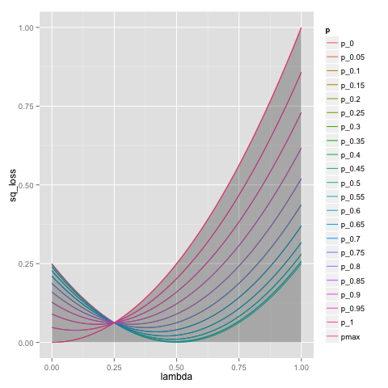
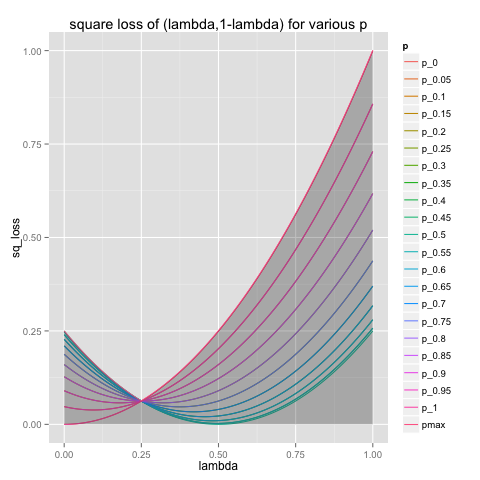
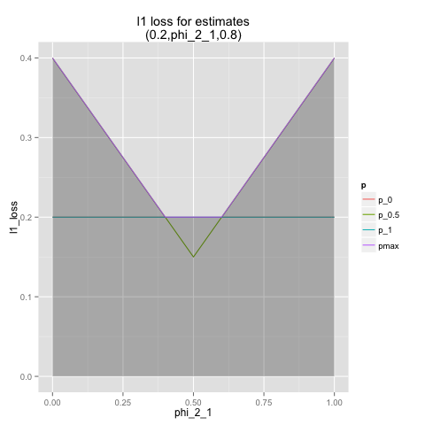
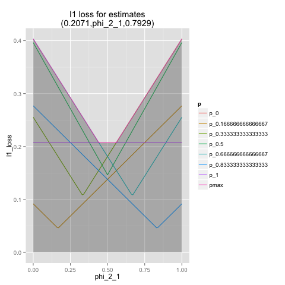
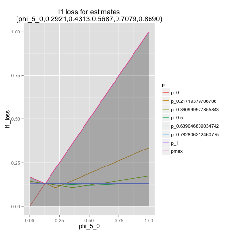
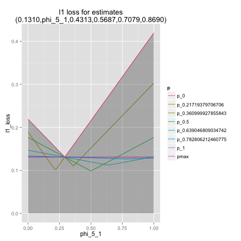
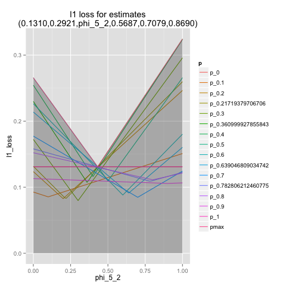
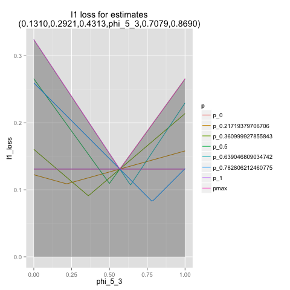
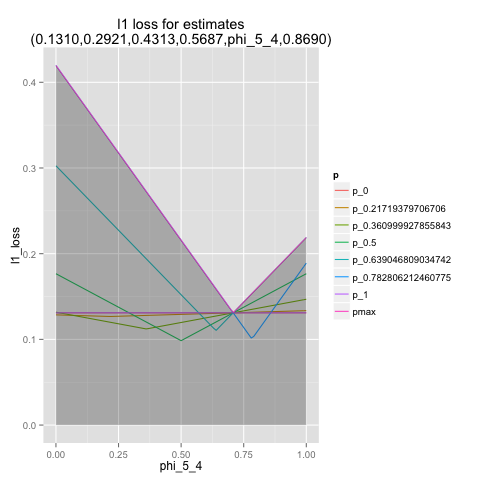
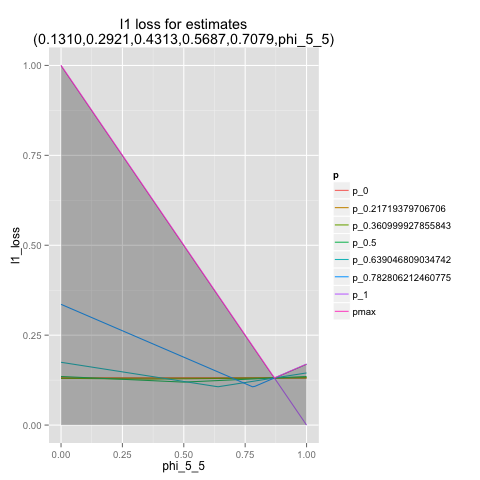

.. code:: python

    %load_ext rpy2.ipython
.. code:: python

    %%R
    library(ggplot2)
    library(reshape2)
.. code:: python

    import sympy
    import numpy
    import pandas
    import scipy
    import scipy.special
    import scipy.optimize
    import cvxopt
.. code:: python

    def ncr(n,h):
        return int(sympy.binomial(k,h))
    
    def numericSoln(si):
        return { k:complex(si[k]).real for k in si.keys() }
    
    def printsolnN(phis,soln):
       ns = numericSoln(soln)
       for phi in phis:
          if phi in soln:
             print '\t',phi,'\t',soln[phi],'\t',ns[phi]
    
    # optimal l2 loss solution
    def l2minimaxSoln(k,numeric=False):
        sqrtk = sympy.sqrt(k)
        if numeric:
            sqrtk = float(sqrtk)
        return [(sqrtk/2 + h)/(sqrtk+k) for h in range(k+1) ]
    
    # approximate l1 loss for using phis as our estimate when prob is one of pseq
    def l1Loss(phis,pseq=[ pi/float(1000) for pi in range(1001) ]):
        k = len(phis)-1
        kchoose = [ float(ncr(k,h)) for h in range(k+1) ]
        def f(p):
            if p<0 or p>1:
                return float('inf')
            return sum([ p**h * (1.0-p)**(k-h) * kchoose[h] * abs(phis[h]-p) for h in range(k+1) ])
        reg = max([ f(p) for p in pseq ])
        return reg
    
    # approximate l2 loss for using phis as our estimate when prob is one of pseq
    def l2Loss(phis,pseq):
        k = len(phis)-1
        kchoose = [ float(ncr(k,h)) for h in range(k+1) ]
        def f(p):
            if p<0 or p>1:
                return float('inf')
            return sum([ p**h * (1.0-p)**(k-h) * kchoose[h] * (phis[h]-p)**2 for h in range(k+1) ])
        reg = max([ f(p) for p in pseq ])
        return reg
    
    def solveL2Problem(k,pseq):
        baseSoln = l2minimaxSoln(k,numeric=True)
        l0 = l2Loss(baseSoln,pseq)
        maxP = max(pseq)
        minP = min(pseq)
        start = [ min(maxP,max(minP,phi)) for phi in baseSoln ]
        def f(x):
            if not all([ phi>=0 and phi<=1 for phi in x]):
                return l0+1.0
            return l2Loss(x,pseq)
        opt = scipy.optimize.minimize(f,start,method='Powell')
        return opt['x']
    
    
    
    # Solve argmin_phi max_i sum_{j=0}^{k} (k choose j) p(i)^j (1-p(i))^{k-j} | p(i) - phi(j) |
    # Pick set of estimates (indexed by evidence) minimizing worse L1 loss expected for any p
    # k: number of flips
    # p: set of probabilities to check against
    def solveL1Problem(k,p):
       nphis = k+1
       p = list(set(p))
       nps = len(p)
       # encode argmin_phi max_i sum_{j=0}^{k} (k choose j) p(i)^j (1-p(i))^{k-j} | p(i) - phi(j) |
       # solve a x <= b 
       # varibles: 
       #  phi (indices: 0 ... nphis-1)
       #  u (indices: nphis ... (1+nps)*nphis-1) 
       #   u(i,j) = var((i+1)*nphis+j) = abs(phi(j)-p(i)) i=0...nps-1, j=0...nphis-1
       #  s (index: (1+nps)*nphis )
       # eqns: 
       #  u(i,j) >= phi(j) - p(i)
       #  u(i,j) >= -(phi(j) - p(i))
       #  s >= sum_{j=0}^{k} (k choose j) p(i)^j (1-p(i))^{k-j} u(i,j)
       nvars = (1+nps)*nphis+1
       sindex = (1+nps)*nphis
       a = []
       b = []
       c = numpy.zeros(nvars)
       c[sindex] = 1.0
       for i in range(nps):
          arow = numpy.zeros(nvars)
          brow = 0.0
          # TODO: put poly coefs in terms of u's here
          arow[sindex] = -1.0
          for j in range(nphis):
             uindex = (i+1)*nphis+j
             arow[uindex] = ncr(k,j) * p[i]**j * (1-p[i])**(k-j)
          a.append(arow)
          b.append(brow)
          for j in range(nphis):
             uindex = (i+1)*nphis+j
             phiindex = j
             # u(i,j) >= phi(j) - p(i) : phi(j) - u(i,j) <= p(i)
             arow = numpy.zeros(nvars)
             arow[phiindex] = 1.0
             arow[uindex] = -1.0 
             brow = p[i]
             a.append(arow)
             b.append(brow)
             # u(i,j) >= -(phi(j) - p(i)) : -phi(j) - u(i,j) <= -p(i)
             arow = numpy.zeros(nvars)
             arow[phiindex] = -1.0
             arow[uindex] = -1.0 
             brow = -p[i]
             a.append(arow)
             b.append(brow)
       cmat = cvxopt.matrix(c)
       gmat = cvxopt.matrix(numpy.matrix(a))
       hmat = cvxopt.matrix(b)
       cvxopt.solvers.options['show_progress'] = False
       sol = cvxopt.solvers.lp(cmat,gmat,hmat) # solve gmax * x <= hmat minimizing cmat
       return [ sol['x'][i] for i in range(nphis) ]
    
    # l1 cost on known ps
    def l1Cost(phis,ps):
        k = len(phis)-1
        choose = [ ncr(k,j) for j in range(len(phis)) ]
        def f(p):
            return sum([ choose[j] *  p**j * (1.0-p)**(k-j) * abs(phis[j]-p) for j in range(len(phis)) ])
        return max([ f(p) for p in ps ])
            
    # solve argmax_p sum_{j=0}^{k} (k choose j) p^j (1-p)^{k-j} | p - phi(j) | for 0<=p<=1
    # allowed to return more than one violation
    def worstL1ps(phis):
        k = len(phis)-1
        choose = [ ncr(k,j) for j in range(len(phis)) ]
        def f(p):
            return -sum([ choose[j] * p**j * (1-p)**(k-j) * abs(phis[j]-p) for j in range(len(phis)) ])
        cuts = set([0.0,1.0])
        for phi in phis:
            if phi>0.0 and phi<1.0:
                cuts.add(phi)
        cuts = sorted(cuts)
        optX = set()
        optF = None
        for i in range(len(cuts)-1):
           opti = scipy.optimize.minimize_scalar(f,bounds=(cuts[i],cuts[i+1]),method='Bounded')
           xi = opti['x']
           fi = -f(xi)
           optX.add(xi)
           if (optF is None) or (fi>optF):
                optF = fi
        return optX,optF
    
    # return which ps are approximately diverse active constrains on the current phis
    def activeL1Constraints(phis,ps):
        ps = list(ps)
        k = len(phis)-1
        choose = [ ncr(k,j) for j in range(len(phis)) ]
        def f(p):
            return sum([ choose[j] *  p**j * (1.0-p)**(k-j) * abs(phis[j]-p) for j in range(len(phis)) ])
        losses = [ f(p) for p in ps ]
        maxloss = max(losses)
        indices = sorted(range(len(losses)),key=lambda i: -losses[i])
        active = set()
        for idx in indices:
            pi = ps[idx]
            lossi = losses[idx]
            if lossi<maxloss-1.0e-6:
                break
            if len(active)<=0 or min([ abs(pi-aj) for aj in active])>1.0e-3:
                active.add(pi)
        return sorted(active)
    
    
    # solve L1 problem over 0<=p<=1 using crude approximate column generation method
    def solveL1ProblemByCuts(k):
       ps = set([ i/100.0 for i in range(101) ])
       done = False
       while not done:
          phis = solveL1Problem(k,ps)
          cost1 = l1Cost(phis,ps)
          ps = ps.union(set(phis))
          newPs,cost2 = worstL1ps(phis)
          ps = ps.union(newPs)
          cost2 = l1Cost(phis,ps)
          if not cost1+1.0e-12<cost2:
             done = True
          #print 'l1',k,'add',newPs,'cost1',cost1,'cost2',cost2
       return phis,activeL1Constraints(phis,ps)
    
                
    # Build the Bayes estimate of expected values from uniform priors
    # on the unknown probability pWin in the set phis
    # seen in kFlips trials
    def bayesMeansEstimates(phis,priors,kFlips):
      nphis = len(phis)
      if priors is None:
         priors = numpy.ones(nphis)
      else:
         priors = numpy.array(priors)
      priors = priors/sum(priors)
      e = numpy.zeros(kFlips+1)
      for winsSeen in range(kFlips+1):
        posteriorProbs = numpy.zeros(nphis)
        for i in range(nphis):
          pWin = phis[i]
          posteriorProbs[i] = priors[i]*ncr(kFlips,winsSeen) * \
             pWin**winsSeen * (1-pWin)**(kFlips-winsSeen)
        posteriorProbs = posteriorProbs/sum(posteriorProbs)
        e[winsSeen] = sum(posteriorProbs*phis)
      return numpy.array(e)
.. code:: python

    def reportSoln(x,pTrue):
        return '[' + ' '.join([str(xi) for xi in x]) + '] l2Loss ' + str(l2Loss(x,pTrue)) + ', l1Loss ' + str(l1Cost(x,pTrue))
    
    df = pandas.DataFrame(columns=['n','h','estName','phi'])
    df[['n','h']] = df[['n','h']].astype(int)
    df[['estName']] = df[['estName']].astype(str)
    df[['phi']] = df[['phi']].astype(float)
    
    def addToFrame(n,estName,phis):
        for h in range(len(phis)):
            df.loc[df.shape[0]+1] = [n,h,estName,phis[h]]
    
    for k in range(1,11):
        print
        print 'solutions for k-rolls:',k
        obliviousSoln = [0.5 for h in range(k+1)]
        efSoln = [ h/float(k) for h in range(k+1)]
        addToFrame(k,'Frequentist',efSoln)
        print '\tempirical frequentist solution:',efSoln
        bjSoln = [ (h+0.5)/(k+1.0) for h in range(k+1)]
        addToFrame(k,'Bayes (Jeffreys)',bjSoln)
        print '\tJeffries prior Bayes solution:',bjSoln
        l1soln,activePs = solveL1ProblemByCuts(k)
        addToFrame(k,'l1 minimax',l1soln)
        print '\tl1 solution for general coin game:',l1soln
        print '\t\t l1 diffs:',[l1soln[i+1]-l1soln[i] for i in range(len(l1soln)-1)]
        print '\tl1 solution active ps:',activePs
        l2soln = l2minimaxSoln(k,numeric=True)
        addToFrame(k,'l2 minimax',l2soln)
        print '\tnumeric l2 for general coin game:',l2soln
        for pTrue in [(0.0,0.5,1.0),(1/6.0,2/6.0,3/6.0,4/6.0,5/6.0)]:
            print '\tsolutions for for k-roll games restricted to probs',pTrue
            print '\t\tempirical frequentist solution:',reportSoln(efSoln,pTrue)
            print '\t\tobvlivious solution',reportSoln(obliviousSoln,pTrue)
            print '\t\tuniform prior restricted Bayes soln:',reportSoln(bayesMeansEstimates(pTrue,None,k),pTrue)
            print '\t\tl1 solution for restrited dice game:',reportSoln(solveL1Problem(k,pTrue),pTrue)
            l2solnP = solveL2Problem(k,pTrue)
            print '\t\tl2 solution for restrited dice game:',reportSoln(l2solnP,pTrue)
            print '\t\t\tl2 restricted loss of last soln:',l2Loss(l2solnP,pTrue),'(and for general l2 solution)',l2Loss(l2soln,pTrue)
        print

.. parsed-literal::

    
    solutions for k-rolls: 1
    	empirical frequentist solution: [0.0, 1.0]
    	Jeffries prior Bayes solution: [0.25, 0.75]
    	l1 solution for general coin game: [0.24999999993052427, 0.7500000000694756]
    		 l1 diffs: [0.5000000001389514]
    	l1 solution active ps: [0.0, 0.5, 1.0]
    	numeric l2 for general coin game: [0.25, 0.75]
    	solutions for for k-roll games restricted to probs (0.0, 0.5, 1.0)
    		empirical frequentist solution: [0.0 1.0] l2Loss 0.25, l1Loss 0.5
    		obvlivious solution [0.5 0.5] l2Loss 0.25, l1Loss 0.5
    		uniform prior restricted Bayes soln: [0.166666666667 0.833333333333] l2Loss 0.111111111111, l1Loss 0.333333333333
    		l1 solution for restrited dice game: [0.249999999455 0.750000000545] l2Loss 0.0625000002725, l1Loss 0.250000000545
    		l2 solution for restrited dice game: [0.25 0.75] l2Loss 0.0625, l1Loss 0.25
    			l2 restricted loss of last soln: 0.0625 (and for general l2 solution) 0.0625
    	solutions for for k-roll games restricted to probs (0.16666666666666666, 0.3333333333333333, 0.5, 0.6666666666666666, 0.8333333333333334)
    		empirical frequentist solution: [0.0 1.0] l2Loss 0.25, l1Loss 0.5
    		obvlivious solution [0.5 0.5] l2Loss 0.111111111111, l1Loss 0.333333333333
    		uniform prior restricted Bayes soln: [0.388888888889 0.611111111111] l2Loss 0.0740740740741, l1Loss 0.259259259259
    		l1 solution for restrited dice game: [0.300000000256 0.699999999744] l2Loss 0.0622222222336, l1Loss 0.20000000017
    		l2 solution for restrited dice game: [0.25 0.75] l2Loss 0.0625, l1Loss 0.25
    			l2 restricted loss of last soln: 0.0625 (and for general l2 solution) 0.0625
    
    
    solutions for k-rolls: 2
    	empirical frequentist solution: [0.0, 0.5, 1.0]
    	Jeffries prior Bayes solution: [0.16666666666666666, 0.5, 0.8333333333333334]
    	l1 solution for general coin game: [0.19160258565074154, 0.49999999999753564, 0.8083974143410706]
    		 l1 diffs: [0.30839741434679413, 0.30839741434353496]
    	l1 solution active ps: [0.0, 0.36110277023033782, 0.63889722976534502, 1.0]
    	numeric l2 for general coin game: [0.20710678118654754, 0.5, 0.7928932188134525]
    	solutions for for k-roll games restricted to probs (0.0, 0.5, 1.0)
    		empirical frequentist solution: [0.0 0.5 1.0] l2Loss 0.125, l1Loss 0.25
    		obvlivious solution [0.5 0.5 0.5] l2Loss 0.25, l1Loss 0.5
    		uniform prior restricted Bayes soln: [0.1 0.5 0.9] l2Loss 0.08, l1Loss 0.2
    		l1 solution for restrited dice game: [0.166666656849 0.5 0.833333343151] l2Loss 0.0555555588283, l1Loss 0.166666671576
    		l2 solution for restrited dice game: [0.207106781187 0.499999999968 0.792893218813] l2Loss 0.0428932188135, l1Loss 0.207106781187
    			l2 restricted loss of last soln: 0.0428932188135 (and for general l2 solution) 0.0428932188135
    	solutions for for k-roll games restricted to probs (0.16666666666666666, 0.3333333333333333, 0.5, 0.6666666666666666, 0.8333333333333334)
    		empirical frequentist solution: [0.0 0.5 1.0] l2Loss 0.125, l1Loss 0.296296296296
    		obvlivious solution [0.5 0.5 0.5] l2Loss 0.111111111111, l1Loss 0.333333333333
    		uniform prior restricted Bayes soln: [0.318181818182 0.5 0.681818181818] l2Loss 0.0541781450872, l1Loss 0.212121212121
    		l1 solution for restrited dice game: [0.242424243029 0.5 0.757575756971] l2Loss 0.0445490256534, l1Loss 0.161616162019
    		l2 solution for restrited dice game: [0.207106781187 0.5 0.792893218813] l2Loss 0.0428932188135, l1Loss 0.181236973415
    			l2 restricted loss of last soln: 0.0428932188135 (and for general l2 solution) 0.0428932188135
    
    
    solutions for k-rolls: 3
    	empirical frequentist solution: [0.0, 0.3333333333333333, 0.6666666666666666, 1.0]
    	Jeffries prior Bayes solution: [0.125, 0.375, 0.625, 0.875]
    	l1 solution for general coin game: [0.16204790198196198, 0.3965868368489873, 0.6034131631510129, 0.8379520980180379]
    		 l1 diffs: [0.23453893486702534, 0.20682632630202558, 0.23453893486702504]
    	l1 solution active ps: [0.0, 0.2896415337253388, 0.5, 0.71035846627466459, 1.0]
    	numeric l2 for general coin game: [0.18301270189221933, 0.3943375672974065, 0.6056624327025936, 0.8169872981077807]
    	solutions for for k-roll games restricted to probs (0.0, 0.5, 1.0)
    		empirical frequentist solution: [0.0 0.333333333333 0.666666666667 1.0] l2Loss 0.0833333333333, l1Loss 0.25
    		obvlivious solution [0.5 0.5 0.5 0.5] l2Loss 0.25, l1Loss 0.5
    		uniform prior restricted Bayes soln: [0.0555555555556 0.5 0.5 0.944444444444] l2Loss 0.0493827160494, l1Loss 0.111111111111
    		l1 solution for restrited dice game: [0.0999999996952 0.5 0.5 0.900000000305] l2Loss 0.040000000061, l1Loss 0.100000000076
    		l2 solution for restrited dice game: [0.183012701892 0.394337567308 0.501819605275 0.816987298125] l2Loss 0.0334936490539, l1Loss 0.183012701892
    			l2 restricted loss of last soln: 0.0334936490539 (and for general l2 solution) 0.0334936490539
    	solutions for for k-roll games restricted to probs (0.16666666666666666, 0.3333333333333333, 0.5, 0.6666666666666666, 0.8333333333333334)
    		empirical frequentist solution: [0.0 0.333333333333 0.666666666667 1.0] l2Loss 0.0833333333333, l1Loss 0.25
    		obvlivious solution [0.5 0.5 0.5 0.5] l2Loss 0.111111111111, l1Loss 0.333333333333
    		uniform prior restricted Bayes soln: [0.274814814815 0.411111111111 0.588888888889 0.725185185185] l2Loss 0.0413402834934, l1Loss 0.179368998628
    		l1 solution for restrited dice game: [0.213263724569 0.405581333739 0.594418666261 0.786736275431] l2Loss 0.0355624537193, l1Loss 0.142498068554
    		l2 solution for restrited dice game: [0.183012701892 0.394337567297 0.605662432703 0.816987298108] l2Loss 0.0334936490539, l1Loss 0.158493649054
    			l2 restricted loss of last soln: 0.0334936490539 (and for general l2 solution) 0.0334936490539
    
    
    solutions for k-rolls: 4
    	empirical frequentist solution: [0.0, 0.25, 0.5, 0.75, 1.0]
    	Jeffries prior Bayes solution: [0.1, 0.3, 0.5, 0.7, 0.9]
    	l1 solution for general coin game: [0.143748050547601, 0.33414660810149377, 0.4999999999999999, 0.6658533918985061, 0.8562519494523989]
    		 l1 diffs: [0.19039855755389276, 0.16585339189850612, 0.16585339189850623, 0.1903985575538928]
    	l1 solution active ps: [0.0, 0.24648663092734108, 0.41668579736196293, 0.58331420263900069, 0.75351336907266298, 1.0]
    	numeric l2 for general coin game: [0.16666666666666666, 0.3333333333333333, 0.5, 0.6666666666666666, 0.8333333333333334]
    	solutions for for k-roll games restricted to probs (0.0, 0.5, 1.0)
    		empirical frequentist solution: [0.0 0.25 0.5 0.75 1.0] l2Loss 0.0625, l1Loss 0.1875
    		obvlivious solution [0.5 0.5 0.5 0.5 0.5] l2Loss 0.25, l1Loss 0.5
    		uniform prior restricted Bayes soln: [0.0294117647059 0.5 0.5 0.5 0.970588235294] l2Loss 0.0276816608997, l1Loss 0.0588235294118
    		l1 solution for restrited dice game: [0.0555555293498 0.5 0.5 0.5 0.94444447065] l2Loss 0.0246913609364, l1Loss 0.0555555588313
    		l2 solution for restrited dice game: [0.166666666667 0.517362587307 0.50000000002 0.373991470843 0.833333333354] l2Loss 0.0277777777778, l1Loss 0.166666666667
    			l2 restricted loss of last soln: 0.0277777777778 (and for general l2 solution) 0.0277777777778
    	solutions for for k-roll games restricted to probs (0.16666666666666666, 0.3333333333333333, 0.5, 0.6666666666666666, 0.8333333333333334)
    		empirical frequentist solution: [0.0 0.25 0.5 0.75 1.0] l2Loss 0.0625, l1Loss 0.197530864198
    		obvlivious solution [0.5 0.5 0.5 0.5 0.5] l2Loss 0.111111111111, l1Loss 0.333333333333
    		uniform prior restricted Bayes soln: [0.246680286006 0.349056603774 0.5 0.650943396226 0.753319713994] l2Loss 0.032666446072, l1Loss 0.155459620586
    		l1 solution for restrited dice game: [0.18090056258 0.339372469422 0.5 0.660627530578 0.81909943742] l2Loss 0.0285590713054, l1Loss 0.120201194966
    		l2 solution for restrited dice game: [0.166666668316 0.333333333317 0.5 0.66666666668 0.833333331591] l2Loss 0.0277777777746, l1Loss 0.124999999796
    			l2 restricted loss of last soln: 0.0277777777746 (and for general l2 solution) 0.0277777777778
    
    
    solutions for k-rolls: 5
    	empirical frequentist solution: [0.0, 0.2, 0.4, 0.6, 0.8, 1.0]
    	Jeffries prior Bayes solution: [0.08333333333333333, 0.25, 0.4166666666666667, 0.5833333333333334, 0.75, 0.9166666666666666]
    	l1 solution for general coin game: [0.1309849027860669, 0.29208335490199555, 0.43128398938100926, 0.5687160106157013, 0.7079166450943544, 0.8690150972055133]
    		 l1 diffs: [0.16109845211592866, 0.1392006344790137, 0.13743202123469206, 0.13920063447865305, 0.16109845211115892]
    	l1 solution active ps: [0.0, 0.21719379045004072, 0.36100048826538267, 0.49999999999999983, 0.63899951585869186, 0.78280620954631819, 1.0]
    	numeric l2 for general coin game: [0.15450849718747373, 0.29270509831248426, 0.43090169943749473, 0.5690983005625052, 0.7072949016875157, 0.8454915028125263]
    	solutions for for k-roll games restricted to probs (0.0, 0.5, 1.0)
    		empirical frequentist solution: [0.0 0.2 0.4 0.6 0.8 1.0] l2Loss 0.05, l1Loss 0.1875
    		obvlivious solution [0.5 0.5 0.5 0.5 0.5 0.5] l2Loss 0.25, l1Loss 0.5
    		uniform prior restricted Bayes soln: [0.0151515151515 0.5 0.5 0.5 0.5 0.984848484848] l2Loss 0.0146923783287, l1Loss 0.030303030303
    		l1 solution for restrited dice game: [0.0294116806678 0.5 0.5 0.5 0.5 0.970588319332] l2Loss 0.0138408353932, l1Loss 0.0294117699583
    		l2 solution for restrited dice game: [0.154508497187 0.66809328892 0.430901699448 0.539193879658 0.408510698599 0.845491502831] l2Loss 0.0238728757031, l1Loss 0.154508497187
    			l2 restricted loss of last soln: 0.0238728757031 (and for general l2 solution) 0.0238728757031
    	solutions for for k-roll games restricted to probs (0.16666666666666666, 0.3333333333333333, 0.5, 0.6666666666666666, 0.8333333333333334)
    		empirical frequentist solution: [0.0 0.2 0.4 0.6 0.8 1.0] l2Loss 0.05, l1Loss 0.1875
    		obvlivious solution [0.5 0.5 0.5 0.5 0.5 0.5] l2Loss 0.111111111111, l1Loss 0.333333333333
    		uniform prior restricted Bayes soln: [0.227306967985 0.305843110191 0.429643929644 0.570356070356 0.694156889809 0.772693032015] l2Loss 0.0265604298945, l1Loss 0.137328258645
    		l1 solution for restrited dice game: [0.166666667912 0.313638256875 0.438893140753 0.561106859247 0.686361743125 0.833333332088] l2Loss 0.0265211391016, l1Loss 0.117263169705
    		l2 solution for restrited dice game: [0.166666666692 0.292705098312 0.430901699437 0.569098300563 0.707294901688 0.833333331847] l2Loss 0.0238113659803, l1Loss 0.128799427915
    			l2 restricted loss of last soln: 0.0238113659803 (and for general l2 solution) 0.0238728757031
    
    
    solutions for k-rolls: 6
    	empirical frequentist solution: [0.0, 0.16666666666666666, 0.3333333333333333, 0.5, 0.6666666666666666, 0.8333333333333334, 1.0]
    	Jeffries prior Bayes solution: [0.07142857142857142, 0.21428571428571427, 0.35714285714285715, 0.5, 0.6428571428571429, 0.7857142857142857, 0.9285714285714286]
    	l1 solution for general coin game: [0.12142009334016471, 0.2614791572136831, 0.38196891864945554, 0.5000000000008149, 0.6180310813522798, 0.738520842788359, 0.8785799066649318]
    		 l1 diffs: [0.14005906387351838, 0.12048976143577245, 0.11803108135135937, 0.1180310813514649, 0.12048976143607926, 0.14005906387657274]
    	l1 solution active ps: [0.0, 0.19573748515281328, 0.32082603310330932, 0.44068737189425083, 0.55931262811345639, 0.67917396673961195, 0.80426251484924949, 1.0]
    	numeric l2 for general coin game: [0.1449489742783178, 0.2632993161855452, 0.38164965809277257, 0.5, 0.6183503419072274, 0.7367006838144547, 0.8550510257216821]
    	solutions for for k-roll games restricted to probs (0.0, 0.5, 1.0)
    		empirical frequentist solution: [0.0 0.166666666667 0.333333333333 0.5 0.666666666667 0.833333333333 1.0] l2Loss 0.0416666666667, l1Loss 0.15625
    		obvlivious solution [0.5 0.5 0.5 0.5 0.5 0.5 0.5] l2Loss 0.25, l1Loss 0.5
    		uniform prior restricted Bayes soln: [0.00769230769231 0.5 0.5 0.5 0.5 0.5 0.992307692308] l2Loss 0.00757396449704, l1Loss 0.0153846153846
    		l1 solution for restrited dice game: [0.0151514648353 0.5 0.5 0.5 0.5 0.5 0.984848535165] l2Loss 0.00734619068911, l1Loss 0.0151515167239
    		l2 solution for restrited dice game: [0.144948974278 0.263299316203 0.381649658105 0.500000000044 0.502038102832 0.434548705357 0.928773590863] l2Loss 0.0210102051443, l1Loss 0.144948974278
    			l2 restricted loss of last soln: 0.0210102051443 (and for general l2 solution) 0.0210102051443
    	solutions for for k-roll games restricted to probs (0.16666666666666666, 0.3333333333333333, 0.5, 0.6666666666666666, 0.8333333333333334)
    		empirical frequentist solution: [0.0 0.166666666667 0.333333333333 0.5 0.666666666667 0.833333333333 1.0] l2Loss 0.0416666666667, l1Loss 0.15625
    		obvlivious solution [0.5 0.5 0.5 0.5 0.5 0.5 0.5] l2Loss 0.111111111111, l1Loss 0.333333333333
    		uniform prior restricted Bayes soln: [0.213380453327 0.274647887324 0.376645355397 0.5 0.623354644603 0.725352112676 0.786619546673] l2Loss 0.0221153021832, l1Loss 0.123136849538
    		l1 solution for restrited dice game: [0.166666667309 0.281076524223 0.375458049807 0.5 0.624541950193 0.718923475777 0.833333332691] l2Loss 0.0218645634403, l1Loss 0.109843857508
    		l2 solution for restrited dice game: [0.16666666669 0.263299316186 0.381649658093 0.5 0.618350341907 0.736700683814 0.833333331731] l2Loss 0.0208516170233, l1Loss 0.116347340583
    			l2 restricted loss of last soln: 0.0208516170233 (and for general l2 solution) 0.0210102051443
    
    
    solutions for k-rolls: 7
    	empirical frequentist solution: [0.0, 0.14285714285714285, 0.2857142857142857, 0.42857142857142855, 0.5714285714285714, 0.7142857142857143, 0.8571428571428571, 1.0]
    	Jeffries prior Bayes solution: [0.0625, 0.1875, 0.3125, 0.4375, 0.5625, 0.6875, 0.8125, 0.9375]
    	l1 solution for general coin game: [0.11389667932573132, 0.23800677044517282, 0.34455956082544853, 0.4484262194707839, 0.5515737805311096, 0.6554404391766782, 0.7619932295574335, 0.8861033206812472]
    		 l1 diffs: [0.1241100911194415, 0.10655279038027571, 0.1038666586453354, 0.10314756106032569, 0.10386665864556854, 0.10655279038075538, 0.12411009112381366]
    	l1 solution active ps: [0.0, 0.17920657990019551, 0.29022140494226539, 0.395986216835298, 0.5, 0.60401378316609622, 0.70977859505803476, 0.82079342010258294, 1.0]
    	numeric l2 for general coin game: [0.1371459425887159, 0.24081853042051138, 0.3444911182523068, 0.4481637060841023, 0.5518362939158977, 0.6555088817476932, 0.7591814695794886, 0.8628540574112842]
    	solutions for for k-roll games restricted to probs (0.0, 0.5, 1.0)
    		empirical frequentist solution: [0.0 0.142857142857 0.285714285714 0.428571428571 0.571428571429 0.714285714286 0.857142857143 1.0] l2Loss 0.0357142857143, l1Loss 0.15625
    		obvlivious solution [0.5 0.5 0.5 0.5 0.5 0.5 0.5 0.5] l2Loss 0.25, l1Loss 0.5
    		uniform prior restricted Bayes soln: [0.00387596899225 0.5 0.5 0.5 0.5 0.5 0.5 0.996124031008] l2Loss 0.00384592272099, l1Loss 0.0077519379845
    		l1 solution for restrited dice game: [0.00769228312404 0.5 0.5 0.5 0.5 0.5 0.5 0.992307716876] l2Loss 0.00378698262649, l1Loss 0.00769230807619
    		l2 solution for restrited dice game: [0.137145942589 0.616206721028 0.344491118265 0.4481637061 0.549190214366 0.360208088664 0.151790613978 0.862854057423] l2Loss 0.0188090095685, l1Loss 0.137145942589
    			l2 restricted loss of last soln: 0.0188090095685 (and for general l2 solution) 0.0188090095685
    	solutions for for k-roll games restricted to probs (0.16666666666666666, 0.3333333333333333, 0.5, 0.6666666666666666, 0.8333333333333334)
    		empirical frequentist solution: [0.0 0.142857142857 0.285714285714 0.428571428571 0.571428571429 0.714285714286 0.857142857143 1.0] l2Loss 0.0357142857143, l1Loss 0.15625
    		obvlivious solution [0.5 0.5 0.5 0.5 0.5 0.5 0.5 0.5] l2Loss 0.111111111111, l1Loss 0.333333333333
    		uniform prior restricted Bayes soln: [0.203065668302 0.251405546037 0.33603150662 0.443861984801 0.556138015199 0.66396849338 0.748594453963 0.796934331698] l2Loss 0.0187823171961, l1Loss 0.116332256288
    		l1 solution for restrited dice game: [0.16666667288 0.25129079795 0.333333333325 0.471599601341 0.528400398659 0.666666666675 0.74870920205 0.83333332712] l2Loss 0.0191337687145, l1Loss 0.102629876053
    		l2 solution for restrited dice game: [0.1666666667 0.240818530421 0.344491118252 0.448163706084 0.551836293916 0.655508881748 0.759181469579 0.833333326791] l2Loss 0.0185656536862, l1Loss 0.112930631576
    			l2 restricted loss of last soln: 0.0185656536862 (and for general l2 solution) 0.0188090095685
    
    
    solutions for k-rolls: 8
    	empirical frequentist solution: [0.0, 0.125, 0.25, 0.375, 0.5, 0.625, 0.75, 0.875, 1.0]
    	Jeffries prior Bayes solution: [0.05555555555555555, 0.16666666666666666, 0.2777777777777778, 0.3888888888888889, 0.5, 0.6111111111111112, 0.7222222222222222, 0.8333333333333334, 0.9444444444444444]
    	l1 solution for general coin game: [0.1077681543681833, 0.2193178507713117, 0.31502312214542627, 0.4080248404537603, 0.5000000000013364, 0.5919751595490542, 0.6849768778578612, 0.7806821492328738, 0.89223184564372]
    		 l1 diffs: [0.1115496964031284, 0.09570527137411458, 0.09300171830833404, 0.09197515954757607, 0.09197515954771784, 0.09300171830880699, 0.09570527137501261, 0.11154969641084622]
    	l1 solution active ps: [0.0, 0.1659985138817946, 0.26598812691099299, 0.36086354032834039, 0.4538026316764418, 0.54619736835169352, 0.6391364596743061, 0.73401187293804149, 0.83400148611889546, 1.0]
    	numeric l2 for general coin game: [0.13060193748187074, 0.22295145311140305, 0.3153009687409354, 0.4076504843704677, 0.5, 0.5923495156295323, 0.6846990312590646, 0.777048546888597, 0.8693980625181293]
    	solutions for for k-roll games restricted to probs (0.0, 0.5, 1.0)
    		empirical frequentist solution: [0.0 0.125 0.25 0.375 0.5 0.625 0.75 0.875 1.0] l2Loss 0.03125, l1Loss 0.13671875
    		obvlivious solution [0.5 0.5 0.5 0.5 0.5 0.5 0.5 0.5 0.5] l2Loss 0.25, l1Loss 0.5
    		uniform prior restricted Bayes soln: [0.00194552529183 0.5 0.5 0.5 0.5 0.5 0.5 0.5 0.998054474708] l2Loss 0.00193795515451, l1Loss 0.00389105058366
    		l1 solution for restrited dice game: [0.00387585717804 0.5 0.5 0.5 0.5 0.5 0.5 0.5 0.996124142822] l2Loss 0.00192296222727, l1Loss 0.0038759698658
    		l2 solution for restrited dice game: [0.130601937482 0.598339643719 0.690689159348 0.407650484382 0.500000000012 0.545606675664 0.385083332668 0.169657691287 0.869398062534] l2Loss 0.017056866074, l1Loss 0.130601937482
    			l2 restricted loss of last soln: 0.017056866074 (and for general l2 solution) 0.017056866074
    	solutions for for k-roll games restricted to probs (0.16666666666666666, 0.3333333333333333, 0.5, 0.6666666666666666, 0.8333333333333334)
    		empirical frequentist solution: [0.0 0.125 0.25 0.375 0.5 0.625 0.75 0.875 1.0] l2Loss 0.03125, l1Loss 0.13671875
    		obvlivious solution [0.5 0.5 0.5 0.5 0.5 0.5 0.5 0.5 0.5] l2Loss 0.111111111111, l1Loss 0.333333333333
    		uniform prior restricted Bayes soln: [0.195260476177 0.233697264582 0.304134379969 0.399057403621 0.5 0.600942596379 0.695865620031 0.766302735418 0.804739523823] l2Loss 0.018007685456, l1Loss 0.106032688791
    		l1 solution for restrited dice game: [0.166666668834 0.2167982497 0.333333333723 0.406367020149 0.5 0.593632979851 0.666666666277 0.7832017503 0.833333331166] l2Loss 0.0179244659521, l1Loss 0.0977270379767
    		l2 solution for restrited dice game: [0.183016542717 0.222965203022 0.315301022824 0.407650485111 0.50000000003 0.591187370225 0.684697182275 0.777048502339 0.833328347103] l2Loss 0.0168129749521, l1Loss 0.102561761124
    			l2 restricted loss of last soln: 0.0168129749521 (and for general l2 solution) 0.017056866074
    
    
    solutions for k-rolls: 9
    	empirical frequentist solution: [0.0, 0.1111111111111111, 0.2222222222222222, 0.3333333333333333, 0.4444444444444444, 0.5555555555555556, 0.6666666666666666, 0.7777777777777778, 0.8888888888888888, 1.0]
    	Jeffries prior Bayes solution: [0.05, 0.15, 0.25, 0.35, 0.45, 0.55, 0.65, 0.75, 0.85, 0.95]
    	l1 solution for general coin game: [0.10264212508821931, 0.2040136749054906, 0.29100220936496646, 0.3753548633670125, 0.4585631959797285, 0.5414368040116312, 0.6246451366235155, 0.7089977906236119, 0.7959863250795016, 0.8973578748666846]
    		 l1 diffs: [0.1013715498172713, 0.08698853445947585, 0.08435265400204606, 0.08320833261271599, 0.08287360803190269, 0.08320833261188432, 0.0843526540000964, 0.08698853445588972, 0.10137154978718299]
    	l1 solution active ps: [0.0, 0.15514957215019079, 0.24623878124738935, 0.3324055847703502, 0.41659630413452203, 0.5, 0.58340369586499563, 0.66759441523010976, 0.75376121875278634, 0.84485042784978504, 1.0]
    	numeric l2 for general coin game: [0.125, 0.20833333333333334, 0.2916666666666667, 0.375, 0.4583333333333333, 0.5416666666666666, 0.625, 0.7083333333333334, 0.7916666666666666, 0.875]
    	solutions for for k-roll games restricted to probs (0.0, 0.5, 1.0)
    		empirical frequentist solution: [0.0 0.111111111111 0.222222222222 0.333333333333 0.444444444444 0.555555555556 0.666666666667 0.777777777778 0.888888888889 1.0] l2Loss 0.0277777777778, l1Loss 0.13671875
    		obvlivious solution [0.5 0.5 0.5 0.5 0.5 0.5 0.5 0.5 0.5 0.5] l2Loss 0.25, l1Loss 0.5
    		uniform prior restricted Bayes soln: [0.000974658869396 0.5 0.5 0.5 0.5 0.5 0.5 0.5 0.5 0.999025341131] l2Loss 0.000972758949572, l1Loss 0.00194931773879
    		l1 solution for restrited dice game: [0.00194482948192 0.5 0.5 0.5 0.5 0.5 0.5 0.5 0.5 0.998055170518] l2Loss 0.000968980284687, l1Loss 0.00194552800984
    		l2 solution for restrited dice game: [0.125 0.583721523941 0.667054857274 0.375000000012 0.458333333346 0.541666666678 0.331666826727 0.407168032872 0.184275811065 0.997847383866] l2Loss 0.015625, l1Loss 0.125
    			l2 restricted loss of last soln: 0.015625 (and for general l2 solution) 0.015625
    	solutions for for k-roll games restricted to probs (0.16666666666666666, 0.3333333333333333, 0.5, 0.6666666666666666, 0.8333333333333334)
    		empirical frequentist solution: [0.0 0.111111111111 0.222222222222 0.333333333333 0.444444444444 0.555555555556 0.666666666667 0.777777777778 0.888888888889 1.0] l2Loss 0.0277777777778, l1Loss 0.13671875
    		obvlivious solution [0.5 0.5 0.5 0.5 0.5 0.5 0.5 0.5 0.5 0.5] l2Loss 0.111111111111, l1Loss 0.333333333333
    		uniform prior restricted Bayes soln: [0.18926077274 0.219987438753 0.278652335209 0.362437814386 0.454203031376 0.545796968624 0.637562185614 0.721347664791 0.780012561247 0.81073922726] l2Loss 0.0172650938973, l1Loss 0.109863319723
    		l1 solution for restrited dice game: [0.166666669019 0.178394850692 0.333333332716 0.33819848159 0.49999999929 0.50000000071 0.66180151841 0.666666667284 0.821605149308 0.833333330981] l2Loss 0.0171215115142, l1Loss 0.0891371380188
    		l2 solution for restrited dice game: [0.196996582979 0.208464792077 0.291666997532 0.374999999481 0.458333333322 0.537269985894 0.624950975144 0.707587563013 0.791646405923 0.833219203426] l2Loss 0.0154449229117, l1Loss 0.10117167516
    			l2 restricted loss of last soln: 0.0154449229117 (and for general l2 solution) 0.015625
    
    
    solutions for k-rolls: 10
    	empirical frequentist solution: [0.0, 0.1, 0.2, 0.3, 0.4, 0.5, 0.6, 0.7, 0.8, 0.9, 1.0]
    	Jeffries prior Bayes solution: [0.045454545454545456, 0.13636363636363635, 0.22727272727272727, 0.3181818181818182, 0.4090909090909091, 0.5, 0.5909090909090909, 0.6818181818181818, 0.7727272727272727, 0.8636363636363636, 0.9545454545454546]
    	l1 solution for general coin game: [0.09826526647532013, 0.1912031220657271, 0.2710157475936154, 0.3482922491114446, 0.42439226870696223, 0.5, 0.5756077312930374, 0.6517077508885554, 0.7289842524063843, 0.8087968779342726, 0.9017347335246796]
    		 l1 diffs: [0.09293785559040696, 0.07981262552788831, 0.07727650151782917, 0.07610001959551765, 0.07560773129303777, 0.07560773129303744, 0.07610001959551793, 0.07727650151782894, 0.07981262552788826, 0.09293785559040701]
    	l1 solution active ps: [0.0, 0.1460430548469249, 0.2297784688304183, 0.30879920080676582, 0.38586689640872041, 0.46204324882957593, 0.5379567512229938, 0.61413310359004236, 0.69120079919316557, 0.77022153116943026, 0.85395694515310194, 1.0]
    	numeric l2 for general coin game: [0.12012653667602108, 0.19610122934081686, 0.27207592200561265, 0.34805061467040843, 0.4240253073352042, 0.5, 0.5759746926647957, 0.6519493853295915, 0.7279240779943873, 0.803898770659183, 0.8798734633239789]
    	solutions for for k-roll games restricted to probs (0.0, 0.5, 1.0)
    		empirical frequentist solution: [0.0 0.1 0.2 0.3 0.4 0.5 0.6 0.7 0.8 0.9 1.0] l2Loss 0.025, l1Loss 0.123046875
    		obvlivious solution [0.5 0.5 0.5 0.5 0.5 0.5 0.5 0.5 0.5 0.5 0.5] l2Loss 0.25, l1Loss 0.5
    		uniform prior restricted Bayes soln: [0.000487804878049 0.5 0.5 0.5 0.5 0.5 0.5 0.5 0.5 0.5 0.999512195122] l2Loss 0.000487328970851, l1Loss 0.000975609756098
    		l1 solution for restrited dice game: [0.000974504389646 0.5 0.5 0.5 0.5 0.5 0.5 0.5 0.5 0.5 0.99902549561] l2Loss 0.000486379775916, l1Loss 0.000974659171114
    		l2 solution for restrited dice game: [0.120126536676 0.571489419948 0.647464112613 0.348050614683 0.424025307347 0.500000000017 0.551651759149 0.354234619838 0.4246453469 0.196507915058 0.940971076946] l2Loss 0.0144303848138, l1Loss 0.120126536676
    			l2 restricted loss of last soln: 0.0144303848138 (and for general l2 solution) 0.0144303848138
    	solutions for for k-roll games restricted to probs (0.16666666666666666, 0.3333333333333333, 0.5, 0.6666666666666666, 0.8333333333333334)
    		empirical frequentist solution: [0.0 0.1 0.2 0.3 0.4 0.5 0.6 0.7 0.8 0.9 1.0] l2Loss 0.025, l1Loss 0.123046875
    		obvlivious solution [0.5 0.5 0.5 0.5 0.5 0.5 0.5 0.5 0.5 0.5 0.5] l2Loss 0.111111111111, l1Loss 0.333333333333
    		uniform prior restricted Bayes soln: [0.184595064958 0.209247335549 0.258068774016 0.331937027007 0.416091566541 0.5 0.583908433459 0.668062972993 0.741931225984 0.790752664451 0.815404935042] l2Loss 0.0164974307555, l1Loss 0.101363602606
    		l1 solution for restrited dice game: [0.166666666528 0.166666667078 0.311378207303 0.333333333202 0.438570869961 0.5 0.561429130039 0.666666666798 0.688621792697 0.833333332922 0.833333333472] l2Loss 0.0162594967291, l1Loss 0.0879975872226
    		l2 solution for restrited dice game: [0.206448101445 0.196302450374 0.272076043217 0.348050614582 0.424025307335 0.499999998882 0.571107824617 0.651597705175 0.726421739604 0.803847976053 0.833127454927] l2Loss 0.0143312921271, l1Loss 0.0952262168474
    			l2 restricted loss of last soln: 0.0143312921271 (and for general l2 solution) 0.0144303848138
    

.. code:: python

    %%R -i df
    df = as.data.frame(df)
    df$group = as.factor(pmin(df$h,df$n-df$h))
    df$up = 2*df$h>=df$n
    df$down = 2*df$h<=df$n
    pieces = list()
    for(e in unique(df$estName)) {
      pieces[[length(pieces)+1]] = 
        geom_text(data=subset(df,estName==e & up),
                  aes(x=n,y=phi,group=group,color=estName,label=paste(h,n,sep='/')))
      pieces[[length(pieces)+1]] = 
        geom_line(data=subset(df,estName==e & up),
                  aes(x=n,y=phi,group=group,color=estName,linetype=estName))
      pieces[[length(pieces)+1]] = 
        geom_text(data=subset(df,estName==e & down),
                  aes(x=n,y=phi,group=group,color=estName,label=paste(h,n,sep='/')))
      pieces[[length(pieces)+1]] = 
        geom_line(data=subset(df,estName==e & down),
                  aes(x=n,y=phi,group=group,color=estName,linetype=estName))
    }
    ns = sort(unique(df$n))
    print(ggplot() + pieces + 
          scale_x_continuous(labels=ns,breaks=ns) +
          scale_y_continuous(labels=seq(0,1,0.1),breaks=seq(0,1,0.1))
         )
    #write.table(df,file='dfFrame.tsv',sep='\t',row.names=FALSE)
    #df <- read.table('dfFrame.tsv',sep='\t',header=TRUE)
    
    # print the decision tables
    options(width = 160)
    for(eName in unique(df$estName)) { 
       print(eName)
       tab <- xtabs(phi~n+h,data=subset(df,estName==eName))
       for(n in 1:dim(tab)[[1]]) {
         if((n+2)<=dim(tab)[[2]]) { # R doesn't have empty : operator
            for(h in (n+2):dim(tab)[[2]]) {
              tab[n,h] = NA
            }
          }
       }
       print(tab)
    }

.. parsed-literal::

    [1] "Frequentist"
        h
    n            0         1         2         3         4         5         6         7         8         9        10
      1  0.0000000 1.0000000                                                                                          
      2  0.0000000 0.5000000 1.0000000                                                                                
      3  0.0000000 0.3333333 0.6666667 1.0000000                                                                      
      4  0.0000000 0.2500000 0.5000000 0.7500000 1.0000000                                                            
      5  0.0000000 0.2000000 0.4000000 0.6000000 0.8000000 1.0000000                                                  
      6  0.0000000 0.1666667 0.3333333 0.5000000 0.6666667 0.8333333 1.0000000                                        
      7  0.0000000 0.1428571 0.2857143 0.4285714 0.5714286 0.7142857 0.8571429 1.0000000                              
      8  0.0000000 0.1250000 0.2500000 0.3750000 0.5000000 0.6250000 0.7500000 0.8750000 1.0000000                    
      9  0.0000000 0.1111111 0.2222222 0.3333333 0.4444444 0.5555556 0.6666667 0.7777778 0.8888889 1.0000000          
      10 0.0000000 0.1000000 0.2000000 0.3000000 0.4000000 0.5000000 0.6000000 0.7000000 0.8000000 0.9000000 1.0000000
    [1] "Bayes (Jeffreys)"
        h
    n             0          1          2          3          4          5          6          7          8          9         10
      1  0.25000000 0.75000000                                                                                                   
      2  0.16666667 0.50000000 0.83333333                                                                                        
      3  0.12500000 0.37500000 0.62500000 0.87500000                                                                             
      4  0.10000000 0.30000000 0.50000000 0.70000000 0.90000000                                                                  
      5  0.08333333 0.25000000 0.41666667 0.58333333 0.75000000 0.91666667                                                       
      6  0.07142857 0.21428571 0.35714286 0.50000000 0.64285714 0.78571429 0.92857143                                            
      7  0.06250000 0.18750000 0.31250000 0.43750000 0.56250000 0.68750000 0.81250000 0.93750000                                 
      8  0.05555556 0.16666667 0.27777778 0.38888889 0.50000000 0.61111111 0.72222222 0.83333333 0.94444444                      
      9  0.05000000 0.15000000 0.25000000 0.35000000 0.45000000 0.55000000 0.65000000 0.75000000 0.85000000 0.95000000           
      10 0.04545455 0.13636364 0.22727273 0.31818182 0.40909091 0.50000000 0.59090909 0.68181818 0.77272727 0.86363636 0.95454545
    [1] "l1 minimax"
        h
    n             0          1          2          3          4          5          6          7          8          9         10
      1  0.25000000 0.75000000                                                                                                   
      2  0.19160259 0.50000000 0.80839741                                                                                        
      3  0.16204790 0.39658684 0.60341316 0.83795210                                                                             
      4  0.14374805 0.33414661 0.50000000 0.66585339 0.85625195                                                                  
      5  0.13098490 0.29208335 0.43128399 0.56871601 0.70791665 0.86901510                                                       
      6  0.12142009 0.26147916 0.38196892 0.50000000 0.61803108 0.73852084 0.87857991                                            
      7  0.11389668 0.23800677 0.34455956 0.44842622 0.55157378 0.65544044 0.76199323 0.88610332                                 
      8  0.10776815 0.21931785 0.31502312 0.40802484 0.50000000 0.59197516 0.68497688 0.78068215 0.89223185                      
      9  0.10264213 0.20401367 0.29100221 0.37535486 0.45856320 0.54143680 0.62464514 0.70899779 0.79598633 0.89735787           
      10 0.09826527 0.19120312 0.27101575 0.34829225 0.42439227 0.50000000 0.57560773 0.65170775 0.72898425 0.80879688 0.90173473
    [1] "l2 minimax"
        h
    n            0         1         2         3         4         5         6         7         8         9        10
      1  0.2500000 0.7500000                                                                                          
      2  0.2071068 0.5000000 0.7928932                                                                                
      3  0.1830127 0.3943376 0.6056624 0.8169873                                                                      
      4  0.1666667 0.3333333 0.5000000 0.6666667 0.8333333                                                            
      5  0.1545085 0.2927051 0.4309017 0.5690983 0.7072949 0.8454915                                                  
      6  0.1449490 0.2632993 0.3816497 0.5000000 0.6183503 0.7367007 0.8550510                                        
      7  0.1371459 0.2408185 0.3444911 0.4481637 0.5518363 0.6555089 0.7591815 0.8628541                              
      8  0.1306019 0.2229515 0.3153010 0.4076505 0.5000000 0.5923495 0.6846990 0.7770485 0.8693981                    
      9  0.1250000 0.2083333 0.2916667 0.3750000 0.4583333 0.5416667 0.6250000 0.7083333 0.7916667 0.8750000          
      10 0.1201265 0.1961012 0.2720759 0.3480506 0.4240253 0.5000000 0.5759747 0.6519494 0.7279241 0.8038988 0.8798735

.. image:: output_5_1.png

.. code:: python

    pTrue = (0.0,0.5,1.0)
    for k in range(1,11):
        print
        print 'uniform Bayes solution to coingame (all-heads, fair, or all-tails):',k
        bmSoln = bayesMeansEstimates(pTrue,None,k)
        print bmSoln
        print 'l1 solution to coingame (all-heads, fair, or all-tails):',k
        l1Soln = solveL1Problem(k,pTrue)
        print 'l1Soln',l1Soln
        print 'l1 loss',l1Loss(l1Soln,pTrue)
        print 'l2 loss',l2Loss(l1Soln,pTrue)
        def eP(z):
             return bayesMeansEstimates(pTrue,(z, 1-2.0*z, z ),k)[0] - l1Soln[0]
        z = scipy.optimize.brentq(eP,0.0,0.5)
        effectivePriors = (z, 1-2.0*z, z)
        print 'effective priors l1',effectivePriors
        print 'Bayes check l1',bayesMeansEstimates(pTrue,effectivePriors,k)
        l2Soln = solveL2Problem(k,pTrue)
        print 'l2Soln',l2Soln
        print 'l1 loss',l1Loss(l2Soln,pTrue)
        print 'l2 loss',l2Loss(l2Soln,pTrue)
        def gP(z):
             return bayesMeansEstimates(pTrue,(z, 1-2.0*z, z ),k)[0] - l2Soln[0]
        z = scipy.optimize.brentq(gP,0.0,0.5)
        effectivePriors2 = (z, 1-2.0*z, z)
        print 'effective priors l2',effectivePriors2
        print 'Bayes check l2',bayesMeansEstimates(pTrue,effectivePriors2,k)

.. parsed-literal::

    
    uniform Bayes solution to coingame (all-heads, fair, or all-tails): 1
    [ 0.16666667  0.83333333]
    l1 solution to coingame (all-heads, fair, or all-tails): 1
    l1Soln [0.24999999945491402, 0.7500000005450859]
    l1 loss 0.250000000545
    l2 loss 0.0625000002725
    effective priors l1 (0.250000000545086, 0.49999999890982805, 0.250000000545086)
    Bayes check l1 [ 0.25  0.75]
    l2Soln [ 0.25  0.75]
    l1 loss 0.25
    l2 loss 0.0625
    effective priors l2 (0.25, 0.5, 0.25)
    Bayes check l2 [ 0.25  0.75]
    
    uniform Bayes solution to coingame (all-heads, fair, or all-tails): 2
    [ 0.1  0.5  0.9]
    l1 solution to coingame (all-heads, fair, or all-tails): 2
    l1Soln [0.1666666568485795, 0.5000000000000001, 0.8333333431514207]
    l1 loss 0.166666671576
    l2 loss 0.0555555588283
    effective priors l1 (0.25000001104535186, 0.4999999779092963, 0.25000001104535186)
    Bayes check l1 [ 0.16666666  0.5         0.83333334]
    l2Soln [ 0.20710678  0.5         0.79289322]
    l1 loss 0.207106781187
    l2 loss 0.0428932188135
    effective priors l2 (0.20710678118656034, 0.5857864376268793, 0.20710678118656034)
    Bayes check l2 [ 0.20710678  0.5         0.79289322]
    
    uniform Bayes solution to coingame (all-heads, fair, or all-tails): 3
    [ 0.05555556  0.5         0.5         0.94444444]
    l1 solution to coingame (all-heads, fair, or all-tails): 3
    l1Soln [0.09999999969515637, 0.5000000000000001, 0.5000000000000001, 0.9000000003048437]
    l1 loss 0.100000000076
    l2 loss 0.040000000061
    effective priors l1 (0.25000000047631815, 0.4999999990473637, 0.25000000047631815)
    Bayes check l1 [ 0.1  0.5  0.5  0.9]
    l2Soln [ 0.1830127   0.39433757  0.50181961  0.8169873 ]
    l1 loss 0.183012701892
    l2 loss 0.0334936490539
    effective priors l2 (0.15108473962578717, 0.6978305207484257, 0.15108473962578717)
    Bayes check l2 [ 0.1830127  0.5        0.5        0.8169873]
    
    uniform Bayes solution to coingame (all-heads, fair, or all-tails): 4
    [ 0.02941176  0.5         0.5         0.5         0.97058824]
    l1 solution to coingame (all-heads, fair, or all-tails): 4
    l1Soln [0.05555552934981534, 0.5000000000000001, 0.5000000000000001, 0.5000000000000001, 0.9444444706501847]
    l1 loss 0.0555555588313
    l2 loss 0.0246913609364
    effective priors l1 (0.2500000663328986, 0.49999986733420276, 0.2500000663328986)
    Bayes check l1 [ 0.05555553  0.5         0.5         0.5         0.94444447]
    l2Soln [ 0.16666667  0.51736259  0.5         0.37399147  0.83333333]
    l1 loss 0.166666666667
    l2 loss 0.0277777777778
    effective priors l2 (0.10000000000011507, 0.7999999999997699, 0.10000000000011507)
    Bayes check l2 [ 0.16666667  0.5         0.5         0.5         0.83333333]
    
    uniform Bayes solution to coingame (all-heads, fair, or all-tails): 5
    [ 0.01515152  0.5         0.5         0.5         0.5         0.98484848]
    l1 solution to coingame (all-heads, fair, or all-tails): 5
    l1Soln [0.02941168066781756, 0.5000000000000001, 0.5000000000000001, 0.5000000000000001, 0.5000000000000001, 0.9705883193321826]
    l1 loss 0.0294117699583
    l2 loss 0.0138408353932
    effective priors l1 (0.2500003794849061, 0.4999992410301878, 0.2500003794849061)
    Bayes check l1 [ 0.02941168  0.5         0.5         0.5         0.5         0.97058832]
    l2Soln [ 0.1545085   0.66809329  0.4309017   0.53919388  0.4085107   0.8454915 ]
    l1 loss 0.154508497187
    l2 loss 0.0238728757031
    effective priors l2 (0.061308939521894985, 0.87738212095621, 0.061308939521894985)
    Bayes check l2 [ 0.1545085  0.5        0.5        0.5        0.5        0.8454915]
    
    uniform Bayes solution to coingame (all-heads, fair, or all-tails): 6
    [ 0.00769231  0.5         0.5         0.5         0.5         0.5
      0.99230769]
    l1 solution to coingame (all-heads, fair, or all-tails): 6
    l1Soln [0.015151464835256744, 0.5000000000000001, 0.5000000000000001, 0.5000000000000001, 0.5000000000000001, 0.5000000000000001, 0.9848485351647435]
    l1 loss 0.0151515167239
    l2 loss 0.00734619068911
    effective priors l1 (0.25000042808198086, 0.4999991438360383, 0.25000042808198086)
    Bayes check l1 [ 0.01515146  0.5         0.5         0.5         0.5         0.5
      0.98484854]
    l2Soln [ 0.14494897  0.26329932  0.38164966  0.5         0.5020381   0.43454871
      0.92877359]
    l1 loss 0.144948974278
    l2 loss 0.0210102051443
    effective priors l2 (0.035551901654750494, 0.928896196690499, 0.035551901654750494)
    Bayes check l2 [ 0.14494897  0.5         0.5         0.5         0.5         0.5
      0.85505103]
    
    uniform Bayes solution to coingame (all-heads, fair, or all-tails): 7
    [ 0.00387597  0.5         0.5         0.5         0.5         0.5         0.5
      0.99612403]
    l1 solution to coingame (all-heads, fair, or all-tails): 7
    l1Soln [0.007692283124038655, 0.5000000000000001, 0.5000000000000001, 0.5000000000000001, 0.5000000000000001, 0.5000000000000001, 0.5000000000000001, 0.9923077168759615]
    l1 loss 0.00769230807619
    l2 loss 0.00378698262649
    effective priors l1 (0.2500004054730463, 0.4999991890539074, 0.2500004054730463)
    Bayes check l1 [ 0.00769228  0.5         0.5         0.5         0.5         0.5         0.5
      0.99230772]
    l2Soln [ 0.13714594  0.61620672  0.34449112  0.44816371  0.54919021  0.36020809
      0.15179061  0.86285406]
    l1 loss 0.137145942589
    l2 loss 0.0188090095685
    effective priors l2 (0.019849362180011466, 0.960301275639977, 0.019849362180011466)
    Bayes check l2 [ 0.13714594  0.5         0.5         0.5         0.5         0.5         0.5
      0.86285406]
    
    uniform Bayes solution to coingame (all-heads, fair, or all-tails): 8
    [ 0.00194553  0.5         0.5         0.5         0.5         0.5         0.5
      0.5         0.99805447]
    l1 solution to coingame (all-heads, fair, or all-tails): 8
    l1Soln [0.003875857178041267, 0.5000000000000001, 0.5000000000000001, 0.5000000000000001, 0.5000000000000001, 0.5000000000000001, 0.5000000000000001, 0.5000000000000001, 0.996124142821959]
    l1 loss 0.0038759698658
    l2 loss 0.00192296222727
    effective priors l1 (0.25000363423216493, 0.49999273153567014, 0.25000363423216493)
    Bayes check l1 [ 0.00387586  0.5         0.5         0.5         0.5         0.5         0.5
      0.5         0.99612414]
    l2Soln [ 0.13060194  0.59833964  0.69068916  0.40765048  0.5         0.54560668
      0.38508333  0.16965769  0.86939806]
    l1 loss 0.130601937482
    l2 loss 0.017056866074
    effective priors l2 (0.010809680995589861, 0.9783806380088202, 0.010809680995589861)
    Bayes check l2 [ 0.13060194  0.5         0.5         0.5         0.5         0.5         0.5
      0.5         0.86939806]
    
    uniform Bayes solution to coingame (all-heads, fair, or all-tails): 9
    [  9.74658869e-04   5.00000000e-01   5.00000000e-01   5.00000000e-01
       5.00000000e-01   5.00000000e-01   5.00000000e-01   5.00000000e-01
       5.00000000e-01   9.99025341e-01]
    l1 solution to coingame (all-heads, fair, or all-tails): 9
    l1Soln [0.0019448294819158865, 0.5000000000000001, 0.5000000000000001, 0.5000000000000001, 0.5000000000000001, 0.5000000000000001, 0.5000000000000001, 0.5000000000000001, 0.5000000000000001, 0.9980551705180841]
    l1 loss 0.00194552800984
    l2 loss 0.000968980284687
    effective priors l1 (0.2500448884146172, 0.4999102231707656, 0.2500448884146172)
    Bayes check l1 [ 0.00194483  0.5         0.5         0.5         0.5         0.5         0.5
      0.5         0.5         0.99805517]
    l2Soln [ 0.125       0.58372152  0.66705486  0.375       0.45833333  0.54166667
      0.33166683  0.40716803  0.18427581  0.99784738]
    l1 loss 0.125
    l2 loss 0.015625
    effective priors l2 (0.00579150579150542, 0.9884169884169891, 0.00579150579150542)
    Bayes check l2 [ 0.125  0.5    0.5    0.5    0.5    0.5    0.5    0.5    0.5    0.875]
    
    uniform Bayes solution to coingame (all-heads, fair, or all-tails): 10
    [  4.87804878e-04   5.00000000e-01   5.00000000e-01   5.00000000e-01
       5.00000000e-01   5.00000000e-01   5.00000000e-01   5.00000000e-01
       5.00000000e-01   5.00000000e-01   9.99512195e-01]
    l1 solution to coingame (all-heads, fair, or all-tails): 10
    l1Soln [0.0009745043896464365, 0.5, 0.5, 0.5, 0.5, 0.5, 0.5, 0.5, 0.5, 0.5, 0.9990254956103537]
    l1 loss 0.000974659171114
    l2 loss 0.000486379775916
    effective priors l1 (0.2500198522933954, 0.4999602954132092, 0.2500198522933954)
    Bayes check l1 [  9.74504390e-04   5.00000000e-01   5.00000000e-01   5.00000000e-01
       5.00000000e-01   5.00000000e-01   5.00000000e-01   5.00000000e-01
       5.00000000e-01   5.00000000e-01   9.99025496e-01]
    l2Soln [ 0.12012654  0.57148942  0.64746411  0.34805061  0.42402531  0.5
      0.55165176  0.35423462  0.42464535  0.19650792  0.94097108]
    l1 loss 0.120126536676
    l2 loss 0.0144303848138
    effective priors l2 (0.003069205372429653, 0.9938615892551407, 0.003069205372429653)
    Bayes check l2 [ 0.12012654  0.5         0.5         0.5         0.5         0.5         0.5
      0.5         0.5         0.5         0.87987346]

.. code:: python

    %%R
    d <- data.frame(lambda=seq(.2,.3,0.001))
    pseq <- seq(1/6,5/6,1/6)
    sqErrP <- function(lambda,p) { p*(1-lambda-p)^2 + (1-p)*(lambda-p)^2 }
    sqErrM <- function(lambda) { max(sapply(pseq,function(p) sqErrP(lambda,p))) }
    lossM <- sapply(pseq,function(p) { sqErrP(d$lambda,p)})
    colnames(lossM) <- paste('p',pseq,sep='_')
    d <- cbind(d,lossM)
    d$pmax <- sapply(d$lambda,sqErrM)
    dplot <- melt(d,id.vars=c('lambda'),variable.name='p',value.name='sq_loss')
    print(ggplot() +
       geom_line(data=dplot,aes(x=lambda,y=sq_loss,color=p)) +
       geom_ribbon(data=subset(dplot,p=='pmax'),aes(x=lambda,ymin=0,ymax=sq_loss),alpha=0.3) +
       coord_cartesian(ylim = c(0.05,0.07)))

.. image:: output_7_0.png

.. code:: python

    %%R
    # l2 all crossing
    d <- data.frame(lambda=seq(0,1,0.01))
    pseq <- seq(0,1,0.05)
    sqErrP <- function(lambda,p) { p*(1-lambda-p)^2 + (1-p)*(lambda-p)^2 }
    sqErrM <- function(lambda) { max(sapply(pseq,function(p) sqErrP(lambda,p))) }
    lossM <- sapply(pseq,function(p) { sqErrP(d$lambda,p)})
    colnames(lossM) <- paste('p',pseq,sep='_')
    d <- cbind(d,lossM)
    d$pmax <- sapply(d$lambda,sqErrM)
    dplot <- melt(d,id.vars=c('lambda'),variable.name='p',value.name='sq_loss')
    ggplot() +
       geom_line(data=dplot,aes(x=lambda,y=sq_loss,color=p)) +
       geom_ribbon(data=subset(dplot,p=='pmax'),aes(x=lambda,ymin=0,ymax=sq_loss),alpha=0.3) 

.. code:: python

    %%R
    # l1 error (notice no all-crossing)
    d <- data.frame(lambda=seq(0,1,0.01))
    pseq <- seq(0,1,0.05)
    l1ErrP <- function(lambda,p) { p*abs(1-lambda-p) + (1-p)*abs(lambda-p) }
    l1ErrM <- function(lambda) { max(sapply(pseq,function(p) l1ErrP(lambda,p))) }
    lossM <- sapply(pseq,function(p) { l1ErrP(d$lambda,p)})
    colnames(lossM) <- paste('p',pseq,sep='_')
    d <- cbind(d,lossM)
    d$pmax <- sapply(d$lambda,l1ErrM)
    dplot <- melt(d,id.vars=c('lambda'),variable.name='p',value.name='l1_loss')
    ggplot() +
       geom_line(data=dplot,aes(x=lambda,y=l1_loss,color=p)) +
       geom_ribbon(data=subset(dplot,p=='pmax'),aes(x=lambda,ymin=0,ymax=l1_loss),alpha=0.3) 

.. code:: python

    %%R
    plotL1Shapes <- function(phis,phiXH,pseq=seq(0,1,1/6),onlyActive=FALSE) {
       d <- data.frame(phiX=seq(0,1,0.01))
       k = length(phis)-1
       combs = sapply(0:k,function(h) choose(k,h))
       phiXname = paste('phi',k,phiXH,sep='_')
       l1ErrP <- function(phiX,p) {
           loss <- 0.0
           for(h in 0:k) {
               if(h!=phiXH) {
                  loss = loss + combs[h+1]*p^h*(1-p)^(k-h)*abs(phis[h+1]-p)
               } else {
                  loss = loss + combs[h+1]*p^h*(1-p)^(k-h)*abs(phiX-p)
               }
           }
           loss
       }
       l1ErrM <- function(phiX) { max(sapply(pseq,function(p) l1ErrP(phiX,p))) }
       lossM <- sapply(pseq,function(p) { l1ErrP(d$phiX,p)})
       pNames <- paste('p',pseq,sep='_')
       colnames(lossM) <- pNames
       d <- cbind(d,lossM)
       d$pmax <- sapply(d$phiX,l1ErrM)
       if(onlyActive) {
         isActive <- sapply(pNames,function(x) { sum(d[,x]>=d[,'pmax'])>0 })
         keep <- setdiff(colnames(d),pNames[!isActive])
         d <- d[,keep]
       }
       dplot <- melt(d,id.vars=c('phiX'),variable.name='p',value.name='l1_loss')
       vChar <- format(phis,digits=4)
       vChar[phiXH+1] = phiXname
       vName <- paste('l1 loss for estimates\n(',paste(vChar,collapse=','),')',sep='')
       ggplot() +
          geom_line(data=dplot,aes(x=phiX,y=l1_loss,color=p)) +
          geom_ribbon(data=subset(dplot,p=='pmax'),aes(x=phiX,ymin=0,ymax=l1_loss),alpha=0.3) +
          xlab(phiXname) +
          ggtitle(vName)
    }
    
    plotL1Shapes(c(0.2, 0.5, 0.8),pseq=c(0,0.5,1),1)

.. image:: output_10_0.png

.. code:: python

    %%R
    plotL1Shapes(c(0.20710678118654738, 0.49999999999999983, 0.79289321881345221),1)

.. code:: python

    %%R
    # l2 no flat
    d <- data.frame(phi21=seq(0,1,0.01))
    pseq <- seq(0,1,1/6)
    l2ErrP <- function(phi21,p) { (1-p)^2*(p-0.207106781187)^2 + 2*p*(1-p)*(phi21-p)^2  + p^2*(p-0.792893218813)^2 }
    l2ErrM <- function(phi21) { max(sapply(pseq,function(p) l2ErrP(phi21,p))) }
    lossM <- sapply(pseq,function(p) { l2ErrP(d$phi21,p)})
    colnames(lossM) <- paste('p',pseq,sep='_')
    d <- cbind(d,lossM)
    d$pmax <- sapply(d$phi21,l2ErrM)
    dplot <- melt(d,id.vars=c('phi21'),variable.name='p',value.name='l2_loss')
    ggplot() +
       geom_line(data=dplot,aes(x=phi21,y=l2_loss,color=p)) +
       geom_ribbon(data=subset(dplot,p=='pmax'),aes(x=phi21,ymin=0,ymax=l2_loss),alpha=0.3) 

.. code:: python

    %%R
    l1Soln <- c(0.13098490014999317, 0.2920833550225756, 0.4312839988599481, 0.5687160116582426, 0.7079166228922025, 0.8690150999541757)
    activePs <- c(0.0, 0.21719379706706049, 0.36099992785584262, 0.5, 0.63904680903474187, 0.78280621246077464, 1.0)
    #activePs <- seq(0,1,0.05)
    plotL1Shapes(phis=l1Soln,phiX=0,pseq=activePs,onlyActive=TRUE)
    for(i in 0:(length(l1Soln)-1)) { 
        print(plotL1Shapes(phis=l1Soln,phiX=i,pseq=activePs,onlyActive=FALSE))
    }

.. image:: output_13_0.png

.. image:: output_13_1.png

.. image:: output_13_2.png

.. image:: output_13_3.png

.. image:: output_13_4.png

.. image:: output_13_5.png

.. code:: python

    %%R
    l1Soln <- c(0.13098490014999317, 0.2920833550225756, 0.4312839988599481, 0.5687160116582426, 0.7079166228922025, 0.8690150999541757)
    activePs <- c(0.0, 0.21719379706706049, 0.36099992785584262, 0.5, 0.63904680903474187, 0.78280621246077464, 1.0)
    activePs <- sort(union(activePs,seq(0,1,0.1)))
    plotL1Shapes(phis=l1Soln,phiX=0,pseq=activePs,onlyActive=TRUE)
    for(i in 0:(length(l1Soln)-1)) { 
        print(plotL1Shapes(phis=l1Soln,phiX=i,pseq=activePs,onlyActive=FALSE))
    }

