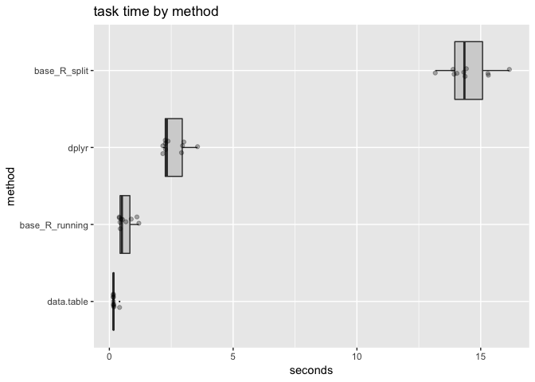

grouped\_sum\_timing.Rmd
================

``` r
library("dplyr")
```

    ## 
    ## Attaching package: 'dplyr'

    ## The following objects are masked from 'package:stats':
    ## 
    ##     filter, lag

    ## The following objects are masked from 'package:base':
    ## 
    ##     intersect, setdiff, setequal, union

``` r
packageVersion("dplyr")
```

    ## [1] '0.7.7'

``` r
library("data.table")
```

    ## 
    ## Attaching package: 'data.table'

    ## The following objects are masked from 'package:dplyr':
    ## 
    ##     between, first, last

``` r
packageVersion("data.table")
```

    ## [1] '1.11.8'

``` r
library("microbenchmark")
library("WVPlots")

f_base_R_split <- function(data) {
  # first sort the data
  order_index <- with(data, 
                      order(x, y, decreasing = TRUE))
  odata <- data[order_index, , drop = FALSE]
  # now split into groups
  data_list <- split(odata, -odata$x)
  # apply the cumsum to each group
  data_list <- lapply(
    data_list,
    function(di) {
      di$running_y_sum <- cumsum(di$y)
      di
    })
  # put the results back to together
  odata <- do.call(rbind, data_list)
  rownames(odata) <- NULL
  odata
}

# does not allow NA
f_base_R_running <- function(data) {
  # first sort the data
  order_index <- with(data, order(x, y, decreasing = TRUE))
  odata <- data[order_index, , drop = FALSE]
  # now compute a running sum across all groups
  if(any(is.na(odata$y))) {
    stop("saw NA")
  }
  odata$running_y_sum <- cumsum(odata$y)
  # now identify where x changes value
  group_start_index <- c(TRUE, odata$x[-1] != odata$x[-nrow(odata)])
  # use the group start markers to get the index of the first row
  # for each group
  group_start_index <- ifelse(group_start_index, 
                              seq_len(length(group_start_index)), 0)
  group_start_index <- cummax(group_start_index)
  # subtract off the group starts to 
  # convert non-grouped running sum to per-group running sums
  offset <- odata$y - odata$running_y_sum
  odata$running_y_sum <- odata$running_y_sum  + offset[group_start_index]
  rownames(odata) <- NULL
  odata
}
# above is a general grouped cumsum
# similar ideas can implement:
#  zoo::na.locf() (propogate index to last good value)
#  grouped zoo::na.locf() (more detailed version of above)
#  grouped min/max (first row in each group under appropriate sorting)
#  grouped sum (at worst cumsum and grouped max)


f_data.table <- function(data) {
  data_data.table <- as.data.table(data)
  
  # sort data
  setorderv(data_data.table, c("x", "y"), order = -1L)
  # apply operation in each x-defined group
  data_data.table[ , running_y_sum := cumsum(y), by = "x"]
  
  data_data.table[]
}

f_dplyr <- function(data) {
  data %>%
    arrange(., desc(x), desc(y)) %>%
    group_by(., x) %>%
    mutate(., running_y_sum = cumsum(y)) %>%
    ungroup(.)
}

data <- wrapr::build_frame(
   "x", "y" |
   1  , 1   |
   0  , 0   |
   1  , 0   |
   0  , 1   |
   0  , 0   |
   1  , 1   )

my_check <- function(values) {
  v1 <- data.frame(values[[1]])
  all(vapply(values[-1], 
             function(x) {
               isTRUE(all.equal(v1, data.frame(x)))
             },
             logical(1)))
}

lst <- list( 
  base_R_split = f_base_R_split(data),
  base_R_running = f_base_R_running(data),
  data.table = f_data.table(data),
  dplyr = f_dplyr(data))

print(lst)
```

    ## $base_R_split
    ##   x y running_y_sum
    ## 1 1 1             1
    ## 2 1 1             2
    ## 3 1 0             2
    ## 4 0 1             1
    ## 5 0 0             1
    ## 6 0 0             1
    ## 
    ## $base_R_running
    ##   x y running_y_sum
    ## 1 1 1             1
    ## 2 1 1             2
    ## 3 1 0             2
    ## 4 0 1             1
    ## 5 0 0             1
    ## 6 0 0             1
    ## 
    ## $data.table
    ##    x y running_y_sum
    ## 1: 1 1             1
    ## 2: 1 1             2
    ## 3: 1 0             2
    ## 4: 0 1             1
    ## 5: 0 0             1
    ## 6: 0 0             1
    ## 
    ## $dplyr
    ## # A tibble: 6 x 3
    ##       x     y running_y_sum
    ##   <dbl> <dbl>         <dbl>
    ## 1     1     1             1
    ## 2     1     1             2
    ## 3     1     0             2
    ## 4     0     1             1
    ## 5     0     0             1
    ## 6     0     0             1

``` r
my_check(lst)
```

    ## [1] TRUE

``` r
nrow <- 1000000
nsym <- 100000
set.seed(235236)
data <- data.frame(x = sample.int(nsym, nrow, replace = TRUE))
data$y <- rnorm(nrow(data))

lst <- list( 
  base_R_split = f_base_R_split(data),
  base_R_running = f_base_R_running(data),
  data.table = f_data.table(data),
  dplyr = f_dplyr(data))
my_check(lst)
```

    ## [1] TRUE

``` r
lst <- NULL


timing <- microbenchmark(
  base_R_split = f_base_R_split(data),
  base_R_running = f_base_R_running(data),
  data.table = f_data.table(data),
  dplyr = f_dplyr(data),
  times = 10L
)

print(timing)
```

    ## Unit: milliseconds
    ##            expr       min         lq       mean     median        uq
    ##    base_R_split 13421.546 13867.2538 14287.5633 14088.6780 15004.193
    ##  base_R_running   310.213   446.1808   650.6018   525.2140   861.440
    ##      data.table   159.415   162.6635   184.1573   163.0788   166.738
    ##           dplyr  2154.965  2242.2044  2449.1062  2294.0786  2689.519
    ##         max neval  cld
    ##  15272.3679    10    d
    ##   1211.4091    10  b  
    ##    354.1081    10 a   
    ##   2953.8621    10   c

``` r
tm <- as.data.frame(timing)
tm$seconds <- tm$time/1e+9
tm$method <- factor(tm$expr)
tm$method <- reorder(tm$method, tm$seconds)
ScatterBoxPlotH(tm, 
                "seconds", "method", 
                "task time by method")
```


