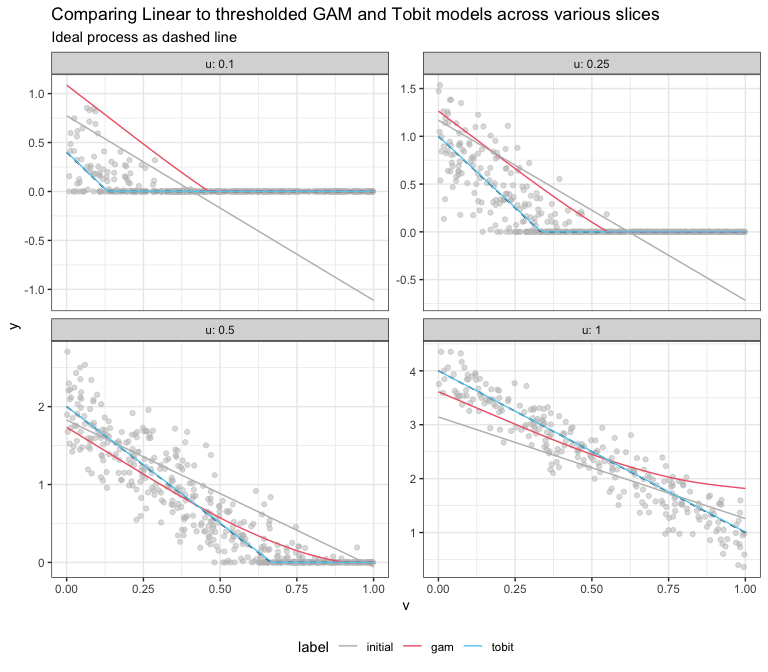

Followup: Adjusting Saturated Multivariate Linear Models
================
Nina Zumel
2024-08-18

This is a followup to the article [*Post-hoc Adjustment for
Zero-Thresholded Linear
Models*](https://win-vector.com/2024/08/16/post-hoc-adjustment-for-zero-thresholded-linear-models/),
in which I showed how to use a one-variable GAM (e.g., a spline) to
adjust a linear model in a problem space where outcomes are strictly
nonnegative. If you haven’t read that article, I suggest you check it
out, first.

> When you don’t expect to see too many zeros in practice, modeling the
> process as linear and thresholding negative predictions at zero is not
> unreasonable. But the more zeros (saturations) you expect to see, the
> less well a linear model will perform.

The original motivation for the work we did here was to help a client
who had built a fairly complex multivariate model to predict count data.
Their underlying assumption was that in their domain, a count of zero is
a rare event. Their model training and deployment process was automated
and put into production across multiple sites.

Unfortunately, zero-counts are not so rare as they originally believed,
at some of their sites. Because coming up with and deploying a new model
design is not necessarily feasible at this stage (at least not in the
immediate term), they wanted to figure out how to adjust their existing
models to operate even at high zero-count sites. Note that this
adjustment is a *one-dimensional* process: mapping the output of one
model to a prediction that is closer to the actual outcomes.

To motivate this adjustment process in the previous article, I used an
example of a linear model that was fit to a one-dimensional saturated
process. This was so I could plot the resulting “hockey stick” function,
and show what happens with different model adjustments. But it’s been my
experience that people won’t believe that this procedure will generalize
to multivariate linear models, unless I show them that it works on such
models. So in this article, I’ll apply the same procedures to a linear
model that was fit to two variables, just to prove the point.

I’ll also add an additional adjustment that wasn’t in the original
article, but was suggested by Neal Fultz: adjustment using a Tobit
model. You can see more details of that in a revised version of the
article on github,
[here](https://github.com/WinVector/Examples/blob/main/linear_regression_w_zeros/lm_adjust_wtobit.md).
Tobit adjustments work nearly as well as GAM adjustments, and do have
the (potential) advantage of having a stronger inductive bias, if you
believe that your process is truly linear in it’s non-saturated regions
[^1].

In the second part of the article, I’ll try fitting a model directly to
the input data, using both GAM and Tobit, since ideally, that’s what
you’d do if you were approaching this problem *de novo*.

For legibility and brevity, I’m going to hide a lot of the code when
generating this article, but you can find the original R Markdown source
code on github as well,
[here](https://github.com/WinVector/Examples/blob/main/linear_regression_w_zeros/lm2d_adjust.Rmd).

## Example Problem

Here are the characteristics of our example problem:

- The feature `u` positively correlates with outcome, while `v`
  negatively correlates.
- The outcome `y` is constrained to be nonnegative; in other words, it
  “saturates” at zero.
- Both features `u` and `v` are bounded between 0 and 1 uniformly.
- There is a moderate noise process on top of it.

``` r
trueprocess = function(N) {
  u = runif(N)
  v = runif(N)
  noise = 0.3 * rnorm(N) 
  y = pmax(0, 4 * u - 3 * v + noise)
  data.frame(u = u, v = v, y = y)
}
```

## The Data

Let’s generate some training data.

``` r
traind = trueprocess(1000)
head(traind)
```

    ##           u         v         y
    ## 1 0.1634115 0.2125462 0.6570359
    ## 2 0.5249624 0.6152054 0.0000000
    ## 3 0.3051476 0.9153664 0.0000000
    ## 4 0.9277528 0.8064937 1.5395565
    ## 5 0.5715193 0.9990540 0.0000000
    ## 6 0.2602110 0.5206304 0.0000000

Let’s plot a heatmap of the training data. Note that there’s lots of
saturation.

<!-- -->

We’re going to use all the data to train our models, but it’s not easy
to show comparison plots in three dimensions in a way that’s legible. So
we’ll also look at a slices of the data, by holding `u` restricted to a
narrow range around a nominal value. Here’s a slice with `u` fixed to
near 0.5.

<!-- -->

As you can see, the data is fairly noisy, in addition to being quite
saturated. Now let’s train a linear model on the data, as well as all
our adjusted models.

## Part I: Adjustments to a Linear Model

### Train the initial model, and all the adjustments

We’ll fit the model, make the naive adjustment of thresholding the data
at zero, then fit all the candidate adjustment models. Note that only
the initial model ever makes reference to the input variables.

``` r
# train the initial model, 
# get the initial predictions and thresholded predictions

initial_model = lm(y ~ u + v, data=traind)
traind$y_initial= predict(initial_model, newdata=traind)
traind$y_pred0 = pmax(0, traind$y_initial)

# fit the adjustment models
# (function definitions in R markdown document)
scaling_model = fit_scaler(initial_model, "y", traind)
linadj_model = fit_linmod(initial_model, "y", traind)
gamadj_model = fit_gammod(initial_model, "y", traind)
tobitadj_model = fit_tobit(initial_model, "y", traind)

adjustments = list(scaling_model, linadj_model, gamadj_model, tobitadj_model)
names(adjustments) = c("y_linscale", "y_linadj", "y_gamadj", "y_tobitadj")

# make the predictions
for(adj in names(adjustments)) {
  traind[[adj]] = do_predict(adjustments[[adj]], newdata=traind)
}
```

Let’s look at the RMSE and bias of each model.

| prediction_type | description            |      RMSE |       bias |
|:----------------|:-----------------------|----------:|-----------:|
| initial         | initial model          | 0.4438901 |  0.0000000 |
| pred0           | zero-thresholded model | 0.3721101 |  0.0842275 |
| linscale        | scale-adjusted model   | 0.3692881 |  0.1196263 |
| linadj          | linear-adjusted model  | 0.2453422 |  0.0298617 |
| gamadj          | GAM-adjusted model     | 0.2261695 |  0.0007868 |
| tobitadj        | Tobit-adjusted model   | 0.2293762 | -0.0097394 |

Model RMSE and bias on training data

As expected (if you’ve read the previous article), the GAM-adjusted
model has the lowest training RMSE, and also lower bias than the other
adjusted models. The Tobit-adjusted model has comparable RMSE, and
slightly more bias.

We can try to visualize what’s happening, by holding `u` constant at
different values and looking at slices of the prediction surfaces. We’ll
just compare the original linear model, GAM-adjustment, and
Tobit-adjustment.

<!-- -->

### Test on holdout

Let’s compare the models on holdout data. For this example the holdout
performances are similar to training.

``` r
testd = trueprocess(5000)

testd$y_initial= predict(initial_model, newdata=testd)
testd$y_pred0 = pmax(0, testd$y_initial)
for(adj in names(adjustments)) {
  testd[[adj]] = do_predict(adjustments[[adj]], newdata=testd)
}
```

| prediction_type | description            |      RMSE |       bias |
|:----------------|:-----------------------|----------:|-----------:|
| initial         | initial model          | 0.4504353 | -0.0046703 |
| pred0           | zero-thresholded model | 0.3750385 |  0.0836604 |
| linscale        | scale-adjusted model   | 0.3721833 |  0.1184737 |
| linadj          | linear-adjusted model  | 0.2482977 |  0.0310791 |
| gamadj          | GAM-adjusted model     | 0.2285600 |  0.0043918 |
| tobitadj        | Tobit-adjusted model   | 0.2300590 | -0.0064108 |

Model RMSE and bias on training data

## Part II : Fitting directly to the input data

Now let’s try both Tobit and GAM directly on the input data. There are,
of course, other methods we could try, like Poisson or Zero-inflated
Poisson regression. But since we’ve been focusing on Tobit and GAM as
adjustments, we’ll just stick to those.

Note that since neither of these models are restricted to nonnegative
predictions, we still have to threshold to zero.

Let’s fit to our training data.

``` r
gam_model = gam(y ~ s(u) + s(v), data=traind)
traind$y_gam = pmax(0, predict(gam_model, newdata=traind))

tobit_model = vglm(y ~ u + v, tobit(Lower=0), data=traind)
# we still have to threshold the tobit model at 0
traind$y_tobit = pmax(0, predict(tobit_model, traind)[, "mu"])
```

We’ll compare the full model fits to the GAM-adjusted and Tobit-adjusted
linear models.

| prediction_type | description          |      RMSE |       bias |
|:----------------|:---------------------|----------:|-----------:|
| gamadj          | GAM-adjusted model   | 0.2261695 |  0.0007868 |
| tobitadj        | Tobit-adjusted model | 0.2293762 | -0.0097394 |
| gam             | Full GAM model       | 0.3505055 |  0.0668857 |
| tobit           | Full Tobit model     | 0.2280450 | -0.0099883 |

Model RMSE and bias on training data

The full (thresholded) Tobit model does slightly better than the
Tobit-adjusted linear model, but the thresholded GAM doesn’t do so well.
Since this problem is truly linear, the stronger inductive bias of the
Tobit model serves us well.

### Test on holdout

We can also evaluate these models on holdout data.

| prediction_type | description          |      RMSE |       bias |
|:----------------|:---------------------|----------:|-----------:|
| gamadj          | GAM-adjusted model   | 0.2285600 |  0.0043918 |
| tobitadj        | Tobit-adjusted model | 0.2300590 | -0.0064108 |
| gam             | Full GAM model       | 0.3574985 |  0.0658623 |
| tobit           | Full Tobit model     | 0.2280260 | -0.0072236 |

Model RMSE and bias on training data

We get similar results. Let’s plot some slices to get an idea of what’s
happening.

<!-- -->

## Conclusions

For our original problem—post-hoc adjustments of an already established
modeling procedure—a GAM adjustment seems to be the best way to adapt
our modeling to higher-than-anticipated saturation frequency; however,
Tobit adjustment is competitive. If you have the opportunity to design
the modeling procedure *de novo*, GAM may not be the best option; though
I admit, I didn’t spend any time trying to tune the model. If the
process you are modeling is well-approximated as linear in its inputs in
the non-saturated region, then a thresholded Tobit model appears to be a
good choice.

[^1]: Statisticians generally use the word “censored” when talking about
    processes that threshold out to a minimum or maximum value (or
    both). Often, the assumption is that the measurements are censored
    because of limitations of the measurement itself: for example, you
    can’t track a subject for more than five years, so the longest
    lifetime you can expect to measure is 5, even if the subject lives
    for decades longer. So models like Tobit try to predict *as if* the
    data isn’t censored: they can predict a lifetime longer than 5
    years, even though those lifetimes can’t be measured. I am using the
    word “saturated” to indicate that the outcome being measured
    literally cannot go beyond the threshold: counts can never be
    negative. A possibly useful analogy is the image from a digital
    camera: too much light “blows out” the photo. If you are trying to
    predict the intensity of the light that hit the camera sensor using
    the image pixels as the outcome data, then the data is censored. If
    you are trying to predict *the values of the pixels*, then the data
    is saturated.
