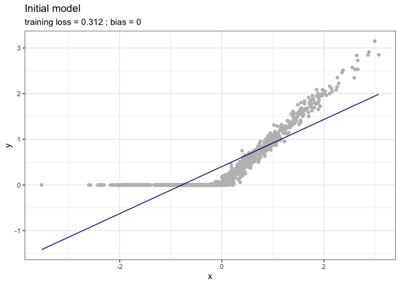
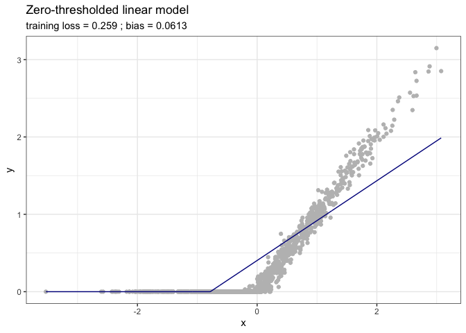
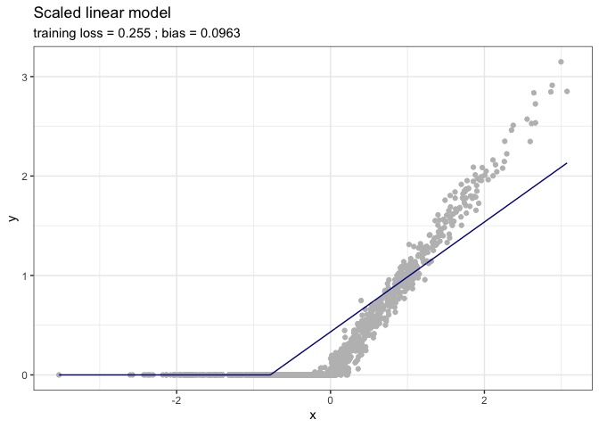
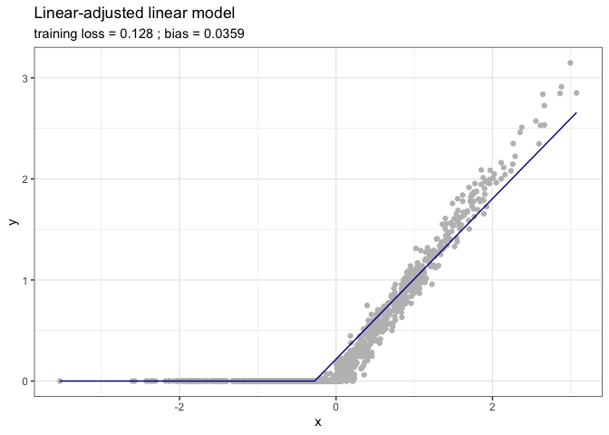
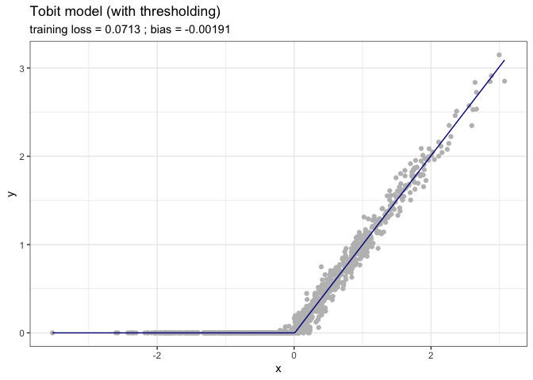
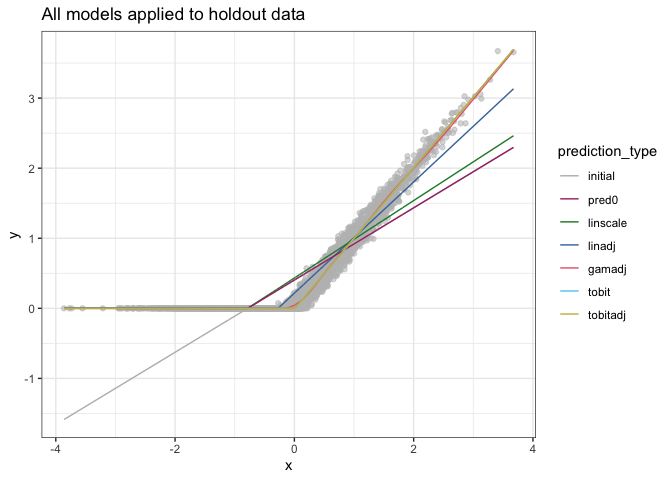

Post-hoc Adjustment for Zero-Thresholded Linear Models
================
Nina Zumel
2024-08-14

*This version of the document includes the Tobit solution from [Neal
Fultz’s
comment](https://win-vector.com/2024/08/16/post-hoc-adjustment-for-zero-thresholded-linear-models/#comments).
I haven’t really changed the text of the orignal document. Thanks, Neal,
for pointing us to this solution!*

Suppose you are modeling a process that you believe is well approximated
as being linear in its inputs, but only within a certain range. Outside
that range, the output might saturate or threshold: for example if you
are modeling a count or a physical process, you likely can never get a
negative outcome. Similarly, a process can saturate to a upper bound
value outside a given range of the input data.

However, you may still want to model the process as linear *under the
assumption* that you don’t expect the process to hit the saturation
point too often. But what if it does? For simplicity we’ll look
specifically at the case where you expect the process to return
non-negative values, and you hope it doesn’t saturate to zero very
often.

When you don’t expect to see too many zeros in practice, modeling the
process as linear and thresholding negative predictions at zero is not
unreasonable. But the more zeros (saturations) you expect to see, the
less well a linear model will perform.

## Dealing with saturated processes

Let’s show this, in R. First, we’ll load the necessary libraries and set
a seed for the random number generator, for reproducibility.

``` r
library(ggplot2) # for plotting
library(poorman) # for data wrangling
library(mgcv)    # for GAM
library(VGAM)    # for Tobit

set.seed(20240812)
```

Now we’ll define our true generative process. For didactic purposes,
I’ll use a one-dimensional process, so that we can plot the various
models in a way that illustrates what’s going on. However, the
principles that we discuss here apply generally to adjusting a linear
model over any process, including multivariate ones.

For this example, the generative process is simply a variable
distributed as a gaussian with variance 1 and mean `mu`, thresholded at
zero. The larger `mu` is, the fewer saturation events we’ll see.

We’ll set `mu = 0`, so we have a large number of saturation events. This
dramatizes the issue that we are trying to address.

``` r
trueprocess = function(mu, N=1000) {
  x = rnorm(N, mu)
  xnoise = x + 0.1 * rnorm(N)
  y = pmax(0.0, xnoise)
  df = data.frame(x=x, y=y)
  df
}

traind = trueprocess(mu=0, N=1000)

head(traind)
```

    ##            x          y
    ## 1 -0.9805332 0.00000000
    ## 2 -0.5096520 0.00000000
    ## 3  0.1802436 0.09393321
    ## 4  0.3206537 0.40332915
    ## 5 -1.4092943 0.00000000
    ## 6  1.8399697 1.76690214

## Initial Model

First, let’s just blindly fit a linear model to this data, and see what
we get.

``` r
traind = trueprocess(mu=0, N=1000)

initial_model = lm(y ~ x, data=traind)
traind$ypred0 = predict(initial_model, newdata=traind)

# we'll be calculating RMSE a lot, so...
rmse = function(y, ypred) {
  err = y - ypred
  sqrt(mean(err^2))
}

# we'll also calculate bias: the mean value of (y - ypred)
bias = function(y, ypred) {
  err = ypred - y   # bias is estimate - actual, opposite of residual which is actual - estimate
  b = mean(err)
  # let's round down to zero for small numbers
  b = ifelse(abs(b) < 1e-12, 0, b)
  b
}

loss = with(traind, rmse(y, ypred0))
loss_str = format(loss, digits=3)
err = with(traind, bias(y, ypred0))
err_str = format(err, digits=3)
subtitle = paste("training loss =", loss_str, "; bias =", err_str)

theme_set(theme_bw()) # set global ggplot theme

ggplot(traind, aes(x=x)) + 
  geom_point(aes(y=y), color="gray") + 
  geom_line(aes(y=ypred0), color="darkblue") + 
  ggtitle("Initial model", subtitle=subtitle)
```

<!-- -->

Yuck (but we knew this would happen)! There are two issues with the
initial model:

1.  It does not respect the non-negativity constraint.
2.  The slope of the model in the positive region is incorrect; it’s too
    low.

Let’s try to adjust the initial model to fix these two issues. The
first, naive, attempt, is just to threshold the predictions at zero.

``` r
predict_lm_0thresh = function(initial_model, newdata) {
  pmax(predict(initial_model, newdata=newdata), 0)
}

traind$ypred_0thresh = predict_lm_0thresh(initial_model, newdata=traind)

loss = with(traind, rmse(y, ypred_0thresh))
loss_str = format(loss, digits=3)
err = with(traind, bias(y, ypred_0thresh))
err_str = format(err, digits=3)
subtitle = paste("training loss =", loss_str, "; bias =", err_str)

ggplot(traind, aes(x=x)) + 
  geom_point(aes(y=y), color="gray") + 
  geom_line(aes(y=ypred_0thresh), color="darkblue") + 
  ggtitle("Zero-thresholded linear model", subtitle=subtitle)
```

<!-- -->

This adjustment reduces the training loss and respects the
non-negativity constraint, but still doesn’t fix the slope issue. What
else can we do?

We could try an explicitly non-negative modeling approach, like Poisson
regression, or a data transform such as the Freeman-Tukey transform. We
feel our problem looks more like zero-inflation, which seems amenable to
a post-hoc adjustment, in the style of [Platt
scaling](https://en.wikipedia.org/wiki/Platt_scaling). Platt scaling a
classification model *calibrates* it: that is, it transforms the outputs
of the classifier into a probabability distribution over the inputs that
is consistent with the training data distribution. In this case, we want
to apply a post-hoc adjustment model to a regression, in order to
transform the original model into one that is consistent with the
saturated nature of the training data.

Let’s try it.

## Attempt 1: Rescale the non-negative predictions

Maybe we can rescale the positive predictions from the original model,
to better match the output? One way to do that is to fit a
zero-intercept linear model to fit the original predictions to the
outcome. This will give us a scaling factor to apply to positive
predictions.

To fit the model, we’ll implement a procedure that takes the initial
linear model along with the training data, and returns a pair of models
: the initial model, and the adjustment model.

``` r
# outcome here is the name of the outcome column in the data frame
fit_scaler = function(initial_model, outcome, data) {
  ypred0 = predict(initial_model, newdata=data)
  df = data.frame(ypred0 = ypred0, y=data[[outcome]])
  
  # reduce the data to non-negative predictions
  df = subset(df, ypred0 > 0)
  
  # now fit the new model to the non-negative predictions
  smodel = lm(y ~ 0 + ypred0, data=df) 
  
  # return a list: initial model, adjustment model
  list(initial_model=initial_model, adjustment=smodel)
 
}
```

We’ll also implement a prediction method that first applies the initial
model to the data, then uses the adjustment model to rescale everywhere
that the initial model returns a negative prediction.

``` r
# "model" is a list (initial_model, adjustment)
do_predict = function(model, newdata) {
  mod0 = model$initial_model
  adjmod = model$adjustment
  
  df = data.frame(ypred0 = predict(mod0, newdata=newdata))
  # if the adjustment model makes negative predictions, threshold to 0
  yadj = pmax(0, predict(adjmod, newdata=df))

  # if linear model predicts a negative number,
  # predict 0, else use adjusted model
  ypred = ifelse(df$ypred0  <= 0, 0, yadj)
  ypred
}
```

Now let’s fit the adjustment and look at what happens.

``` r
# now fit the adjustment model
scaling_model = fit_scaler(initial_model, "y", traind)

adjustment_coef = coef(scaling_model$adjustment)
```

In this example, the rescaling coefficient is 1.0722805, meaning the
adjustment is a very small increase in slope. This slightly reduces the
training loss.

``` r
traind$ypred_scaled = do_predict(scaling_model, newdata=traind)

loss = with(traind, rmse(y, ypred_scaled))
loss_str = format(loss, digits=3)
err = with(traind, bias(y, ypred_scaled))
err_str = format(err, digits=3)
subtitle = paste("training loss =", loss_str, "; bias =", err_str)

ggplot(traind, aes(x=x)) + 
  geom_point(aes(y=y), color="gray") + 
  geom_line(aes(y=ypred_scaled), color="darkblue") + 
  ggtitle("Scaled linear model", subtitle=subtitle)
```

<!-- -->

Looking at the result, we realize we aren’t “rotating” the positive part
of the hockey stick enough.

## Attempt 2: Rotate the predictions via a linear model

Now let’s try a linear adjustment model with an intercept. This
essentially shifts and rotates the non-negative range of the initial
model.

``` r
fit_linmod = function(initial_model, outcome, data) {
  ypred0 = predict(initial_model, newdata=data)
  df = data.frame(ypred0 = ypred0, y=data[[outcome]])
  
  # reduce the data to non-negative predictions
  df = subset(df, ypred0 > 0)
  
  # now fit the new model
  lpmodel = lm(y ~ ypred0, data=df) 
  
  # return a list: initial model, adjustment model
  list(initial_model=initial_model, adjustment=lpmodel)
 
}
  
# now fit the adjustment model
linadj_model = fit_linmod(initial_model, "y", traind)

adjustment_coef = coef(linadj_model$adjustment)
```

The adjustment coefficients are (-0.4050229, 1.5403333), resulting in a
small shift and a more substantial scaling of the original model’s
output in the non-negative region.

``` r
traind$ypred_linadj = do_predict(linadj_model, newdata=traind)

loss = with(traind, rmse(y, ypred_linadj))
loss_str = format(loss, digits=3)
err = with(traind, bias(y, ypred_linadj))
err_str = format(err, digits=3)
subtitle = paste("training loss =", loss_str, "; bias =", err_str)

ggplot(traind, aes(x=x)) + 
  geom_point(aes(y=y), color="gray") + 
  geom_line(aes(y=ypred_linadj), color="darkblue") + 
  ggtitle("Linear-adjusted linear model", subtitle=subtitle)
```

<!-- -->

Much better! We’ve halved the training loss, and the slope is a better
fit to the data. We’ve also reduced the magnitude of the bias (the
tendency of the model to over- or under- predict, on average) relative
to the other adjusted models. Note that linear models are designed to be
zero-bias on the training data, and our initial linear model doesn’t
predict so well, so zero-bias isn’t everything; but a low bias model is
still considered a good thing.

Looking at the graph, the main issue remaining is that the adjusted
model doesn’t correctly estimate the location of the “elbow” of the
graph. This leads to a slight underestimation of the data slope.

## Attempt 3: Adjust predictions via a generalized additive model (GAM)

GAM uses a spline (in general, one spline per input) to approximate the
mapping from inputs to output. This allows us to fit a non-linear
adjustment to the original model.

We’ll again fit the adjustment only to the region where the original
model predicted a positive value.

``` r
# returned model is a list (initial_model, adjustment)
fit_gammod = function(initial_model, outcome, data) {
  ypred0 = predict(initial_model, newdata=data)
  df = data.frame(ypred0 = ypred0, y=data[[outcome]])
  
  # reduce the data to non-negative predictions
  df = subset(df, ypred0 > 0)
  
  # now fit the new model
  gammodel = gam(y ~ s(ypred0), data=df) 
  
  # return a list: initial model, adjustment model
  list(initial_model=initial_model, adjustment=gammodel)
 
}

# now fit the adjustment model
gamadj_model = fit_gammod(initial_model, "y", traind)

traind$ypred_gamadj = do_predict(gamadj_model, newdata=traind)

loss = with(traind, rmse(y, ypred_gamadj))
loss_str = format(loss, digits=3)
err = with(traind, bias(y, ypred_gamadj))
err_str = format(err, digits=3)
subtitle = paste("training loss =", loss_str, "; bias =", err_str)

ggplot(traind, aes(x=x)) + 
  geom_point(aes(y=y), color="gray") + 
  geom_line(aes(y=ypred_gamadj), color="darkblue") + 
  ggtitle("GAM-adjusted linear model", subtitle=subtitle)
```

<!-- -->

This is the best fit to the training data of all the models we’ve
observed. We’ve again nearly halved the training RMSE, and substantially
reduced the training bias.

A GAM can’t truly replicate the ideal process, since a hockey stick is a
non smooth function (the derivative doesn’t exist at the “elbow”).
However, the algorithm has managed to fit a very good smooth
approximation of the ideal shape. The function gives a good estimate of
the data slope in the linear region, and identified the region of the
inflection point fairly accurately.

## Attempt 4: Tobit on x

This is actually a regression directly on the original data. Tobit
predicts over the full range (meaning it still predicts negative values,
even fron non-negative training data). This is useful if the zeros are
from a censoring process. This is a bit different from our situation,
where the zeros are essential (an actual physical effect to be
respected, such as an object count never being negative).

But this model goes a great job of estimating the slope of the
non-negative data, and it correctly estimated the inflection point. We
just still have to threshold the negative predictions to zero.

[You can find a discussion of Tobit models
here.](https://stats.oarc.ucla.edu/r/dae/tobit-models/)

``` r
tobit_model <- vglm(y ~ x, tobit(Lower = 0), data = traind)
summary(tobit_model)
```

    ## 
    ## Call:
    ## vglm(formula = y ~ x, family = tobit(Lower = 0), data = traind)
    ## 
    ## Coefficients: 
    ##                Estimate Std. Error z value Pr(>|z|)    
    ## (Intercept):1 -0.009230   0.006819  -1.354    0.176    
    ## (Intercept):2 -2.287463   0.030855 -74.136   <2e-16 ***
    ## x              1.008115   0.006862 146.923   <2e-16 ***
    ## ---
    ## Signif. codes:  0 '***' 0.001 '**' 0.01 '*' 0.05 '.' 0.1 ' ' 1
    ## 
    ## Names of linear predictors: mu, loglink(sd)
    ## 
    ## Log-likelihood: 405.6109 on 1997 degrees of freedom
    ## 
    ## Number of Fisher scoring iterations: 5 
    ## 
    ## No Hauck-Donner effect found in any of the estimates

``` r
# prediction output is a matrix
# tobit projects over the full range *as if* the data isn't censored
traind$ypred_tobit = pmax(0, predict(tobit_model, traind)[,'mu'])  

loss = with(traind, rmse(y, ypred_tobit))
loss_str = format(loss, digits=3)
err = with(traind, bias(y, ypred_tobit))
err_str = format(err, digits=3)
subtitle = paste("training loss =", loss_str, "; bias =", err_str)

ggplot(traind, aes(x=x)) + 
  geom_point(aes(y=y), color="gray") + 
  geom_line(aes(y=ypred_tobit), color="darkblue") + 
  ggtitle("Tobit model (with thresholding)", subtitle=subtitle)
```

<!-- -->

## Attempt 4: Tobit on ypred0

We can also use Tobit to adjust the initial linear model (instead of
properly using Tobit). The results (for this example) are essentially
identical to fitting directly on x.

``` r
# make the adjustment function/model analogous to the previous ones
fit_tobit = function(initial_model, outcome, data) {
  ypred0 = predict(initial_model, newdata=data)
  df = data.frame(ypred0 = ypred0, y=data[[outcome]])
  
  # reduce the data to non-negative predictions
  df = subset(df, ypred0 > 0)
  
  # now fit the new model
  tobitmodel = vglm(y ~ ypred0, tobit(Lower = 0), data = df)
  
  # return a list: initial model, adjustment model
  list(initial_model=initial_model, adjustment=tobitmodel)
}

# needs a slightly different do_predict
do_predict_tobit = function(model, newdata) {
  mod0 = model$initial_model
  adjmod = model$adjustment
  
  df = data.frame(ypred0 = predict(mod0, newdata=newdata))
  yadj = pmax(0, predict(adjmod, df)[, 'mu'])
  
  # if linear model predicts a negative number,
  # predict 0, else use adjusted model
  ypred = ifelse(df$ypred0  <= 0, 0, yadj)
  ypred
}


tobit_adj_model = fit_tobit(initial_model, "y", traind)
summary(tobit_adj_model$adjustment)
```

    ## 
    ## Call:
    ## vglm(formula = y ~ ypred0, family = tobit(Lower = 0), data = df)
    ## 
    ## Coefficients: 
    ##               Estimate Std. Error z value Pr(>|z|)    
    ## (Intercept):1 -0.79853    0.01148  -69.55   <2e-16 ***
    ## (Intercept):2 -2.28746    0.03085  -74.14   <2e-16 ***
    ## ypred0         1.95636    0.01332  146.92   <2e-16 ***
    ## ---
    ## Signif. codes:  0 '***' 0.001 '**' 0.01 '*' 0.05 '.' 0.1 ' ' 1
    ## 
    ## Names of linear predictors: mu, loglink(sd)
    ## 
    ## Log-likelihood: 405.6109 on 1589 degrees of freedom
    ## 
    ## Number of Fisher scoring iterations: 5 
    ## 
    ## No Hauck-Donner effect found in any of the estimates

``` r
traind$ypred_tobitadj = do_predict_tobit(tobit_adj_model, newdata=traind)

loss = with(traind, rmse(y, ypred_tobitadj))
loss_str = format(loss, digits=3)
err = with(traind, bias(y, ypred_tobitadj))
err_str = format(err, digits=3)
subtitle = paste("training loss =", loss_str, "; bias =", err_str)

ggplot(traind, aes(x=x)) + 
  geom_point(aes(y=y), color="gray") + 
  geom_line(aes(y=ypred_tobitadj), color="darkblue") + 
  ggtitle("Tobit-adjusted linear model", subtitle=subtitle)
```

<!-- -->

## Holdout evaluation

Let’s compare all the models we’ve discussed on holdout data.

``` r
testd = trueprocess(mu=0, N=5000)

# try all the models we've done so far
testd$y_initial = predict(initial_model, newdata=testd)
testd$y_pred0 = pmax(0, predict(initial_model, newdata=testd))
testd$y_linscale = do_predict(scaling_model, newdata=testd)
testd$y_linadj = do_predict(linadj_model, newdata=testd)
testd$y_gamadj = do_predict(gamadj_model, newdata=testd)
testd$y_tobit = pmax(0, predict(tobit_model, testd)[,'mu']) 
testd$y_tobitadj = do_predict_tobit(tobit_adj_model, newdata=testd)


# pivot data into a form better for plotting and summarizing
testdlong = pivot_longer(
  testd,
  c("y_initial", "y_pred0", "y_linscale", "y_linadj", "y_gamadj", "y_tobit", "y_tobitadj"),
  names_to = "prediction_type",
  names_prefix = "y_",
  values_to = "prediction"
)

# get the error statistics
errframe = testdlong |>
  group_by(prediction_type) |>
  summarize(RMSE = rmse(y, prediction),
            bias = bias(y, prediction)) |>
  ungroup()

# descriptions
descv = c("initial model", "zero-thresholded model", "scale-adjusted model", "linear-adjusted model", 
          "GAM-adjusted model", "Tobit model on x", "Tobit-adjusted model")
names(descv) = c("initial", "pred0", "linscale", "linadj", "gamadj", "tobit", "tobitadj")

# a little rearrangement for good presentation
rownames(errframe) = errframe$prediction_type
errframe$description = descv[errframe$prediction_type]
errframe = errframe[names(descv), c("prediction_type", "description", "RMSE", "bias")]

knitr::kable(errframe, caption = "Model RMSE and bias on holdout data", row.names=FALSE) 
```

| prediction_type | description            |      RMSE |       bias |
|:----------------|:-----------------------|----------:|-----------:|
| initial         | initial model          | 0.3043739 |  0.0046863 |
| pred0           | zero-thresholded model | 0.2518775 |  0.0642282 |
| linscale        | scale-adjusted model   | 0.2486353 |  0.0982720 |
| linadj          | linear-adjusted model  | 0.1219682 |  0.0335343 |
| gamadj          | GAM-adjusted model     | 0.0694896 | -0.0018866 |
| tobit           | Tobit model on x       | 0.0695431 | -0.0042344 |
| tobitadj        | Tobit-adjusted model   | 0.0695431 | -0.0042344 |

Model RMSE and bias on holdout data

Observe that the GAM-adjusted model has the lowest RMSE error, and the
lowest magnitude bias, comparable to the original linear model –
although the Tobit model is essentially just as good. Let’s plot them to
take a look:

``` r
# colors from the Tol_bright colorblind-friendly palette
# https://thenode.biologists.com/data-visualization-with-flying-colors/research/
# https://personal.sron.nl/~pault/#sec:qualitative

palette = c(initial = "#BBBBBB", pred0 = "#AA3377", linscale = "#228833", 
            linadj = "#4477AA",  gamadj = "#EE6677", tobit = "#66CCEE", "tobitadj" = "#CCBB44")

ggplot(testdlong, aes(x=x)) + 
  geom_point(aes(y=y), color="gray", alpha = 0.1) + 
  geom_line(aes(y = prediction, color=prediction_type)) + 
  ggtitle("All models applied to holdout data") + 
  scale_color_manual(breaks = names(descv), values=palette)
```

<!-- -->

## Conclusion

Many real-world processes can be well-approximated as linear within a
restricted range of inputs. However, when fitting linear models to these
processes, it’s a good idea to adjust for potential saturation, or
“out-of-linear-range” events. In this note, we’ve motivated using a
spline to adjust an initial linear model, in order to accurately predict
in a range that includes saturated regions. We’ve fit the spline using
the generalized additive model, or GAM, in R. A similar solution can
also be fit in python, as well.
