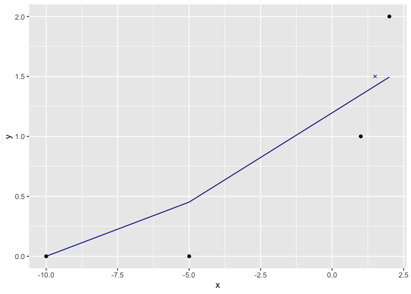
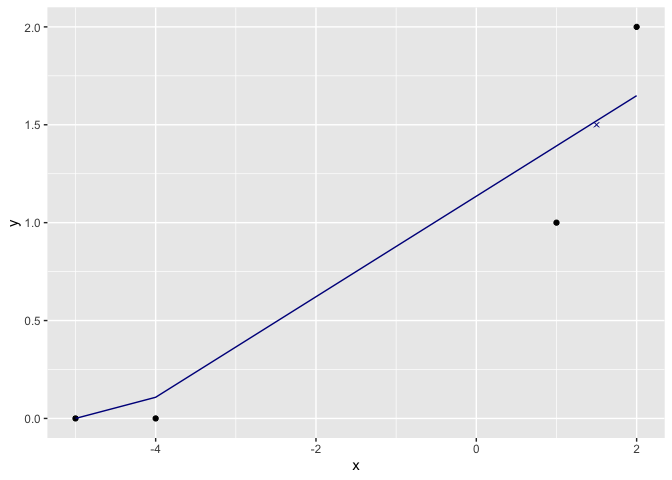

Showing over and under prediction
================
2024-08-13

``` r
library(ggplot2)
```

    ## Warning: package 'ggplot2' was built under R version 4.3.2

``` r
d <- data.frame(
  x = c(-10, -5, 1, 2),
  y = c(0, 0, 1, 2)
)

model <- lm(y ~ x, data=d)
plt_frame <- data.frame(
  x = c(d$x, 1.5)
)
plt_frame['y'] = pmax(0, predict(model, newdata=plt_frame))
mid_frame = data.frame(
  x=1.5,
  y=1.5
)
mid_frame$pred = predict(model, newdata = mid_frame)
ggplot(
  mapping=aes(x=x, y=y) ) + 
  geom_point(data=d) +
  geom_point(data=mid_frame, shape=4, color='darkblue') +
  geom_line(data = plt_frame, color='darkblue')
```

<!-- -->

``` r
mid_frame
```

    ##     x   y     pred
    ## 1 1.5 1.5 1.420213

``` r
d <- data.frame(
  x = c(-5, -4, 1, 2),
  y = c(0, 0, 1, 2)
)

model <- lm(y ~ x, data=d)
plt_frame <- data.frame(
  x = c(d$x, 1.5)
)
plt_frame['y'] = pmax(0, predict(model, newdata=plt_frame))
mid_frame = data.frame(
  x=1.5,
  y=1.5
)
mid_frame$pred = predict(model, newdata = mid_frame)
ggplot(
  mapping=aes(x=x, y=y) ) + 
  geom_point(data=d) +
  geom_point(data=mid_frame, shape=4, color='darkblue') +
  geom_line(data = plt_frame, color='darkblue')
```

<!-- -->

``` r
mid_frame
```

    ##     x   y    pred
    ## 1 1.5 1.5 1.52027
