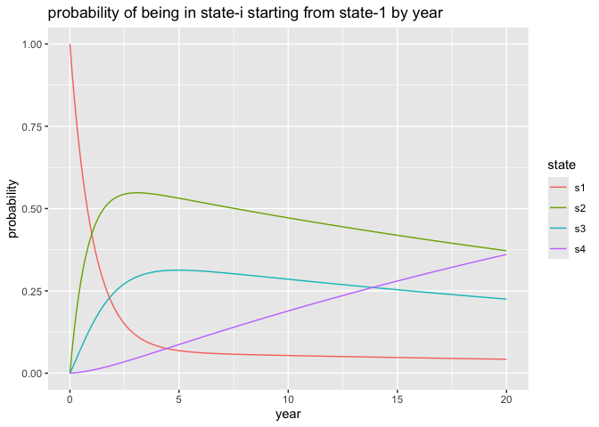

stan_ex
================
2025-08-23

Working the problem shared in: [J. Rickert, “Multistate Models for
Medical
Applications”](https://rviews.rstudio.com/2023/04/19/multistate-models-for-medical-applications/)

``` r
library(msm)
library(rstan)
library(cdata)
library(ggplot2)
```

``` r
cav = cav[order(cav$PTNUM, cav$years), , drop=FALSE]
cav$pt_idx = match(cav$PTNUM, unique(cav$PTNUM))
head(cav)
```

    ##    PTNUM      age    years dage sex pdiag cumrej state firstobs statemax pt_idx
    ## 1 100002 52.49589 0.000000   21   0   IHD      0     1        1        1      1
    ## 2 100002 53.49863 1.002740   21   0   IHD      2     1        0        1      1
    ## 3 100002 54.49863 2.002740   21   0   IHD      2     2        0        2      1
    ## 4 100002 55.58904 3.093151   21   0   IHD      2     2        0        2      1
    ## 5 100002 56.49589 4.000000   21   0   IHD      3     2        0        2      1
    ## 6 100002 57.49315 4.997260   21   0   IHD      3     3        0        3      1

``` r
statetable.msm(state = state, subject = PTNUM, data = cav)
```

    ##     to
    ## from    1    2    3    4
    ##    1 1367  204   44  148
    ##    2   46  134   54   48
    ##    3    4   13  107   55

Each row (except for the first) for each patient represents an observed
state transition. We confirm this by comparing the following counts.

``` r
sum(statetable.msm(state = state, subject = PTNUM, data = cav))
```

    ## [1] 2224

``` r
nrow(cav) - length(unique(cav$PTNUM))
```

    ## [1] 2224

We encode the transitions as an ad-hoc continuous time Markov chain
(time being given by “years”).

For this analysis we are going to assume the observation times are
independent of the states and that there are no unobserved transitions.
This is a strong assumption that the reporting intervals are triggers
are sufficiently sensitive. If this is not the case we need different
methods. We will also model state 4 as absorbing. We can perform the
analysis with different assumptions.

A number of lemmas allow us to represent a [continuous time Markov
chain](https://en.wikipedia.org/wiki/Continuous-time_Markov_chain) by
estimating exponential holding times at each state and the discrete jump
probabilities given a transition takes place.

The [exponential
distribution](https://en.wikipedia.org/wiki/Exponential_distribution) is
a probability distribution on the non-negative reals such that:

- The distribution has a single shape parameters $\lambda$.
- The density at $x$ is $\lambda e^{-\lambda x}$.
- The mean is $1 / \lambda$.
- The CDF or $\text{P}[X <= x]$ is $1 - e^{-\lambda x}$.
- $\text{P}[X >= x] =  e^{-\lambda x}$.
- The distribution is “memoryless” that is
  $\text{P}[X >= a + b \;|\; X >= b] = \text{P}[X >= a]$. Or: no matter
  how long you have waited, your remaining expected wait time remains
  the same. This property allows us to analyze the recorded data row by
  row.

In this formulation:the time spent at state $i$ is distributed
exponential with parameter $\lambda_{i} > 0$.

- The probability of observing a state $i$ to $i$ transition while
  waiting $t$ time units is given by how much mass of the exponential
  distribution is at least $t$. For the exponential distribution this is
  $\text{exp}(-\lambda_{i} t)$.
- The probability of observing a state $i$ to $j$ ($j$ different than
  $i$) transition at an unknown intermediate time $z$ such that
  $0 <= z <= t$ happens with probability given by waiting until time $z$
  in state $i$, jumping from $i$ to $j$ (itself with probability
  $\text{P}[i, j]$) and then waiting in state $j$ for time $t - z$. For
  a given $z$ this probability is
  $(\lambda_{i} \text{exp}(-\lambda_{i} z)) \text{P}[i, j] (\lambda_{j} \text{exp}(-\lambda_{j} (t - z)))$.
  As we don’t know $t$ we integrate it out. The solution in this case is
  (with the correct convention when $\lambda_i = \lambda_j$) then our
  solution is $\text{P}[i, j] I$ where:

$$
I = \int_{0}^{t} \bigl(\lambda_i e^{-\lambda_i z}\bigr) \bigl(\lambda_j e^{-\lambda_j (t-z)}\bigr) dz
$$

For $\lambda_i \neq \lambda_j$:

$$
I = \frac{\lambda_i \lambda_j}{\lambda_i - \lambda_j} \Bigl(e^{-\lambda_j t} - e^{-\lambda_i t}\Bigr).
$$

For $\lambda_i = \lambda_j = \lambda$ the above form is problematic, and
we switch to its limit:

$$
I = \lambda^{2} t e^{-\lambda t}.
$$

The switching is problematic (it destroys derivatives), but could be
softened by different interpolation ideas.

The argument that integrating out $z$ is a correct step is as follows:
we could put it in a model as an unobserved parameter of the model. Then
sampling the model would be picking viable values of $z$ uniformly,
which is numerically equivalent to integrating $z$ out. So either having
$z$ as an explicit unobserved parameter or integrating it out is a
correct inference method. When the math allows it we integrate out $z$,
when it does not we just add many $z$ as model parameters.

Given that we can copy these into Stan as distributional statements.

``` r
stan_src = "
data {
  int<lower=1> m_examples;
  int<lower=2> n_states;
  int<lower=1> n_patients;
  array[m_examples] int<lower=1, upper=n_patients> pt_idx;
  vector[m_examples] years;
  array[m_examples] int<lower=1, upper=n_states> state;
}
parameters {
   vector<lower=0>[n_states - 1] lambda;
   array[n_states - 1] simplex[n_states - 1] Pd;
}
model {
  for (i in 2:m_examples) {
     if ((pt_idx[i-1] == pt_idx[i]) && (state[i] < n_states)) {
       real t;
       real v;
       t = years[i] - years[i-1];
       if (state[i-1] == state[i]) {
          v = exp(-lambda[state[i]] * t);
       } else {
          if (abs(lambda[state[i]] - lambda[state[i-1]]) > 1e-5 ) { // depends on paramter inferences (ick)
            v = (
               lambda[state[i]] * lambda[state[i-1]] 
                 * (
                    exp(-lambda[state[i-1]] * t)
                    - exp(-lambda[state[i]] * t)
                 )
                 / (lambda[state[i]] - lambda[state[i-1]])
            );
          } else {
            v = (
               lambda[state[i]] * lambda[state[i-1]] 
                  * t 
                  * exp(-(lambda[state[i]] + lambda[state[i-1]]) * t / 2)
            );
          }
          if (state[i-1] < state[i]) {
             v = (v + 1e-6) * (Pd[state[i-1], state[i] - 1] + 1e-6);
          } else {
             v = (v + 1e-6) * (Pd[state[i-1], state[i]] + 1e-6);
          }
       }
       target += log(v);
     }
  }
}
"
```

The `Pd`s in this model do not encode self-transitions are in encoded as
follows:

- For $i > j$ $\text{Pd}[i, j]$ is the probability of moving from state
  $i$ to state $j$, given there was a transition.
- For $i < j$ $\text{Pd}[i, j - 1]$ is the probability of moving from
  state $i$ to state $j$, given there was a transition.

Notice there is no representation for a $i$ to $i$ transition. When we
unpack these results we will pad them out to get a more regular
$\text{P}[i, j]$ represents the $i$ to $j$ transition notation.

One can extend the model to parametric inference by writing `Pd` and
`lambda` as parametric functions of instance features.

Let’s use Stan to find a set of parameters for which the observations
are likely.

``` r
model = stan_model(
  model_code=stan_src
)
```

``` r
stan_data <- list(
  m_examples = nrow(cav),
  n_states = max(cav$state),
  n_patients = max(cav$pt_idx),
  pt_idx = array(cav$pt_idx, dim=nrow(cav)),
  years = array(cav$years, dim=nrow(cav)),
  state = array(cav$state, dim=nrow(cav))
)
```

``` r
res <- as.data.frame(sampling(
  model,
  data = stan_data,
  chains = 4,                 # number of Markov chains
  cores = 4,                  # number of cores (could use one per chain)
  warmup = 16000,              # number of warmup iterations per chain
  iter = 20000,                # total number of iterations per chain
  refresh = 0                # no progress shown
))
```

``` r
res = res[res$lp__ >= quantile(res$lp__, 0.9), , drop=FALSE]
res_row = colMeans(res)
```

``` r
head(res)
```

    ##    lambda[1] lambda[2] lambda[3]   Pd[1,1]   Pd[2,1]   Pd[3,1]   Pd[1,2]
    ## 4  0.1106487 0.8235867 0.6301178 0.8206924 0.4345567 0.1676295 0.1754727
    ## 5  0.1166146 0.9118337 0.6043275 0.8147177 0.4814474 0.3488916 0.1808120
    ## 22 0.1159200 0.8088261 0.6242995 0.7827463 0.4549131 0.1987055 0.2136692
    ## 40 0.1085106 0.8763047 0.5570058 0.7995738 0.4682664 0.2008675 0.1979275
    ## 60 0.1139297 0.8903710 0.6342031 0.8071830 0.4657396 0.3195633 0.1917919
    ## 61 0.1135004 0.8651196 0.6055870 0.8230892 0.4507424 0.1898692 0.1744865
    ##      Pd[2,2]   Pd[3,2]     Pd[1,3]     Pd[2,3]    Pd[3,3]      lp__
    ## 4  0.5628864 0.8053693 0.003834870 0.002556885 0.02700122 -1588.732
    ## 5  0.5030391 0.5965096 0.004470257 0.015513495 0.05459882 -1587.938
    ## 22 0.5339387 0.7427983 0.003584536 0.011148126 0.05849623 -1588.500
    ## 40 0.5273770 0.7434437 0.002498706 0.004356628 0.05568876 -1588.549
    ## 60 0.5269918 0.6246473 0.001025131 0.007268539 0.05578939 -1587.941
    ## 61 0.5472652 0.7681938 0.002424239 0.001992417 0.04193697 -1587.977

From our sample can extract the discrete step matrix, which encodes:
given one changed states what state did one change to?

``` r
n_states = max(cav$state)
step_matrix = matrix(0, nrow=n_states, ncol=n_states)
for (i in 1:(n_states - 1)) {
  for (j in 1:n_states) {
     if (i!=j) {
       js = j
       if (j > i) {
         js = j - 1
       }
       step_matrix[i, j] = as.numeric(res_row[paste0('Pd[', i, ',', js, ']')])
     }
  }
}

step_matrix
```

    ##           [,1]      [,2]      [,3]        [,4]
    ## [1,] 0.0000000 0.8162952 0.1796941 0.004010690
    ## [2,] 0.4569063 0.0000000 0.5333479 0.009745752
    ## [3,] 0.2503335 0.6987701 0.0000000 0.050896444
    ## [4,] 0.0000000 0.0000000 0.0000000 0.000000000

And it is then standard to combine this and the expected hold-times to
get the Q matrix.

``` r
Q = step_matrix
for (j in 1:(n_states - 1)) {
  # divide by expected hold time (1/lambda)
  Q[, j] = Q[, j] * res_row[paste0('lambda[', j, ']')]
}
diag = -rowSums(Q)
for (j in 1:(n_states - 1)) {
  Q[j, j] = diag[j]
}

Q
```

    ##             [,1]       [,2]       [,3]        [,4]
    ## [1,] -0.82336581  0.7082519  0.1111032 0.004010690
    ## [2,]  0.05244167 -0.3919516  0.3297642 0.009745752
    ## [3,]  0.02873216  0.6062822 -0.6859108 0.050896444
    ## [4,]  0.00000000  0.0000000  0.0000000 0.000000000

It is a standard argument that the probability of observing a patient
starting in state $i$ being in state $j$ at time $t$ is then
$\text{exp}(t Q)[i, j]$. An example of the `0.1` year situation is as
follows.

``` r
Matrix::expm(0.1 * Q)
```

    ## 4 x 4 Matrix of class "dgeMatrix"
    ##             [,1]       [,2]       [,3]         [,4]
    ## [1,] 0.921151847 0.06699774 0.01140334 0.0004470711
    ## [2,] 0.004981832 0.96269278 0.03128725 0.0010381395
    ## [3,] 0.002814718 0.05756787 0.93466764 0.0049497757
    ## [4,] 0.000000000 0.00000000 0.00000000 1.0000000000

As is usual with exponents, the `k* 0.1` year estimate is the `k'th`
power of the `0.1` year estimate.

``` r
Matrix::expm(3 * 0.1 * Q) - (Matrix::expm(0.1 * Q) %*% Matrix::expm(0.1 * Q) %*% Matrix::expm(0.1 * Q))
```

    ## 4 x 4 Matrix of class "dgeMatrix"
    ##               [,1]          [,2]         [,3]         [,4]
    ## [1,] -1.110223e-16  2.775558e-17 1.387779e-17 0.000000e+00
    ## [2,]  1.734723e-18 -1.110223e-16 5.551115e-17 4.336809e-19
    ## [3,]  5.204170e-18  5.551115e-17 7.771561e-16 6.938894e-18
    ## [4,]  0.000000e+00  0.000000e+00 0.000000e+00 0.000000e+00

Notice we have not referred to the [Kolmogorov
equations](https://en.wikipedia.org/wiki/Kolmogorov_equations#Continuous-time_Markov_chains),
instead attempting to infer parameters that entail a Q-matrix which we
can use to build detailed summaries.

``` r
time_frame = data.frame(
  year = seq(from=0, to=10, by=0.1),
  s1 = 0,
  s2 = 0,
  s3 = 0,
  s4 = 0
  )
for (i in 1:nrow(time_frame)) {
  d = Matrix::expm(max(1e-6, time_frame$year[i]) * Q)  # could also just power up exp(time[1] * Q)
  time_frame[i, 's1'] = d[1, 1]
  time_frame[i, 's2'] = d[1, 2]
  time_frame[i, 's3'] = d[1, 3]
  time_frame[i, 's4'] = d[1, 4]
}
plot_frame = pivot_to_blocks(
  time_frame, 
  nameForNewKeyColumn = 'state', 
  nameForNewValueColumn = 'probability', 
  columnsToTakeFrom = c('s1', 's2', 's3', 's4'))
(
  ggplot(
    data=plot_frame,
    mapping=aes(x=year, y=probability, color=state)
    )
  + geom_line()
  + ggtitle("probability of being in state-i starting from state-1 by year")
)
```

<!-- -->
