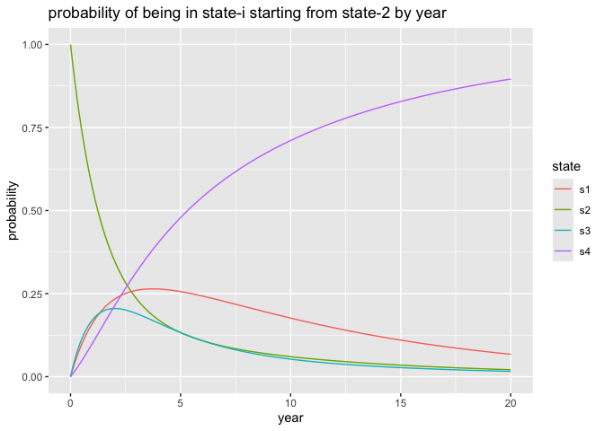
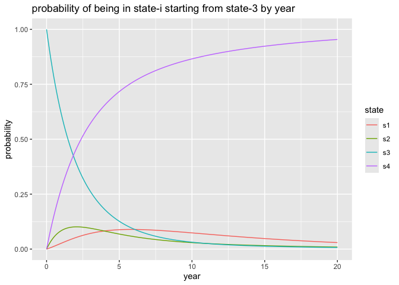

stan_ex
================
2025-08-23

Working a variation of the problem shared in: [J. Rickert, “Multistate
Models for Medical
Applications”](https://rviews.rstudio.com/2023/04/19/multistate-models-for-medical-applications/).

``` r
library(msm)
library(rstan)
library(cdata)
library(ggplot2)
```

For this example we will leave in observed backwards transitions.

``` r
forward_only = FALSE
```

``` r
cav = cav[order(cav$PTNUM, cav$years), , drop=FALSE]
cav$pt_idx = match(cav$PTNUM, unique(cav$PTNUM))
head(cav)
```

    ##    PTNUM      age    years dage sex pdiag cumrej state firstobs statemax pt_idx
    ## 1 100002 52.49589 0.000000   21   0   IHD      0     1        1        1      1
    ## 2 100002 53.49863 1.002740   21   0   IHD      2     1        0        1      1
    ## 3 100002 54.49863 2.002740   21   0   IHD      2     2        0        2      1
    ## 4 100002 55.58904 3.093151   21   0   IHD      2     2        0        2      1
    ## 5 100002 56.49589 4.000000   21   0   IHD      3     2        0        2      1
    ## 6 100002 57.49315 4.997260   21   0   IHD      3     3        0        3      1

``` r
if (forward_only) {
  while(TRUE) {
    regressions = c(FALSE, (diff(cav$pt_idx) == 0) & (diff(cav$state) < 0))
    if (sum(regressions) <= 0) {
      break
    }
    cav = cav[regressions == FALSE, , drop=FALSE]
  }
}
```

``` r
statetable.msm(state = state, subject = PTNUM, data = cav)
```

    ##     to
    ## from    1    2    3    4
    ##    1 1367  204   44  148
    ##    2   46  134   54   48
    ##    3    4   13  107   55

Each row (except for the first) for each patient represents an observed
state transition. We confirm this by comparing the following counts.

``` r
sum(statetable.msm(state = state, subject = PTNUM, data = cav))
```

    ## [1] 2224

``` r
nrow(cav) - length(unique(cav$PTNUM))
```

    ## [1] 2224

We encode this in Q-form where a state `i` to state `j` transition
(`i=j` allowed) after time `t` is observed with probability
`exp(t Q)[i, j]`.

We model state 4 as absorbing. We can perform the analysis with
different assumptions.

Let’s translate this into Stan as distributional statements.

``` r
stan_src = "
data {
  int<lower=0, upper=1> forward_only;
  int<lower=1> m_examples;
  int<lower=2> n_states;
  int<lower=1> n_patients;
  array[m_examples] int<lower=1, upper=n_patients> pt_idx;
  vector[m_examples] years;
  array[m_examples] int<lower=1, upper=n_states> state;
}
parameters {
  matrix<lower=0>[n_states - 1, n_states] Qd;
}
transformed parameters {
  matrix[n_states, n_states] Q;
  for (i in 1:n_states - 1) {
    for (j in 1:n_states) {
      if ( ((forward_only==1) && (i < j)) || ((forward_only==0) && (i != j)) ) {
        Q[i, j] = Qd[i, j];
      } else {
        Q[i, j] = 0;
      }
    }
  }
  for (j in 1:n_states) {
    Q[n_states , j] = 0;
  }
  for (i in 1:n_states - 1) {
    for (j in 1:n_states) {
      if (i != j) {
        Q[i, i] = Q[i, i] - Qd[i, j];
      }
    }
  }
}
model {
  // diffuse priors
  for (i in 1:n_states - 1) {
    for (j in 1:n_states) {
       Qd[i, j] ~ exponential(0.01);
    }
  }
  // relation to observations
  for (i in 2:m_examples) {
     if ((pt_idx[i-1] == pt_idx[i]) && (state[i - 1] < n_states)) {
       real t;
       matrix[n_states, n_states] expQ;
       real pij;
       t = years[i] - years[i-1];
       expQ = matrix_exp( t * Q );
       pij = expQ[state[i-1], state[i]];
       target += log(pij + 1e-6);
     }
  }
}
"
```

Let’s use Stan to find a set of parameters for which the observations
are likely.

``` r
model = stan_model(
  model_code=stan_src
)
```

``` r
stan_data <- list(
  forward_only = if (forward_only) 1 else 0,
  m_examples = nrow(cav),
  n_states = max(cav$state),
  n_patients = max(cav$pt_idx),
  pt_idx = array(cav$pt_idx, dim=nrow(cav)),
  years = array(cav$years, dim=nrow(cav)),
  state = array(cav$state, dim=nrow(cav))
)
```

``` r
res <- as.data.frame(sampling(
  model,
  data = stan_data,
  chains = 4,                 # number of Markov chains
  cores = 4,                  # number of cores (could use one per chain)
  warmup = 500,               # number of warmup iterations per chain
  iter = 1000,                # total number of iterations per chain
  pars = "Q",
  # refresh = 0                # no progress shown
))
```

``` r
res = res[res$lp__ >= quantile(res$lp__, 0.9), , drop=FALSE]
res_row = colMeans(res)
```

``` r
head(res)
```

    ##        Q[1,1]    Q[2,1]     Q[3,1] Q[4,1]    Q[1,2]     Q[2,2]    Q[3,2] Q[4,2]
    ## 6  -0.1714406 0.2238297 0.01964604      0 0.1218169 -0.6028829 0.1512067      0
    ## 9  -0.1841702 0.2479826 0.01252220      0 0.1292913 -0.5845410 0.1134835      0
    ## 21 -0.1744206 0.2269192 0.03861678      0 0.1208582 -0.6202168 0.1802868      0
    ## 36 -0.1727590 0.2500679 0.01306027      0 0.1218090 -0.6350000 0.1540545      0
    ## 41 -0.1750943 0.2334576 0.03975346      0 0.1195889 -0.6037287 0.1235047      0
    ## 46 -0.1758434 0.2026111 0.02091855      0 0.1228458 -0.6170589 0.1415376      0
    ##         Q[1,3]    Q[2,3]     Q[3,3] Q[4,3]     Q[1,4]     Q[2,4]    Q[3,4]
    ## 6  0.003706417 0.2552398 -0.5047383      0 0.04591725 0.12381350 0.3338855
    ## 9  0.004954932 0.2466969 -0.4381051      0 0.04992395 0.08986154 0.3120994
    ## 21 0.003202988 0.3190824 -0.5941110      0 0.05035943 0.07421519 0.3752075
    ## 36 0.001319355 0.3063326 -0.5059344      0 0.04963057 0.07859960 0.3388196
    ## 41 0.001386301 0.2897648 -0.4914640      0 0.05411909 0.08050619 0.3282059
    ## 46 0.000955178 0.3209921 -0.5326698      0 0.05204242 0.09345565 0.3702136
    ##    Q[4,4]      lp__
    ## 6       0 -2008.295
    ## 9       0 -2009.264
    ## 21      0 -2007.989
    ## 36      0 -2008.323
    ## 41      0 -2008.090
    ## 46      0 -2009.376

We now pull out an estimate of the so-called Q matrix.

``` r
n_states = max(cav$state)
Q = matrix(0, nrow=n_states, ncol=n_states)
for (i in 1:(n_states - 1)) {
  for (j in 1:n_states) {
       Q[i, j] = as.numeric(res_row[paste0('Q[', i, ',', j, ']')])
     }
}

Q
```

    ##             [,1]       [,2]         [,3]       [,4]
    ## [1,] -0.17514381  0.1234017  0.003001276 0.04874078
    ## [2,]  0.23121619 -0.6064548  0.293778179 0.08146044
    ## [3,]  0.02139701  0.1419968 -0.501074697 0.33768093
    ## [4,]  0.00000000  0.0000000  0.000000000 0.00000000

It is a standard argument that the probability of observing a patient
starting in state $i$ being in state $j$ at time $t$ is then
$\text{exp}(t Q)[i, j]$. An example of the `0.1` year situation is as
follows.

``` r
Matrix::expm(0.1 * Q)
```

    ## 4 x 4 Matrix of class "dgeMatrix"
    ##             [,1]       [,2]         [,3]        [,4]
    ## [1,] 0.982776757 0.01187157 0.0004638907 0.004887783
    ## [2,] 0.022269891 0.94149021 0.0278019249 0.008437972
    ## [3,] 0.002226202 0.01344902 0.9513253504 0.032999431
    ## [4,] 0.000000000 0.00000000 0.0000000000 1.000000000

As is usual with exponents, the `k* 0.1` year estimate is the `k'th`
power of the `0.1` year estimate.

``` r
Matrix::expm(3 * 0.1 * Q) - (Matrix::expm(0.1 * Q) %*% Matrix::expm(0.1 * Q) %*% Matrix::expm(0.1 * Q))
```

    ## 4 x 4 Matrix of class "dgeMatrix"
    ##               [,1]          [,2]          [,3]          [,4]
    ## [1,]  0.000000e+00  6.938894e-18  0.000000e+00  0.000000e+00
    ## [2,]  6.938894e-18  2.220446e-16  1.387779e-17 -3.469447e-18
    ## [3,] -1.734723e-18 -6.938894e-18 -2.220446e-16  0.000000e+00
    ## [4,]  0.000000e+00  0.000000e+00  0.000000e+00  0.000000e+00

Notice we have not referred to the [Kolmogorov
equations](https://en.wikipedia.org/wiki/Kolmogorov_equations#Continuous-time_Markov_chains),
instead attempting to infer parameters that entail a Q-matrix which we
can use to build detailed summaries.

``` r
for (s0 in 1:3) {
  time_frame = data.frame(
    year = seq(from=0, to=20, by=0.1),
    s1 = 0,
    s2 = 0,
    s3 = 0,
    s4 = 0
    )
  for (i in 1:nrow(time_frame)) {
    d = Matrix::expm(max(1e-6, time_frame$year[i]) * Q)  # could also just power up exp(time[1] * Q)
    time_frame[i, 's1'] = d[s0, 1]
    time_frame[i, 's2'] = d[s0, 2]
    time_frame[i, 's3'] = d[s0, 3]
    time_frame[i, 's4'] = d[s0, 4]
  }
  plot_frame = pivot_to_blocks(
    time_frame, 
    nameForNewKeyColumn = 'state', 
    nameForNewValueColumn = 'probability', 
    columnsToTakeFrom = c('s1', 's2', 's3', 's4'))
  print(
    ggplot(
      data=plot_frame,
      mapping=aes(x=year, y=probability, color=state)
      )
    + geom_line()
    + ggtitle(paste0("probability of being in state-i starting from state-", s0, " by year"))
  )
}
```

<!-- --><!-- --><!-- -->
