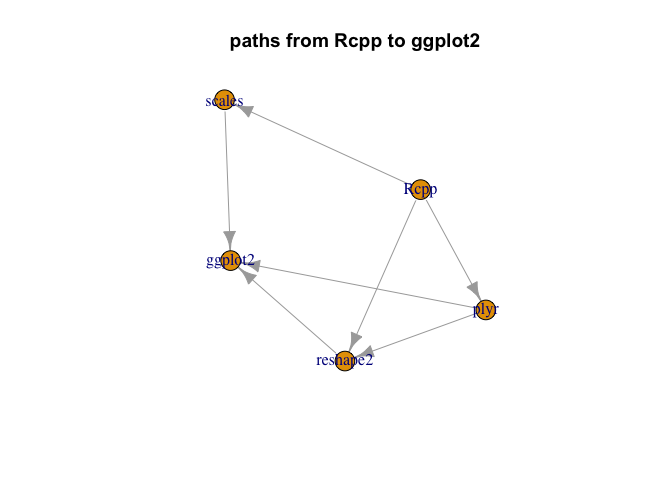

package reach
================

``` r
target_pkg <- "Rcpp"
```

Look at the reach of Rcpp.

``` r
library("rqdatatable")
```

    ## Loading required package: rquery

``` r
# # load package facts
# cran <- tools::CRAN_package_db()
# cr <- tools::CRAN_check_results()
# saveRDS(list(cran = cran, cr = cr), "cran_facts_2019_03_31.RDS")
lst <- readRDS("cran_facts_2019_03_31.RDS")
cran <- lst$cran
```

``` r
base_pkgs <- c("", "R", 
               "base", "compiler", "datasets", 
               "graphics", "grDevices", "grid",
               "methods", "parallel", "splines", 
               "stats", "stats4", "tcltk", "tools",
               "translations", "utils")

# convert comma separated list into
# sequence of non-core package names
parse_lists <- function(strs) {
  strs[is.na(strs)] <- ""
  strs <- gsub("[(][^)]*[)]", "", strs)
  strs <- gsub("\\s+", "", strs)
  strs <- strsplit(strs, ",", fixed=TRUE)
  strs <- lapply(
    strs,
    function(si) {
      setdiff(si, base_pkgs)
    })
  strs
}

# collect the columns we want
# collect the columns we want
d <- data.frame(
  Package = cran$Package,
  stringsAsFactors = FALSE)
for(use_type in c("Depends", "Imports", "Suggests", "LinkingTo")) {
  d[[use_type]] <- parse_lists(cran[[use_type]])
  d[[paste0("n_", use_type)]] <- vapply(d[[use_type]], length, numeric(1))
  use_str <- paste(use_type, target_pkg, sep = "_")
  d[[use_str]] <- vapply(d[[use_type]], 
                            function(di) {
                              target_pkg %in% di
                            }, logical(1))
  print(use_str)
  print(table(d[[use_str]]))
}
```

    ## [1] "Depends_Rcpp"
    ## 
    ## FALSE  TRUE 
    ## 13831   171 
    ## [1] "Imports_Rcpp"
    ## 
    ## FALSE  TRUE 
    ## 12625  1377 
    ## [1] "Suggests_Rcpp"
    ## 
    ## FALSE  TRUE 
    ## 13979    23 
    ## [1] "LinkingTo_Rcpp"
    ## 
    ## FALSE  TRUE 
    ## 12419  1583

``` r
# build relation graph edges
n_nodes <- nrow(d)
want <- logical(n_nodes)
for(relation in c("LinkingTo", "Depends", "Imports")) {
  want <- want | d[[paste(relation, target_pkg, sep = "_")]]
}
summary(want)
```

    ##    Mode   FALSE    TRUE 
    ## logical   12397    1605

``` r
edges <- data.frame(
  Uses = target_pkg,
  Package = d$Package[want],
  stringsAsFactors = FALSE)
nrow(edges)
```

    ## [1] 1605

``` r
# ick row-wise
get_edges <- function(row) {
  deps <- character(0)
  if(row$Package[[1]]!=target_pkg) {
    deps <- sort(base::unique(c(row$Depends[[1]], row$Imports[[1]], row$LinkingTo[[1]])))
  }
  if(length(deps)<1) {
    return(data.frame(
      Uses = character(0),
      Package = character(0),
      stringsAsFactors = FALSE))
  }
  data.frame(
      Uses = deps,
      Package = row$Package[[1]],
      stringsAsFactors = FALSE)
}
ee <- lapply(seq_len(n_nodes),
             function(i) {
               get_edges(d[i, , drop = FALSE])
             })
ee <- do.call(rbind, ee)
ee <- ee[(ee$Uses!=target_pkg) & (ee$Package!=target_pkg), , drop = FALSE]
ee <- rbind(edges, ee)
ee <- ee[(!(ee$Uses %in% base_pkgs)) & (!(ee$Package %in% base_pkgs)), , drop = FALSE]
```

``` r
# analyze the graph
graph <- igraph::graph_from_edgelist(as.matrix(ee), directed = TRUE)
f <- function(order) {
  length(igraph::ego(graph, mode="out", nodes = target_pkg, order = order)[[1]])
}


find_induced_subgraph <- function(start, end) {
  dist <- as.numeric(igraph::distances(graph, v = start, to = end , mode = "out"))
  if(is.infinite(dist)) {
    return(NULL)
  }
  nbhd <- igraph::ego(graph, mode="out", nodes = start, order = n_nodes)[[1]]
  dback <- igraph::distances(graph, v = end, to = nbhd , mode = "in")
  nodes <- dback[ , !is.infinite(dback[1, , drop = TRUE]), drop = TRUE]
  subg <- igraph::induced_subgraph(graph, nbhd[names(nodes)], impl = "create_from_scratch")
  subg
}


# look at size distribution as a function of links from package

(sizes <- vapply(0:10, f, numeric(1)))
```

    ##  [1]    1 1606 4899 6152 6314 6336 6337 6337 6337 6337 6337

``` r
(sizes <- sizes - c(0, sizes[-length(sizes)]))
```

    ##  [1]    1 1605 3293 1253  162   22    1    0    0    0    0

``` r
(sum(sizes)-1)/n_nodes
```

    ## [1] 0.4525068

``` r
for(i in wrapr::seqi(1, min(which(sizes==0))-2)) {
  print(i)
  (pkg <- setdiff(names(igraph::ego(graph, mode="out", nodes = target_pkg, order = i)[[1]]), 
                  names(igraph::ego(graph, mode="out", nodes = target_pkg, order = i-1)[[1]])))
  (pkg <- pkg[[sample.int(length(pkg),1)]])
  
  plot(find_induced_subgraph(target_pkg, pkg))
  title(paste("paths from", target_pkg, "to", pkg))
}
```

    ## [1] 1


    ## [1] 2


    ## [1] 3


    ## [1] 4


    ## [1] 5


    ## [1] 6


``` r
# Look at some examples


plot(find_induced_subgraph(target_pkg, "ggplot2"))
title(paste("paths from", target_pkg, "to", "ggplot2"))
```


``` r
plot(find_induced_subgraph(target_pkg, "tidyr"))
title(paste("paths from", target_pkg, "to", "tidyr"))
```


``` r
# look for large packages
root_pkgs <- setdiff(unique(ee$Uses), ee$Package)
seeds <- c("dplyr", "tidyr", "ggplot2", "rlang", "reshape", "reshape2", "plyr", "tibble")
root_pkgs <- sort(unique(c(root_pkgs, seeds)))
reach <- vapply(root_pkgs,
                function(pi) {
                  length(igraph::ego(graph, mode="out", nodes = pi, order = 100)[[1]])
                }, numeric(1))
reach <- reach[(reach>=1000) | (names(reach) %in% seeds)]
reach <- reach[order(-reach)]
reach
```

    ##         Rcpp      lattice     magrittr         MASS           R6 
    ##         6337         6045         4901         4617         4300 
    ##        rlang    pkgconfig         glue       crayon   assertthat 
    ##         4017         4005         3971         3945         3880 
    ##      stringi         utf8        fansi       tibble       digest 
    ##         3714         3613         3612         3608         3387 
    ##         plyr           BH RColorBrewer   colorspace        withr 
    ##         3108         2832         2754         2709         2689 
    ##     reshape2  viridisLite     lazyeval     labeling       gtable 
    ##         2681         2595         2584         2580         2554 
    ##      ggplot2     jsonlite         mime        plogr        dplyr 
    ##         2507         2399         2142         1745         1671 
    ##         curl   data.table    codetools         yaml      mvtnorm 
    ##         1647         1418         1383         1366         1279 
    ##    base64enc       xtable          sys        tidyr      reshape 
    ##         1042         1034         1021          898          179

``` r
reachf <- data.frame(Package = names(reach),
                     reach = reach,
                     stringsAsFactors = FALSE)
reachf$Package <- reorder(reachf$Package, reachf$reach)

library("ggplot2")

ggplot(data = reachf, mapping = aes(x = Package, y = reach)) + 
  geom_segment(aes(xend = Package, yend=0), color = "blue") +
  geom_point(color = "blue", size = 2) +
  coord_flip() +
  ggtitle("package reach")
```



``` r
reachf <- reachf[order(as.character(reachf$Package)), , drop = FALSE]
rownames(reachf) <- NULL
reachf$fraction <- reachf$reach / n_nodes
knitr::kable(reachf)
```

| Package      |  reach|   fraction|
|:-------------|------:|----------:|
| assertthat   |   3880|  0.2771033|
| base64enc    |   1042|  0.0744179|
| BH           |   2832|  0.2022568|
| codetools    |   1383|  0.0987716|
| colorspace   |   2709|  0.1934724|
| crayon       |   3945|  0.2817455|
| curl         |   1647|  0.1176261|
| data.table   |   1418|  0.1012712|
| digest       |   3387|  0.2418940|
| dplyr        |   1671|  0.1193401|
| fansi        |   3612|  0.2579631|
| ggplot2      |   2507|  0.1790459|
| glue         |   3971|  0.2836023|
| gtable       |   2554|  0.1824025|
| jsonlite     |   2399|  0.1713327|
| labeling     |   2580|  0.1842594|
| lattice      |   6045|  0.4317240|
| lazyeval     |   2584|  0.1845451|
| magrittr     |   4901|  0.3500214|
| MASS         |   4617|  0.3297386|
| mime         |   2142|  0.1529781|
| mvtnorm      |   1279|  0.0913441|
| pkgconfig    |   4005|  0.2860306|
| plogr        |   1745|  0.1246251|
| plyr         |   3108|  0.2219683|
| R6           |   4300|  0.3070990|
| RColorBrewer |   2754|  0.1966862|
| Rcpp         |   6337|  0.4525782|
| reshape      |    179|  0.0127839|
| reshape2     |   2681|  0.1914726|
| rlang        |   4017|  0.2868876|
| stringi      |   3714|  0.2652478|
| sys          |   1021|  0.0729182|
| tibble       |   3608|  0.2576775|
| tidyr        |    898|  0.0641337|
| utf8         |   3613|  0.2580346|
| viridisLite  |   2595|  0.1853307|
| withr        |   2689|  0.1920440|
| xtable       |   1034|  0.0738466|
| yaml         |   1366|  0.0975575|
