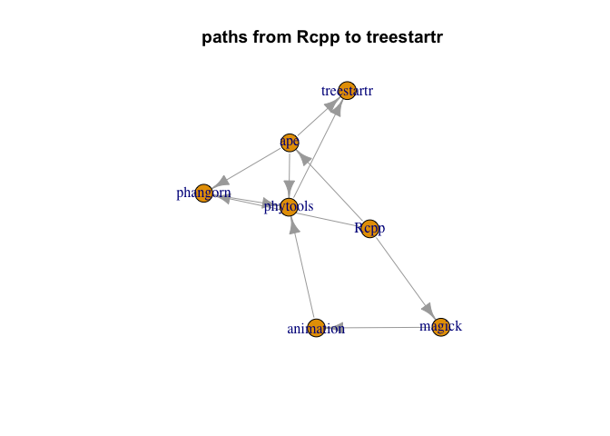
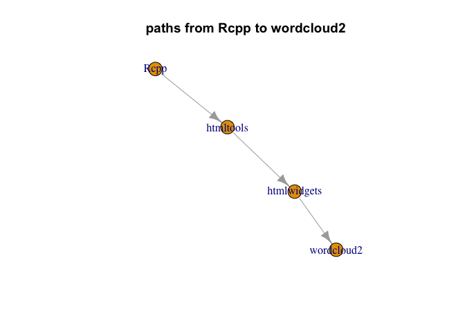
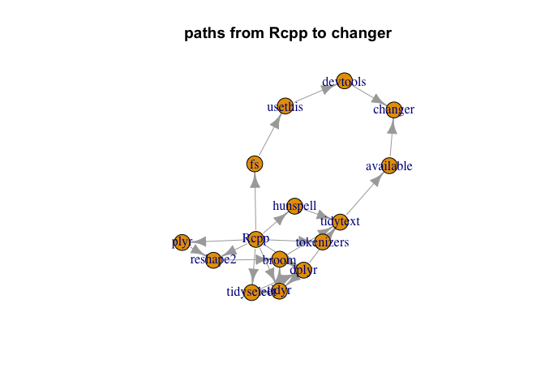
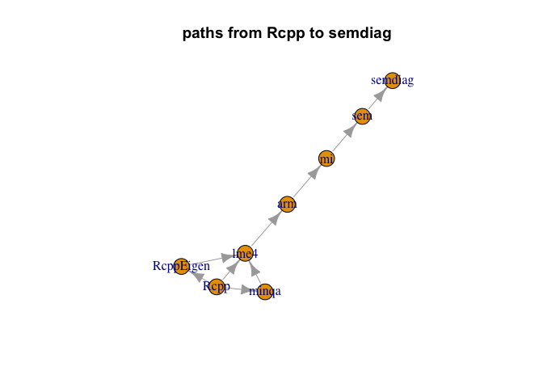
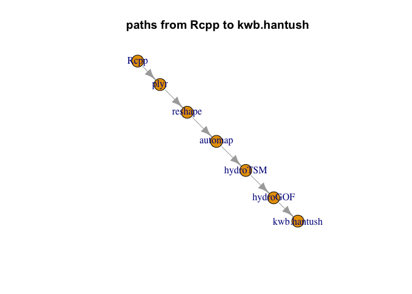
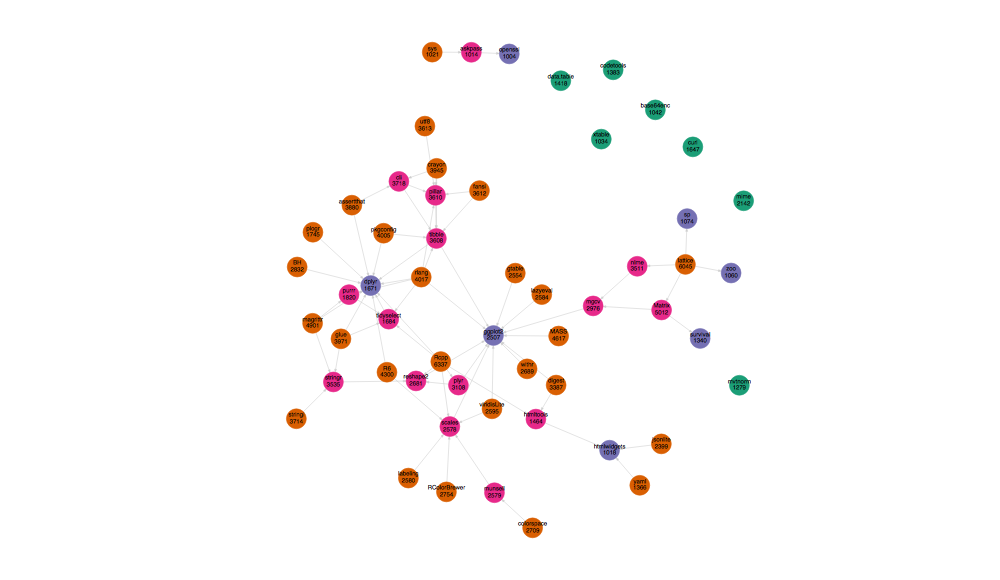
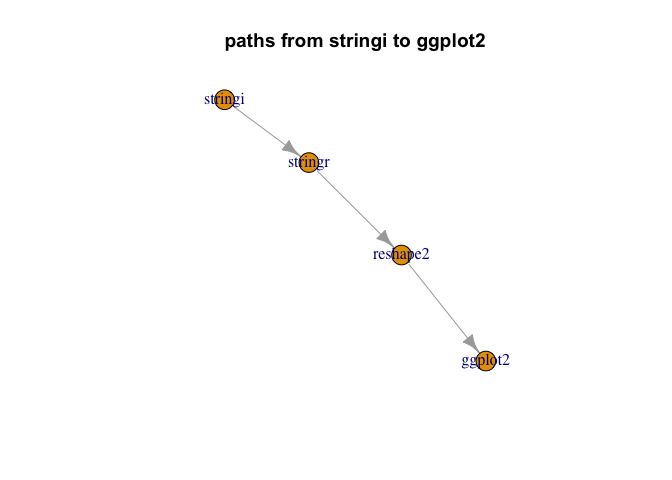

package reach
================

``` r
target_pkg <- "Rcpp"
```

Look at the reach of Rcpp.

``` r
library("rqdatatable")
```

    ## Loading required package: rquery

``` r
# # load package facts
# cran <- tools::CRAN_package_db()
# cr <- tools::CRAN_check_results()
# saveRDS(list(cran = cran, cr = cr), "cran_facts_2019_03_31.RDS")
lst <- readRDS("cran_facts_2019_03_31.RDS")
cran <- lst$cran
```

``` r
base_pkgs <- c("", "R", 
               "base", "compiler", "datasets", 
               "graphics", "grDevices", "grid",
               "methods", "parallel", "splines", 
               "stats", "stats4", "tcltk", "tools",
               "translations", "utils")

# convert comma separated list into
# sequence of non-core package names
parse_lists <- function(strs) {
  strs[is.na(strs)] <- ""
  strs <- gsub("[(][^)]*[)]", "", strs)
  strs <- gsub("\\s+", "", strs)
  strs <- strsplit(strs, ",", fixed=TRUE)
  strs <- lapply(
    strs,
    function(si) {
      setdiff(si, base_pkgs)
    })
  strs
}

# collect the columns we want
# collect the columns we want
d <- data.frame(
  Package = cran$Package,
  stringsAsFactors = FALSE)
for(use_type in c("Depends", "Imports", "Suggests", "LinkingTo")) {
  d[[use_type]] <- parse_lists(cran[[use_type]])
  d[[paste0("n_", use_type)]] <- vapply(d[[use_type]], length, numeric(1))
  use_str <- paste(use_type, target_pkg, sep = "_")
  d[[use_str]] <- vapply(d[[use_type]], 
                            function(di) {
                              target_pkg %in% di
                            }, logical(1))
  print(use_str)
  print(table(d[[use_str]]))
}
```

    ## [1] "Depends_Rcpp"
    ## 
    ## FALSE  TRUE 
    ## 13831   171 
    ## [1] "Imports_Rcpp"
    ## 
    ## FALSE  TRUE 
    ## 12625  1377 
    ## [1] "Suggests_Rcpp"
    ## 
    ## FALSE  TRUE 
    ## 13979    23 
    ## [1] "LinkingTo_Rcpp"
    ## 
    ## FALSE  TRUE 
    ## 12419  1583

``` r
# build relation graph edges
n_nodes <- nrow(d)
want <- logical(n_nodes)
for(relation in c("LinkingTo", "Depends", "Imports")) {
  want <- want | d[[paste(relation, target_pkg, sep = "_")]]
}
summary(want)
```

    ##    Mode   FALSE    TRUE 
    ## logical   12397    1605

``` r
edges <- data.frame(
  Uses = target_pkg,
  Package = d$Package[want],
  stringsAsFactors = FALSE)
nrow(edges)
```

    ## [1] 1605

``` r
# ick row-wise
get_edges_f <- function(row) {
  deps <- character(0)
  if(row$Package[[1]]!=target_pkg) {
    deps <- sort(base::unique(c(row$Depends[[1]], row$Imports[[1]], row$LinkingTo[[1]])))
  }
  if(length(deps)<1) {
    return(data.frame(
      Uses = character(0),
      Package = character(0),
      stringsAsFactors = FALSE))
  }
  data.frame(
      Uses = deps,
      Package = row$Package[[1]],
      stringsAsFactors = FALSE)
}
ee <- lapply(seq_len(n_nodes),
             function(i) {
               get_edges_f(d[i, , drop = FALSE])
             })
ee <- do.call(rbind, ee)
ee <- ee[(ee$Uses!=target_pkg) & (ee$Package!=target_pkg), , drop = FALSE]
ee <- rbind(edges, ee)
ee <- ee[(!(ee$Uses %in% base_pkgs)) & (!(ee$Package %in% base_pkgs)), , drop = FALSE]
```

``` r
# analyze the graph
graph <- igraph::graph_from_edgelist(as.matrix(ee), directed = TRUE)
igraph::is.dag(graph)
```

    ## [1] TRUE

``` r
f <- function(order) {
  length(igraph::ego(graph, mode="out", nodes = target_pkg, order = order)[[1]])
}


find_induced_subgraph <- function(start, end) {
  dist <- as.numeric(igraph::distances(graph, v = start, to = end , mode = "out"))
  if(is.infinite(dist)) {
    return(NULL)
  }
  nbhd <- igraph::ego(graph, mode="out", nodes = start, order = n_nodes)[[1]]
  dback <- igraph::distances(graph, v = end, to = nbhd , mode = "in")
  nodes <- dback[ , !is.infinite(dback[1, , drop = TRUE]), drop = TRUE]
  subg <- igraph::induced_subgraph(graph, nbhd[names(nodes)], impl = "create_from_scratch")
  subg
}


# look at size distribution as a function of links from package

(sizes <- vapply(0:10, f, numeric(1)))
```

    ##  [1]    1 1606 4899 6152 6314 6336 6337 6337 6337 6337 6337

``` r
(sizes <- sizes - c(0, sizes[-length(sizes)]))
```

    ##  [1]    1 1605 3293 1253  162   22    1    0    0    0    0

``` r
(sum(sizes)-1)/n_nodes
```

    ## [1] 0.4525068

``` r
for(i in wrapr::seqi(1, min(which(sizes==0))-2)) {
  print(i)
  (pkg <- setdiff(names(igraph::ego(graph, mode="out", nodes = target_pkg, order = i)[[1]]), 
                  names(igraph::ego(graph, mode="out", nodes = target_pkg, order = i-1)[[1]])))
  (pkg <- pkg[[sample.int(length(pkg),1)]])
  
  plot(find_induced_subgraph(target_pkg, pkg))
  title(paste("paths from", target_pkg, "to", pkg))
}
```

    ## [1] 1


    ## [1] 2



    ## [1] 3



    ## [1] 4



    ## [1] 5



    ## [1] 6



``` r
# Look at some examples


plot(find_induced_subgraph(target_pkg, "ggplot2"))
title(paste("paths from", target_pkg, "to", "ggplot2"))
```


``` r
plot(find_induced_subgraph(target_pkg, "tidyr"))
title(paste("paths from", target_pkg, "to", "tidyr"))
```


For page-rank see also the earlier work of [andrie/pagerank](https://github.com/andrie/pagerank).

``` r
# look at page rank
pr <- igraph::page_rank(graph, directed = FALSE)
ranksu <- pr[[1]]
head(ranksu[order(-ranksu)], n = 100)
```

    ##          Rcpp          MASS       ggplot2         dplyr        Matrix 
    ##  0.0176048480  0.0147493539  0.0142858040  0.0094262472  0.0081686009 
    ##       mvtnorm      survival       stringr      magrittr          plyr 
    ##  0.0064296145  0.0060656663  0.0059605732  0.0059290170  0.0059170282 
    ## RcppArmadillo      jsonlite    data.table          httr        igraph 
    ##  0.0058286223  0.0055452347  0.0051754217  0.0050758330  0.0043153151 
    ##       foreach       lattice            sp        tibble         shiny 
    ##  0.0042677377  0.0041529766  0.0040827879  0.0039682756  0.0038400250 
    ##      reshape2         tidyr         purrr         rlang    doParallel 
    ##  0.0036398494  0.0034885900  0.0032318578  0.0031999917  0.0030088077 
    ##  RColorBrewer          coda           zoo        raster        scales 
    ##  0.0027112694  0.0025823188  0.0024735797  0.0024487715  0.0022703492 
    ##     lubridate           XML      numDeriv          nlme     gridExtra 
    ##  0.0022686519  0.0022510433  0.0022402631  0.0021926590  0.0021010654 
    ##          boot         RCurl        glmnet          xml2           ape 
    ##  0.0020989121  0.0020960222  0.0020163019  0.0020080026  0.0019898175 
    ##          mgcv           rgl            R6          lme4         Hmisc 
    ##  0.0019668707  0.0019329109  0.0019321364  0.0019196030  0.0017979698 
    ##     RcppEigen        gtools         readr         knitr        digest 
    ##  0.0017735282  0.0017538998  0.0017530324  0.0017119153  0.0016775741 
    ##       cluster            BH         rJava    assertthat         rgdal 
    ##  0.0016597348  0.0015806091  0.0015585240  0.0015027618  0.0014995369 
    ##           car        fields         abind       Formula       stringi 
    ##  0.0014965067  0.0014462739  0.0014233428  0.0014227795  0.0013724622 
    ##        pracma          curl         e1071        gplots     htmltools 
    ##  0.0012731778  0.0012530704  0.0012102455  0.0011908229  0.0011722599 
    ##   htmlwidgets  randomForest   matrixStats           DBI     rmarkdown 
    ##  0.0011588519  0.0011332387  0.0011235511  0.0011109912  0.0011061578 
    ##          nnet      quadprog        xtable         rgeos         vegan 
    ##  0.0010958997  0.0010911149  0.0010722776  0.0010660375  0.0010505855 
    ##         rpart       corpcor       plotrix         psych      quantreg 
    ##  0.0010450481  0.0010270037  0.0010054516  0.0009994554  0.0009522582 
    ##        crayon    robustbase      spatstat      lazyeval           xts 
    ##  0.0009489958  0.0009367402  0.0009361444  0.0009063139  0.0009058668 
    ##      forecast        plotly    colorspace       R.utils      sandwich 
    ##  0.0008923884  0.0008919703  0.0008849384  0.0008799795  0.0008673012 
    ##          glue       deSolve        Rdpack      maptools        mclust 
    ##  0.0008641411  0.0008634447  0.0008618278  0.0008586200  0.0008440189 
    ##     checkmate     iterators            sf         caret         rjson 
    ##  0.0008382363  0.0008128617  0.0008111455  0.0007794065  0.0007793108

``` r
# graph with edges reversed
rgraph <- igraph::graph_from_edgelist(as.matrix(ee[ , c("Package", "Uses"), ]), directed = TRUE)
pr <- igraph::page_rank(rgraph, directed = TRUE)
ranksr <- pr[[1]]
head(ranksr[order(-ranksr)], n = 100)
```

    ##          Rcpp       lattice        Matrix          MASS       ggplot2 
    ##  0.0413945385  0.0413057550  0.0214926964  0.0205909949  0.0113395298 
    ##      magrittr      survival       mvtnorm      jsonlite          plyr 
    ##  0.0102471424  0.0078643741  0.0074593760  0.0073796442  0.0071147497 
    ##       stringr         dplyr         rlang            sp RcppArmadillo 
    ##  0.0069379931  0.0066855165  0.0065268746  0.0063306080  0.0049965502 
    ##          nlme        tibble           zoo          httr        digest 
    ##  0.0049420396  0.0048866417  0.0048422050  0.0047213480  0.0046898774 
    ##       foreach    data.table            R6        igraph         shiny 
    ##  0.0046282540  0.0045512645  0.0045202085  0.0040472914  0.0035924613 
    ##     iterators          glue      reshape2       stringi          coda 
    ##  0.0035059262  0.0033956235  0.0033365715  0.0032382916  0.0032194850 
    ##          mgcv      numDeriv        gtools        crayon          boot 
    ##  0.0029639734  0.0028704246  0.0027152258  0.0026826909  0.0026591405 
    ##  RColorBrewer     pkgconfig     codetools        bitops            BH 
    ##  0.0026193534  0.0025979958  0.0025881399  0.0025344829  0.0024783472 
    ##     htmltools        gtable         rJava        scales    assertthat 
    ##  0.0024707188  0.0024498776  0.0024322962  0.0024024732  0.0023664016 
    ##          curl         purrr           XML       cluster         RCurl 
    ##  0.0023028882  0.0022735869  0.0022604477  0.0022584838  0.0019404629 
    ##           ape         tidyr         abind    doParallel        raster 
    ##  0.0019094729  0.0018855494  0.0018331338  0.0018285317  0.0018126972 
    ##      quadprog     RcppEigen           rgl          lme4          mime 
    ##  0.0017927820  0.0017612387  0.0017544487  0.0017128052  0.0016807821 
    ##        glmnet         knitr          xml2     lubridate         class 
    ##  0.0016433711  0.0016284379  0.0016283552  0.0015710750  0.0015311418 
    ##      lazyeval       Formula        gplots     gridExtra   htmlwidgets 
    ##  0.0015003746  0.0014838267  0.0014695057  0.0014542295  0.0014093439 
    ##           car   viridisLite           DBI         Hmisc     backports 
    ##  0.0013952689  0.0013918201  0.0013571766  0.0013522150  0.0013388502 
    ##         rpart          yaml         withr   R.methodsS3      sandwich 
    ##  0.0013306353  0.0013070122  0.0012904007  0.0012521829  0.0012297654 
    ##    colorspace          nnet      quantreg       openssl           cli 
    ##  0.0012187920  0.0012186620  0.0011920099  0.0011912211  0.0011852173 
    ##        fields       lpSolve       askpass         readr        xtable 
    ##  0.0011733873  0.0011533725  0.0011171720  0.0011092892  0.0011068106 
    ##           sys          maps        pracma    KernSmooth     checkmate 
    ##  0.0011035439  0.0010955005  0.0010796890  0.0010703314  0.0010199584 
    ##       foreign   matrixStats         rgdal         e1071        mnormt 
    ##  0.0010153012  0.0009849114  0.0009549801  0.0009435228  0.0009377159

``` r
# original graph (edges not in correct direction for this application)
pr <- igraph::page_rank(graph, directed = TRUE)
rankse <- pr[[1]]
head(rankse[order(rankse)], n = 100)
```

    ##                        MASS                     stringi 
    ##                6.411838e-05                6.411838e-05 
    ##                        Rcpp                     pbapply 
    ##                6.411838e-05                6.411838e-05 
    ##                      xtable                        curl 
    ##                6.411838e-05                6.411838e-05 
    ##                         XML                    abc.data 
    ##                6.411838e-05                6.411838e-05 
    ##                        nnet                     plotrix 
    ##                6.411838e-05                6.411838e-05 
    ##                    corrplot                     lattice 
    ##                6.411838e-05                6.411838e-05 
    ##                 matrixStats                       abind 
    ##                6.411838e-05                6.411838e-05 
    ##                        glue                    magrittr 
    ##                6.411838e-05                6.411838e-05 
    ##                       rlang                  rstudioapi 
    ##                6.411838e-05                6.411838e-05 
    ##                       Cairo                     cluster 
    ##                6.411838e-05                6.411838e-05 
    ##                     kernlab                     Biobase 
    ##                6.411838e-05                6.411838e-05 
    ##                       DESeq                       limma 
    ##                6.411838e-05                6.411838e-05 
    ##                        QUIC                  data.table 
    ##                6.411838e-05                6.411838e-05 
    ##                         DBI                   iterators 
    ##                6.411838e-05                6.411838e-05 
    ##                     nleqslv            PhysicalActivity 
    ##                6.411838e-05                6.411838e-05 
    ##                        fgui                      tcltk2 
    ##                6.411838e-05                6.411838e-05 
    ##                     compare                          BH 
    ##                6.411838e-05                6.411838e-05 
    ##                  filematrix                     foreign 
    ##                6.411838e-05                6.411838e-05 
    ##                 R.methodsS3                     dummies 
    ##                6.411838e-05                6.411838e-05 
    ##                randomForest                     lpSolve 
    ##                6.411838e-05                6.411838e-05 
    ##                   acss.data                  Biostrings 
    ##                6.411838e-05                6.411838e-05 
    ##                    BSgenome BSgenome.Hsapiens.UCSC.hg19 
    ##                6.411838e-05                6.411838e-05 
    ##                GenomeInfoDb               GenomicRanges 
    ##                6.411838e-05                6.411838e-05 
    ##                     IRanges                   S4Vectors 
    ##                6.411838e-05                6.411838e-05 
    ##                       chron                      expint 
    ##                6.411838e-05                6.411838e-05 
    ##                   fftwtools                       rpart 
    ##                6.411838e-05                6.411838e-05 
    ##                         FNN                        nnls 
    ##                6.411838e-05                6.411838e-05 
    ##                        lars                    quadprog 
    ##                6.411838e-05                6.411838e-05 
    ##                      digest                       git2r 
    ##                6.411838e-05                6.411838e-05 
    ##                    versions                      pracma 
    ##                6.411838e-05                6.411838e-05 
    ##                    phyloseq                     mvtnorm 
    ##                6.411838e-05                6.411838e-05 
    ##                        boot                   rootSolve 
    ##                6.411838e-05                6.411838e-05 
    ##                    rappdirs                  lpSolveAPI 
    ##                6.411838e-05                6.411838e-05 
    ##                    combinat                        glm2 
    ##                6.411838e-05                6.411838e-05 
    ##                     tkrplot                       pdist 
    ##                6.411838e-05                6.411838e-05 
    ##                  KernSmooth                      deldir 
    ##                6.411838e-05                6.411838e-05 
    ##                    filehash                       audio 
    ##                6.411838e-05                6.411838e-05 
    ##                       shape                       clipr 
    ##                6.411838e-05                6.411838e-05 
    ##                   highlight                  manipulate 
    ##                6.411838e-05                6.411838e-05 
    ##                 viridisLite                     polynom 
    ##                6.411838e-05                6.411838e-05 
    ##                  awsMethods                RcppProgress 
    ##                6.411838e-05                6.411838e-05 
    ##                     ellipse                GenBinomApps 
    ##                6.411838e-05                6.411838e-05 
    ##                    waveslim                  assertthat 
    ##                6.411838e-05                6.411838e-05 
    ##                     Formula                  colorspace 
    ##                6.411838e-05                6.411838e-05 
    ##                     writexl                     moments 
    ##                6.411838e-05                6.411838e-05 
    ##                         png                  minpack.lm 
    ##                6.411838e-05                6.411838e-05 
    ##                     geepack                       dummy 
    ##                6.411838e-05                6.411838e-05 
    ##                 binaryLogic                   AlgDesign 
    ##                6.411838e-05                6.411838e-05 
    ##                  matrixcalc                        yaml 
    ##                6.411838e-05                6.411838e-05 
    ##                        VGAM                     nortest 
    ##                6.411838e-05                6.411838e-05

``` r
# look for large/famous packages
target_pkgs <- sort(unique(ee$Uses))
reaches <- vapply(target_pkgs,
                function(pi) {
                  length(igraph::ego(graph, mode="out", nodes = pi, order = 100)[[1]])
                }, numeric(1))
reach <- reaches[reaches>=1000]
reach <- reach[order(-reach)]
reach
```

    ##         Rcpp      lattice       Matrix     magrittr         MASS 
    ##         6337         6045         5012         4901         4617 
    ##           R6        rlang    pkgconfig         glue       crayon 
    ##         4300         4017         4005         3971         3945 
    ##   assertthat          cli      stringi         utf8        fansi 
    ##         3880         3718         3714         3613         3612 
    ##       pillar       tibble      stringr         nlme       digest 
    ##         3610         3608         3535         3511         3387 
    ##         plyr         mgcv           BH RColorBrewer   colorspace 
    ##         3108         2976         2832         2754         2709 
    ##        withr     reshape2  viridisLite     lazyeval     labeling 
    ##         2689         2681         2595         2584         2580 
    ##      munsell       scales       gtable      ggplot2     jsonlite 
    ##         2579         2578         2554         2507         2399 
    ##         mime        purrr        plogr   tidyselect        dplyr 
    ##         2142         1820         1745         1684         1671 
    ##         curl    htmltools   data.table    codetools         yaml 
    ##         1647         1464         1418         1383         1366 
    ##     survival      mvtnorm           sp          zoo    base64enc 
    ##         1340         1279         1074         1060         1042 
    ##       xtable          sys  htmlwidgets      askpass      openssl 
    ##         1034         1021         1018         1014         1004

``` r
reachf <- data.frame(Package = names(reach),
                     reach = reach,
                     stringsAsFactors = FALSE)
reachf$Package <- reorder(reachf$Package, reachf$reach)

library("ggplot2")

ggplot(data = reachf, mapping = aes(x = Package, y = reach)) + 
  geom_segment(aes(xend = Package, yend=0), color = "blue") +
  geom_point(color = "blue", size = 2) +
  coord_flip() +
  ggtitle("package reach")
```


``` r
reachf <- reachf[order(as.character(reachf$Package)), , drop = FALSE]
rownames(reachf) <- NULL
reachf$fraction <- reachf$reach / n_nodes
knitr::kable(reachf)
```

| Package      |  reach|   fraction|
|:-------------|------:|----------:|
| askpass      |   1014|  0.0724182|
| assertthat   |   3880|  0.2771033|
| base64enc    |   1042|  0.0744179|
| BH           |   2832|  0.2022568|
| cli          |   3718|  0.2655335|
| codetools    |   1383|  0.0987716|
| colorspace   |   2709|  0.1934724|
| crayon       |   3945|  0.2817455|
| curl         |   1647|  0.1176261|
| data.table   |   1418|  0.1012712|
| digest       |   3387|  0.2418940|
| dplyr        |   1671|  0.1193401|
| fansi        |   3612|  0.2579631|
| ggplot2      |   2507|  0.1790459|
| glue         |   3971|  0.2836023|
| gtable       |   2554|  0.1824025|
| htmltools    |   1464|  0.1045565|
| htmlwidgets  |   1018|  0.0727039|
| jsonlite     |   2399|  0.1713327|
| labeling     |   2580|  0.1842594|
| lattice      |   6045|  0.4317240|
| lazyeval     |   2584|  0.1845451|
| magrittr     |   4901|  0.3500214|
| MASS         |   4617|  0.3297386|
| Matrix       |   5012|  0.3579489|
| mgcv         |   2976|  0.2125411|
| mime         |   2142|  0.1529781|
| munsell      |   2579|  0.1841880|
| mvtnorm      |   1279|  0.0913441|
| nlme         |   3511|  0.2507499|
| openssl      |   1004|  0.0717040|
| pillar       |   3610|  0.2578203|
| pkgconfig    |   4005|  0.2860306|
| plogr        |   1745|  0.1246251|
| plyr         |   3108|  0.2219683|
| purrr        |   1820|  0.1299814|
| R6           |   4300|  0.3070990|
| RColorBrewer |   2754|  0.1966862|
| Rcpp         |   6337|  0.4525782|
| reshape2     |   2681|  0.1914726|
| rlang        |   4017|  0.2868876|
| scales       |   2578|  0.1841166|
| sp           |   1074|  0.0767033|
| stringi      |   3714|  0.2652478|
| stringr      |   3535|  0.2524639|
| survival     |   1340|  0.0957006|
| sys          |   1021|  0.0729182|
| tibble       |   3608|  0.2576775|
| tidyselect   |   1684|  0.1202685|
| utf8         |   3613|  0.2580346|
| viridisLite  |   2595|  0.1853307|
| withr        |   2689|  0.1920440|
| xtable       |   1034|  0.0738466|
| yaml         |   1366|  0.0975575|
| zoo          |   1060|  0.0757035|

``` r
# get relations
paths <- igraph::distances(graph, v = as.character(reachf$Package), to = as.character(reachf$Package) , mode = "out")
pe <- lapply(colnames(paths),
             function(ci) {
               pi <- paths[, ci]
               pi <- pi[!is.infinite(pi)]
               pi <- pi[names(pi)!=ci]
               if(length(pi)<1) {
                 return(
                   data.frame(
                     Uses = character(0),
                     Package = character(0),
                     length = numeric(0),
                     stringsAsFactors = FALSE)
                 )
               }
               data.frame(
                 Uses = names(pi),
                 Package = ci,
                 length = pi,
                 stringsAsFactors = FALSE)
             })
pe <- do.call(rbind, pe)


# because our node filter is consistent with edges (a -> b means b in set implies a in set)
# there can not be any indirect paths not in the selected nodes, so we can
# recover the graph structure by restricting to direct edges (undo the transitivie
# closure computed by using path length not infinite above.
pe <- pe[pe$length==1, , drop = FALSE]  
out_deg <- pe %.>% extend(., one = 1) %.>% project(., groupby = "Uses", count = sum(one))
in_deg <- pe %.>% extend(., one = 1) %.>% project(., groupby = "Package", count = sum(one))

subg <- igraph::graph_from_edgelist(as.matrix(pe[ , c("Uses", "Package")]), directed = TRUE)
igraph::is.dag(subg)
```

    ## [1] TRUE

``` r
library("DiagrammeR")
nodes <- names(reach)
no_out <- !(nodes %in% out_deg$Uses)
no_in <- !(nodes %in% in_deg$Package)
colors <- ifelse(no_in, ifelse(no_out, "#1b9e77", "#d95f02") , ifelse(no_out, "#7570b3", "#e7298a"))
node_map <- seq_len(length(nodes))
names(node_map) <- nodes
nodes_df <- create_node_df(n = length(nodes),
                           color = colors,
                           fillcolor = colors,
                           fontcolor = "black",
                           style = "filled")
nodes_df$label <- paste0(nodes, "\n", reach)
edges_df <- create_edge_df(from = node_map[pe$Uses],
                       to = node_map[pe$Package],
                       rel = "leading_to",
                       values = pe$length)
g <- create_graph(nodes_df = nodes_df,
                  edges_df = edges_df,
                  directed = TRUE)

render_graph(g, layout="fr")
```



``` r
g %.>%
  render_graph(., layout="fr") %.>%
  DiagrammeRsvg::export_svg(.) %.>%
  writeLines(text = ., con = "pkgs.svg")

plot(find_induced_subgraph("stringi", "ggplot2"))
title(paste("paths from", "stringi", "to", "ggplot2"))
```


