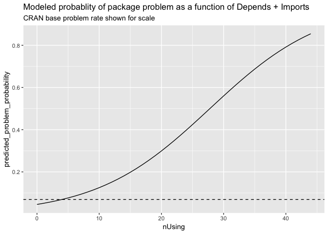

pgk\_risk
================

*Very* basic and cursory study on package use as package risk. The conclusion is: packages on CRAN tend not to be in a bad state (defined as one of FAIL, ERROR, WARN) but historically each additional package in Depends or Imports adds a 0.7% chance of being observed in the bad state (very small) or in relative terms an extra 11% relative-chance of being observed in the bad state (a moderately large effect).

This model sees packages at the import level of `dplyr` as implying a an 11% problem rate and packages at the import level of `tidyverse` implying a 42% problem rate. Both of these are far in excess of the current CRAN problem rate of 7.4%

There is a heavy censorship issue (CRAN tends to remove error packages). Additional confounding factor is package use decreases chance of a package being observed in the Note state. Obvious omitted points: package complexity in general and package authors.

``` r
library("wrapr")

# load package facts
cran <- tools::CRAN_package_db()
cr <- tools::CRAN_check_results()

# convert comma separated list into
# sequence of non-core package names
parse_lists <- function(strs) {
  strs[is.na(strs)] <- ""
  strs <- gsub("[(][^)]*[)]", "", strs)
  strs <- gsub("\\s+", "", strs)
  strs <- strsplit(strs, ",", fixed=TRUE)
  strs <- lapply(
    strs,
    function(si) {
      setdiff(si, c("", "R", 
                    "base", "compiler", "datasets", 
                    "graphics", "grDevices", "grid",
                    "methods", "parallel", "splines", 
                    "stats", "stats4", "tcltk", "tools",
                    "translations", "utils"))
    })
  strs
}

# collect the columns we want
d <- data.frame(
  Package = cran$Package,
  stringsAsFactors = FALSE)
d$Depends <- parse_lists(cran$Depends)
d$nDepends <- vapply(d$Depends, length, numeric(1))
d$Imports <- parse_lists(cran$Imports)
d$nImports <- vapply(d$Imports, length, numeric(1))
d$nUsing <- d$nDepends + d$nImports

# map check status into our data
d$Status <- NA_character_
smap <- as.character(cr$Status)
names(smap) <- as.character(cr$Package)
d$Status <- smap[d$Package]

# take a look
head(d)
```

    ##       Package                                Depends nDepends
    ## 1          A3                        xtable, pbapply        2
    ## 2      abbyyR                                               0
    ## 3         abc abc.data, nnet, quantreg, MASS, locfit        5
    ## 4    abc.data                                               0
    ## 5     ABC.RAP                                               0
    ## 6 ABCanalysis                                               0
    ##                                  Imports nImports nUsing Status
    ## 1                                               0      2     OK
    ## 2 httr, XML, curl, readr, plyr, progress        6      6     OK
    ## 3                                               0      5   NOTE
    ## 4                                               0      0     OK
    ## 5                                               0      0   WARN
    ## 6                                plotrix        1      1     OK

``` r
# summarize status
table(d$Status, useNA = "ifany")
```

    ## 
    ## ERROR  FAIL  NOTE    OK  WARN  <NA> 
    ##   255     1  2354 10606   705     2

``` r
# build a simple model
m <- glm(Status!="OK" ~ nUsing,
         data = d,
         family = binomial)
summary(m)
```

    ## 
    ## Call:
    ## glm(formula = Status != "OK" ~ nUsing, family = binomial, data = d)
    ## 
    ## Deviance Residuals: 
    ##     Min       1Q   Median       3Q      Max  
    ## -0.7671  -0.7574  -0.7289  -0.6314   2.1651  
    ## 
    ## Coefficients:
    ##              Estimate Std. Error z value Pr(>|z|)    
    ## (Intercept) -1.072744   0.026204 -40.938  < 2e-16 ***
    ## nUsing      -0.029253   0.005721  -5.113 3.17e-07 ***
    ## ---
    ## Signif. codes:  0 '***' 0.001 '**' 0.01 '*' 0.05 '.' 0.1 ' ' 1
    ## 
    ## (Dispersion parameter for binomial family taken to be 1)
    ## 
    ##     Null deviance: 15283  on 13920  degrees of freedom
    ## Residual deviance: 15255  on 13919  degrees of freedom
    ##   (2 observations deleted due to missingness)
    ## AIC: 15259
    ## 
    ## Number of Fisher Scoring iterations: 4

``` r
# notice more package use reduces chance of Status!="OK"
# however, we are mostly modeing if status is OK versus NOTE.

# build a simple model on bad states
d$bad_status <- d$Status %in% c("ERROR", "FAIL", "WARN")
m <- glm(bad_status ~ nUsing,
           data = d,
           family = binomial)
summary(m)
```

    ## 
    ## Call:
    ## glm(formula = bad_status ~ nUsing, family = binomial, data = d)
    ## 
    ## Deviance Residuals: 
    ##     Min       1Q   Median       3Q      Max  
    ## -1.9635  -0.3788  -0.3407  -0.3063   2.4830  
    ## 
    ## Coefficients:
    ##             Estimate Std. Error z value Pr(>|z|)    
    ## (Intercept) -3.03572    0.04611  -65.83   <2e-16 ***
    ## nUsing       0.10923    0.00654   16.70   <2e-16 ***
    ## ---
    ## Signif. codes:  0 '***' 0.001 '**' 0.01 '*' 0.05 '.' 0.1 ' ' 1
    ## 
    ## (Dispersion parameter for binomial family taken to be 1)
    ## 
    ##     Null deviance: 6992.2  on 13922  degrees of freedom
    ## Residual deviance: 6745.7  on 13921  degrees of freedom
    ## AIC: 6749.7
    ## 
    ## Number of Fisher Scoring iterations: 5

``` r
# try to interpret
pred <- predict(m, newdata = d, type = "response")
d2 <- d
d2$nUsing <- d$nUsing + 1
pred_plus <- predict(m, newdata = d2, type = "response")

# bad status is rare (CRAN removes bad packages)
summary(d$bad_status)
```

    ##    Mode   FALSE    TRUE 
    ## logical   12962     961

``` r
mean(d$bad_status)
```

    ## [1] 0.06902248

``` r
# the absolute risk of each additional dependency is low
summary(pred_plus - pred)
```

    ##     Min.  1st Qu.   Median     Mean  3rd Qu.     Max. 
    ## 0.005022 0.005539 0.006103 0.007146 0.007377 0.027294

``` r
# the relative risk of each additional dependency is medium
summary(pred_plus / pred)
```

    ##    Min. 1st Qu.  Median    Mean 3rd Qu.    Max. 
    ##   1.015   1.107   1.108   1.107   1.109   1.110

``` r
d$predicted_problem_probability <- pred

d[d$Package %in% c("dplyr", "tidyverse"), 
  c("Package", "nDepends", "nImports", "Status", "predicted_problem_probability")] %.>%
  knitr::kable(.)
```

|       | Package   |  nDepends|  nImports| Status |  predicted\_problem\_probability|
|-------|:----------|---------:|---------:|:-------|--------------------------------:|
| 2910  | dplyr     |         0|         9| ERROR  |                        0.1137870|
| 12877 | tidyverse |         0|        25| OK     |                        0.4243566|

``` r
library("ggplot2")

ggplot(data = d, mapping = aes(x = nUsing)) +
  geom_histogram(bins = 20) + 
  ggtitle("Distribution of count of package by number of Depends + Imports")
```


``` r
ds <- data.frame(nUsing = 0:max(d$nUsing))
ds$predicted_problem_probability <- predict(m, newdata = ds, type = "response")

CRAN_rate <- mean(d$bad_status)
ggplot(data = ds, mapping = aes(x = nUsing, y = predicted_problem_probability)) +
  geom_line() +
  geom_hline(yintercept = CRAN_rate, linetype=2) +
  ggtitle("Modeled probablity of package problem as a function of Depends + Imports",
          subtitle = "CRAN base problem rate shown for scale")
```


