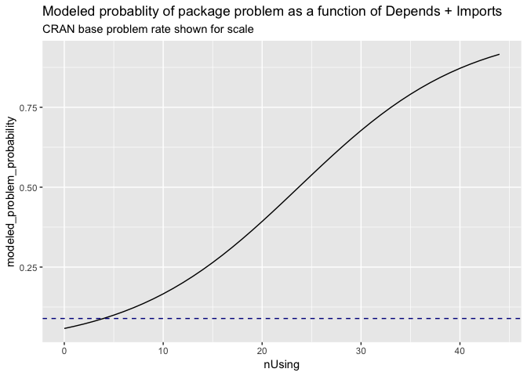
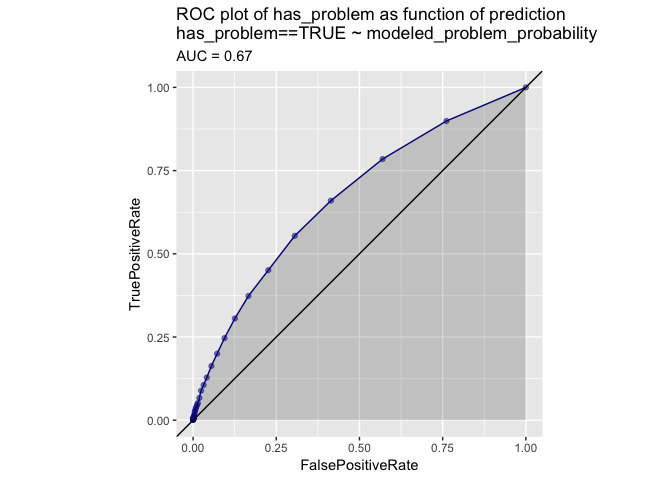
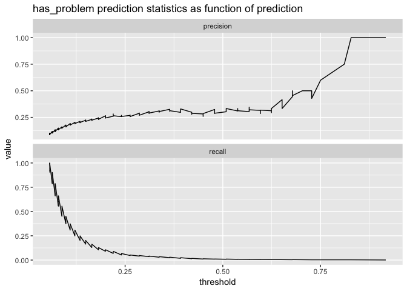
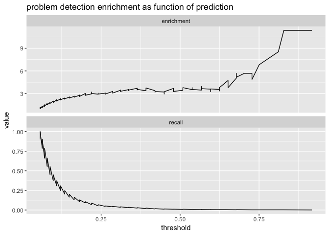
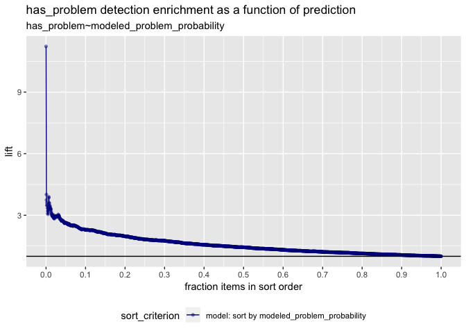

pgk\_risk\_E
================

Introduction
------------

The following is a *very* basic and cursory study on package Depends/Imports and its observed relation to package risk.

The conclusion is: [R](https://www.r-project.org) packages on [CRAN](https://cran.r-project.org) tend not to be in a bad state (defined as one of FAIL, ERROR, WARN) but historically each additional package in Depends or Imports adds a 1.8% chance of being observed in the bad state or in relative terms an extra 11% relative-chance of being observed in the bad state (a moderately large effect).

This model captures and quantifies the fact that packages with 5 or more Imports plus Depends have an elevated number of problem indications on CRAN.

There is a heavy statistical censorship issue (CRAN tends to remove error packages). Obvious omitted variables include: package complexity in general and package authors. And not all dependencies are the same (but we think that aspect could be handled by a pooled hierarchical modeling approach). Also detected package problems are only a weak proxy for package quality.

One theory is: an excess number of dependencies is a "code smell" indicating broad packages that serve many purposes. Or that in addition to dependent packages possibly bringing in issues, they are themselves indicators of other issues.

The Study
---------

### Data

First we bring in the packages we are going to use and the data. To enhance reproducibility we have cached data we pulled from the `tools` API on 2019-03-17.

``` r
library("rqdatatable")
```

    ## Loading required package: rquery

``` r
library("ggplot2")

# load package facts
# cran <- tools::CRAN_package_db()
# cr <- tools::CRAN_check_results()
# saveRDS(list(cran = cran, cr = cr), "cran_facts.RDS")
lst <- readRDS("cran_facts.RDS")
cran <- lst$cran
cr <- lst$cr

dim(cran)
```

    ## [1] 13923    65

``` r
#str(cran)

dim(cr)
```

    ## [1] 166133     10

``` r
#str(cr)
```

DataPrep
--------

Now we prepare the data for analysis.

We get per-package status summaries (restricting to a few build flavors).

``` r
flavors = c("r-devel-linux-x86_64-debian-clang",
            "r-devel-linux-x86_64-debian-gcc",
            "r-devel-linux-x86_64-fedora-clang",
            "r-devel-linux-x86_64-fedora-gcc", "r-devel-windows-ix86+x86_64",
            "r-patched-linux-x86_64", "r-release-linux-x86_64",
            "r-release-osx-x86_64", "r-release-windows-ix86+x86_64")

package_summary <- cr %.>%
  select_rows(.,
              !is.na(Status)) %.>%
  set_indicator(., 
                rescol = "examine",
                testcol = "Flavor",
                testvalues = flavors) %.>%
  extend(., 
         one = 1) %.>%
  project(.,
          groupby = c("Package", "Status"),
          count = sum(one)) %.>%
  cdata::pivot_to_rowrecs(., 
                          columnToTakeKeysFrom = "Status",
                          columnToTakeValuesFrom = "count",
                          rowKeyColumns = "Package") %.>%
  extend(.,
         OK = ifelse(is.na(OK), 0, OK),
         NOTE = ifelse(is.na(NOTE), 0, NOTE),
         WARN = ifelse(is.na(WARN), 0, WARN),
         ERROR = ifelse(is.na(ERROR), 0, ERROR),
         FAIL = ifelse(is.na(FAIL), 0, FAIL)) %.>%
  extend(.,
         has_problem = ERROR>0)

dim(package_summary)
```

    ## [1] 13901     7

``` r
package_summary %.>% 
  head(.) %.>%
  knitr::kable(.)
```

| Package     |   OK|  NOTE|  WARN|  ERROR|  FAIL| has\_problem |
|:------------|----:|-----:|-----:|------:|-----:|:-------------|
| A3          |   12|     0|     0|      0|     0| FALSE        |
| abbyyR      |   12|     0|     0|      0|     0| FALSE        |
| abc         |    0|    12|     0|      0|     0| FALSE        |
| abc.data    |   12|     0|     0|      0|     0| FALSE        |
| ABC.RAP     |   11|     0|     1|      0|     0| FALSE        |
| ABCanalysis |   12|     0|     0|      0|     0| FALSE        |

For this study we consider a package to have problems if it has at least one `ERROR` record.

We also unpack the Depends and Imports fields from comma separated strings into character vectors and then collect or statistics.

``` r
# convert comma separated list into
# sequence of non-core package names
parse_lists <- function(strs) {
  strs[is.na(strs)] <- ""
  strs <- gsub("[(][^)]*[)]", "", strs)
  strs <- gsub("\\s+", "", strs)
  strs <- strsplit(strs, ",", fixed=TRUE)
  strs <- lapply(
    strs,
    function(si) {
      setdiff(si, c("", "R", 
                    "base", "compiler", "datasets", 
                    "graphics", "grDevices", "grid",
                    "methods", "parallel", "splines", 
                    "stats", "stats4", "tcltk", "tools",
                    "translations", "utils"))
    })
  strs
}

# collect the columns we want
d <- data.frame(
  Package = cran$Package,
  stringsAsFactors = FALSE)
d$Depends <- parse_lists(cran$Depends)
d$nDepends <- vapply(d$Depends, length, numeric(1))
d$Imports <- parse_lists(cran$Imports)
d$nImports <- vapply(d$Imports, length, numeric(1))
d$nUsing <- d$nDepends + d$nImports

# map check status into our data
d <- natural_join(d, package_summary, 
                  by = "Package", 
                  jointype = "INNER")
summary(d$has_problem)
```

    ##    Mode   FALSE    TRUE 
    ## logical   12696    1225

``` r
dim(d)
```

    ## [1] 13921    12

``` r
d <- select_rows(d, !is.na(has_problem))
d <- data.frame(d)

# take a look
d %.>% 
  head(.) %.>%
  knitr::kable(.)
```

| Package      | Depends                | Imports                  |  nDepends|  nImports|  nUsing|  ERROR|  FAIL| has\_problem |  NOTE|   OK|  WARN|
|:-------------|:-----------------------|:-------------------------|---------:|---------:|-------:|------:|-----:|:-------------|-----:|----:|-----:|
| A3           | c("xtable", "pbapply") | character(0)             |         2|         0|       2|      0|     0| FALSE        |     0|   12|     0|
| ABC.RAP      | character(0)           | character(0)             |         0|         0|       0|      0|     0| FALSE        |     0|   11|     1|
| ABCanalysis  | character(0)           | plotrix                  |         0|         1|       1|      0|     0| FALSE        |     0|   12|     0|
| ABCoptim     | character(0)           | Rcpp                     |         0|         1|       1|      0|     0| FALSE        |     0|   12|     0|
| ABCp2        | MASS                   | character(0)             |         1|         0|       1|      0|     0| FALSE        |     0|   12|     0|
| ABHgenotypeR | character(0)           | c("ggplot2", "reshape2") |         0|         2|       2|      0|     0| FALSE        |     0|   11|     1|

``` r
# summarize status
table(d$has_problem, 
      useNA = "ifany")
```

    ## 
    ## FALSE  TRUE 
    ## 12696  1225

``` r
mean(d$has_problem)
```

    ## [1] 0.08799655

Modeling
--------

``` r
# build a simple model
m <- glm(has_problem ~ nUsing,
         data = d,
         family = binomial)

summary(m)
```

    ## 
    ## Call:
    ## glm(formula = has_problem ~ nUsing, family = binomial, data = d)
    ## 
    ## Deviance Residuals: 
    ##     Min       1Q   Median       3Q      Max  
    ## -1.8251  -0.4302  -0.3840  -0.3424   2.3941  
    ## 
    ## Coefficients:
    ##              Estimate Std. Error z value Pr(>|z|)    
    ## (Intercept) -2.807355   0.041915  -66.98   <2e-16 ***
    ## nUsing       0.118424   0.006125   19.34   <2e-16 ***
    ## ---
    ## Signif. codes:  0 '***' 0.001 '**' 0.01 '*' 0.05 '.' 0.1 ' ' 1
    ## 
    ## (Dispersion parameter for binomial family taken to be 1)
    ## 
    ##     Null deviance: 8293.5  on 13920  degrees of freedom
    ## Residual deviance: 7947.7  on 13919  degrees of freedom
    ## AIC: 7951.7
    ## 
    ## Number of Fisher Scoring iterations: 5

``` r
sigr::wrapChiSqTest(m)
```

    ## [1] "Chi-Square Test summary: pseudo-R2=0.04169 (X2(1,N=13921)=345.8, p<1e-05)."

The model indicates package use count (`Imports` plus `Depends`) is correlated with packages having problems.

Interpretation
--------------

To interpret that let's score our data and then re-score altered data where each package claims an additional package use. How these predictions vary shows us how this factor related to problems by the model.

``` r
# try to interpret
pred <- predict(m, newdata = d, type = "response")
d2 <- d
d2$nUsing <- d$nUsing + 1
pred_plus <- predict(m, newdata = d2, type = "response")


# the absolute risk of each additional dependency is low
summary(pred_plus - pred)
```

    ##     Min.  1st Qu.   Median     Mean  3rd Qu.     Max. 
    ## 0.006702 0.007431 0.008226 0.009594 0.010017 0.029593

``` r
# the relative risk of each additional dependency is medium
summary(pred_plus / pred)
```

    ##    Min. 1st Qu.  Median    Mean 3rd Qu.    Max. 
    ##   1.009   1.113   1.116   1.113   1.117   1.118

``` r
d$modeled_problem_probability <- pred

write.csv(d[ , qc(Package, nUsing, 
                  ERROR, FAIL, NOTE, OK, WARN, 
                  has_problem, modeled_problem_probability)], 
          "d.csv", 
          row.names = FALSE, quote = FALSE)
```

The above can be read that add an additional package is associated with an absolute 1.7% increase of probability of package problems and a relative increase of risk of 11%.

Now let's examine how sorting the data against different thresholds (either in model prediction or in usage count, which are monotone related) sorts problems.

``` r
ggplot(data = d, mapping = aes(x = nUsing)) +
  geom_histogram(bins = 20) + 
  ggtitle("Distribution of count of package by number of Depends + Imports")
```


``` r
ds <- data.frame(nUsing = 0:max(d$nUsing))
ds$modeled_problem_probability <- predict(m, newdata = ds, type = "response")

(CRAN_rate <- mean(d$has_problem))
```

    ## [1] 0.08799655

``` r
ggplot(data = ds, mapping = aes(x = nUsing, y = modeled_problem_probability)) +
  geom_line() +
  geom_hline(yintercept = CRAN_rate, linetype=2, color = "darkblue") +
  ggtitle("Modeled probablity of package problem as a function of Depends + Imports",
          subtitle = "CRAN base problem rate shown for scale")
```



``` r
knitr::kable(ds[1:10,])
```

|  nUsing|  modeled\_problem\_probability|
|-------:|------------------------------:|
|       0|                      0.0569280|
|       1|                      0.0636297|
|       2|                      0.0710609|
|       3|                      0.0792864|
|       4|                      0.0883735|
|       5|                      0.0983908|
|       6|                      0.1094072|
|       7|                      0.1214910|
|       8|                      0.1347075|
|       9|                      0.1491177|

``` r
WVPlots::ROCPlot(d, 
                 "modeled_problem_probability",
                 "has_problem", 
                 TRUE, 
                 "ROC plot of has_problem as function of prediction")
```



``` r
WVPlots::PRTPlot(d, 
                 "modeled_problem_probability",
                 "has_problem", 
                 TRUE, 
                 "has_problem prediction statistics as function of prediction")
```



``` r
WVPlots::PRTPlot(d, 
                 "modeled_problem_probability",
                 "has_problem", 
                 TRUE, 
                 "problem detection enrichment as function of prediction",
                 plotvars = c("enrichment", "recall"))
```



``` r
WVPlots::LiftCurvePlot(d, 
                 "modeled_problem_probability",
                 "has_problem", 
                 "has_problem detection enrichment as a function of prediction",
                 include_wizard = FALSE)
```



Application
-----------

We can re-examine the facts summarized in the above graphs by tabulating data sorted by the model scores (or equivalently by the package usage count).

``` r
table(high_risk = d$modeled_problem_probability>CRAN_rate, 
      problem = d$has_problem,
      useNA = "ifany")
```

    ##          problem
    ## high_risk FALSE TRUE
    ##     FALSE  8814  545
    ##     TRUE   3882  680

``` r
(t <- table(high_risk = d$nUsing>5, 
      problem = d$has_problem,
      useNA = "ifany"))
```

    ##          problem
    ## high_risk FALSE  TRUE
    ##     FALSE 10580   767
    ##     TRUE   2116   458

``` r
t[2,2]/sum(t[,2])
```

    ## [1] 0.3738776

``` r
table(high_risk = d$nUsing>10, 
      problem = d$has_problem,
      useNA = "ifany")
```

    ##          problem
    ## high_risk FALSE  TRUE
    ##     FALSE 12173  1067
    ##     TRUE    523   158

``` r
table(high_risk = d$nUsing>20, 
      problem = d$has_problem,
      useNA = "ifany")
```

    ##          problem
    ## high_risk FALSE  TRUE
    ##     FALSE 12644  1204
    ##     TRUE     52    21

``` r
table(high_risk = d$modeled_problem_probability>0.5, 
      problem = d$has_problem,
      useNA = "ifany")
```

    ##          problem
    ## high_risk FALSE  TRUE
    ##     FALSE 12672  1213
    ##     TRUE     24    12

For each of these tables note how much richer packages indicating problems are in the selected set than in the rejected set.

Conclusion
----------

Package use count historically correlates with package problems both in a clinically significant and statistically significant manner.

Materials
---------

All code, data, results, and graphs can be found [here](https://github.com/WinVector/Examples/tree/master/pkg_risk). Discussion of the results can be found [here](http://www.win-vector.com/blog/2019/03/quantifying-r-package-dependency-risk/).
