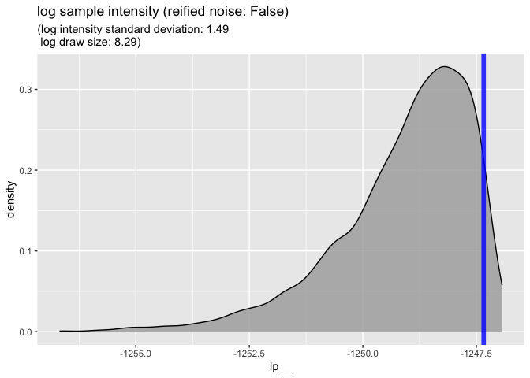
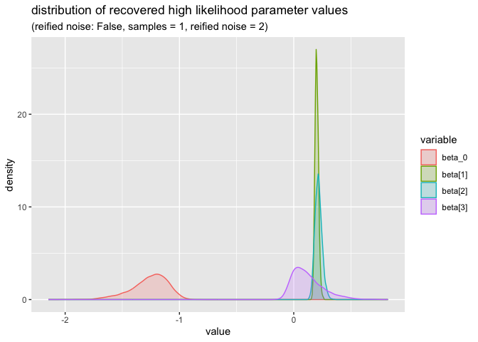
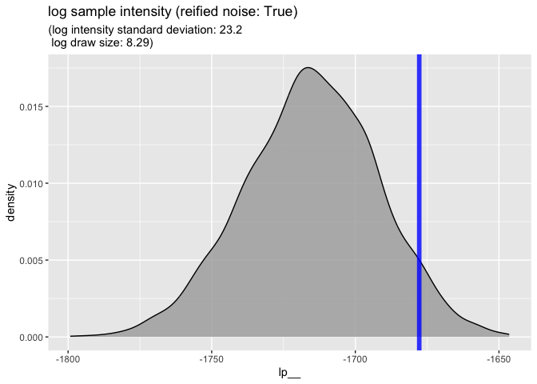
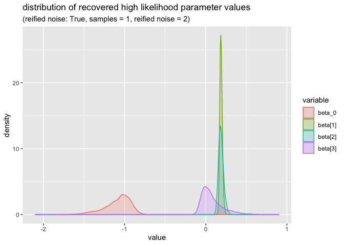

rstan
================
2024-08-28

``` r
library(rstan)
```

    ## Loading required package: StanHeaders

    ## 
    ## rstan version 2.32.6 (Stan version 2.32.2)

    ## For execution on a local, multicore CPU with excess RAM we recommend calling
    ## options(mc.cores = parallel::detectCores()).
    ## To avoid recompilation of unchanged Stan programs, we recommend calling
    ## rstan_options(auto_write = TRUE)
    ## For within-chain threading using `reduce_sum()` or `map_rect()` Stan functions,
    ## change `threads_per_chain` option:
    ## rstan_options(threads_per_chain = 1)

``` r
library(jsonlite)
library(ggplot2)
library(poorman)
```

    ## 
    ##   I'd seen my father. He was a poor man, and I watched him do astonishing things.
    ##     - Sidney Poitier

    ## 
    ## Attaching package: 'poorman'

    ## The following objects are masked from 'package:stats':
    ## 
    ##     filter, lag

``` r
data <- fromJSON("rank_data_censored_picks.json")
```

``` r
fit1 <- stan(
  file = "rank_src_censored_picks.stan",  # Stan program
  data = data,                            # named list of data
  chains = 4,                             # number of Markov chains
  warmup = 1000,                          # number of warmup iterations per chain
  iter = 2000,                            # total number of iterations per chain
  cores = 4,                              # number of cores (could use one per chain)
  refresh = 0,                            # no progress shown
  pars=c("lp__", "beta_0", "beta")        # parameters to bring back
  )
```

``` r
draws <- as.data.frame(fit1)
```

``` r
draws |>
  head() |>
  knitr::kable()
```

|    lp\_\_ |    beta_0 | beta\[1\] | beta\[2\] | beta\[3\] |
|----------:|----------:|----------:|----------:|----------:|
| -1251.130 | -1.520818 | 0.2282623 | 0.2879370 | 0.3201965 |
| -1250.358 | -1.506511 | 0.2233696 | 0.2475490 | 0.1977965 |
| -1251.936 | -1.552996 | 0.1998336 | 0.2522806 | 0.3323120 |
| -1249.657 | -1.533951 | 0.2080136 | 0.2574112 | 0.3573067 |
| -1248.750 | -1.493253 | 0.2228508 | 0.2416577 | 0.3151417 |
| -1248.531 | -1.221375 | 0.2030706 | 0.2373745 | 0.0258106 |

``` r
nrow(draws)
```

    ## [1] 4000

``` r
(
    ggplot(
        data=draws,
        mapping=aes(x=lp__)
    )
    + geom_density(fill='darkgrey', alpha=0.8)
    + geom_vline(
      xintercept=quantile(draws$lp__, 0.95), 
      color='blue', 
      linewidth=2, 
      alpha=0.8)
    + ggtitle("log sample intensity (reified noise: False)",
        subtitle = paste0(
          "(log intensity standard deviation: ",
          format(sd(draws$lp__), digits=3),
          "\n log draw size: ", 
          format(log(nrow(draws)), digits=3), 
          ")"))
)
```

<!-- -->

``` r
draws_long <- pivot_longer(
  draws[, c('beta_0', 'beta[1]', 'beta[2]', 'beta[3]')], 
  cols=c('beta_0', 'beta[1]', 'beta[2]', 'beta[3]'),
  names_to='variable',
  values_to='value')
(
    ggplot(
        data=draws_long,
        mapping=aes(x=value, color=variable, fill=variable)
    )
    + geom_density(alpha=0.2)
    + ggtitle("distribution of recovered high likelihood parameter values",
        subtitle = paste0(
          "(reified noise: False, samples = ",
          1,
          ", reified noise = ",
          2,
          ")"))
)
```

<!-- -->

``` r
fit1 <- stan(
  file = "rank_src_censored_picks_reified_noise.stan",  # Stan program
  data = data,                            # named list of data
  chains = 4,                             # number of Markov chains
  warmup = 1000,                          # number of warmup iterations per chain
  iter = 2000,                            # total number of iterations per chain
  cores = 4,                              # number of cores (could use one per chain)
  refresh = 0,                            # no progress shown
  pars=c("lp__", "beta_0", "beta")        # parameters to bring back
  )
```

``` r
draws <- as.data.frame(fit1)
```

``` r
draws |>
  head() |>
  knitr::kable()
```

|    lp\_\_ |     beta_0 | beta\[1\] | beta\[2\] |  beta\[3\] |
|----------:|-----------:|----------:|----------:|-----------:|
| -1720.524 | -1.0012525 | 0.1824492 | 0.1432262 | -0.0284954 |
| -1727.087 | -1.0242526 | 0.1828179 | 0.1498542 | -0.0321725 |
| -1725.950 | -1.0405628 | 0.2074125 | 0.1654192 |  0.1822274 |
| -1725.436 | -0.9885111 | 0.1666840 | 0.1833373 |  0.0403337 |
| -1723.363 | -0.9157697 | 0.2107349 | 0.1373391 | -0.0170442 |
| -1729.142 | -1.2450365 | 0.1651720 | 0.2463396 |  0.0614226 |

``` r
nrow(draws)
```

    ## [1] 4000

``` r
(
    ggplot(
        data=draws,
        mapping=aes(x=lp__)
    )
    + geom_density(fill='darkgrey', alpha=0.8)
    + geom_vline(
      xintercept=quantile(draws$lp__, 0.95), 
      color='blue', 
      linewidth=2, 
      alpha=0.8)
    + ggtitle("log sample intensity (reified noise: True)",
        subtitle = paste0(
          "(log intensity standard deviation: ",
          format(sd(draws$lp__), digits=3),
          "\n log draw size: ", 
          format(log(nrow(draws)), digits=3), 
          ")"))
)
```

<!-- -->

``` r
draws_long <- pivot_longer(
  draws[, c('beta_0', 'beta[1]', 'beta[2]', 'beta[3]')], 
  cols=c('beta_0', 'beta[1]', 'beta[2]', 'beta[3]'),
  names_to='variable',
  values_to='value')
(
    ggplot(
        data=draws_long,
        mapping=aes(x=value, color=variable, fill=variable)
    )
    + geom_density(alpha=0.2)
    + ggtitle("distribution of recovered high likelihood parameter values",
        subtitle = paste0(
          "(reified noise: True, samples = ",
          1,
          ", reified noise = ",
          2,
          ")"))
)
```

<!-- -->
