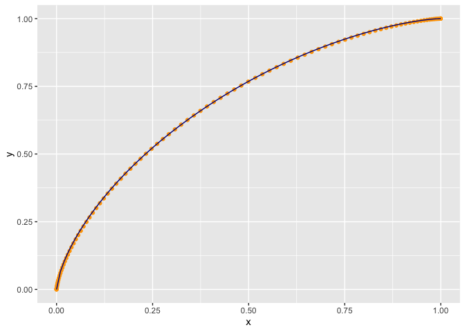

CurveExample
================

``` r
library(ggplot2)
```

    ## Warning: replacing previous import 'vctrs::data_frame' by 'tibble::data_frame'
    ## when loading 'dplyr'

``` r
a = 3.2
b = 2.4

t = seq(0, 1, length.out = 101)
parametric_example <- data.frame(
  x = 1 - pbeta(t, b, a),
  y = 1 - pbeta(t, a, b))

s <- log(1 - pbeta(0.5, b, a)) / log(0.5)


equation_example <- data.frame(
  x = seq(0, 1, length.out = 101))
equation_example$y <-  1 - (1 - equation_example$x^(1/s))^s

ggplot(mapping = aes(x = x, y = y)) +
  geom_point(data = parametric_example, color = "Orange") + 
  geom_line(data = equation_example, color = "DarkBlue")
```

<!-- -->
