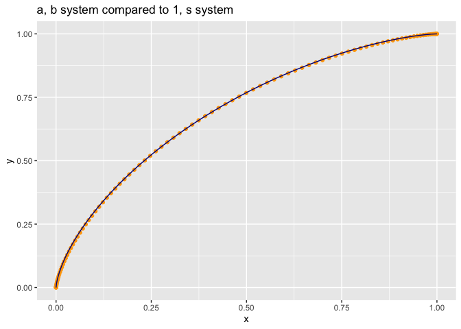
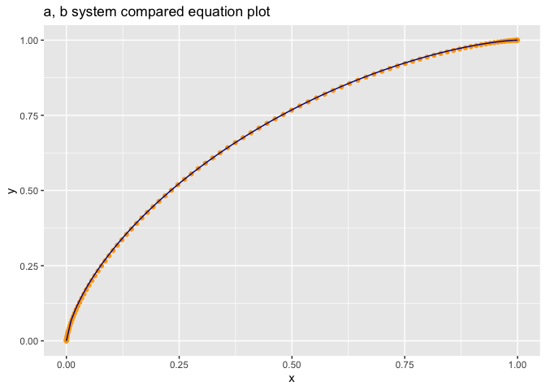

CurveExample
================

The following equations arise in studying ROC curves.

If `x(t) = 1 - pbeta(t, b, a); y(t) = 1 - pbeta(t, a, b))` (`pbeta`
being the incomplete gamma function) then `(1 - y)^(1/s) + x^(1/s) = 1`
where `s = log(1 - pbeta(0.5, b, a)) / log(0.5)`. I can show the case
where `a=1`, as in this case the incomplete beta function is a simple
polynomial. However, as we see many more cases also appear to be true.
All I would need to complete a proof is to show `x(t) = 1 - pbeta(t, 1,
s); y(t) = 1 - pbeta(t, s, 1))` is the same curve as `x(t) = 1 -
pbeta(t, b, a); y(t) = 1 - pbeta(t, a, b))` or the same as `(1 -
y)^(1/s) + x^(1/s) = 1` (obviously parameterized at a different rate),
and all is done.

A numeric example in [`R`](https://www.r-project.org) can be found
[here](https://github.com/WinVector/Examples/blob/main/rebalance/CurveExample.md).
Math-overflow link
[here](https://mathoverflow.net/questions/371568/need-help-converting-a-curve-parameterized-in-terms-of-incomplete-beta-functions).

It seems like this may take more than polynomial algebra. Maybe set up
an ODE on the derivatives of `x(t)` and `y(t)`, but I haven’t seen a
good wat to de-parameterize the equations. Alternately is there an
obvious symmetry of the incomplete beta that moves the parameteric beta
forms from (a,b) to (1,s) which would also complete the proof.

``` r
library(ggplot2)
```

    ## Warning: replacing previous import 'vctrs::data_frame' by 'tibble::data_frame'
    ## when loading 'dplyr'

``` r
a = 3.2
b = 2.4

t = seq(0, 1, length.out = 101)
```

``` r
parametric_example <- data.frame(
  x = 1 - pbeta(t, b, a),
  y = 1 - pbeta(t, a, b))

s <- log(1 - pbeta(0.5, b, a)) / log(0.5)
print(s)
```

    ## [1] 1.484192

``` r
# 1, s solution
parametric_example_s <- data.frame(
  x = 1 - pbeta(t, 1, s),
  y = 1 - pbeta(t, s, 1))

ggplot(mapping = aes(x = x, y = y)) +
  geom_point(data = parametric_example, color = "Orange") + 
  geom_line(data = parametric_example_s, color = "DarkBlue") + 
  ggtitle("a, b system compared to 1, s system")
```

<!-- -->

``` r
equation_example <- data.frame(
  x = seq(0, 1, length.out = 101))
equation_example$y <-  1 - (1 - equation_example$x^(1/s))^s

ggplot(mapping = aes(x = x, y = y)) +
  geom_point(data = parametric_example, color = "Orange") + 
  geom_line(data = equation_example, color = "DarkBlue") + 
  ggtitle("a, b system compared equation plot")
```

<!-- -->

It is easy to show that `x = 1 - pbeta(t, 1, s); y = 1 - pbeta(t, s, 1)`
is on the curve `(1 - y)^(1/s) + x^(1/s) = 1` (notes
[here](https://github.com/WinVector/Examples/blob/main/rebalance/ROC_shape.md)).

How does one show the curve `x = 1 - pbeta(t, a, b); y = 1 - pbeta(t, b,
a)` is coincident with these two curves?
