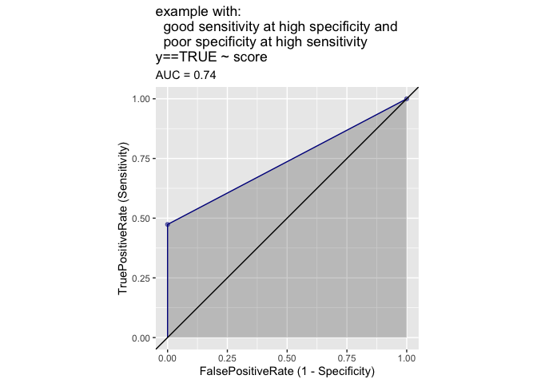
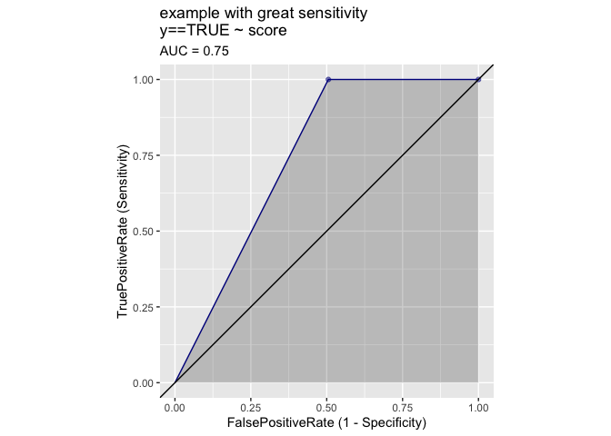
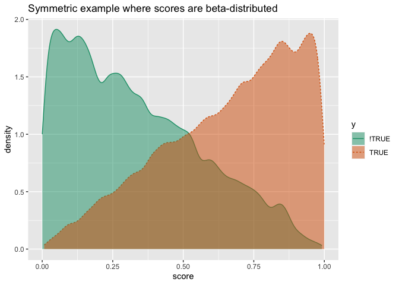
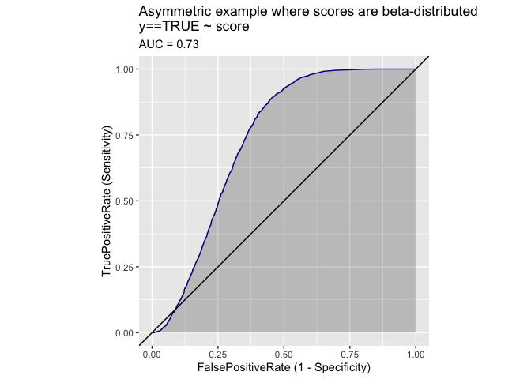
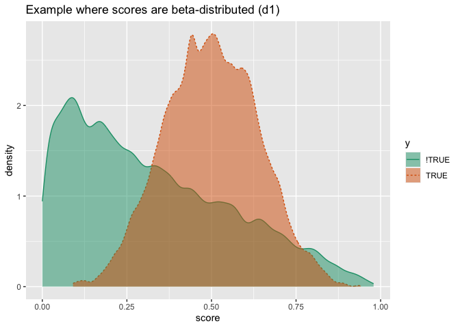
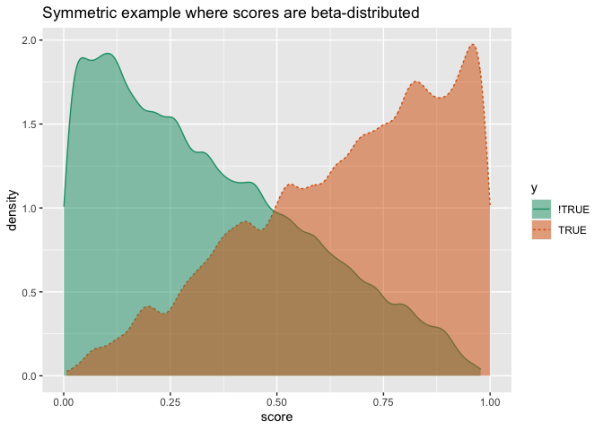
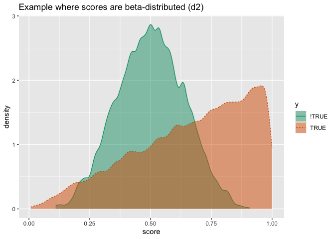
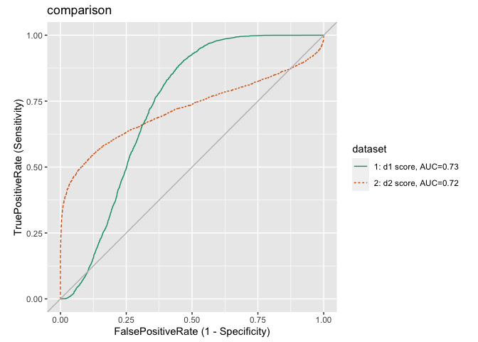
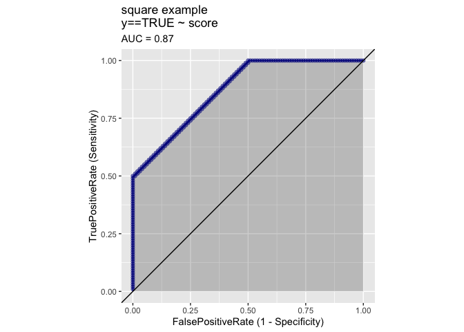

The Better AUC Implies Better ROC Fallacy
================

Some data scientists appear work as if laboring under the fallacy that
in classification problems a better [`AUC` (area under the
curve)](https://en.wikipedia.org/wiki/Receiver_operating_characteristic#Area_under_the_curve)
implies a better [`ROC plot` (receiver operating characteristic
plot)](https://en.wikipedia.org/wiki/Receiver_operating_characteristic).
Most of them if asked would, of course, know this is not the case.

Yet they often use a the idea that a model with a higher `AUC` is always
the better model. This, were it true, would essentially imply the above
fallacy.

This is not the case. Which model is better depends on your application.
In comparing models during development we *do* recommend abstract
metrics such as `AUC`, [`statistical
devaince`](https://en.wikipedia.org/wiki/Deviance_\(statistics\)), or
[`cross entropy`](https://en.wikipedia.org/wiki/Cross_entropy). These
metrics do capture something about model quality (the first being [how
often the mode score is *rank
correct*](https://win-vector.com/2013/01/17/more-on-rocauc/), the second
being a measure of similarity of distribution).

Neither of these metrics is a business metric. Often in business you
have class imbalance: the category you are hoping for, such as
conversion to sale, is rare. Also you often have asymmetric costs: a
successful loan may make a small amount of interest, wheras a default is
very expensive. A proper “what is really better” metric takes these into
account through summaries such as sensitivity/specificity or
precision/recall.

What we do *not* recommend is: using `AUC` as the only metric, or even
the final metric.

The `ROC` plot shows every possible trade-off between sensitivity and
specificity for a given model. Leaving the choice of these trade-offs to
the business is critical. In fact leaving a the trade-off as re-tunable
adjustment is a great practice. This is why we recommend [not using
classification rules for classification
problems](https://win-vector.com/2020/08/07/dont-use-classification-rules-for-classification-problems/),
but instead using probability models.

This also means: if one `ROC` plot is contained in another, then the
containing plot is just better in the sense that every
sensitivity/specificity trade off in the first model is at least as good
in the second. So we do have a notion of better for `ROC` plots. It is
just some `ROC` plots are incomparable without knowing the business
goal.

Let’s work some examples in [`R`](https://www.r-project.org) to make
this clear.

First we attach our packages and define an example function.

``` r
library(wrapr)
library(WVPlots)
```

    ## Warning: replacing previous import 'vctrs::data_frame' by 'tibble::data_frame'
    ## when loading 'dplyr'

``` r
extreme_example <- function(n, sensitivity, specificity) {
  d <- data.frame(
    y = sample(
      c(TRUE, FALSE), 
      size = n, 
      replace = TRUE),
    score = 0.0
  )
  d$score[d$y] <- sample(
    c(0.25, 0.75), 
    size = sum(d$y), 
    replace = TRUE,
    prob = c(1 - sensitivity, sensitivity))
  d$score[!d$y] <- sample(
    c(0.25, 0.75), 
    size = sum(!d$y), 
    replace = TRUE,
    prob = c(specificity, 1 - specificity))
  d
}
```

Notice the following to `ROC` plots are not nested- each is better than
the other in complementary regions.

``` r
ROCPlot(
  extreme_example(1000, 0.5, 1),
  xvar = 'score', 
  truthVar = 'y', truthTarget = TRUE, 
  title = 'example with:\n  good sensitivity at high specificity and\n  poor specificity at high sensitivity')
```

<!-- -->

``` r
ROCPlot(
  extreme_example(1000, 1, 0.5), 
  xvar = 'score', 
  truthVar = 'y', truthTarget = TRUE, 
  title = 'example with:\n  poor sensitivity at high specficity and\n  good specificity at high sensitivity ')
```

<!-- -->

Which of the above two models you would want depends critically on your
application and the prevalence of the class you are trying to identify.
You can’t tell from the area alone which is the better model.

The “larger `AUC` is enough” fallacy is driven by the experience that
`ROC` plots very often look like a smooth symmetric curve over the
diagonal. An example of such a plot is given below.

``` r
beta_example <- function(n, shape1_pos, shape2_pos, shape1_neg, shape2_neg) {
  d <- data.frame(
    y = sample(
      c(TRUE, FALSE), 
      size = n, 
      replace = TRUE),
    score = 0.0
  )
  d$score[d$y] <- rbeta(sum(d$y), shape1 = shape1_pos, shape2 = shape2_pos)
  d$score[!d$y] <- rbeta(sum(!d$y), shape1 = shape1_neg, shape2 = shape2_neg)
  d
}
```

``` r
d <- beta_example(
  10000,
  shape1_pos = 2, 
  shape2_pos = 1,
  shape1_neg = 1, 
  shape2_neg = 2)
  
DoubleDensityPlot(
  d,
  xvar = 'score',
  truthVar = 'y',
  truth_target = TRUE,
  title = "Symmetric example where scores are beta-distributed")
```

<!-- -->

``` r
ROCPlot(
  d, 
  xvar = 'score', 
  truthVar = 'y', truthTarget = TRUE, 
  title = "Symmetric example where scores are beta-distributed")
```

<!-- -->

The above shape is in fact *very* common. We saw it in [our uniform
score distribution
example](https://win-vector.com/2020/09/06/0-83-is-a-special-auc/) and
it commonly occurs in real world examples (for instance
[here](https://github.com/WinVector/PDSwR2/blob/main/KDD2009/KDD2009vtreat.md);
both in the training and test graphs). If all `ROC` graphs were just a
single parameter family of nested copies of this shape: then bigger
`AUC` would always be better.

However, the above shape family is not the only possibility. Our
original examples were not this shape, even in the symmetric case we
show below.

``` r
ROCPlot(
  extreme_example(1000, 0.75, 0.75), 
  xvar = 'score', 
  truthVar = 'y', truthTarget = TRUE, 
  title = 'Extreme example')
```

<!-- -->

And even the nice “scores are beta-distributed” case we can have
assymetric and even non-convex examples.

``` r
d1 <- beta_example(
  10000,
  shape1_pos = 6, 
  shape2_pos = 6,
  shape1_neg = 1, 
  shape2_neg = 2)

DoubleDensityPlot(
  d1,
  xvar = 'score',
  truthVar = 'y',
  truth_target = TRUE,
  title = "Example where scores are beta-distributed (d1)")
```

<!-- -->

``` r
d2 <- beta_example(
  10000,
  shape1_pos = 2, 
  shape2_pos = 1,
  shape1_neg = 6, 
  shape2_neg = 6)

DoubleDensityPlot(
  d2,
  xvar = 'score',
  truthVar = 'y',
  truth_target = TRUE,
  title = "Example where scores are beta-distributed (d2)")
```

<!-- -->

``` r
ROCPlotPair2(
  nm1 = 'd1',
  frame1 = d1,
  xvar1 = 'score',
  truthVar1 = 'y',
  truthTarget1 = TRUE,
  nm2 = 'd2',
  frame2 = d2,
  xvar2 = 'score',
  truthVar2 = 'y',
  truthTarget2 = TRUE,
  title = 'comparison',
  estimate_sig = FALSE)
```

<!-- -->

The point to remember is: there is a diversity of possible `ROC` plot
shapes, making mere area comparison unreliable. However, often the
shapes are not diverse allowing area comparison to be effective in those
cases. This falls into a category of practices that are technically
wrong, but not wrong often enough to scare people into more hygienic
practices.

We think data science can and should be correct.

## Appendix

Another shape

``` r
sq_example <- rbind(
  data.frame(score = seq(0, 2/3, length.out = 100),
             y = FALSE),
  data.frame(score = seq(1/3, 1, length.out = 100),
             y = TRUE))

ROCPlot(
  sq_example, 
  xvar = 'score', 
  truthVar = 'y', truthTarget = TRUE, 
  title = 'square example')
```

<!-- -->
