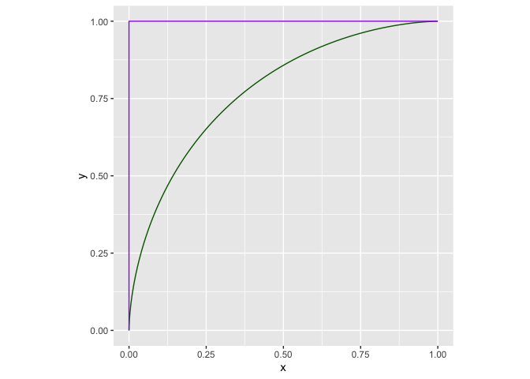
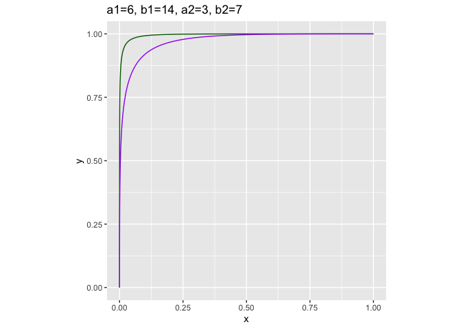
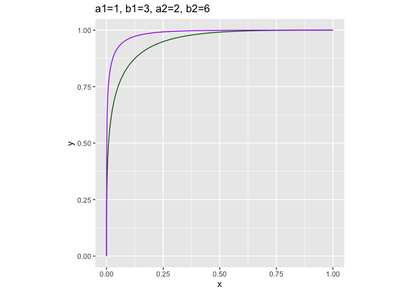

ROC\_beta
================

``` r
library(ggplot2)
```

    ## Warning: replacing previous import 'vctrs::data_frame' by 'tibble::data_frame'
    ## when loading 'dplyr'

``` r
mk_curve <- function(a, b) {
  d <- data.frame(
    t = seq(0, 1, length.out = 101)
  )
  d$x <- 1 - pbeta(d$t, shape1 = a, shape2 = b)
  d$y <- 1 - pbeta(d$t, shape1 = b, shape2 = a)
  d$a <- a
  d$b <- b
  d$what <- paste0('a=', a, ', b=', b)
  d
}

plot_curve_pair <- function(a1, b1, a2, b2) {
  d1 <- mk_curve(a1, b1)
  d2 <- mk_curve(a2, b2)
  
  ggplot() + 
    geom_line(data = d1,
              mapping = aes(x = x, y = y),
              color = 'DarkGreen') +
    geom_line(data = d2,
              mapping = aes(x = x, y = y),
              color = "Purple") + 
    theme(aspect.ratio = 1) +
    ggtitle(paste0(
      'a1=', a1,
      ', b1=', b1,
      ', a2=', a2,
      ', b2=', b2
    ))
}

plot_curve_pair(2, 3.1, 1.93, 3)
```

<!-- -->

``` r
plot_curve_pair(2, 3.1, 3, 3)
```

<!-- -->

``` r
plot_curve_pair(6, 14, 3, 7)
```

<!-- -->

``` r
plot_curve_pair(1, 3, 2, 5)
```

<!-- -->
