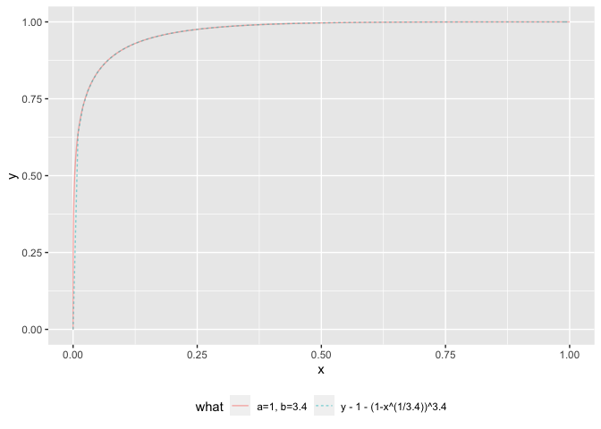
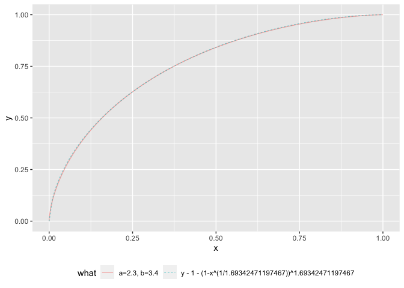

ROC\_beta
================

``` r
library(ggplot2)
```

``` r
mk_curve_beta <- function(a, b, left = 0, right = 1) {
  d <- data.frame(
    t = seq(left, right, length.out = 101)
  )
  d$x <- 1 - pbeta(d$t, shape1 = a, shape2 = b)
  d$y <- 1 - pbeta(d$t, shape1 = b, shape2 = a)
  d$a <- a
  d$b <- b
  d$what <- paste0('a=', a, ', b=', b)
  d
}

mk_curve_polynomial <- function(b, left = 0, right = 1) {
  d <- data.frame(
    t = NA,
    x = seq(left, right, length.out = 101)
  )
  d$y <- 1 - (1 - d$x^(1/b))^b
  d$a <- 1
  d$b <- b
  d$what <- paste0('y - 1 - (1-x^(1/', b,'))^', b)
  d
}

plot_curve_list <- function(curves) {
  ggplot(data = curves,
         aes(x = x, y = y, color = what, linetype=what)) + 
    geom_line(alpha = 0.5) +
    theme(legend.position="bottom")
}

c1 <- mk_curve_beta(1, 3.4)
c2 <- mk_curve_polynomial(3.4)
plot_curve_list(do.call(rbind, list(c1, c2)))
```

<!-- -->

``` r
c1 <- mk_curve_beta(2.3, 3.4)
target_x <- c1$x[c1$t==0.5][[1]]
# solve for (1-0.5)^b == target_x
b_soln <- log(target_x) / log(0.5)
c2 <- mk_curve_polynomial(b_soln)
plot_curve_list(do.call(rbind, list(c1, c2)))
```

<!-- -->
