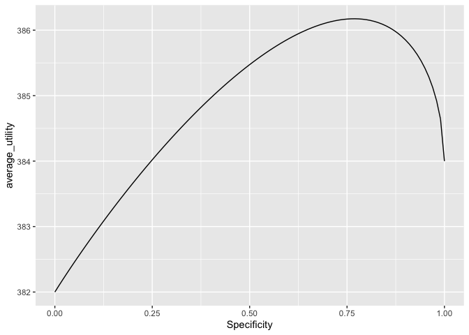

Utility\_Calc
================

Here we show how to use the ideal ROC curve demonstrated
[here](https://github.com/WinVector/Examples/blob/main/rebalance/ROC_shape.md)
to pick an optimal utility threshold. The announcement discussion is
<a href="https://win-vector.com/2020/09/13/why-working-with-auc-is-more-powerful-than-one-might-think/">here</a>.

We can use this parametric idealization to simplify choosing thresholds.

Suppose we are told our problem is predicting account cancellation. Our
model predicts the risk of cancellation with the above ROC curve.
“Positive” accounts are those that are going to cancel, though perhaps
we can alter that with an intervention.

And we are told (just using nominal figures here):

<ul>

<li>

Time discounted customer lifetime value v = $400

</li>

<li>

The cancellation prevalence is p = 0.04

</li>

<li>

The cost of an intervention (calling the customer, offering a discount)
is s = $10, and moves the retention probability to f = 0.5 for customers
who where leaving and has no effect for other customers.

</li>

</ul>

Then we want to pick an intervention threshold that maximizes our
utility under the above model and specifications. The idea is: there is
an optimal sensitivity and specificity trade-off determined by the above
parameters. Obviously we want sensitivity = 1 and specificity = 1, but
we have to accept the base trade-off that our model’s supplies. What
sensitivity/specificity trade-offs are available for our model is
exactly the content of the ROC curve.

We define utility as:

<ul>

<li>

Each true negative is worth v, we see the customer lifetime value and
incur no intervention cost.

</li>

<li>

Each false positive is worth v-s, we see the customer lifetime value but
do incur the intervention cost.

</li>

<li>

Each false negative is worth 0, we lose the customer.

</li>

<li>

Each true positive is worth f\*v-s, we incur the intervention cost and
maybe retain the customer.

</li>

</ul>

So the expected value per-customer of a decision rule is:

<pre>
true_negative_count * v + 
   false_positive_count * (v-s) + 
   false_negative_count * 0 + 
   true_positive_count * (f*v - s)
</pre>

So our utility function is defined as thus, using the `q = 0.61` example
from [here]().

``` r
library(ggplot2)
```

    ## Warning: replacing previous import 'vctrs::data_frame' by 'tibble::data_frame'
    ## when loading 'dplyr'

``` r
library(sigr) # requires version at least 1.1.0
```

``` r
q = 0.61

v = 400
p = 0.04
s = 10
f = 0.5

fn <- function(specificity) {
  roc_curve <- data.frame(
    Specificity = specificity,
    Sensitivity = 1 - (1 -  (1-specificity)^q)^(1/q) # our model
  )
  roc_curve <- sigr::add_ROC_derived_columns(roc_curve, p)
  
  # average utility
  roc_curve$average_utility = roc_curve$true_negative_prevalence * v + 
   roc_curve$false_positive_prevalence * (v-s) + 
   roc_curve$false_negative_prevalence * 0 + 
   roc_curve$true_positive_prevalence * (f*v - s)
  
  roc_curve
}
```

We can plot and optimize this easily.

``` r
d_utility <- fn(seq(0, 1, length.out = 101))

ggplot(
  data = d_utility,
  mapping = aes(x = Specificity, y = average_utility)) +
  geom_line()
```

<!-- -->

The optimal trade-off is given here:

``` r
best_idx = which.max(d_utility$average_utility)[[1]]
str(d_utility[best_idx, ])
```

    ## 'data.frame':    1 obs. of  11 variables:
    ##  $ Specificity              : num 0.77
    ##  $ Sensitivity              : num 0.577
    ##  $ FalsePositiveRate        : num 0.23
    ##  $ TruePositiveRate         : num 0.577
    ##  $ TrueNegativeRate         : num 0.77
    ##  $ FalseNegativeRate        : num 0.423
    ##  $ false_positive_prevalence: num 0.221
    ##  $ true_positive_prevalence : num 0.0231
    ##  $ true_negative_prevalence : num 0.739
    ##  $ false_negative_prevalence: num 0.0169
    ##  $ average_utility          : num 386

Using the idea curve for optimization has the advantage that we are
working with a smooted estimate that depends on all of the data.

The model says, for this population, and these costs, our best trade-off
is to run at specificity 0.77 and sensitivity 0.58. This optimal
solution is trading-off cost of interaction with possible loss of
revenue. With different rates, revenue, and costs we would have a
different optimum trade-off.
