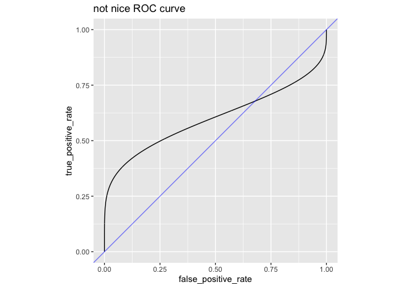
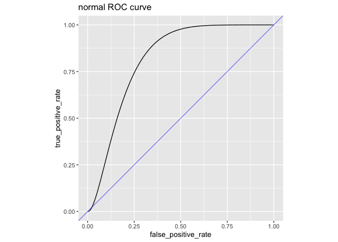

ib_pow
================
2023-10-21

``` r
library(ggplot2)
```

``` r
pbeta(0.1, 4, 1)^(1/4) + (1 - pbeta(0.1, 1, 4))^(1/4)
```

    ## [1] 1

``` r
pbeta(0.5, 4, 1)^(1/4) + (1 - pbeta(0.5, 1, 4))^(1/4)
```

    ## [1] 1

``` r
pbeta(0.5, 4, 1)^(1/4) + pbeta(0.5, 4, 1)^(1/4)
```

    ## [1] 1

``` r
pbeta(0.5, 4, 1)^(1/4)
```

    ## [1] 0.5

``` r
pbeta(0.5, 4, 1)
```

    ## [1] 0.0625

``` r
s = -log(2) / log(pbeta(0.5, 4, 1))

s
```

    ## [1] 0.25

``` r
pbeta(0.5, 4, 1)^s + (1 - pbeta(0.5, 1, 4))^s
```

    ## [1] 1

``` r
pbeta(0.5, 4, 1)^(1/4) 
```

    ## [1] 0.5

``` r
pbeta(0.5, 4, 2)^(1/4) 
```

    ## [1] 0.658037

``` r
s = -log(2) / log(pbeta(0.5, 4, 3))

s
```

    ## [1] 0.6491111

``` r
pbeta(0.5, 4, 3)^s
```

    ## [1] 0.5

``` r
pbeta(0.5, 4, 3)^s + (1 - pbeta(0.5, 3, 4))^s
```

    ## [1] 1

``` r
pbeta(0.3, 4, 3)^s + (1 - pbeta(0.3, 3, 4))^s
```

    ## [1] 1.004312

``` r
s = -log(2) / log(pbeta(0.5, 40, 30))

s
```

    ## [1] 0.3194517

``` r
pbeta(0.3, 40, 30)^s + (1 - pbeta(0.3, 30, 40))^s
```

    ## [1] 1.009345

``` r
pbeta(0.7, 1, 2)
```

    ## [1] 0.91

``` r
pbeta(0.7, 60, 40)
```

    ## [1] 0.9824075

``` r
library(ggplot2)

d_nice <- data.frame(
  threshold = seq(0, 1, 0.001)
)
d_nice$false_positive_rate = 1 - pbeta(d_nice$threshold, 4, 6)
d_nice$true_positive_rate = 1 - pbeta(d_nice$threshold, 6, 4)

ggplot(
  data=d_nice,
  mapping=aes(x=false_positive_rate, y=true_positive_rate)
  ) +
  geom_line() +
  geom_abline(intercept=0, slope=1, color="Blue", alpha=0.5) +
  theme(aspect.ratio=1) + 
  ggtitle("nice ROC curve")
```

<!-- -->

``` r
d_bad <- data.frame(
  threshold = seq(0, 1, 0.001)
)
d_bad$false_positive_rate = 1 - pbeta(d_bad$threshold, 4, 6)
d_bad$true_positive_rate = 1 - pbeta(d_bad$threshold, 1, 1)

ggplot(
  data=d_bad,
  mapping=aes(x=false_positive_rate, y=true_positive_rate)
  ) +
  geom_line() +
  geom_abline(intercept=0, slope=1, color="Blue", alpha=0.5) +
  theme(aspect.ratio=1) + 
  ggtitle("not nice ROC curve")
```

<!-- -->

``` r
d_norm <- data.frame(
  threshold = seq(-10, 10, 0.001)
)
d_norm$false_positive_rate = 1 - pnorm(d_norm$threshold, mean=1, sd=1)
d_norm$true_positive_rate = 1 - pnorm(d_norm$threshold, mean=2, sd=0.5)

ggplot(
  data=d_norm,
  mapping=aes(x=false_positive_rate, y=true_positive_rate)
  ) +
  geom_line() +
  geom_abline(intercept=0, slope=1, color="Blue", alpha=0.5) +
  theme(aspect.ratio=1) + 
  ggtitle("normal ROC curve")
```

<!-- -->

``` r
d_norm_zoomed <- data.frame(
  threshold = seq(2.5, 10, 0.001)
)
d_norm_zoomed$false_positive_rate = 1 - pnorm(d_norm_zoomed$threshold, mean=1, sd=1)
d_norm_zoomed$true_positive_rate = 1 - pnorm(d_norm_zoomed$threshold, mean=2, sd=0.5)

ggplot(
  data=d_norm_zoomed,
  mapping=aes(x=false_positive_rate, y=true_positive_rate)
  ) +
  geom_line() +
  geom_abline(intercept=0, slope=1, color="Blue", alpha=0.5) +
  theme(aspect.ratio=1) + 
  ggtitle("normal ROC curve")
```

<!-- -->
