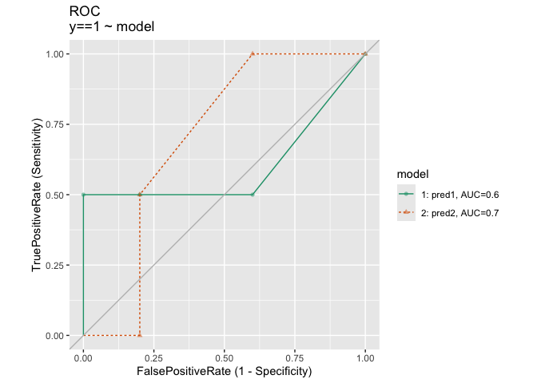
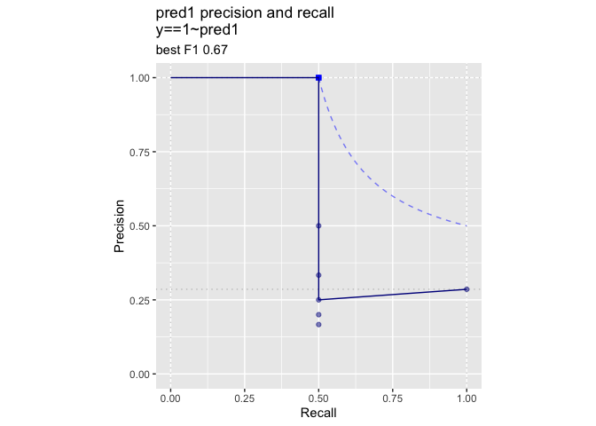
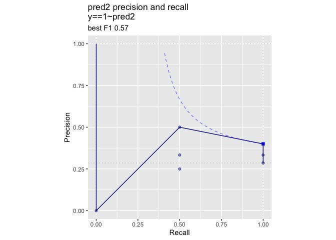

A Simple Example Where re-Weighting Data is Not Monotone
================
John Mount, Nina Zume; <https://www.win-vector.com>
Wed Aug 19 11:53:52 2020

Here is an example of how re-weighting data as function of the training
outcome to balance the positive and negative examples can change results
in a non-monotone manner, even for a simple logistic regression. This
means in this case re-weighing is not equivalent to sweeping the chosen
threshold that converts a score into a classification rule. However,
[for single variable plus intercept logistic regression models no such
non-monotone re-ordering is
possible](https://github.com/WinVector/Examples/blob/main/rebalance/rw_invariant.md).

[Nina Zumel had some interesting comments on the
ideas](https://ninazumel.com/2015/02/27/balancing-classes-before-training-classifiers-addressing-a-folk-theorem/)
which lead us to conclude: if re-balancing does anything better than
moving your threshold, this is in fact evidence of a missed interaction.

Let’s work our example in [`R`](https://www.r-project.org).

``` r
# first attach packages
library(wrapr)
library(WVPlots)
```

``` r
# build our example data
# modeling y as a function of x1 and x2 (plus intercept)

d <- wrapr::build_frame(
  "x1"  , "x2", "y", "w2" |
    0   , 0   , 0  , 2    |
    0   , 0   , 0  , 2    |
    0   , 1   , 1  , 5    |
    1   , 0   , 0  , 2    |
    1   , 0   , 0  , 2    |
    1   , 0   , 1  , 5    |
    1   , 1   , 0  , 2    )

knitr::kable(d)
```

| x1 | x2 | y | w2 |
| -: | -: | -: | -: |
|  0 |  0 | 0 |  2 |
|  0 |  0 | 0 |  2 |
|  0 |  1 | 1 |  5 |
|  1 |  0 | 0 |  2 |
|  1 |  0 | 0 |  2 |
|  1 |  0 | 1 |  5 |
|  1 |  1 | 0 |  2 |

Fit a logistic regression model

``` r
model1 <- glm(
  y ~ x1 + x2,
  data = d,
  family = binomial())
```

Take a look at the model summary.

``` r
summary(model1)
```

    ## 
    ## Call:
    ## glm(formula = y ~ x1 + x2, family = binomial(), data = d)
    ## 
    ## Deviance Residuals: 
    ##       1        2        3        4        5        6        7  
    ## -0.7239  -0.7239   1.1117  -0.6294  -0.6294   1.8529  -1.1117  
    ## 
    ## Coefficients:
    ##             Estimate Std. Error z value Pr(>|z|)
    ## (Intercept)  -1.2056     1.4879  -0.810    0.418
    ## x1           -0.3129     1.7648  -0.177    0.859
    ## x2            1.3621     1.8101   0.752    0.452
    ## 
    ## (Dispersion parameter for binomial family taken to be 1)
    ## 
    ##     Null deviance: 8.3758  on 6  degrees of freedom
    ## Residual deviance: 7.7453  on 4  degrees of freedom
    ## AIC: 13.745
    ## 
    ## Number of Fisher Scoring iterations: 4

Add the model predictions to the data frame.

``` r
d$pred1 <- predict(model1, newdata = d, type = 'response')
```

``` r
knitr::kable(d)
```

| x1 | x2 | y | w2 |     pred1 |
| -: | -: | -: | -: | --------: |
|  0 |  0 | 0 |  2 | 0.2304816 |
|  0 |  0 | 0 |  2 | 0.2304816 |
|  0 |  1 | 1 |  5 | 0.5390367 |
|  1 |  0 | 0 |  2 | 0.1796789 |
|  1 |  0 | 0 |  2 | 0.1796789 |
|  1 |  0 | 1 |  5 | 0.1796789 |
|  1 |  1 | 0 |  2 | 0.4609633 |

However, notice the was not a “balanced” problem or a problem with
prevalence equal to 0.5.

``` r
sum(d$y) / nrow(d)
```

    ## [1] 0.2857143

Let’s see if fitting a balanced copy of the data set (created by
up-sampling the positive examples) gives us a structurally different
answer.

``` r
# confirm weighted prevalence is exactly 0.5
sum(d$y * d$w2) / sum(d$w2)
```

    ## [1] 0.5

``` r
model2 <- glm(
  y ~ x1 + x2,
  data = d,
  weights = w2,
  family = binomial())
```

``` r
summary(model2)
```

    ## 
    ## Call:
    ## glm(formula = y ~ x1 + x2, family = binomial(), data = d, weights = w2)
    ## 
    ## Deviance Residuals: 
    ##      1       2       3       4       5       6       7  
    ## -1.349  -1.349   1.860  -1.413  -1.413   3.056  -2.292  
    ## 
    ## Coefficients:
    ##             Estimate Std. Error z value Pr(>|z|)
    ## (Intercept)  -0.5513     0.9209  -0.599    0.549
    ## x1            0.1169     1.0354   0.113    0.910
    ## x2            1.4348     1.1034   1.300    0.193
    ## 
    ## (Dispersion parameter for binomial family taken to be 1)
    ## 
    ##     Null deviance: 27.726  on 6  degrees of freedom
    ## Residual deviance: 25.686  on 4  degrees of freedom
    ## AIC: 31.686
    ## 
    ## Number of Fisher Scoring iterations: 5

``` r
# land the new predictions in our data frame
d$pred2 <- predict(model2, newdata = d, type = 'response')
```

``` r
knitr::kable(d)
```

| x1 | x2 | y | w2 |     pred1 |     pred2 |
| -: | -: | -: | -: | --------: | --------: |
|  0 |  0 | 0 |  2 | 0.2304816 | 0.3655679 |
|  0 |  0 | 0 |  2 | 0.2304816 | 0.3655679 |
|  0 |  1 | 1 |  5 | 0.5390367 | 0.7075457 |
|  1 |  0 | 0 |  2 | 0.1796789 | 0.3930810 |
|  1 |  0 | 0 |  2 | 0.1796789 | 0.3930810 |
|  1 |  0 | 1 |  5 | 0.1796789 | 0.3930810 |
|  1 |  1 | 0 |  2 | 0.4609633 | 0.7311357 |

Notice rows 1 and 2 are predicted to have larger probability (prediction
\~ 0.23) in model1 than rows 4 and 5 (prediction \~ 0.18). This relation
is reversed in model2. So the models have essentially different order,
and therefore are not monotone transforms of each other.

This can also be seen in the ROC plots.

``` r
ROCPlotPair(
  d,
  xvar1 = 'pred1',
  xvar2 = 'pred2',
  truthVar = 'y',
  truthTarget = 1,
  title = 'ROC')
```

<!-- -->

We see the regular model is better in the high-specificity /
low-sensitivity region and the balanced model is better at the
low-specificity / high-sensitivity regions. However, this can be
misleading as the ROC plot deliberately removes prevalence driven
effects.

We can also look at precision and recall trade-offs.

``` r
PRPlot(
  d,
  xvar = 'pred1',
  truthVar = 'y',
  truthTarget = 1,
  title = 'pred1 precision and recall')
```

<!-- -->

``` r
PRPlot(
  d,
  xvar = 'pred2',
  truthVar = 'y',
  truthTarget = 1,
  title = 'pred2 precision and recall')
```

<!-- -->

It is not obvious that re-scaling is always going to be a bad transform.
But our point is: it is not obvious re-scaling is always going to be a
good transform. As we have [written
before](https://win-vector.com/2020/08/07/dont-use-classification-rules-for-classification-problems/).
It is our opinion that data re-sampling is often used to work around the
avoidable mistake of using a classification rule where a detailed
numeric score would in fact to better.

As we mentioned in our [invariant
note](https://github.com/WinVector/Examples/blob/main/rebalance/rw_invariant.md)
a saturated version of this data set will not have the non-monotone
property. With enough training data the satuarating is mere feature
engineering.

For example we can saturate our example by adding a few interaction
variables.

``` r
d$x3 <- d$x1 * d$x2
d$x4 <- (1 - d$x1) * d$x2
d$x5 <- d$x1 * (1 - d$x2)
d$x6 <- (1 - d$x1) * (1 - d$x2)

knitr::kable(d)
```

| x1 | x2 | y | w2 |     pred1 |     pred2 | x3 | x4 | x5 | x6 |
| -: | -: | -: | -: | --------: | --------: | -: | -: | -: | -: |
|  0 |  0 | 0 |  2 | 0.2304816 | 0.3655679 |  0 |  0 |  0 |  1 |
|  0 |  0 | 0 |  2 | 0.2304816 | 0.3655679 |  0 |  0 |  0 |  1 |
|  0 |  1 | 1 |  5 | 0.5390367 | 0.7075457 |  0 |  1 |  0 |  0 |
|  1 |  0 | 0 |  2 | 0.1796789 | 0.3930810 |  0 |  0 |  1 |  0 |
|  1 |  0 | 0 |  2 | 0.1796789 | 0.3930810 |  0 |  0 |  1 |  0 |
|  1 |  0 | 1 |  5 | 0.1796789 | 0.3930810 |  0 |  0 |  1 |  0 |
|  1 |  1 | 0 |  2 | 0.4609633 | 0.7311357 |  1 |  0 |  0 |  0 |

``` r
model1s <- glm(
  y ~ x1 + x2 + x3 + x4 + x5 + x6,
  data = d,
  family = binomial())
```

``` r
predict(model1s, newdata = d, type = 'response')
```

    ## Warning in predict.lm(object, newdata, se.fit, scale = 1, type = if (type == :
    ## prediction from a rank-deficient fit may be misleading

    ##            1            2            3            4            5            6 
    ## 1.170226e-09 1.170226e-09 1.000000e+00 3.333333e-01 3.333333e-01 3.333333e-01 
    ##            7 
    ## 1.170226e-09

``` r
model2s <- glm(
  y ~ x1 + x2 + x3 + x4 + x5 + x6,
  data = d,
  weights = w2,
  family = binomial())
```

``` r
predict(model2s, newdata = d, type = 'response')
```

    ## Warning in predict.lm(object, newdata, se.fit, scale = 1, type = if (type == :
    ## prediction from a rank-deficient fit may be misleading

    ##            1            2            3            4            5            6 
    ## 2.272475e-09 2.272475e-09 1.000000e+00 5.555556e-01 5.555556e-01 5.555556e-01 
    ##            7 
    ## 2.272475e-09

Notice the two predictions have the same order-statistics.

This can be achieved quicker by introducing the obvious categorical
variable that the partition implied by the satured variables.

``` r
d$cat <- paste(d$x1, d$x2)
```

``` r
model1c <- glm(
  y ~ cat,
  data = d,
  family = binomial())
```

``` r
predict(model1c, newdata = d, type = 'response')
```

    ##            1            2            3            4            5            6 
    ## 1.170226e-09 1.170226e-09 1.000000e+00 3.333333e-01 3.333333e-01 3.333333e-01 
    ##            7 
    ## 1.170226e-09

``` r
model2c <- glm(
  y ~ cat,
  data = d,
  weights = w2,
  family = binomial())
```

``` r
predict(model2c, newdata = d, type = 'response')
```

    ##            1            2            3            4            5            6 
    ## 2.272475e-09 2.272475e-09 1.000000e+00 5.555556e-01 5.555556e-01 5.555556e-01 
    ##            7 
    ## 2.272475e-09
