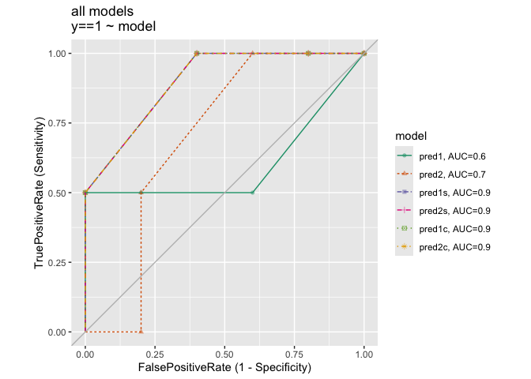
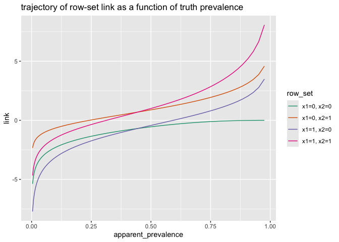
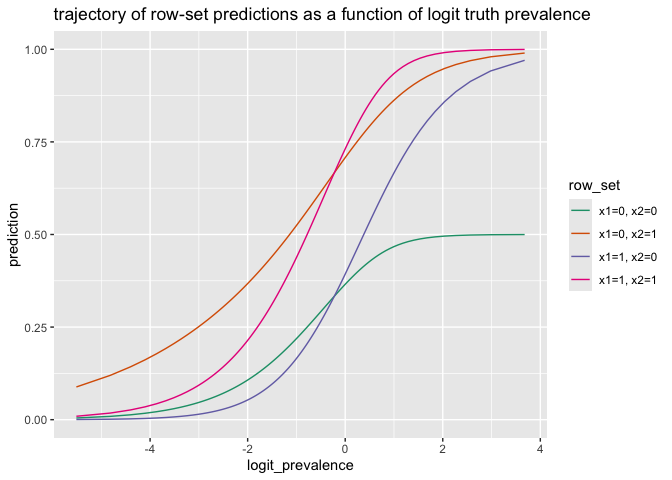

A Simple Example Where re-Weighting Data is Not Monotone
================
John Mount, Nina Zumel; <https://www.win-vector.com>
Fri Nov 11 07:49:12 2022

## Introduction

Here is an example of how re-weighting data as function of the training
outcome to balance the positive and negative examples can change results
in a non-monotone manner, even for a simple logistic regression. This
means in this case re-weighing is not equivalent to sweeping the chosen
threshold that converts a score into a classification rule. However,
[for single variable plus intercept logistic regression models no such
non-monotone re-ordering is
possible](https://github.com/WinVector/Examples/blob/main/rebalance/rw_invariant.md).

[Nina Zumel had some interesting comments on the
ideas](https://ninazumel.com/2015/02/27/balancing-classes-before-training-classifiers-addressing-a-folk-theorem/)
which lead us to conclude: if re-balancing does anything better than
moving your threshold, this is in fact evidence of a missed interaction.

It is our thesis that their is little benefit to re-balancing data and
if there appears to be such a benefit it means you failed to use numeric
scores (converted to a classification rule too early) or missed an
interaction in your data (which can be fixed by a bit more feature
engineering, the non-montone change suggests some interactions that can
be introduced).

## Example

Let’s work our example in [`R`](https://www.r-project.org). Some of our
terminology is defined in our [companion
note](https://github.com/WinVector/Examples/blob/main/rebalance/rw_invariant.md).

``` r
# first attach packages
library(ggplot2)
```

    ## Warning in register(): Can't find generic `scale_type` in package ggplot2 to
    ## register S3 method.

``` r
library(wrapr)
library(WVPlots)
```

``` r
# build our example data
# modeling y as a function of x1 and x2 (plus intercept)

d <- wrapr::build_frame(
  "x1"  , "x2", "y", "w2" |
    0   , 0   , 0  , 2    |
    0   , 0   , 0  , 2    |
    0   , 1   , 1  , 5    |
    1   , 0   , 0  , 2    |
    1   , 0   , 0  , 2    |
    1   , 0   , 1  , 5    |
    1   , 1   , 0  , 2    )

knitr::kable(d)
```

|  x1 |  x2 |   y |  w2 |
|----:|----:|----:|----:|
|   0 |   0 |   0 |   2 |
|   0 |   0 |   0 |   2 |
|   0 |   1 |   1 |   5 |
|   1 |   0 |   0 |   2 |
|   1 |   0 |   0 |   2 |
|   1 |   0 |   1 |   5 |
|   1 |   1 |   0 |   2 |

### First Model

Fit a logistic regression model

``` r
model1 <- glm(
  y ~ x1 + x2,
  data = d,
  family = binomial())
```

Take a look at the model summary.

``` r
summary(model1)
```

    ## 
    ## Call:
    ## glm(formula = y ~ x1 + x2, family = binomial(), data = d)
    ## 
    ## Deviance Residuals: 
    ##       1        2        3        4        5        6        7  
    ## -0.7239  -0.7239   1.1117  -0.6294  -0.6294   1.8529  -1.1117  
    ## 
    ## Coefficients:
    ##             Estimate Std. Error z value Pr(>|z|)
    ## (Intercept)  -1.2056     1.4879  -0.810    0.418
    ## x1           -0.3129     1.7648  -0.177    0.859
    ## x2            1.3621     1.8101   0.752    0.452
    ## 
    ## (Dispersion parameter for binomial family taken to be 1)
    ## 
    ##     Null deviance: 8.3758  on 6  degrees of freedom
    ## Residual deviance: 7.7453  on 4  degrees of freedom
    ## AIC: 13.745
    ## 
    ## Number of Fisher Scoring iterations: 4

Add the model predictions to the data frame.

``` r
d$pred1 <- predict(model1, newdata = d, type = 'response')
```

``` r
knitr::kable(d)
```

|  x1 |  x2 |   y |  w2 |     pred1 |
|----:|----:|----:|----:|----------:|
|   0 |   0 |   0 |   2 | 0.2304816 |
|   0 |   0 |   0 |   2 | 0.2304816 |
|   0 |   1 |   1 |   5 | 0.5390367 |
|   1 |   0 |   0 |   2 | 0.1796789 |
|   1 |   0 |   0 |   2 | 0.1796789 |
|   1 |   0 |   1 |   5 | 0.1796789 |
|   1 |   1 |   0 |   2 | 0.4609633 |

However, notice the was not a “balanced” problem or a problem with
prevalence equal to 0.5.

``` r
sum(d$y) / nrow(d)
```

    ## [1] 0.2857143

### Re-balanced Model

Let’s see if fitting a balanced copy of the data set (created by
up-sampling the positive examples) gives us a structurally different
answer.

``` r
# confirm weighted prevalence is exactly 0.5
sum(d$y * d$w2) / sum(d$w2)
```

    ## [1] 0.5

``` r
model2 <- glm(
  y ~ x1 + x2,
  data = d,
  weights = w2,
  family = binomial())
```

``` r
summary(model2)
```

    ## 
    ## Call:
    ## glm(formula = y ~ x1 + x2, family = binomial(), data = d, weights = w2)
    ## 
    ## Deviance Residuals: 
    ##      1       2       3       4       5       6       7  
    ## -1.349  -1.349   1.860  -1.413  -1.413   3.056  -2.292  
    ## 
    ## Coefficients:
    ##             Estimate Std. Error z value Pr(>|z|)
    ## (Intercept)  -0.5513     0.9209  -0.599    0.549
    ## x1            0.1169     1.0354   0.113    0.910
    ## x2            1.4348     1.1034   1.300    0.193
    ## 
    ## (Dispersion parameter for binomial family taken to be 1)
    ## 
    ##     Null deviance: 27.726  on 6  degrees of freedom
    ## Residual deviance: 25.686  on 4  degrees of freedom
    ## AIC: 31.686
    ## 
    ## Number of Fisher Scoring iterations: 5

``` r
# land the new predictions in our data frame
d$pred2 <- predict(model2, newdata = d, type = 'response')
```

``` r
knitr::kable(d)
```

|  x1 |  x2 |   y |  w2 |     pred1 |     pred2 |
|----:|----:|----:|----:|----------:|----------:|
|   0 |   0 |   0 |   2 | 0.2304816 | 0.3655679 |
|   0 |   0 |   0 |   2 | 0.2304816 | 0.3655679 |
|   0 |   1 |   1 |   5 | 0.5390367 | 0.7075457 |
|   1 |   0 |   0 |   2 | 0.1796789 | 0.3930810 |
|   1 |   0 |   0 |   2 | 0.1796789 | 0.3930810 |
|   1 |   0 |   1 |   5 | 0.1796789 | 0.3930810 |
|   1 |   1 |   0 |   2 | 0.4609633 | 0.7311357 |

### The Difference

Notice rows 1 and 2 are predicted to have larger probability (prediction
\~ 0.23) in model1 than rows 4 and 5 (prediction \~ 0.18). This relation
is reversed in model2. So the models have essentially different order,
and therefore are not monotone transforms of each other.

This can also be seen in the ROC plots.

``` r
ROCPlotPair(
  d,
  xvar1 = 'pred1',
  xvar2 = 'pred2',
  truthVar = 'y',
  truthTarget = 1,
  title = 'ROC')
```

<!-- -->

We see the regular model is better in the high-specificity /
low-sensitivity region and the balanced model is better at the
low-specificity / high-sensitivity regions. However, this can be
misleading as the ROC plot deliberately removes prevalence driven
effects.

We can also look at precision and recall trade-offs.

``` r
PRPlot(
  d,
  xvar = 'pred1',
  truthVar = 'y',
  truthTarget = 1,
  title = 'pred1 precision and recall')
```

<!-- -->

``` r
PRPlot(
  d,
  xvar = 'pred2',
  truthVar = 'y',
  truthTarget = 1,
  title = 'pred2 precision and recall')
```

<!-- -->

## A Critique

An important property of logistic regression is [the balance
properties](https://win-vector.com/2011/09/14/the-simpler-derivation-of-logistic-regression/):
for any variable `v` we have
`sum(d[[v]] * d$y) == sum(d[[v]] * d$prediction)`. Fitting with the
balance priors (essentially the wrong priors loses this property).

``` r
sum(d$x1 * d$y)
```

    ## [1] 1

``` r
sum(d$x1 * d$pred1)  # matches sum(d$x1 * d$y)
```

    ## [1] 1

``` r
sum(d$x1 * d$pred2)  # does not match
```

    ## [1] 1.910379

And this is not fixed by trying to adjust back to the true (unbalanced)
priors.

``` r
sum(d$x1 * d$pred2) * (  sum(d$y) / sum(d$pred2) )  # still does not match
```

    ## [1] 1.140845

## Moving Forward

It is not obvious that re-scaling is always going to be a bad transform.
But our point is: it is not obvious re-scaling is always going to be a
good transform. As we have [written
before](https://win-vector.com/2020/08/07/dont-use-classification-rules-for-classification-problems/).
It is our opinion that data re-sampling is often used to work around the
avoidable mistake of using a classification rule where a detailed
numeric score would in fact to better.

As we mentioned in our [invariant
note](https://github.com/WinVector/Examples/blob/main/rebalance/rw_invariant.md)
a saturated version of this data set will not have the non-monotone
property. With enough training data the satuarating is mere feature
engineering. The non-monotone transform is a symptom of a missing
interaction forcing the modeling to make different compromises at
different data prevalences. With a richer feature set the model can make
different decisions for subsets of rows, yielding a better model with
fewer compromises.

### Adding Interactions

The non-monotone set can actually suggest interactions to add.

``` r
find_order_reversals <- function(p1, p2) {
  # find the order changes.
  eps <- 1e-12
  combs <- combn(seq_len(nrow(d)), 2)
  reversals <- ( p1[combs[1, ]] > p1[combs[2, ]] + eps) & 
    ( p2[combs[1, ]] + eps < p2[combs[2, ]] )
  combs[, reversals, drop = FALSE]
}

pairs <- list(
  find_order_reversals(d$pred1, d$pred2),
  find_order_reversals(d$pred2, d$pred1))

pairs
```

    ## [[1]]
    ##      [,1] [,2] [,3] [,4] [,5] [,6] [,7]
    ## [1,]    1    1    1    2    2    2    3
    ## [2,]    4    5    6    4    5    6    7
    ## 
    ## [[2]]
    ##     
    ## [1,]
    ## [2,]

Each entry of `pairs` is the edge-set of a graph where `pred1` and
`pred2` orders disagree. We want new variables eliminate edges from
these graphs.

In our case the ordered supports of the components are
`{({1,2}, {4, 5, 6}), ({3}, {7})}`. Our idea is to introduce variables
that identify these support sets, as this would give the model the
degrees of freedom needed to re-score these sets independently and
remove the compromises forcing the non-monotone change.

``` r
d$s_456 <- d$x1 - d$x1 * d$x2
d$s_12 <- (1 - d$x1) * (1 - d$x2)
d$s_3 <- (1 - d$x1) * d$x2
d$s_7 <- d$x1 * d$x2
knitr::kable(d)
```

|  x1 |  x2 |   y |  w2 |     pred1 |     pred2 | s_456 | s_12 | s_3 | s_7 |
|----:|----:|----:|----:|----------:|----------:|------:|-----:|----:|----:|
|   0 |   0 |   0 |   2 | 0.2304816 | 0.3655679 |     0 |    1 |   0 |   0 |
|   0 |   0 |   0 |   2 | 0.2304816 | 0.3655679 |     0 |    1 |   0 |   0 |
|   0 |   1 |   1 |   5 | 0.5390367 | 0.7075457 |     0 |    0 |   1 |   0 |
|   1 |   0 |   0 |   2 | 0.1796789 | 0.3930810 |     1 |    0 |   0 |   0 |
|   1 |   0 |   0 |   2 | 0.1796789 | 0.3930810 |     1 |    0 |   0 |   0 |
|   1 |   0 |   1 |   5 | 0.1796789 | 0.3930810 |     1 |    0 |   0 |   0 |
|   1 |   1 |   0 |   2 | 0.4609633 | 0.7311357 |     0 |    0 |   0 |   1 |

The idea is: we are working in the set-algebra of the indicator
variables. Complement is subtraction from one, intersection is
represented by multiplication, union compliment of intersection of
complements. The supports must be in this algebra as rows that are
indistinguishible by combinations of our variables must enter and leave
the supports together.

Once we have an augmented set of variables we can re-solve for models
under both data weightings.

``` r
model1s <- glm(
  y ~ x1 + x2 + s_456 + s_12 + s_3 + s_7,
  data = d,
  family = binomial())

model1s$coefficients
```

    ## (Intercept)          x1          x2       s_456        s_12         s_3 
    ##   -20.56607   -41.13214    41.13214    61.00506          NA          NA 
    ##         s_7 
    ##          NA

``` r
d$pred1s <- predict(model1s, newdata = d, type = 'response')
```

    ## Warning in predict.lm(object, newdata, se.fit, scale = 1, type = if (type == :
    ## prediction from a rank-deficient fit may be misleading

``` r
d$pred1s
```

    ## [1] 1.170226e-09 1.170226e-09 1.000000e+00 3.333333e-01 3.333333e-01
    ## [6] 3.333333e-01 1.170226e-09

``` r
model2s <- glm(
  y ~ x1 + x2 + s_456 + s_12 + s_3 + s_7,
  data = d,
  weights = w2,
  family = binomial())

model2s$coefficients
```

    ## (Intercept)          x1          x2       s_456        s_12         s_3 
    ##   -19.90240   -40.43890    40.43890    60.56444          NA          NA 
    ##         s_7 
    ##          NA

``` r
d$pred2s <- predict(model2s, newdata = d, type = 'response')
```

    ## Warning in predict.lm(object, newdata, se.fit, scale = 1, type = if (type == :
    ## prediction from a rank-deficient fit may be misleading

``` r
d$pred2s
```

    ## [1] 2.272475e-09 2.272475e-09 1.000000e+00 5.555556e-01 5.555556e-01
    ## [6] 5.555556e-01 2.272475e-09

``` r
list(
  find_order_reversals(d$pred1s, d$pred2s),
  find_order_reversals(d$pred2s, d$pred1s))
```

    ## [[1]]
    ##     
    ## [1,]
    ## [2,]
    ## 
    ## [[2]]
    ##     
    ## [1,]
    ## [2,]

Notice the two predictions, while different, now have the same
order-statistics. So instead of worrying which of the original two
models was better, we instead say the original order difference were in
fact evidence of missing interaction variables. With the additional
interaction variables we have a model structure, that with enough
training data, should dominate both original models.

The point is: with individual variables that contain finer detail about
the data fewer trade-offs are required. Likely higher complexity models
such as polynomial regression, kernelized methods, tree based methods,
ensemble methods, and neural nets introduce enough interactions to not
fundamentally need the re-balance (though any one particular
implementation may fall short).

This can be achieved all at once by introducing the obvious categorical
variable that the partition implied by the combinations of the original
variables variables.

``` r
d$cat <- paste(d$x1, d$x2)
```

``` r
model1c <- glm(
  y ~ cat,
  data = d,
  family = binomial())

model1c$coefficients
```

    ##   (Intercept)        cat0 1        cat1 0        cat1 1 
    ## -2.056607e+01  4.113214e+01  1.987292e+01 -5.786086e-11

``` r
d$pred1c <- predict(model1c, newdata = d, type = 'response')
d$pred1c
```

    ## [1] 1.170226e-09 1.170226e-09 1.000000e+00 3.333333e-01 3.333333e-01
    ## [6] 3.333333e-01 1.170226e-09

``` r
model2c <- glm(
  y ~ cat,
  data = d,
  weights = w2,
  family = binomial())

model2c$coefficients
```

    ##   (Intercept)        cat0 1        cat1 0        cat1 1 
    ## -1.990240e+01  4.043890e+01  2.012554e+01 -1.077021e-08

``` r
d$pred2c <- predict(model2c, newdata = d, type = 'response')
d$pred2c
```

    ## [1] 2.272475e-09 2.272475e-09 1.000000e+00 5.555556e-01 5.555556e-01
    ## [6] 5.555556e-01 2.272475e-09

## Dominance

The point being: a sufficiently saturated model should eventualy
dominate other models. Assuming we have enough training data, the extra
features allow us to take more favorable sensitivity/specficity
trade-off and make the initial training priors something we can more
easilly substitute out.

``` r
ROCPlotPairList(
  d,
  xvar_names = qc(pred1, pred2, pred1s, pred2s, pred1c, pred2c),
  truthVar = 'y',
  truthTarget = 1,
  title = 'all models')
```

<!-- -->

Notice the models `pred1c`, `pred1s`, `pred2c`, and `pred2s` are are
identical and dominant in terms of order statistics and
sensitivity/specficity trade-offs.

``` r
ROCPlotPairList(
  d,
  xvar_names = qc(pred1s, pred2s, pred1c, pred2c),
  truthVar = 'y',
  truthTarget = 1,
  title = 'dominant model family')
```

<!-- -->

This emphasizes we would be happy with any one of these models, and
could use them by either post-hoc adjusting the scores or thresholds.

## Shifting

Matloff *Statistical Regression and Classification*, CRC Press, 2017,
section 5.8.2.2 “The Issue of ‘Unbalanced’ (and Balanced) Data,
Remedies” suggests shifting prediction scores instead of moving
thresholds to deal changes in priors. This is good advice and emphasizes
staying with scores, instead of binding in thresholds to form
classification rules too early.

The monotone models are very well suited for this transform, as for them
any such transform is order equivilent to re-training with different
priors.

## Homotopy Model Bundles

We suggest the solution to using a model in possibly unknown future
prevalance situations is to implement the trajectory plotting ideas
shown in the appendix of this note. We introduce a new model object we
are going to call a *homotopy model bundle*.

<blockquote>

A *homotopy model bundle* is defined as follows.

A classification score model is a map `m: X -> [0, 1]` that maps
elements the space of explanitory variables to probility estimates. Call
the space of all such functions

A classification model homotopy bundle is a map ’h: X \* \[0, 1\] -\>
\[0, 1\]\` or a map from the cross-product of the space of explanatory
variables and posited prevelance to probability estimates.
</blockquote>

So in principle a homotopy model bundle is an infinite family of models,
one for each posited prevance in the interal `[0, 1]`. In practice the
homotopy model bundle may have a more concise realization.

One thing we have shown: even for logistic regression there are
situations where the model homotopy bundle is *not* of the form
`f(p)(m(X))` where `f()` is a family of functions, and`f(p)` is a
monotone function of the original model prediction `m(X)` .

## Conclusion

We have shown some ways to refine the logistic regression model so it is
prediction order-invariant to data prevalence. This sort of model should
be prefered.

## Appendix

### Plotting prediction trajectory

Here we look at the trajectories of coefficients and predictions as a
function of data re-weighting.

``` r
logit <- function(x) log(x/(1-x))

dt <- data.frame(
  x1 = c(0, 0, 1, 1), 
  x2 = c(0, 1, 0, 1))
names <- vapply(colnames(dt), function(v) paste0(v, '=', dt[[v]]), character(nrow(dt)))
names <- vapply(seq_len(nrow(names)), function(i) paste(names[i,], collapse = ', '), character(1))
wseq <- seq(0.01, 0.99, length.out = 100)

evalsp <- lapply(
  wseq,
  function(wi) {
    weights = wi*d$y + (1-wi)*(1-d$y)
    mt <-  suppressWarnings(
      glm(
        y ~ x1 + x2,
        data = d,
        weights = weights,
        family = binomial())
    )
    data.frame(
      wt = wi,
      apparent_prevalence = sum(weights * d$y)/sum(weights),
      row_set = names,
      prediction = predict(mt, newdata = dt, type = 'response'),
      link = predict(mt, newdata = dt, type = 'link'))
  }
)
evalsp <- do.call(rbind, evalsp)

ggplot(
  data = evalsp, 
  mapping = aes(x = apparent_prevalence, y = prediction, color = row_set)) +
  geom_line() +
  ggtitle("trajectory of row-set predictions as a function of truth prevalence") +
  scale_color_brewer(palette = "Dark2")
```

<!-- -->

``` r
ggplot(data = evalsp, mapping = aes(x = apparent_prevalence, y = link, color = row_set)) +
  geom_line() +
  ggtitle("trajectory of row-set link as a function of truth prevalence") +
  scale_color_brewer(palette = "Dark2")
```

<!-- -->

``` r
evalsp$logit_prevalence <- logit(evalsp$apparent_prevalence)

ggplot(data = evalsp, mapping = aes(x = logit_prevalence, y = prediction, color = row_set)) +
  geom_line() +
  ggtitle("trajectory of row-set predictions as a function of logit truth prevalence") +
  scale_color_brewer(palette = "Dark2")
```

<!-- -->

``` r
ggplot(data = evalsp, mapping = aes(x = logit_prevalence, y = link, color = row_set)) +
  geom_line() +
  ggtitle("trajectory of row-set link as a function of logit truth prevalence") +
  scale_color_brewer(palette = "Dark2")
```

<!-- -->

``` r
evalsc <- lapply(
  wseq,
  function(wi) {
    weights = wi*d$y + (1-wi)*(1-d$y)
    mt <-  suppressWarnings(
      glm(
        y ~ x1 + x2,
        data = d,
        weights = weights,
        family = binomial())
    )
    data.frame(
      wt = wi,
      apparent_prevalence = sum(weights * d$y)/sum(weights),
      coef_name = names(mt$coefficients),
      coef_value = mt$coefficients)
  }
)
evalsc <- do.call(rbind, evalsc)

ggplot(data = evalsc, mapping = aes(x = apparent_prevalence, y = coef_value, color = coef_name)) +
  geom_line() +
  ggtitle("trajectory of coefficients as a function of truth prevalence") +
  scale_color_brewer(palette = "Dark2")
```

<!-- -->

``` r
evalsc$logit_prevalence <- logit(evalsc$apparent_prevalence)

ggplot(data = evalsc, mapping = aes(x = logit_prevalence, y = coef_value, color = coef_name)) +
  geom_line() +
  ggtitle("trajectory of coefficients as a function of logit truth prevalence") +
  scale_color_brewer(palette = "Dark2")
```

<!-- -->

``` r
sigmoid <- function(x) { 1 / (1 + exp(-x)) }
evalsc$sigmoid_coef_value <- sigmoid(evalsc$coef_value)

ggplot(data = evalsc, mapping = aes(x = apparent_prevalence, y = sigmoid_coef_value, color = coef_name)) +
  geom_line() +
  ggtitle("trajectory of sigmoid of coefficients as a function of truth prevalence") +
  scale_color_brewer(palette = "Dark2")
```

<!-- -->

``` r
ggplot(data = evalsc, mapping = aes(x = apparent_prevalence, y = sigmoid_coef_value, color = coef_name)) +
  geom_line() +
  ggtitle("trajectory of sigmoid of coefficients as a function of truth prevalence") +
  scale_color_brewer(palette = "Dark2")
```

<!-- -->

``` r
ggplot(data = evalsc, mapping = aes(x = logit_prevalence, y = sigmoid_coef_value, color = coef_name)) +
  geom_line() +
  ggtitle("trajectory of sigmoid of coefficients as a function of logit truth prevalence") +
  scale_color_brewer(palette = "Dark2")
```

<!-- -->
