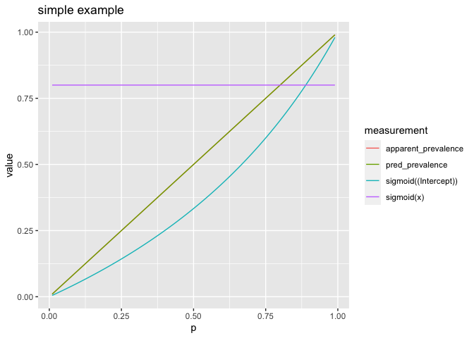
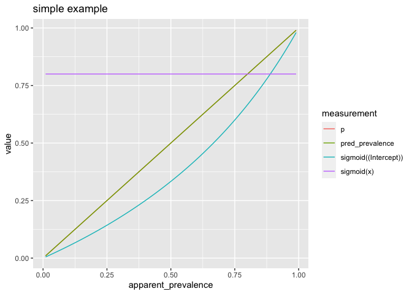

simple_example.Rmd
================
2022-11-11

``` r
library(ggplot2)
```

    ## Warning in register(): Can't find generic `scale_type` in package ggplot2 to
    ## register S3 method.

``` r
sigmoid <- function(x) { 1 / (1 + exp(-x)) }
```

``` r
p = 0.3
d <- data.frame(x=c(1, 1), y=c(TRUE, FALSE))
wts <- p * d$y + (1 - p) * (1 - d$y)
apparent_prevalence <- sum(wts * d$y) / sum(wts)
apparent_prevalence
```

    ## [1] 0.3

``` r
model <- glm(
  y ~ 0 + x,
  data = d,
  weights = wts,
  family = binomial())
```

    ## Warning in eval(family$initialize): non-integer #successes in a binomial glm!

``` r
preds <- predict(model, newdata=d, type="response")
preds
```

    ##   1   2 
    ## 0.3 0.3

``` r
sigmoid(model$coefficients)
```

    ##   x 
    ## 0.3

``` r
evel_on_wt_dq <- function(p, ..., d, vars, outcome_name = "y") {
  wrapr::stop_if_dot_args(substitute(list(...)), "evel_on_wt_dq")
  wts <- p * d$y + (1 - p) * (1 - d$y)
  apparent_prevalence <- sum(wts * d$y) / sum(wts)
  fml <- wrapr::mk_formula(outcome_name, vars, extra_values = list(wts = wts))
  model <-suppressWarnings(  # shut about non-integer weights
    glm(
      fml,
      data = d,
      weights = wts,
      family = binomial())
    )
  preds <- predict(model, newdata=d, type="response")
  pred_prevalence <- sum(preds * wts) / sum(wts)
  res <- as.data.frame(t(sigmoid(model$coefficients)))
  colnames(res) <- paste0("sigmoid(", colnames(res), ")")
  res$p <- p
  res$apparent_prevalence <- apparent_prevalence
  res$pred_prevalence <- pred_prevalence
  res
  }
```

``` r
build_trajectory_graphs <- function(d, ..., title, vars, outcome_name = "y") {
  wrapr::stop_if_dot_args(substitute(list(...)), "build_trajetory_graphs")
  frms <- lapply(seq(0.01, 0.99, length.out = 100), function(p) evel_on_wt_dq(p, d = d, vars = vars, outcome_name = outcome_name))
  frms <- do.call(rbind, frms)
  data_for_plot <- cdata::pivot_to_blocks(
    frms, 
    nameForNewKeyColumn = "measurement", 
    nameForNewValueColumn = "value", 
    columnsToTakeFrom = colnames(frms)[colnames(frms) != "p"])
  print(
    ggplot(data = data_for_plot, aes(x = p, y = value, color = measurement)) + 
      geom_line() +
      ggtitle(title)
  )
  data_for_plot <- cdata::pivot_to_blocks(
    frms, 
    nameForNewKeyColumn = "measurement", 
    nameForNewValueColumn = "value", 
    columnsToTakeFrom = colnames(frms)[colnames(frms) != "apparent_prevalence"])
  print(
    ggplot(data = data_for_plot, aes(x = apparent_prevalence, y = value, color = measurement)) + 
      geom_line() +
      ggtitle(title)
  )
}
```

``` r
d_simple <- wrapr::build_frame(
  "x"  , "y" |
    0  , 0   |
    0  , 0   |
    0  , 1   |
    1  , 0   |
    1  , 1   )
```

``` r
build_trajectory_graphs(d_simple, title = "simple example", vars = c("x"))
```

<!-- --><!-- -->

``` r
d_ex <- wrapr::build_frame(
   "x1"  , "x2", "y" |
     0   , 0   , 0   |
     0   , 0   , 0   |
     0   , 1   , 1   |
     1   , 0   , 0   |
     1   , 0   , 0   |
     1   , 0   , 1   |
     1   , 1   , 0   )
```

``` r
build_trajectory_graphs(d_ex, title = "complex example", vars = c("x1", "x2"))
```

<!-- --><!-- -->
