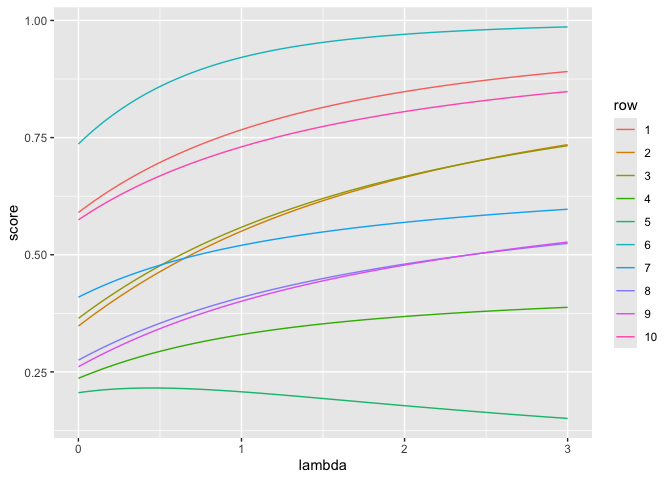

traj_graph_2
================
2024-06-23

``` r
library(ggplot2)
```

    ## Warning: package 'ggplot2' was built under R version 4.3.2

``` r
library(data.table)
```

    ## Warning: package 'data.table' was built under R version 4.3.2

``` r
set.seed(2024)
```

``` r
d_ex <- wrapr::build_frame(
   "x1"  , "x2", "y" |
     0   , 0   , 0   |
     1   , 0   , 1   |
     -2   , 0   , 0   |
     0   , 2   , 1   |
     1   , 2   , 1   |
     1   , 1   , 0   )
```

``` r
 d_ex <- wrapr::build_frame(
    "x1"  , "x2", "x3", "x4", "y"   |
      -4L ,  4L ,  0L , -2L , TRUE  |
       3L , -5L , -1L , -1L , TRUE  |
       1L , -3L , -1L , -3L , TRUE  |
      -5L , -2L , -3L , -5L , TRUE  |
       4L , -3L ,  1L , -5L , FALSE |
      -1L ,  3L ,  2L , -3L , TRUE  |
       2L ,  2L , -2L , -2L , FALSE |
      -5L ,  3L , -3L ,  5L , TRUE  |
       5L ,  5L , -1L , -1L , FALSE |
      -2L , -5L ,  2L , -4L , FALSE )
```

``` r
build_traj <- function(d_ex, lambda_max = 3, length.out = 100) {
    frame <- list()
    suppressWarnings(
      for(lambda in seq(0, lambda_max, length.out = length.out)) {
        model <- glm(y ~ x1 + x2, family=binomial(), data=d_ex, weights = 1 + lambda * d_ex$y)
        preds <- predict(model, type='response', newdata=d_ex)
        row_frame <- as.data.frame(t(as.matrix(preds)))
        row_frame['lambda'] <- lambda
        frame <- c(frame, list(row_frame))
      }
    )
    frame <- do.call(rbind, frame)
    return(frame)
}
```

``` r
logit <- function(x) {log(x/(1-x))}
```

``` r
frame <- build_traj(d_ex)
```

``` r
want_frame <- function(frame) {
  check_eps = 0.03
  n_f_rows <- nrow(frame)
  have_cross <- FALSE
  have_increasing <- FALSE
  have_decreasing <- FALSE
  have_non_monotone <- FALSE
  for(col in colnames(frame)) {
    if(col != 'lambda') {
      col_v <- frame[[col]]
      have_increasing <- have_increasing || ((col_v[[1]] + check_eps) < col_v[[n_f_rows]])
      have_decreasing <- have_decreasing || ((col_v[[1]] - check_eps) > col_v[[n_f_rows]])
      have_non_monotone <- have_non_monotone || (min(col_v) + check_eps < min(col_v[[1]], col_v[[n_f_rows]])) || (max(col_v) - check_eps > max(col_v[[1]], col_v[[n_f_rows]])) 
      for(col2 in colnames(frame)) {
        if(col2 != 'lambda') {
          col2_v <- frame[[col2]]
          see_cross <- (abs(col_v[[1]] - col2_v[[1]]) > check_eps) && (abs(col_v[[n_f_rows]] - col2_v[[n_f_rows]]) > check_eps) && (col_v[[n_f_rows]] != col2_v[[n_f_rows]]) && ((col_v[[1]] > col2_v[[1]]) != (col_v[[n_f_rows]] > col2_v[[n_f_rows]]))
          have_cross <- have_cross || see_cross
        }
      }
    }
  }
  return(have_increasing && have_decreasing && have_cross)
}
```

``` r
mk_example <- function() {
  d_cols <- c('x1', 'x2', 'y')
  n_rows <- 10
  while(TRUE) {
    d_ex <- data.frame(matrix(
      sample(seq(-20, 20), size = length(d_cols) * n_rows, replace = TRUE),
      ncol=length(d_cols)))
    colnames(d_ex) <- d_cols
    d_ex['y'] = d_ex['y'] >= 0
    frame <- build_traj(d_ex)
    if(want_frame(frame)) {
      return(d_ex)
    }
  }
}
```

``` r
d_ex <- mk_example()
```

``` r
cat(wrapr::draw_frame(d_ex))
```

    ## d_ex <- wrapr::build_frame(
    ##    "x1"  , "x2", "y"   |
    ##      -12L,   8L, TRUE  |
    ##       10L, -17L, TRUE  |
    ##        8L, -13L, TRUE  |
    ##       18L,  -9L, FALSE |
    ##       17L,  13L, FALSE |
    ##      -20L, -11L, FALSE |
    ##        0L,  12L, FALSE |
    ##       15L, -12L, FALSE |
    ##       17L, -16L, FALSE |
    ##      -12L,  14L, TRUE  )

``` r
knitr::kable(d_ex)
```

|  x1 |  x2 | y     |
|----:|----:|:------|
| -12 |   8 | TRUE  |
|  10 | -17 | TRUE  |
|   8 | -13 | TRUE  |
|  18 |  -9 | FALSE |
|  17 |  13 | FALSE |
| -20 | -11 | FALSE |
|   0 |  12 | FALSE |
|  15 | -12 | FALSE |
|  17 | -16 | FALSE |
| -12 |  14 | TRUE  |

``` r
frame <- build_traj(d_ex)
plot_dat <- data.frame(data.table::melt(
  data.table(frame), 
  variable.name = 'row',
  value.name = 'score',
  id.vars='lambda'))
```

``` r
ggplot(
  data=plot_dat,
  mapping=aes(x=lambda, y=score, color=row)
) +
  geom_line()
```

<!-- -->
