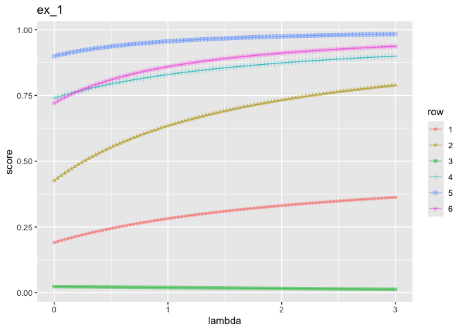
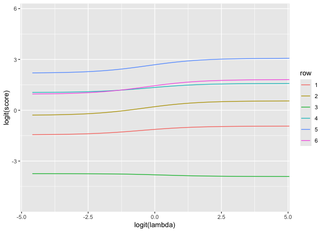

traj_graph_2
================
2024-06-23

``` r
library(ggplot2)
```

    ## Warning: package 'ggplot2' was built under R version 4.3.2

``` r
library(data.table)
```

    ## Warning: package 'data.table' was built under R version 4.3.2

``` r
d_ex <- wrapr::build_frame(
   "x1"  , "x2", "y" |
     0   , 0   , 0   |
     1   , 0   , 1   |
     0   , 2   , 1   |
     1   , 2   , 1   |
     1   , 1   , 0   )

knitr::kable(d_ex)
```

|  x1 |  x2 |   y |
|----:|----:|----:|
|   0 |   0 |   0 |
|   1 |   0 |   1 |
|   0 |   2 |   1 |
|   1 |   2 |   1 |
|   1 |   1 |   0 |

``` r
logit <- function(x) {log(x/(1-x))}
is_non_decreasing <- function(x) {all(x == cummax(x))}
```

``` r
frames <- list()
suppressWarnings(
  for(lambda in seq(0.01, 0.99, length.out = 100)) {
    model <- glm(y ~ x1 + x2, family=binomial(), data=d_ex, weights = 1 + lambda * d_ex$y)
    preds <- predict(model, type='response', newdata=d_ex)
    row_frame <- as.data.frame(t(as.matrix(preds)))
    row_frame['lambda'] <- lambda
    frames <- c(frames, list(row_frame))
  }
)
frames <- do.call(rbind, frames)
for(col in colnames(frames)) { stopifnot(is_non_decreasing(frames[[col]])) }
plot_dat <- data.frame(data.table::melt(
  data.table(frames), 
  variable.name = 'row',
  value.name = 'score',
  id.vars='lambda'))
plot_dat['logit(lambda)'] = logit(plot_dat['lambda'])
plot_dat['logit(score)'] = logit(plot_dat['score'])
```

``` r
ggplot(
  data=plot_dat,
  mapping=aes(x=lambda, y=score, color=row)
) +
  geom_line()
```

<!-- -->

``` r
ggplot(
  data=plot_dat,
  mapping=aes(x=`logit(lambda)`, y=`logit(score)`, color=row)
) +
  geom_line()
```

<!-- -->
