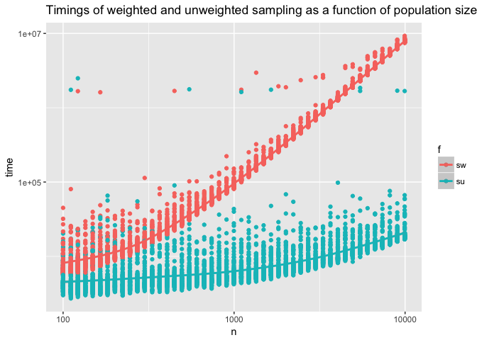
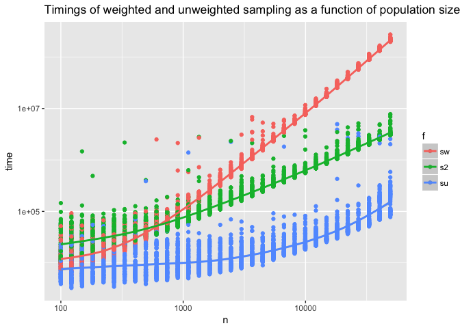

sample
================
John Mount, Win-Vector LLC
9/27/2017

It turns out [R](https://www.r-project.org)'s sampling code is bad at weighted sampling without replacement (meaning each item can occur at most once in the sample) at scale.

As we can see below, the timings are awful:

``` r
library("microbenchmark")
library("ggplot2")
library("seplyr")
```

    ## Loading required package: wrapr

``` r
# build a size k uniform sample (without replacement) of the integers 1:n
su <- function(n, k) {
  n <- floor(n)
  k <- floor(k)
  sample.int(n, k, replace = FALSE)
}

# build a size k uniform sample (without replacement) of the integers 1:n
# but add a uniform weights argument
sw <- function(n, k) {
  n <- floor(n)
  k <- floor(k)
  sample.int(n, k, replace = FALSE, prob = rep(1/n, n))
}

# from: https://stackoverflow.com/questions/32950881/how-to-use-list-argument-in-microbenchmark
exprs <- lapply(
  round(exp(seq(log(100), log(10000), by=0.1))),
  function(n) {
    c(paste0('su(',n,',',n/10,')'),
      paste0('sw(',n,',',n/10,')')) :=
      list(
        local({n = n; bquote(su(.(n),.(n)/10))}),
        local({n = n; bquote(sw(.(n),.(n)/10))})
      )
  }
)
exprs <- do.call(c, exprs)

timings <- microbenchmark(list = exprs)
plotd <- as.data.frame(timings)
plotd$f <- plotd$expr %.>%
  gsub('\\(.*$', '', .)
plotd$n <- plotd$expr %.>%
  gsub('^[^0-9]+\\(', '', .) %.>%
  gsub(',.*$', '', .) %.>%
  as.numeric(.)
plotd$f <- reorder(plotd$f, -plotd$time)

ggplot(data=plotd, aes(x=n, y=time, color=f)) +
  geom_point() + geom_smooth() + 
  scale_x_log10() + scale_y_log10() + 
  ggtitle("Timings of weighted and unweighted sampling as a function of population size")
```

    ## `geom_smooth()` using method = 'gam'



Fortunately [Kirill Müller](http://krlmlr.github.io) has a neat package that solves this: [wrswoR](https://CRAN.R-project.org/package=wrswoR) ([doc](https://cran.r-project.org/web/packages/wrswoR/vignettes/wrswoR.pdf)).

``` r
library("wrswoR")

# build a size k uniform sample (without replacement) of the integers 1:n
# but use wrswoR with a uniform weights argument
s2 <- function(n, k) {
  n <- floor(n)
  k <- floor(k)
  sample_int_expj(n, k, prob = rep(1/n, n))
}

exprs2 <- lapply(
  round(exp(seq(log(100), log(50000), by=0.2))),
  function(n) {
    c(paste0('su(',n,',',n/10,')'),
      paste0('s2(',n,',',n/10,')'),
      paste0('sw(',n,',',n/10,')')) :=
      list(
        local({n = n; bquote(su(.(n),.(n)/10))}),
        local({n = n; bquote(s2(.(n),.(n)/10))}),
        local({n = n; bquote(sw(.(n),.(n)/10))}))
  }
)
exprs2 <- do.call(c, exprs2)

timings2 <- microbenchmark(list = exprs2)
plotd2 <- as.data.frame(timings2)
plotd2$f <- plotd2$expr %.>%
  gsub('\\(.*$', '', .)
plotd2$n <- plotd2$expr %.>%
  gsub('^.*\\(', '', .) %.>%
  gsub(',.*$', '', .) %.>%
  as.numeric(.)
plotd2$f <- reorder(plotd2$f, -plotd2$time)

ggplot(data=plotd2, aes(x=n, y=time, color=f)) +
  geom_point() + geom_smooth() + 
  scale_x_log10() + scale_y_log10() + 
  ggtitle("Timings of weighted and unweighted sampling as a function of population size")
```

    ## `geom_smooth()` using method = 'gam'


