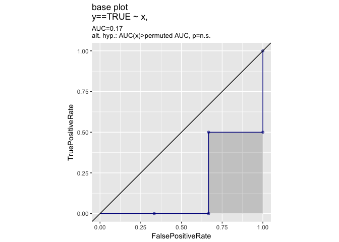
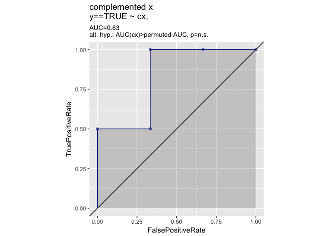
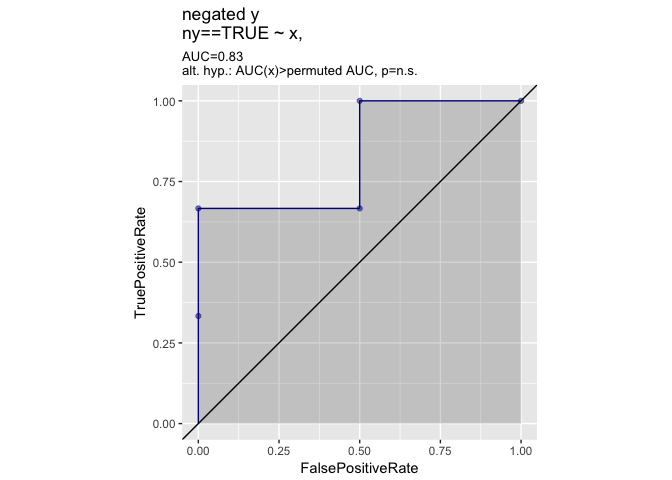
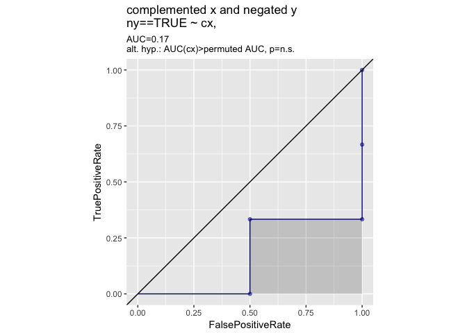
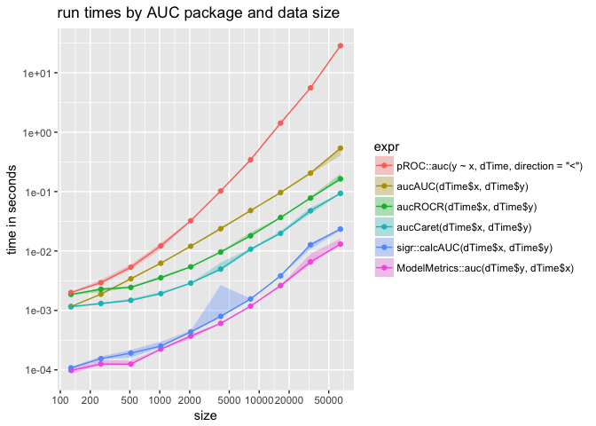

##### Setup.

``` r
library("dplyr")
```

    ## 
    ## Attaching package: 'dplyr'

    ## The following objects are masked from 'package:stats':
    ## 
    ##     filter, lag

    ## The following objects are masked from 'package:base':
    ## 
    ##     intersect, setdiff, setequal, union

``` r
library("plotly")
```

    ## Loading required package: ggplot2

    ## 
    ## Attaching package: 'plotly'

    ## The following object is masked from 'package:ggplot2':
    ## 
    ##     last_plot

    ## The following object is masked from 'package:stats':
    ## 
    ##     filter

    ## The following object is masked from 'package:graphics':
    ## 
    ##     layout

``` r
library("WVPlots")  # needs dev version from Github
library("microbenchmark")

set.seed(224)

mkData <- function(n) {
  d <- data.frame(x= runif(n),   # predictor
                  y= rnorm(n)>=0 # outcome/truth
  )
  d$cx <- 1-d$x # complement of x
  d$ny <- !d$y  # not y
  d
}
d <- mkData(5)
print(d)
```

    ##           x     y         cx    ny
    ## 1 0.7538008 FALSE 0.24619925  TRUE
    ## 2 0.5867451 FALSE 0.41325491  TRUE
    ## 3 0.3844693  TRUE 0.61553066 FALSE
    ## 4 0.9483048 FALSE 0.05169519  TRUE
    ## 5 0.6525606  TRUE 0.34743940 FALSE

The effect
----------

We are looking at the facts that `AUC(prediction, outcome) + AUC(1-prediction, outcome) == 1` and `AUC(prediction, outcome) + AUC(prediction, !outcome) == 1`.

``` r
WVPlots::ROCPlot(d,'x','y',TRUE,'base plot')
```



``` r
WVPlots::ROCPlot(d,'cx','y',TRUE,'complemented x')
```



``` r
WVPlots::ROCPlot(d,'x','ny',TRUE,'negated y')
```



``` r
WVPlots::ROCPlot(d,'cx','ny',TRUE,'complemented x and negated y')
```



##### `ModelMetrics`

``` r
ModelMetrics::auc(d$y, d$x) +
  ModelMetrics::auc(d$y, d$cx)
```

    ## [1] 1

``` r
ModelMetrics::auc(d$y, d$x) +
  ModelMetrics::auc(d$ny, d$x)
```

    ## [1] 1

##### `sigr`

``` r
sigr::calcAUC(d$x, d$y) + 
  sigr::calcAUC(d$cx, d$y)
```

    ## [1] 1

``` r
sigr::calcAUC(d$x, d$y) +
  sigr::calcAUC(d$x, d$ny)
```

    ## [1] 1

##### `ROCR`

``` r
aucROCR <- function(predictions, target) {
  pred <- ROCR::prediction(predictions,
                           target)
  perf_AUC <- ROCR::performance(pred,
                                "auc")
  perf_AUC@y.values[[1]]
}

aucROCR(d$x, d$y) + 
  aucROCR(d$cx, d$y)
```

    ## [1] 1

``` r
aucROCR(d$x, d$y) + 
  aucROCR(d$x, d$ny)
```

    ## [1] 1

##### `AUC`

``` r
aucAUC <- function(predictions, target) {
  AUC::auc(AUC::roc(predictions, 
                  factor(ifelse(target, "1", "0"))))
}

aucAUC(d$x, d$y) +
  aucAUC(d$cx, d$y)
```

    ## [1] 1

``` r
aucAUC(d$x, d$y) +
  aucAUC(d$x, d$ny)
```

    ## [1] 1

##### `caret`

``` r
aucCaret <- function(predictions, target) {
  classes <- c("class1", "class2")
  df <- data.frame(obs= ifelse(target, 
                               "class1", 
                               "class2"),
                 pred = ifelse(predictions>0.5, 
                               "class1", 
                               "class2"),
                 class1 = predictions,
                 class2 = 1-predictions)
  caret::twoClassSummary(df, lev=classes)[['ROC']]
}


aucCaret(d$x, d$y) + 
  aucCaret(d$cx, d$y)
```

    ## [1] 1

``` r
aucCaret(d$x, d$y) + 
  aucCaret(d$x, d$ny)
```

    ## [1] 1

##### `pROC`

``` r
pROC::auc(y~x, d) + 
  pROC::auc(y~cx, d) # wrong
```

    ## [1] 1.666667

More tries with `pROC`.

From `help(roc)`

> direction
>
> in which direction to make the comparison? "auto" (default): automatically define in which group the median is higher and take the direction accordingly. "&gt;": if the predictor values for the control group are higher than the values of the case group (controls &gt; t &gt;= cases). "&lt;": if the predictor values for the control group are lower or equal than the values of the case group (controls &lt; t &lt;= cases).

``` r
pROC::auc(y~x, d, direction= '<') + 
  pROC::auc(y~cx, d, direction= '<')
```

    ## [1] 1

``` r
pROC::auc(y~x, d, direction= '<') +
  pROC::auc(ny~x, d, direction= '<')
```

    ## [1] 1

### Timing

``` r
dTime <- mkData(100)
ModelMetrics::auc(dTime$y, dTime$x)
```

    ## [1] 0.468888

``` r
sigr::calcAUC(dTime$x, dTime$y)
```

    ## [1] 0.468888

``` r
aucROCR(dTime$x, dTime$y)
```

    ## [1] 0.468888

``` r
aucAUC(dTime$x, dTime$y)
```

    ## [1] 0.468888

``` r
aucCaret(dTime$x, dTime$y)
```

    ## [1] 0.468888

``` r
pROC::auc(y~x, dTime, direction= '<')
```

    ## Area under the curve: 0.4689

``` r
sizes <- 2^(7:16)
rlist <- lapply(sizes,
                function(si) {
                  dTime <- mkData(si)
                  res <- microbenchmark(
                    ModelMetrics::auc(dTime$y, dTime$x),
                    sigr::calcAUC(dTime$x, dTime$y),
                    aucROCR(dTime$x, dTime$y),
                    aucAUC(dTime$x, dTime$y),
                    aucCaret(dTime$x, dTime$y),
                    pROC::auc(y~x, dTime, direction= '<'),
                    times=10L
                  )
                  res$size <- si
                  res
                })
res <- bind_rows(rlist)
# select down columns and control units
res %>% 
  group_by(expr,size) %>%
  mutate(time = time/1e9) %>% # move from NanoSeconds to seconds
  summarize(meanTimeS = mean(time), 
            q1 = quantile(time, probs=0.25),
            q2 = quantile(time, probs=0.5),
            q3 = quantile(time, probs=0.75)) %>%
  arrange(size,expr) -> plt
plt$expr <- reorder(plt$expr, -plt$q2)

# from: http://stackoverflow.com/a/22227846/6901725
base_breaks <- function(n = 10){
    function(x) {
        axisTicks(log10(range(x, na.rm = TRUE)), log = TRUE, n = n)
    }
}

ggplot(plt, aes(x=size, color=expr, fill=expr)) +
  geom_point(aes(y=q2)) +
  geom_line(aes(y=q2)) +
  geom_ribbon(aes(ymin=q1, ymax=q3), alpha=0.3, color=NA) +
  scale_x_log10(breaks= base_breaks()) + 
  scale_y_log10(breaks= base_breaks()) +
  ylab("time in seconds") +
  ggtitle("run times by AUC package and data size")
```


