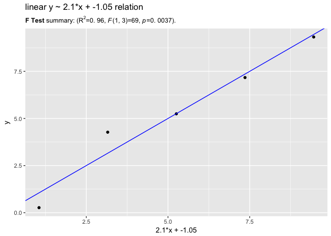

[`sigr`](https://CRAN.R-project.org/package=sigr) is an [`R`](https://cran.r-project.org) package conveniently formats significance tests, allowing the analyst to use the correct test no matter what modeling package you use.


Model Example
-------------

For example, take the following linear relation between `x` and `y`:

``` r
library('sigr')
d <- data.frame(x=1:5)
set.seed(353525)
d$y <- 2*d$x + rnorm(nrow(d))
```

`stats::lm()` has among the most complete summaries of all models in `R`, so we easily get can see the quality of fit and its significance:

``` r
model <- lm(y~x, d=d)
summary(model)
```

    ## 
    ## Call:
    ## lm(formula = y ~ x, data = d)
    ## 
    ## Residuals:
    ##         1         2         3         4         5 
    ## -0.786973  1.117243 -0.009319 -0.185198 -0.135753 
    ## 
    ## Coefficients:
    ##             Estimate Std. Error t value Pr(>|t|)   
    ## (Intercept)  -1.0473     0.8391  -1.248  0.30053   
    ## x             2.1011     0.2530   8.304  0.00366 **
    ## ---
    ## Signif. codes:  0 '***' 0.001 '**' 0.01 '*' 0.05 '.' 0.1 ' ' 1
    ## 
    ## Residual standard error: 0.8001 on 3 degrees of freedom
    ## Multiple R-squared:  0.9583, Adjusted R-squared:  0.9444 
    ## F-statistic: 68.96 on 1 and 3 DF,  p-value: 0.003659

`sigr::wrapFTest()` can render the relevant model quality summary.

``` r
cat(render(wrapFTest(model),
    pSmallCutoff=0))
```

**F Test** summary: (<i>R<sup>2</sup></i>=0.96, *F*(1,3)=69, *p*=0.0037).

`sigr` also carries around the important summary components for use in code.

``` r
unclass(wrapFTest(model))
```

    ## $test
    ## [1] "F Test"
    ## 
    ## $numdf
    ## [1] 1
    ## 
    ## $dendf
    ## [1] 3
    ## 
    ## $FValue
    ## [1] 68.96306
    ## 
    ## $R2
    ## [1] 0.9583119
    ## 
    ## $pValue
    ## [1] 0.003658704

In this function it is much like `broom` or `modelr`.

``` r
broom::glance(model)
```

    ##   r.squared adj.r.squared     sigma statistic     p.value df    logLik
    ## 1 0.9583119     0.9444159 0.8000775  68.96306 0.003658704  2 -4.702395
    ##        AIC     BIC deviance df.residual
    ## 1 15.40479 14.2331 1.920372           3

``` r
modelr::rmse(model, d)
```

    ## [1] 0.6197373

``` r
modelr::rsquare(model, d)
```

    ## [1] 0.9583119

``` r
#modelr::mae(model, d)
#modelr::qae(model, d)
```

Data example
------------

With `sigr` it is also easy to reconstruct quality and significance from the predictions, no matter where they came from (without needing the model data structures).

``` r
d$pred <- predict(model, newdata = d)
```

``` r
cat(render(wrapFTest(d, 'pred', 'y'),
    pSmallCutoff=0))
```

**F Test** summary: (<i>R<sup>2</sup></i>=0.96, *F*(1,3)=69, *p*=0.0037).

Notice we reconstruct the summary statistic and significance, independent of the model data structures. This means the test is generic and can be used on any regression (modulo informing the significance model of the appropriate number of parameters).

Plotting
--------

Because `sigr` can render to "`LaTex`" it can (when used in conjunction with `latex2exp`) also produce formatted titles for plots.

``` r
library("ggplot2")
library("latex2exp")


f <- paste0(format(model$coefficients['x'], digits= 3), 
            '*x + ',
            format(model$coefficients['(Intercept)'], digits= 3))
title <- paste0("linear y ~ ", f, " relation")
subtitle <- latex2exp::TeX(render(wrapFTest(d, 'pred', 'y'), 
                                          format= 'latex'))
ggplot(data=d, mapping=aes(x=pred, y=y)) + 
  geom_point() + geom_abline(color='blue') +
  xlab(f) +
  ggtitle(title, 
          subtitle= subtitle)
```


