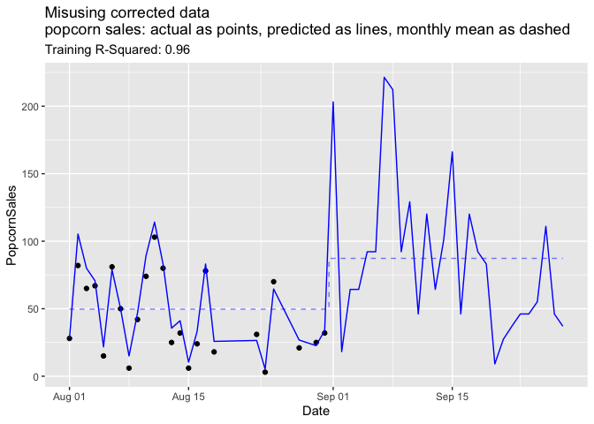
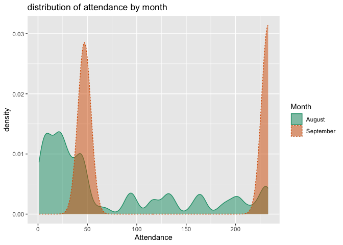
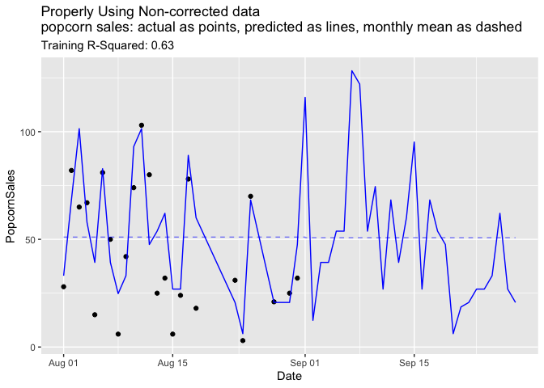

Please Version Data
================
2024-09-07

## Introduction

An important goal of our [Win Vector LLC teaching
offerings](https://win-vector.com/training-overview/) is to instill in
engineers some familiarity with, and empathy for, how data is likely to
be used for analytics and business. Having such engineers in your
organization *greatly* increases the quality of the data later available
to your analysts and data scientists. This in turn expands what is
possible in prediction and forecasting, which can lead to significant
revenue opportunities.

In the following, I’d like to illustrate a data issue that can squander
such opportunities.

## An Example Problem

Suppose you are purchasing data on movie attendance in your region; data
for both past attendance, and future projected attendance. In
particular, you are concerned about planning for popcorn sales at the
[The Roxie movie house](https://roxie.com/calendar/).

(**NOTE:** While the Roxie is an actual movie theater, please note that
we are using synthetic attendance numbers, for the purposes of this
example.)

<center>
<a href="https://en.wikipedia.org/wiki/Roxie_Theater#/media/File:RoxieSF.jpg">

<p/>
Photo by
<a rel="nofollow" class="external text" href="https://www.flickr.com/photos/45199709@N00">Simon
Durkin</a> - originally posted to
<a href="//commons.wikimedia.org/wiki/Flickr" class="mw-redirect" title="Flickr">Flickr</a>
as
<a rel="nofollow" class="external text" href="https://www.flickr.com/photos/45199709@N00/3329573032">Roxie
Theatre - Mission SF</a>,
<a href="https://creativecommons.org/licenses/by-sa/2.0" title="Creative Commons Attribution-Share Alike 2.0">CC
BY-SA 2.0</a>,
<a href="https://commons.wikimedia.org/w/index.php?curid=7593242">Link</a>
</a>
</center>

The attendance data purports to align the published movie schedules with
projected attendance, and looks like the following:

``` r
# attach our packages
library(ggplot2)
library(dplyr)
```

``` r
# read our data
d <- read.csv(
  'Roxie_schedule_as_known_after_August.csv', 
  strip.white = TRUE, 
  stringsAsFactors = FALSE)
d$Date <- as.Date(d$Date)

d |>
  head() |>
  knitr::kable(row.names = NA)
```

| Date       | Movie                                                | Time    | Attendance |
|:-----------|:-----------------------------------------------------|:--------|-----------:|
| 2024-08-01 | Eno                                                  | 6:40 pm |         10 |
| 2024-08-01 | Longlegs                                             | 8:35 pm |        114 |
| 2024-08-01 | Staff Pick: Melvin and Howard (35mm)                 | 8:45 pm |         23 |
| 2024-08-02 | Made in England: The Films of Powell and Pressburger | 6:00 pm |        204 |
| 2024-08-02 | Lyd                                                  | 6:30 pm |        213 |
| 2024-08-02 | The Red Shoes                                        | 8:45 pm |        230 |

Our business goal is to build a model relating attendance to popcorn
sales, which we will apply to future data in order to predict future
popcorn sales. This allows us to plan staffing and purchasing, and also
to predict snack bar revenue.

In the above example data, all dates in August of 2024 are “in the past”
(available as training and test/validation data) and all dates in
September of 2024 are “in the future” (dates we want to make predictions
for). The movie attendance service we are subscribing to supplies

- past schedules
- past (recorded) attendance
- future schedules, and
- (estimated) future attendance.

### The fly in the ointment

The above already has the flaw we are warning about: **we have mixed
*past attendance* and *(estimated) future attendance*.** In machine
learning modeling we want our explanatory variables (in this case
attendance) to be produced the same way when *training* a model as when
*applying* the model. Here, we are using recorded attendance for the
past, and some sort of estimated future attendance for the future.
Without proper care, these are *not* necessarily the same thing.

### Continuing the example

Our intermediate goal is to build a model relating past popcorn (unit)
purchases to past attendance.

To do this we join in our own past popcorn sales data (in units sold)
and build a predictive model.

``` r
# join in popcorn sales records
popcorn_sales <- read.csv(
  'popcorn_sales.csv', 
  strip.white = TRUE, 
  stringsAsFactors = FALSE)
popcorn_sales$Date <- as.Date(popcorn_sales$Date)

popcorn_sales |>
  head() |>
  knitr::kable(row.names = NA)
```

| Date       | PopcornSales |
|:-----------|-------------:|
| 2024-08-01 |           28 |
| 2024-08-02 |           82 |
| 2024-08-03 |           65 |
| 2024-08-04 |           67 |
| 2024-08-05 |           15 |
| 2024-08-06 |           81 |

``` r
d_train <- d |>
  filter(is.na(Attendance) == FALSE) |>
  group_by(Date) |>
  summarize(Attendance = sum(Attendance)) |>
  inner_join(popcorn_sales, by='Date')

d_train |>
  head() |>
  knitr::kable(row.names = NA)
```

| Date       | Attendance | PopcornSales |
|:-----------|-----------:|-------------:|
| 2024-08-01 |        147 |           28 |
| 2024-08-02 |        648 |           82 |
| 2024-08-03 |        439 |           65 |
| 2024-08-04 |        377 |           67 |
| 2024-08-05 |         91 |           15 |
| 2024-08-06 |        472 |           81 |

``` r
# model popcorn sales as a function of attendance
model <- lm(PopcornSales ~ Attendance, data=d_train)
d$PredictedPopcorn <- round(pmax(0, 
                                 predict(model, newdata=d)), 
                            digits=1)
train_R2 <- summary(model)$adj.r.squared
summary(model)
```

    ## 
    ## Call:
    ## lm(formula = PopcornSales ~ Attendance, data = d_train)
    ## 
    ## Residuals:
    ##      Min       1Q   Median       3Q      Max 
    ## -17.2124  -2.8715  -0.1313   3.1903  11.4406 
    ## 
    ## Coefficients:
    ##             Estimate Std. Error t value Pr(>|t|)    
    ## (Intercept) 2.005205   2.237771   0.896     0.38    
    ## Attendance  0.150011   0.006634  22.614   <2e-16 ***
    ## ---
    ## Signif. codes:  0 '***' 0.001 '**' 0.01 '*' 0.05 '.' 0.1 ' ' 1
    ## 
    ## Residual standard error: 6.09 on 22 degrees of freedom
    ## Multiple R-squared:  0.9588, Adjusted R-squared:  0.9569 
    ## F-statistic: 511.4 on 1 and 22 DF,  p-value: < 2.2e-16

We get what *appears* to be a good result: a *highly* predictive model
that shows about a 15% attachment rate from attendance to popcorn
purchase.

Let’s plot our predictions in the past and future, and actuals in the
past.

``` r
subtitle = paste("Training R-Squared:", sprintf('%.2f', train_R2))

d_daily <- d |> 
  group_by(Date) |>
  summarize(PredictedPopcorn = sum(PredictedPopcorn)) |>
  ungroup() |>
  full_join(popcorn_sales, by='Date') |>
  mutate(Month = format(Date, '%B')) |>
  group_by(Month) |>
  mutate(
    MeanPredictedPopcorn = mean(PredictedPopcorn), 
    MeanPopcornSales = mean(PopcornSales)) |>
  ungroup()
ggplot(
  data=d_daily,
  mapping=aes(x=Date)) +
  geom_point(mapping=aes(y=PopcornSales)) +
  geom_line(
    mapping=aes(y=PredictedPopcorn), 
    color='Blue') +
  geom_step(
    mapping=aes(y=MeanPredictedPopcorn), 
    direction='mid', 
    color='Blue', 
    alpha=0.5, 
    linetype=2) +
  ggtitle('Misusing corrected data\npopcorn sales: actual as points, predicted as lines, monthly mean as dashed',
      subtitle=subtitle)
```

<!-- -->

Now we really see the problem. Our model predicts popcorn sales in the
presumed future month of September are going to be *double* what was
seen in the past training month of August. As we don’t have the future
data yet, we don’t immediately know this is wrong. But without a
presumed cause, it is suspicious.

## Diagnosing

Let’s plot how our explanatory variable changes form the past month to
the future month.

``` r
d_plot = d
d_plot$Month = format(d_plot$Date, '%B')

ggplot(
  data=d_plot,
  mapping=aes(
    x=Attendance, 
    color=Month, 
    fill=Month, 
    linetype=Month)) +
  geom_density(adjust = 0.2, alpha=0.5) +
  scale_color_brewer(type="qual", palette="Dark2") + 
  scale_fill_brewer(type="qual", palette="Dark2") +
  ggtitle("distribution of attendance by month")
```

<!-- -->

The months look nothing alike. The estimated future attendances (which
we purchased from our data supplier) look nothing like what the (same)
data supplier said past attendances were.

Let’s look at a few rows of future application data.

``` r
d |>
  tail() |>
  knitr::kable(row.names = NA)
```

|     | Date       | Movie                                                                      | Time    | Attendance | PredictedPopcorn |
|:----|:-----------|:---------------------------------------------------------------------------|:--------|-----------:|-----------------:|
| 188 | 2024-09-26 | Girls Will Be Girls                                                        | 6:30 pm |        233 |             37.0 |
| 189 | 2024-09-26 | To Be Destroyed / It’s Okay with Dave Eggers                               | 6:30 pm |        233 |             37.0 |
| 190 | 2024-09-26 | LeatherWeek: Puppies and Leather and Boys!                                 | 8:40 pm |        233 |             37.0 |
| 191 | 2024-09-27 | Floating Features: Pirates of the Caribbean – The Curse of the Black Pearl | 6:30 pm |        233 |             37.0 |
| 192 | 2024-09-27 | All Shall Be Well                                                          | 6:30 pm |         47 |              9.1 |
| 193 | 2024-09-28 | BloodSisters                                                               | 4:00 pm |        233 |             37.0 |

This looks like only a few different attendance values are reported.
Let’s dig deeper into that.

``` r
table(
  Attendance = d[format(d$Date, '%B') == 'September',
                 'Attendance']) |>
  knitr::kable(row.names = NA)
```

| Attendance | Freq |
|:-----------|-----:|
| 47         |   49 |
| 233        |   54 |

We are seeing only two values for estimated future attendance: 47 and
233. It turns out that these are the reported sizes of the two theaters
comprising the Roxie ([ref](https://roxie.com/rent-the-roxie/)).

## A guess

Here’s what we guess is happening: For future events, the data supplier
is using the venue size as the size estimate. For past events they
*edit* the event record to reflect actual ticketed attendance. This
correction seems like an improvement, until one attempts a project
spanning both past (used for training) and future (used for application)
data. The individual record may seem better, but its relation to other
records is made worse. This is a *severe* form of undesirable
concept-drift or data non-exchangeability. We need the imposed practice
or rehearsal conditions to simulate the required performance conditions.

No amount of single-time-index back-testing on past data would show the
effect. Only by tracking what was the recorded attendance for a given
date *as a function of when we ask* will we see what is going on.

## The fix

To fix this issue, we need “versioned”, “as of”, or
“[bitemporal](https://en.wikipedia.org/wiki/Bitemporal_modeling)” data.
For the August data we don’t want the actual known attendance (as nice
as that is), but in fact what the estimated attendance for August looked
like way back in July. That way the `Attendance` variable we use in
training is an estimate, just like it will be in future applications of
the model.

If our vendor supplies versioned data we can then use that. Even though
it is “inferior” it is better suited to our application.

Let’s see that in action. To do this we need older projections for
attendance that have not been corrected. If we have such we can proceed,
if not we are stuck. Let’s suppose we have the older records.

``` r
# read our data
d_est <- read.csv(
  'Roxie_schedule_as_known_before_August.csv', 
  strip.white = TRUE, 
  stringsAsFactors = FALSE)
d_est$Date <- as.Date(d$Date, format='%Y-%B-%d')

d_est |>
  head() |>
  knitr::kable(row.names = NA)
```

| Date       | Movie                                                | Time    | EstimatedAttendance |
|:-----------|:-----------------------------------------------------|:--------|--------------------:|
| 2024-08-01 | Chronicles of a Wandering Saint                      | 6:40 pm |                  47 |
| 2024-08-01 | Longlegs                                             | 8:35 pm |                 233 |
| 2024-08-01 | Staff Pick: Melvin and Howard (35mm)                 | 8:45 pm |                  47 |
| 2024-08-02 | Made in England: The Films of Powell and Pressburger | 6:00 pm |                 233 |
| 2024-08-02 | Lyd                                                  | 6:30 pm |                 233 |
| 2024-08-02 | The Red Shoes                                        | 8:45 pm |                 233 |

Let’s repeat our modeling effort with the uncorrected (not retouched)
data.

``` r
# predict popcorn sales as a function of attendance
d_est_train <- d_est |>
  filter(is.na(EstimatedAttendance) == FALSE) |>
  group_by(Date) |>
  summarize(EstimatedAttendance = sum(EstimatedAttendance)) |>
  inner_join(popcorn_sales, by='Date')

model_est <- lm(PopcornSales ~ EstimatedAttendance, data=d_est_train)
d_est$PredictedPopcorn <- round(pmax(0, 
                                     predict(model_est, newdata=d_est)), 
                                digits=1)
train_est_R2 <- summary(model_est)$adj.r.squared
```

``` r
subtitle = paste("Training R-Squared:", sprintf('%.2f', train_est_R2))

d_est_daily <- d_est |> 
  group_by(Date) |>
  summarize(PredictedPopcorn = sum(PredictedPopcorn)) |>
  ungroup() |>
  full_join(popcorn_sales, by='Date') |>
  mutate(Month = format(Date, '%B')) |>
  group_by(Month) |>
  mutate(
    MeanPredictedPopcorn = mean(PredictedPopcorn), 
    MeanPopcornSales = mean(PopcornSales)) |>
  ungroup()
ggplot(
  data=d_est_daily,
  mapping=aes(x=Date)) +
  geom_point(mapping=aes(y=PopcornSales)) +
  geom_line(mapping=aes(
    y=PredictedPopcorn), 
    color='Blue') +
  geom_step(mapping=aes(
    y=MeanPredictedPopcorn), 
    directon='mid', 
    color='Blue', 
    alpha=0.5, 
    linetype=2) +
  ggtitle("Properly Using Non-corrected data\npopcorn sales: actual as points, predicted as lines, monthly mean as dashed",
          subtitle=subtitle)
```

<!-- -->

Using the estimated attendance to train (instead of actual) gives a
*vastly* inferior R-squared as measured on training data. However, using
the estimated attendance (without corrections) gives us a model that
performs *much* better in the future (which *is* the actual project
goal)! The idea is that we expect our model to be applied to rough,
estimated future inputs, so we need to train it on such estimates, and
not on cleaned up values that will not be available during application.
A production model must be trained in the same rough seas that it will
sail in.

## Conclusion

The performance of a model on held-out data is only a proxy measure for
future model performance. In our example we see that the desired
connection breaks down when there is a data concept-change between the
training and application periods. The fix is to use “as of” data or
bitemporal modeling.

A common way to achieve a full bitemporal data model is to have
reversible time stamped audit logging on any field edits. One keeps
additional records of the form “at this time this value was changed from
A to B in this record.” An engineer unfamiliar with how forecasts are
applied may not accept the cost of the audit or roll-back logging. So
one needs to convert these engineers into modeling peers and allies.

Data users should *insist* on bitemporal data for forecasting
applications. When date or time enter the picture- it is rare that there
is only one key. Most date/time questions unfortunately can not be
simplified down to “what is the prediction for date x?” Instead one
needs to respect structures such as “what is the best prediction for
date x, using a model trained up through what was known at date y, and
taking inputs known up through date z?” To even back test such models
one needs a bitemporal database, to control what data looked like at
different times.

## Appendix

All the code and data to reproduce this example can be found
[here](https://github.com/WinVector/Examples/tree/main/versioning_data).
