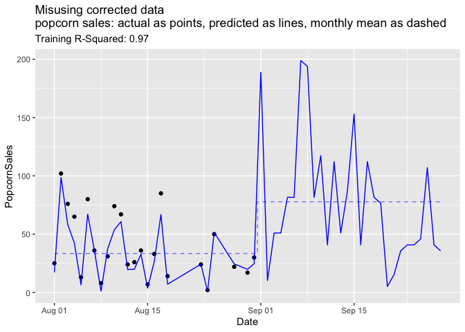

Please Version Data
================
2024-09-06

## Introdution

An important goal of our [Win Vector LLC teaching
offerings](https://win-vector.com/training-overview/) is to instill in
engineers an empathy of how data is likely to be used. Having such
engineers in your organization *greatly* increases the quality of data
later available to your analysts and data scientists. This greatly
expands what is possible in prediction and forecasting, which can lead
to significant revenue opportunities.

I’d like to illustrate this with an example.

## An Example Problem

Suppose you are purchasing predicted and scheduled movie attendance data
for your region. The data is initially described as having aligned
published movie schedules with a projection of attendance and looks like
the following schedule from [The Roxie movie
house](https://roxie.com/calendar/).

``` r
# attach our packages
library(ggplot2)
library(dplyr)
```

``` r
# read our data
d <- read.csv('Roxie_schedule.csv', strip.white = TRUE, stringsAsFactors = FALSE)
d$Date <- as.Date(d$Date, format='%Y-%B-%d')

d |>
  head() |>
  knitr::kable()
```

| Date       | Movie                                                | Time    | Attendance | PopcornSales |
|:-----------|:-----------------------------------------------------|:--------|-----------:|-------------:|
| 2024-08-01 | Chronicles of a Wandering Saint                      | 6:40 pm |          6 |            1 |
| 2024-08-01 | Eno                                                  | 6:40 pm |         10 |            1 |
| 2024-08-01 | Longlegs                                             | 8:35 pm |        114 |           20 |
| 2024-08-01 | Staff Pick: Melvin and Howard (35mm)                 | 8:45 pm |         23 |            3 |
| 2024-08-02 | Made in England: The Films of Powell and Pressburger | 6:00 pm |        204 |           39 |
| 2024-08-02 | Lyd                                                  | 6:30 pm |        213 |           24 |

Our business goal is to build a model relating attendance to popcorn
sales, and then apply this model to future data to predict future
popcorn sales (allowing us to staff, purchase, and predict revenue).

In the above example data all dates in August of 2024 are “in the past”
(available as training and test/validation data) and all dates in
September of 2024 are “in the future” (dates we want to make predictions
for). The movie attendance service we are subscribing supplies: past
schedules, past attendance, future schedules, and (estimated) future
attendance.

### The fly in the ointment

The above already has the flaw we are warning about: we have mixed “past
attendance” and “(estimated) future attendance.” In machine learning
modeling we want our explanatory variables (in this case attendance) to
be produced the same way when *training* a model as when *applying* the
model. Here in the past we are using recorded attendance, and in the
future we are using some sort of estimated future attendance. These are
*not* necessarily the same thing.

### Continuing the example

Our next step is to build a model relating past popcorn (unit) purchases
to past attendance.

``` r
# predict popcorn sales as a function of attendance
d_train <- d[is.na(d$PopcornSales) == FALSE, , drop=FALSE]
model <- lm(PopcornSales ~ Attendance, data=d_train)
d$PredictedPopcorn <- round(pmax(0, predict(model, newdata=d)), digits=1)
train_R2 <- summary(model)$adj.r.squared
summary(model)
```

    ## 
    ## Call:
    ## lm(formula = PopcornSales ~ Attendance, data = d_train)
    ## 
    ## Residuals:
    ##      Min       1Q   Median       3Q      Max 
    ## -11.7391  -0.7127  -0.0614   0.7196   9.0168 
    ## 
    ## Coefficients:
    ##             Estimate Std. Error t value Pr(>|t|)    
    ## (Intercept) 0.067023   0.440447   0.152    0.879    
    ## Attendance  0.153416   0.004553  33.694   <2e-16 ***
    ## ---
    ## Signif. codes:  0 '***' 0.001 '**' 0.01 '*' 0.05 '.' 0.1 ' ' 1
    ## 
    ## Residual standard error: 3.014 on 89 degrees of freedom
    ## Multiple R-squared:  0.9273, Adjusted R-squared:  0.9265 
    ## F-statistic:  1135 on 1 and 89 DF,  p-value: < 2.2e-16

We get what *appears* to be a good result: a *highly* predictive model
that shows about a 15% attachment rate from attendance to popcorn
purchase.

Let’s plot this.

``` r
d_daily <- d |> 
  group_by(Date) |>
  summarize(PopcornSales = sum(PopcornSales), PredictedPopcorn = sum(PredictedPopcorn)) |>
  ungroup() |>
  mutate(Month = format(Date, '%B')) |>
  group_by(Month) |>
  mutate(MeanPopcornSales = mean(PopcornSales), MeanPredictedPopcorn = mean(PredictedPopcorn)) |>
  ungroup()
ggplot(
  data=d_daily,
  mapping=aes(x=Date)) +
  geom_point(mapping=aes(y=PopcornSales)) +
  geom_line(mapping=aes(y=PredictedPopcorn), color='Blue') +
  geom_step(mapping=aes(y=MeanPredictedPopcorn), directon='mid', color='Blue', alpha=0.5, linetype=2) +
  ggtitle(paste(
    "actual Popcorn sales as points, predited as lines\n(monthly mean as dashed step), train R2: ", 
    sprintf('%.2f', train_R2)))
```

<!-- -->

Now we see the problem. Our model predicts popcorn sales in the presumed
future month of September are going to be double what was seen in the
past training month of August. As we don’t have the future data yet, we
don’t immediately known this is wrong. But, without a presumed cause it
is suspicious.

## Diagnosing

Let’s plot how our explanatory variable changes form the path month to
the future month.

``` r
d_plot = d
d_plot$Month = format(d_plot$Date, '%B')

ggplot(
  data=d_plot,
  mapping=aes(x=Attendance, color=Month, fill=Month, linetype=Month)) +
  geom_density(adjust = 0.2, alpha=0.5) +
  scale_color_brewer(type="qual", palette="Dark2") + 
  scale_fill_brewer(type="qual", palette="Dark2") +
  ggtitle("distribution of attendance by month")
```

<!-- -->

The months look nothing alike. The estimated future attendances (which
we purchased from our data supplier) look nothing like what the data
supplier said past attendances were.

Let’s look at a few rows of future application data.

``` r
d |>
  tail() |>
  knitr::kable()
```

|     | Date       | Movie                                                                      | Time    | Attendance | PopcornSales | PredictedPopcorn |
|:----|:-----------|:---------------------------------------------------------------------------|:--------|-----------:|-------------:|-----------------:|
| 189 | 2024-09-26 | Girls Will Be Girls                                                        | 6:30 pm |        233 |           NA |             35.8 |
| 190 | 2024-09-26 | To Be Destroyed / It’s Okay with Dave Eggers                               | 6:30 pm |        233 |           NA |             35.8 |
| 191 | 2024-09-26 | LeatherWeek: Puppies and Leather and Boys!                                 | 8:40 pm |        233 |           NA |             35.8 |
| 192 | 2024-09-27 | Floating Features: Pirates of the Caribbean – The Curse of the Black Pearl | 6:30 pm |        233 |           NA |             35.8 |
| 193 | 2024-09-27 | All Shall Be Well                                                          | 6:30 pm |         47 |           NA |              7.3 |
| 194 | 2024-09-28 | BloodSisters                                                               | 4:00 pm |        233 |           NA |             35.8 |

This looks like only a few different attendance values are reported.
Let’s dig deeper into that.

``` r
table(Attendance = d[format(d$Date, '%B') == 'September', 'Attendance']) |>
  knitr::kable()
```

| Attendance | Freq |
|:-----------|-----:|
| 47         |   49 |
| 233        |   54 |

We are seeing only two values for estimated future attendance: 47 and
233. It turns out that these are the reported sizes of the two theaters
comprising the Roxy ([ref](https://roxie.com/rent-the-roxie/)).

## A guess

A guess at what is happening is the following. For future events the
data supplier is using the venue size as the size estimate. For past
events they *edit* the event record to reflect actual ticketed
attendance. This correction seems like an improvement, until one
attempts a project spanning both past (used for training) and future
(used for application) data. This is a *severe* form of undesirable
concept-drift or non-exchangeability. Or: we need the imposed practice
or rehearsal conditions to simulate the required performance conditions.

No amount of back-testing on past data would show the effect. Only
tracking what was the recorded attendance for a given date *as a
function of when we ask* will reveal what is going on.

## The fix

The fix is: we need “versioned”, “as of”, or
“[bitemporal](https://en.wikipedia.org/wiki/Bitemporal_modeling) data.”
For the August data we don’t want the actual known attendance (as nice
as that is), but in fact what the estimated attendance for August would
look like way back in July. That way the training explanatory variables
are estimates, just like the future application data will be.

If our vendor supplies versioned data we can then use that. Even though
it is “inferior” it is better suited to our application.

Let’s see that in action.

``` r
# read our data
d_est <- read.csv('Roxie_schedule_estimates.csv', strip.white = TRUE, stringsAsFactors = FALSE)
d_est$Date <- as.Date(d$Date, format='%Y-%B-%d')

d_est |>
  head() |>
  knitr::kable()
```

| Date       | Movie                                                | Time    | EstimatedAttendance | PopcornSales |
|:-----------|:-----------------------------------------------------|:--------|--------------------:|-------------:|
| 2024-08-01 | Chronicles of a Wandering Saint                      | 6:40 pm |                  47 |            1 |
| 2024-08-01 | Eno                                                  | 6:40 pm |                 233 |            1 |
| 2024-08-01 | Longlegs                                             | 8:35 pm |                 233 |           20 |
| 2024-08-01 | Staff Pick: Melvin and Howard (35mm)                 | 8:45 pm |                  47 |            3 |
| 2024-08-02 | Made in England: The Films of Powell and Pressburger | 6:00 pm |                 233 |           39 |
| 2024-08-02 | Lyd                                                  | 6:30 pm |                 233 |           24 |

We now have the older estimates are just as bad as the future estimates-
so learning to work with them will help us in the future. For our
application is in fact an improvement.

Let’s repeat our modeling effort with the uncorrected (not retouched)
data.

``` r
# predict popcorn sales as a function of attendance
d_est_train <- d_est[is.na(d_est$PopcornSales) == FALSE, , drop=FALSE]
model_est <- lm(PopcornSales ~ EstimatedAttendance, data=d_est_train)
d_est$PredictedPopcorn <- round(pmax(0, predict(model_est, newdata=d_est)), digits=1)
train_est_R2 <- summary(model_est)$adj.r.squared
```

``` r
d_est_daily <- d_est |> 
  group_by(Date) |>
  summarize(PopcornSales = sum(PopcornSales), PredictedPopcorn = sum(PredictedPopcorn)) |>
  ungroup() |>
  mutate(Month = format(Date, '%B')) |>
  group_by(Month) |>
  mutate(MeanPopcornSales = mean(PopcornSales), MeanPredictedPopcorn = mean(PredictedPopcorn)) |>
  ungroup()
ggplot(
  data=d_est_daily,
  mapping=aes(x=Date)) +
  geom_point(mapping=aes(y=PopcornSales)) +
  geom_line(mapping=aes(y=PredictedPopcorn), color='Blue') +
  geom_step(mapping=aes(y=MeanPredictedPopcorn), directon='mid', color='Blue', alpha=0.5, linetype=2) +
  ggtitle(paste(
    "actual Popcorn sales as points, predited from attendance estimates as lines\n(monthly mean as dashed step), train R2: ", 
    sprintf('%.2f', train_est_R2)))
```

<!-- -->

Note: using the estimated attendance to train (instead of actual) gives
a *vastly* inferior R-squared as measured on training data. However, it
gives us a model that performs *much* better in the future (which
presumably is the actual project goal)!

## Conclusion

The performance of a model on held-out data is only a proxy measure for
future model performance. In our example we see that this common proxy
idea breaks down when there is a data concept-change between the
training and application periods. The fix is: “as of” or bitemporal
modeling.

A common way to achieve a full bitemporal data model is: reversible time
stamped audit logging on any field edits. One keeps additional records
of the form “at this time this value was changed from A to B in this
record.” This puts most of the cost of “as of” or “what would this value
have looked like if asked about at this date” queries on the modeling
system (which wants them) and away from the data production system
(which would just like to update records and be done with things).

An engineer unfamiliar with how forecasts are applied may not accept the
cost of the audit or roll-back logging. So one needs to turn these
engineers into modeling peers and allies.

Data users should *insist* on bitemporal data for forecasting
applications.
