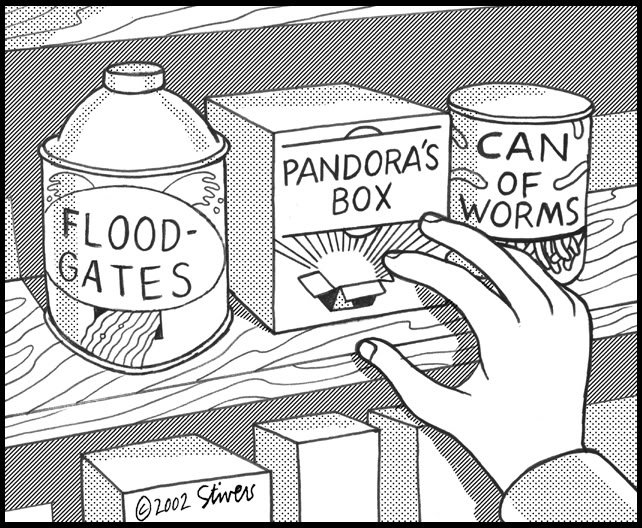

[Jonathan Carroll](https://jcarroll.com.au) had a an interesting [`R`](https://cran.r-project.org) language idea: to [use `@`-notation](https://twitter.com/carroll_jono/status/842142292253196290) to request value substitution in a non-standard evaluation environment (inspired by [msyql User-Defined Variables](https://dev.mysql.com/doc/refman/5.7/en/user-variables.html)).

He even picked the right image:



It is kind of reverse from some Lisp ideas ("evaled unless ticked"), but an interesting possibility. We can play along with it a bit in [`R`](https://cran.r-project.org) as follows. The disadvantages of our simulation include:

-   The user must both call `wrapr::ateval` and place their code in quotes.
-   The effect is still achieved through string substitution.

But here it is for what it is worth:

``` r
# devtools::install_github("WinVector/wrapr")
library("wrapr")
library("dplyr")
```

The original example function from the Tweet:

``` r
f <- function(col1, col2, new_col_name) {
  ateval('mtcars %>% mutate(@new_col_name = @col1 + @col2)')
}
```

And the requested effect actually realized:

``` r
d <- f('gear', 'carb', 'nonsense')
head(d)
```

    ##    mpg cyl disp  hp drat    wt  qsec vs am gear carb nonsense
    ## 1 21.0   6  160 110 3.90 2.620 16.46  0  1    4    4        8
    ## 2 21.0   6  160 110 3.90 2.875 17.02  0  1    4    4        8
    ## 3 22.8   4  108  93 3.85 2.320 18.61  1  1    4    1        5
    ## 4 21.4   6  258 110 3.08 3.215 19.44  1  0    3    1        4
    ## 5 18.7   8  360 175 3.15 3.440 17.02  0  0    3    2        5
    ## 6 18.1   6  225 105 2.76 3.460 20.22  1  0    3    1        4

The point is a standard function (`f()`) can accept user column names and then itself use convenient non-standard evaluation notation (in this case `dplyr`) to perform operations. This package-based simulation is not as good as actual language support, but simulations like this are how we collect experience with possible new language features.

We can also try a `(!!name)` notation inspired by [recent developments in `dplyr`](https://github.com/hadley/dplyr/commit/8f03f835185370626a566e95d268623b20189e07).

``` r
fb <- function(col1, col2) {
  beval(
    mtcars %>% mutate(res_col = (!!col1) + (!!col2))
  )
}
head(fb('gear', 'carb'))
```

    ##    mpg cyl disp  hp drat    wt  qsec vs am gear carb res_col
    ## 1 21.0   6  160 110 3.90 2.620 16.46  0  1    4    4       8
    ## 2 21.0   6  160 110 3.90 2.875 17.02  0  1    4    4       8
    ## 3 22.8   4  108  93 3.85 2.320 18.61  1  1    4    1       5
    ## 4 21.4   6  258 110 3.08 3.215 19.44  1  0    3    1       4
    ## 5 18.7   8  360 175 3.15 3.440 17.02  0  0    3    2       5
    ## 6 18.1   6  225 105 2.76 3.460 20.22  1  0    3    1       4

Notice we no longer need to quote the source code. However, without some additional trick the `(!!name)` notation can not be used on the left hand side of an assignment. Also note: <code>!!</code> is not a no-op, but is a sufficiently uncommon expression I thought we could use it (some have mentioned using <code>!!!</code> as it is equivalent to <code>!</code> and therefore not strictly necessary).

The real point is a user wants a flexible language with macros and functions (`R` uses an intermediate form called ["an Fexpr"](https://en.wikipedia.org/wiki/Fexpr) for just about everything) that they can both use interactively and program over. This means they eventually want an execution environment where they can both pass in parametric values (what `R` calls standard evaluation) and the ability to have code elements treated directly as values (a convenience and related to what `R` calls non-standard evaluation).

The classic Lisp solution organizes things a bit differently, and uses various "back-tick" notations to specify control of the interpretation of symbols. I think `R` has picked a different set of defaults as to how symbols, values, expressions, and execution interact- so any notation is going to be a bit different.
