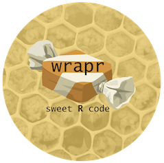
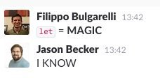

# wrapr: for sweet R code

This article is on writing sweet [`R`](https://cran.r-project.org) code using the [`wrapr`](https://CRAN.R-project.org/package=wrapr) package.



## The problem

Consider the following R puzzle. You are given: a data.frame, the name of a column that you wish to find missing values (NA) in, and the name of a column to land the result. For instance:

```{r}
d <- data.frame(x = c(1, NA))
print(d)
```

```{r}
cname <- 'x'
print(cname)
```

```{r}
rname <- paste(cname, 'isNA', sep = '_')
print(rname)
```

How do you write generic code to populate the column x_isNA with which rows of x are missing?

## The "base R" solution

In "base R" (R without additional packages) this is easy.

When you know the column names while writing the code:

```{r}
d2 <- d
d2$x_isNA <- is.na(d2$x)

print(d2)
```

And when you don't know the column names while writing the code (but know they will arrive in variables later):

```{r}
d2 <- d
d2[[rname]] <- is.na(d2[[cname]])
```

The "base R" solution really is quite elegant.


## The "all in" non-standard evaluation dplyr::mutate solution

As far as I can tell the "all in" non-standard evaluation dplyr::mutate solution is something like the following.

When you know the column names while writing the code:

```{r}
library("dplyr")
d %>% mutate(x_isNA = is.na(x))
```

And when you don't know the column names while writing the code (but know they will arrive in variables later):

```{r}
d %>%
  mutate_(.dots =
            stats::setNames(list(lazyeval::interp(
              ~ is.na(VAR),
              VAR = as.name(cname)
            )),
            rname))
```

# The sweet wrapr::let dplyr::mutate solution

We will only work the harder "when you don't yet know the column name" (or parametric) version:

```{r}
library("wrapr")
let(list(COL = cname, RES = rname),
    d %>% mutate(RES = is.na(COL))
)
```

I think that this is pretty sweet, and can really level up your dplyr game.

<iframe width="560" height="315" src="https://www.youtube.com/embed/nG9fXbhoPJE" frameborder="0" allowfullscreen></iframe>

`wrapr::let` is available from CRAN and already has a number of satisfied users:




If function behavior depends on variable names, then convenient control of functions is eventually going to require convenient control of variable names; so needing to re-map variable names at some point is inevitable.
